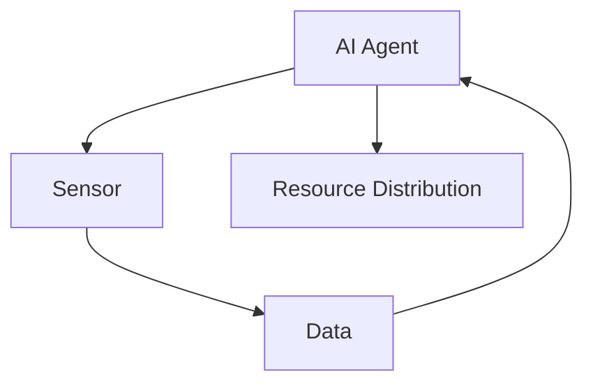

                 


```markdown
# AI Agent在海洋资源勘探中的应用

> 关键词：AI Agent, 海洋资源勘探, 强化学习, 聚类分析, 实体关系图

> 摘要：AI Agent作为一种智能体，正在逐渐被应用于海洋资源勘探领域。本文将从AI Agent的基本概念出发，详细探讨其在海洋资源勘探中的应用背景、核心概念、算法原理、系统架构以及实际应用案例。通过分析AI Agent在海洋资源勘探中的优势，本文旨在为读者提供一个全面而深入的理解。

---

## 第一部分: AI Agent与海洋资源勘探的背景介绍

### 第1章: AI Agent与海洋资源勘探概述

#### 1.1 AI Agent的基本概念
##### 1.1.1 AI Agent的定义
AI Agent（人工智能代理）是指能够感知环境、做出决策并采取行动以实现目标的智能实体。它可以是一个软件程序、机器人或其他任何形式的智能系统。

##### 1.1.2 AI Agent的核心特点
- **自主性**：能够在没有外部干预的情况下独立运作。
- **反应性**：能够根据环境变化实时调整行为。
- **目标导向**：所有行动都以实现特定目标为导向。
- **学习能力**：能够通过经验改进自身的决策能力。

##### 1.1.3 AI Agent与传统AI的区别
传统的AI系统（如专家系统）依赖于固定的规则和逻辑推理，而AI Agent具有更强的自主性和适应性，能够在动态环境中做出实时决策。

#### 1.2 海洋资源勘探的背景与挑战
##### 1.2.1 海洋资源勘探的重要性
海洋资源勘探是指对海洋中的矿产资源、生物资源、能源资源等进行调查和评估的过程。它对于国家经济发展、能源安全以及环境保护具有重要意义。

##### 1.2.2 海洋资源勘探的主要挑战
- **环境复杂性**：海洋环境恶劣，数据采集困难。
- **数据量大**：海洋资源勘探涉及海量数据，处理难度大。
- **成本高昂**：海洋勘探需要大量资金和资源投入。
- **技术限制**：传统技术在精度和效率上存在局限。

##### 1.2.3 AI Agent在海洋资源勘探中的作用
AI Agent可以通过自动化数据处理、智能决策和实时反馈，显著提高海洋资源勘探的效率和准确性，降低成本。

---

### 第2章: AI Agent的核心概念与原理

#### 2.1 AI Agent的核心概念
##### 2.1.1 AI Agent的定义与分类
AI Agent可以分为简单反射型、基于模型的反应型、目标驱动型和实用驱动型等几类，每种类型适用于不同的应用场景。

##### 2.1.2 AI Agent的基本原理
AI Agent通过感知环境、建立模型、制定策略、执行行动和学习优化的循环过程，实现目标的动态调整和优化。

##### 2.1.3 AI Agent与智能体的对比
AI Agent是一种智能体，但智能体还包括其他类型，如基于规则的智能体和基于知识的智能体。

#### 2.2 AI Agent的算法原理
##### 2.2.1 强化学习算法
强化学习是一种通过试错机制优化决策的算法，广泛应用于AI Agent的训练中。

##### 2.2.2 聚类分析算法
聚类分析用于将相似的数据点分组，帮助AI Agent识别潜在的资源分布模式。

##### 2.2.3 分类算法
分类算法用于将数据点归类，帮助AI Agent识别不同的资源类型。

#### 2.3 AI Agent在海洋资源勘探中的应用原理
##### 2.3.1 数据采集与处理
AI Agent通过传感器和卫星数据采集海洋环境信息，并进行预处理和特征提取。

##### 2.3.2 模型训练与优化
通过机器学习算法，AI Agent对数据进行建模和训练，优化其决策能力。

##### 2.3.3 智能决策与执行
AI Agent根据训练好的模型，做出最优决策并执行相应的行动。

---

### 第3章: AI Agent与海洋资源勘探的核心概念对比

#### 3.1 AI Agent的核心属性特征
##### 3.1.1 智能性
AI Agent能够理解、推理和学习，具备强大的问题解决能力。

##### 3.1.2 自适应性
AI Agent能够根据环境变化动态调整自身行为。

##### 3.1.3 可解释性
AI Agent的决策过程需要具备一定的可解释性，以便于人类理解和监控。

#### 3.2 海洋资源勘探的核心要素
##### 3.2.1 数据采集
通过多种传感器和设备获取海洋环境数据。

##### 3.2.2 数据分析
对采集到的数据进行处理、分析和建模，提取有价值的信息。

##### 3.2.3 资源评估
基于数据分析结果，评估海洋资源的分布和储量。

#### 3.3 AI Agent与海洋资源勘探的对比分析
##### 3.3.1 核心概念对比
AI Agent作为一种智能体，具备自主性、目标导向性和学习能力，而海洋资源勘探则是一个复杂的数据处理和资源评估过程。

##### 3.3.2 技术特点对比
AI Agent强调实时性和动态适应性，而海洋资源勘探更注重数据的全面性和准确性。

##### 3.3.3 应用场景对比
AI Agent适用于需要实时决策和自动化操作的场景，而海洋资源勘探则需要长期的数据积累和分析。

---

### 第4章: AI Agent在海洋资源勘探中的实体关系图

#### 4.1 实体关系图的构建
##### 4.1.1 实体定义
- **AI Agent**：智能代理，负责数据处理和决策。
- **海洋环境**：包括水温、盐度、地形等环境参数。
- **资源分布**：海洋资源的地理位置和储量信息。
- **传感器**：用于采集海洋环境数据的设备。

##### 4.1.2 实体关系
AI Agent通过传感器获取海洋环境数据，分析后生成资源分布信息，指导资源勘探行动。

##### 4.1.3 图表展示


#### 4.2 实体关系图的分析
##### 4.2.1 关系类型
- **数据采集**：AI Agent通过传感器获取环境数据。
- **数据处理**：AI Agent对数据进行分析和建模。
- **资源评估**：AI Agent生成资源分布信息并指导勘探行动。

##### 4.2.2 关系强度
AI Agent与传感器之间的关系最为紧密，其次是与资源分布的关系。

##### 4.2.3 关系应用
通过实体关系图可以清晰地看到AI Agent在海洋资源勘探中的核心作用和数据流。

---

## 总结

AI Agent在海洋资源勘探中的应用前景广阔，通过智能化的数据处理和决策优化，能够显著提升勘探效率和准确性。本文通过详细分析AI Agent的核心概念、算法原理和系统架构，为读者提供了一个全面而深入的理解。未来，随着技术的不断发展，AI Agent将在海洋资源勘探中发挥越来越重要的作用。

---

**作者：AI天才研究院/AI Genius Institute & 禅与计算机程序设计艺术 /Zen And The Art of Computer Programming**
```

