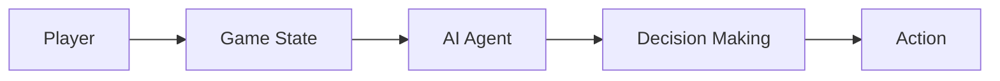
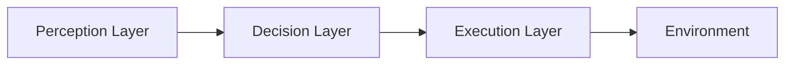
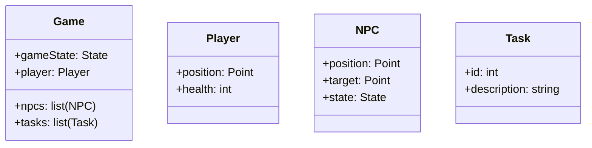
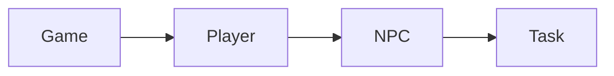
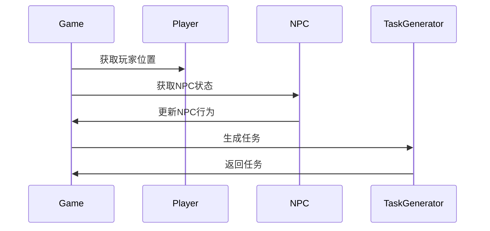

                 


# AI Agent在游戏开发中的创新应用

**关键词**：AI Agent, 游戏开发, 创新应用, 机器学习, 行为决策, NPC

**摘要**：  
AI Agent（人工智能代理）在游戏开发中的应用已经成为现代游戏设计的重要创新方向。通过AI Agent，游戏中的非玩家角色（NPC）能够实现更智能、更动态的行为决策，从而提升游戏的沉浸感和可玩性。本文将从AI Agent的基本概念出发，探讨其在游戏开发中的核心原理、应用场景、系统架构以及实际项目中的创新实践。文章结合理论与实践，通过具体案例分析，深入剖析AI Agent在游戏开发中的技术实现与优化策略。

---

# 第1章 AI Agent的基本概念与背景

## 1.1 AI Agent的定义与特点
### 1.1.1 什么是AI Agent
AI Agent（人工智能代理）是一种能够感知环境、做出决策并采取行动的智能实体。在游戏开发中，AI Agent通常用于控制NPC（非玩家角色）的行为，使其能够与玩家互动并适应游戏环境的变化。

### 1.1.2 AI Agent的核心特点
1. **自主性**：AI Agent能够独立决策，无需外部干预。
2. **反应性**：能够实时感知环境变化并做出响应。
3. **目标导向**：基于目标驱动行为，具有明确的行动动机。
4. **学习能力**：通过机器学习算法不断优化行为策略。

### 1.1.3 AI Agent在游戏开发中的作用
AI Agent在游戏中的作用包括NPC行为控制、任务生成、玩家行为预测与响应等，显著提升了游戏的互动性和趣味性。

## 1.2 游戏开发中的传统AI与现代AI的区别
### 1.2.1 传统游戏AI的局限性
传统游戏AI通常基于规则引擎或有限状态机（FSM），虽然能够实现简单的逻辑行为，但缺乏灵活性和适应性，容易被玩家预测和利用。

### 1.2.2 现代AI Agent的优势
现代AI Agent结合了机器学习、强化学习等技术，能够实现动态决策、自适应行为和复杂环境下的智能交互。

### 1.2.3 游戏开发中AI的创新应用
AI Agent的创新应用包括智能NPC、自适应任务生成、动态难度调节等，显著提升了游戏的沉浸感和玩家体验。

## 1.3 游戏开发中AI Agent的应用场景
### 1.3.1 NPC行为控制
AI Agent可以实现NPC的自主决策，例如巡逻、追逐、逃跑等行为。

### 1.3.2 自动任务生成
AI Agent可以根据游戏环境和玩家行为动态生成任务，例如动态生成敌人行动计划或道具位置。

### 1.3.3 玩家行为预测与响应
AI Agent可以实时预测玩家行为并做出响应，例如动态调整敌人策略或优化NPC互动方式。

## 1.4 本章小结
本章介绍了AI Agent的基本概念、特点及其在游戏开发中的作用，并对比了传统AI与现代AI的区别，最后总结了AI Agent在游戏开发中的主要应用场景。

---

# 第2章 AI Agent的核心概念与原理

## 2.1 AI Agent的核心概念
### 2.1.1 知识表示
知识表示是AI Agent实现智能决策的基础，包括状态表示、动作表示和目标表示。

### 2.1.2 行为决策
行为决策是AI Agent的核心功能，基于当前环境状态和目标，选择最优动作。

### 2.1.3 状态感知
状态感知是AI Agent通过传感器或游戏引擎获取环境信息的过程，包括视觉、听觉和触觉等感知方式。

## 2.2 AI Agent的核心原理
### 2.2.1 基于规则的决策系统
基于规则的决策系统通过预定义的规则集实现行为决策，简单但缺乏灵活性。

### 2.2.2 基于状态的决策系统
基于状态的决策系统通过有限状态机（FSM）实现行为决策，适用于复杂环境下的动态行为切换。

### 2.2.3 基于逻辑推理的决策系统
基于逻辑推理的决策系统通过形式逻辑推理实现行为决策，适用于需要复杂推理的任务。

## 2.3 AI Agent的核心要素对比
### 2.3.1 不同决策系统的对比表格
| 决策系统 | 优点 | 缺点 |
|----------|------|------|
| 基于规则 | 简单易懂 | 缺乏灵活性 |
| 基于状态 | 灵活性高 | 实现复杂 |
| 基于逻辑 | 推理能力强 | 计算开销大 |

### 2.3.2 AI Agent实体关系图的 Mermaid 流程图


## 2.4 本章小结
本章深入探讨了AI Agent的核心概念与原理，分析了不同决策系统的优缺点，并通过Mermaid图展示了AI Agent的实体关系。

---

# 第3章 AI Agent的算法原理与实现

## 3.1 常见AI算法在游戏开发中的应用
### 3.1.1 A*寻路算法
A*算法是一种经典的路径规划算法，广泛应用于游戏中的NPC寻路和任务规划。

### 3.1.2 有限状态机（FSM）
FSM通过状态转移实现行为切换，适用于简单但高效的决策逻辑。

### 3.1.3 强化学习算法
强化学习通过奖励机制优化行为策略，适用于复杂环境下的动态决策。

## 3.2 AI Agent的数学模型与公式
### 3.2.1 A*算法的数学模型
$$f(n) = g(n) + h(n)$$  
其中，$g(n)$是当前节点到起点的路径成本，$h(n)$是当前节点到目标的启发函数。

### 3.2.2 强化学习的数学模型
$$Q(s, a) = r + \gamma \max_{a'} Q(s', a')$$  
其中，$Q$是Q值函数，$s$是当前状态，$a$是动作，$\gamma$是折扣因子。

## 3.3 AI Agent的实现步骤
### 3.3.1 环境感知
通过传感器或游戏引擎获取环境信息。

### 3.3.2 状态表示
将环境信息转换为可处理的状态表示。

### 3.3.3 行为决策
基于当前状态和目标，选择最优动作。

### 3.3.4 动作执行
将决策结果转化为具体动作，实现行为执行。

## 3.4 本章小结
本章详细介绍了常见AI算法在游戏开发中的应用，分析了算法的数学模型，并总结了AI Agent的实现步骤。

---

# 第4章 AI Agent的系统架构与设计

## 4.1 系统架构概述
AI Agent的系统架构包括感知层、决策层和执行层，各层协同工作实现智能行为。

### 4.1.1 感知层
感知层负责获取环境信息，例如玩家位置、游戏状态等。

### 4.1.2 决策层
决策层基于感知信息和目标，制定行为决策。

### 4.1.3 执行层
执行层将决策转化为具体动作，实现行为执行。

## 4.2 系统设计与优化
### 4.2.1 系统功能设计
系统功能包括环境感知、行为决策、动作执行和学习优化。

### 4.2.2 系统优化策略
通过缓存、并行计算和增量学习等技术优化系统性能。

## 4.3 系统架构图的 Mermaid 图


## 4.4 本章小结
本章总结了AI Agent的系统架构与设计，分析了各层的功能与优化策略，并通过Mermaid图展示了系统架构。

---

# 第5章 AI Agent在游戏开发中的创新应用

## 5.1 智能NPC的设计与实现
### 5.1.1 智能NPC的行为模型
基于AI Agent实现智能NPC的行为模型，例如巡逻、追逐和逃跑。

### 5.1.2 NPC行为的动态调整
通过机器学习动态调整NPC行为策略，提升游戏的可玩性。

## 5.2 动态任务生成
### 5.2.1 动态任务生成的原理
基于游戏环境和玩家行为动态生成任务，例如动态生成敌人行动计划。

### 5.2.2 动态任务生成的实现
通过AI Agent的感知和决策能力实现动态任务生成。

## 5.3 玩家行为预测与响应
### 5.3.1 玩家行为预测的原理
通过机器学习模型预测玩家行为，例如预测玩家的下一步动作。

### 5.3.2 玩家行为响应的实现
基于预测结果动态调整NPC行为，提升游戏的互动性。

## 5.4 本章小结
本章总结了AI Agent在游戏开发中的创新应用，分析了智能NPC、动态任务生成和玩家行为预测与响应的设计与实现。

---

# 第6章 项目实战：基于AI Agent的RPG游戏开发

## 6.1 项目背景与需求分析
### 6.1.1 项目背景
本项目旨在开发一款基于AI Agent的RPG游戏，实现智能NPC和动态任务生成。

### 6.1.2 需求分析
需求包括智能NPC行为控制、动态任务生成和玩家行为预测与响应。

## 6.2 系统功能设计
### 6.2.1 领域模型图的 Mermaid 图


## 6.3 系统架构设计
### 6.3.1 系统架构图的 Mermaid 图


## 6.4 系统接口设计
### 6.4.1 NPC行为控制接口
```python
class NPCController:
    def update(self, gameState):
        # 实现NPC行为更新
        pass
```

### 6.4.2 任务生成接口
```python
class TaskGenerator:
    def generateTask(self, gameState):
        # 实现任务生成
        pass
```

## 6.5 系统交互序列图的 Mermaid 图


## 6.6 项目实战小结
本章通过一个实际项目案例，详细介绍了基于AI Agent的RPG游戏开发过程，包括需求分析、系统设计和实现步骤。

---

# 第7章 总结与展望

## 7.1 本章总结
本文系统介绍了AI Agent在游戏开发中的创新应用，分析了AI Agent的核心概念、算法原理和系统架构，并通过实际项目案例展示了其在游戏开发中的应用价值。

## 7.2 未来展望
未来，AI Agent在游戏开发中的应用将更加广泛，包括更智能的NPC、更动态的任务生成和更复杂的玩家行为预测与响应。

## 7.3 注意事项
在实际应用中，需要注意AI Agent的性能优化、算法选择和系统设计，以确保游戏的流畅运行和玩家体验。

## 7.4 拓展阅读
推荐阅读相关技术文献，深入学习AI Agent在游戏开发中的具体应用和优化策略。

---

# 附录：AI Agent相关技术细节

## 附录A：数学公式汇总
- A*算法：$$f(n) = g(n) + h(n)$$
- 强化学习：$$Q(s, a) = r + \gamma \max_{a'} Q(s', a')$$

## 附录B：API文档
- 游戏引擎接口：[Unity API](https://docs.unity3d.com/)
- AI算法库：[OpenAI Gym](https://gym.openai.com/)

## 附录C：工具推荐
- 游戏开发工具：Unity、Unreal Engine
- AI开发工具：TensorFlow、PyTorch

## 附录D：术语表
- AI Agent：人工智能代理
- NPC：非玩家角色
- FSM：有限状态机
- A*：A星算法

---

# 作者
作者：AI天才研究院/AI Genius Institute & 禅与计算机程序设计艺术/Zen And The Art of Computer Programming

