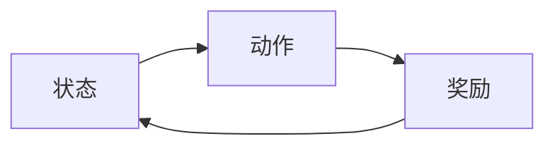
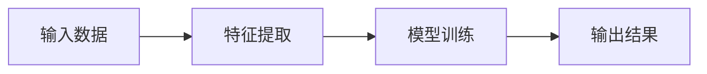
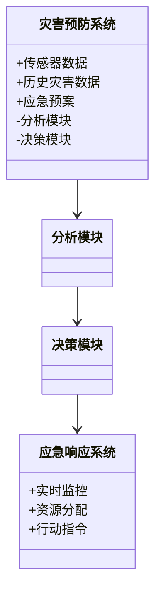
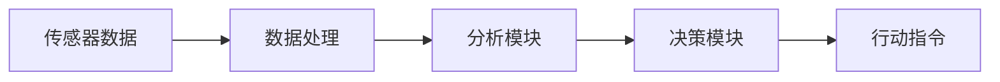
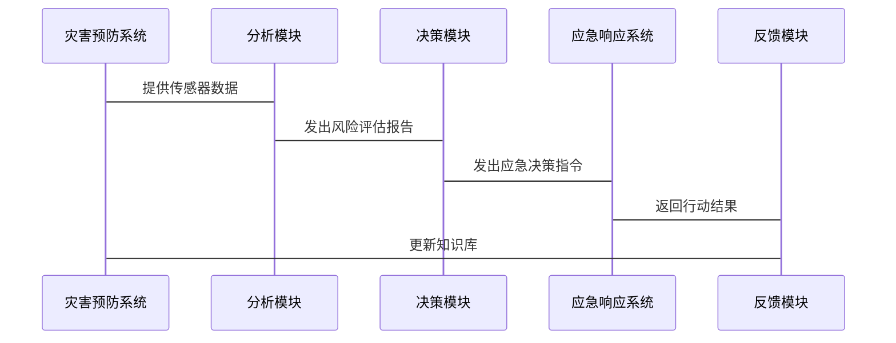

                 


# AI Agent在灾害预防与应急响应中的作用

**关键词：** AI Agent, 灾害预防, 应急响应, 强化学习, 系统架构, 项目实战

**摘要：**  
本文探讨AI Agent在灾害预防与应急响应中的关键作用。通过分析AI Agent的核心概念、算法原理、系统架构及实际案例，揭示其在灾害预测、风险评估和应急决策中的潜力。文章结构清晰，内容详实，旨在为技术开发者和应急管理部门提供理论与实践参考。

---

# 第1章: AI Agent的基本概念与背景介绍

## 1.1 AI Agent的定义与核心概念

AI Agent（智能体）是指能够感知环境、做出决策并执行行动的智能系统。它具备以下核心属性：
- **自主性：** 能够独立运作，无需外部干预。
- **反应性：** 能够实时感知环境变化并做出响应。
- **目标导向：** 通过优化目标函数来实现特定任务。
- **学习能力：** 能够通过经验改进性能。

AI Agent在灾害预防中的作用主要体现在：
1. 实时监控：通过传感器和数据源持续收集环境信息。
2. 风险评估：分析数据，预测潜在灾害风险。
3. 应急决策：制定应急方案，协调资源。

---

## 1.2 灾害预防与应急响应的背景

### 1.2.1 灾害的类型与影响

灾害可分为自然灾害（地震、洪水、台风）和人为灾害（火灾、爆炸、恐怖袭击）。灾害带来的人员伤亡和财产损失巨大，因此预防和应急响应至关重要。

### 1.2.2 灾害预防的传统方法与局限性

传统方法依赖人工监控和经验判断，存在以下问题：
- 响应速度慢：依赖人工分析，无法实时处理海量数据。
- 精准度低：经验判断存在主观性和局限性。
- 资源分配不合理：难以在复杂情况下优化资源配置。

### 1.2.3 现代灾害响应的需求与挑战

现代灾害响应需要快速、精准的决策支持系统。AI Agent能够通过实时数据分析优化资源分配，提高响应效率。

---

## 1.3 AI Agent在灾害预防中的应用前景

### 1.3.1 AI Agent的优势与潜力

AI Agent的优势在于：
- **实时性：** 能够快速处理数据，提供实时反馈。
- **准确性：** 利用机器学习算法提高预测精度。
- **可扩展性：** 能够适应不同规模和类型的灾害。

### 1.3.2 典型应用场景分析

AI Agent可应用于：
- **火灾预警：** 通过烟雾传感器和视频监控实时检测火源。
- **洪水监测：** 分析气象数据和水位传感器预测洪水风险。
- **地震预警：** 利用地震传感器和历史数据快速发出警报。

### 1.3.3 技术发展的趋势与挑战

技术发展趋势：
- **多模态数据处理：** 综合分析多种数据源，提高预测准确性。
- **强化学习应用：** 通过强化学习优化应急决策流程。
- **边缘计算：** 实现本地实时计算，减少延迟。

---

# 第2章: AI Agent的核心概念与工作原理

## 2.1 AI Agent的分类与特点

### 2.1.1 分类：基于智能水平的划分

AI Agent可分为：
- **反应式Agent：** 基于当前感知做出反应。
- **基于模型的Agent：** 使用内部模型进行推理和规划。
- **学习型Agent：** 能够通过经验改进性能。

### 2.1.2 AI Agent的特点

AI Agent的特点包括：
- **感知能力：** 通过传感器和数据源获取环境信息。
- **决策能力：** 利用算法制定最优行动方案。
- **执行能力：** 执行决策并反馈结果。

### 2.1.3 与传统自动化系统的区别

AI Agent与传统自动化系统的区别在于：
- **自主性：** AI Agent具备自主决策能力。
- **学习能力：** 能够通过经验优化性能。
- **适应性：** 能够根据环境变化调整行为。

---

## 2.2 AI Agent的工作原理

### 2.2.1 感知层：数据采集与处理

感知层通过传感器和数据源获取环境信息，例如：
- **地震传感器：** 监测地壳活动。
- **气象传感器：** 监测温度、湿度、风速等。

### 2.2.2 决策层：算法与策略

决策层利用算法对数据进行分析，制定行动方案。常见的算法包括：
- **强化学习：** 通过试错优化决策。
- **监督学习：** 基于历史数据进行分类和回归。

### 2.2.3 执行层：行动与反馈

执行层根据决策层的指令执行行动，并将结果反馈给感知层。

---

## 2.3 AI Agent在灾害预防中的核心要素

### 2.3.1 数据源：传感器、历史数据、实时信息

数据源包括：
- **传感器数据：** 如地震传感器、气象传感器。
- **历史数据：** 历史灾害数据和应急响应记录。
- **实时信息：** 当前环境的动态数据。

### 2.3.2 知识库：灾害类型、应对策略、应急预案

知识库包含：
- **灾害类型：** 不同灾害的特征和应对措施。
- **应对策略：** 不同场景下的最优行动方案。
- **应急预案：** 标准化的应急响应流程。

### 2.3.3 决策模型：规则引擎、机器学习模型

决策模型包括：
- **规则引擎：** 基于预定义规则进行决策。
- **机器学习模型：** 利用训练数据进行预测和分类。

---

# 第3章: AI Agent的算法原理与数学模型

## 3.1 常见算法概述

### 3.1.1 强化学习：Q-Learning算法

Q-Learning算法通过试错学习优化决策策略。其核心公式为：
$$ Q(s, a) = Q(s, a) + \alpha (r + \gamma \max Q(s', a') - Q(s, a)) $$

### 3.1.2 监督学习：分类与回归算法

监督学习用于分类和回归任务。例如，利用决策树算法对灾害类型进行分类。

### 3.1.3 聚类分析：K-Means算法

K-Means算法用于将相似的数据点聚类，常用于模式识别。

---

## 3.2 算法原理与流程图

### 3.2.1 强化学习流程图



### 3.2.2 监督学习流程图



---

## 3.3 数学模型与公式

### 3.3.1 Q-Learning算法公式

$$ Q(s, a) = Q(s, a) + \alpha (r + \gamma \max Q(s', a') - Q(s, a)) $$

### 3.3.2 分类算法示例

$$ P(y|x) = \frac{P(x|y)P(y)}{P(x)} $$

---

## 3.4 算法实现与代码示例

### 3.4.1 强化学习代码示例

```python
import numpy as np

class QLearning:
    def __init__(self, state_space, action_space):
        self.state_space = state_space
        self.action_space = action_space
        self.Q = np.zeros((state_space, action_space))
    
    def update(self, state, action, reward, next_state, alpha=0.1, gamma=0.9):
        self.Q[state, action] += alpha * (reward + gamma * np.max(self.Q[next_state, :]) - self.Q[state, action])
```

---

# 第4章: AI Agent的系统架构设计

## 4.1 灾害预防与应急响应的场景分析

### 4.1.1 火灾应急响应场景

在火灾场景中，AI Agent需要实时监测烟雾传感器和视频监控，及时发出警报并制定灭火方案。

### 4.1.2 洪水应急响应场景

在洪水场景中，AI Agent需要分析气象数据和水位传感器，预测洪水风险并制定撤离计划。

---

## 4.2 系统功能设计

### 4.2.1 领域模型：灾害预防与应急响应系统



---

## 4.3 系统架构设计

### 4.3.1 系统架构图



---

## 4.4 系统接口设计

### 4.4.1 灾害预防系统接口

- **输入接口：** 传感器数据、历史灾害数据。
- **输出接口：** 风险评估报告、应急决策方案。

### 4.4.2 应急响应系统接口

- **输入接口：** 决策模块指令。
- **输出接口：** 行动指令、反馈数据。

---

## 4.5 系统交互流程图



---

# 第5章: AI Agent的项目实战

## 5.1 项目背景与目标

### 5.1.1 项目背景

以城市洪水应急响应系统为例，AI Agent需要实时监测气象数据和水位传感器，预测洪水风险并制定撤离计划。

### 5.1.2 项目目标

- 实现实时监测与预测。
- 制定最优应急决策。
- 优化资源分配。

---

## 5.2 项目环境与工具

### 5.2.1 环境配置

- **操作系统：** Linux
- **编程语言：** Python
- **框架与库：** TensorFlow、Keras、OpenCV
- **传感器与数据源：** 气象传感器、水位传感器、视频监控

---

## 5.3 核心代码实现

### 5.3.1 数据处理与特征提取

```python
import pandas as pd

def preprocess_data(data):
    # 数据预处理
    data['time'] = pd.to_datetime(data['time'])
    data.set_index('time', inplace=True)
    return data
```

### 5.3.2 灾害预测模型

```python
from sklearn.ensemble import RandomForestRegressor

model = RandomForestRegressor(n_estimators=100, random_state=42)
model.fit(X_train, y_train)
```

---

## 5.4 项目实战与案例分析

### 5.4.1 实际案例分析

在某城市，AI Agent通过实时监测气象数据和水位传感器，成功预测了洪水风险，并协调救援资源，减少了人员伤亡和财产损失。

### 5.4.2 项目总结与经验教训

- **总结：** AI Agent在灾害预防中的应用显著提高了应急响应效率。
- **教训：** 数据质量和模型优化是未来改进的重点。

---

# 第6章: AI Agent的最佳实践与未来展望

## 6.1 最佳实践

### 6.1.1 数据质量：确保数据的准确性和实时性

数据是AI Agent决策的基础，数据质量直接影响预测结果。

### 6.1.2 模型优化：持续优化算法和参数

通过持续学习和模型优化，提高AI Agent的预测精度和决策能力。

### 6.1.3 系统集成：与其他应急系统无缝对接

确保AI Agent能够与其他应急系统协同工作，形成高效的应急响应网络。

---

## 6.2 未来展望与发展趋势

### 6.2.1 多模态数据融合

未来，AI Agent将综合分析多种数据源，提高预测精度。

### 6.2.2 自适应学习

AI Agent将具备更强的自适应学习能力，能够根据环境变化动态调整策略。

### 6.2.3 边缘计算与雾计算

通过边缘计算和雾计算，实现本地实时计算，减少数据传输延迟。

---

## 6.3 总结与注意事项

### 6.3.1 总结

AI Agent在灾害预防与应急响应中的应用前景广阔，能够显著提高应急响应效率和精准度。

### 6.3.2 注意事项

- **数据隐私：** 注意保护个人隐私和数据安全。
- **系统可靠性：** 确保系统的稳定性和容错性。
- **人机协作：** AI Agent应与人类专家协同工作，避免过度依赖机器决策。

---

# 附录: 参考文献与工具列表

**参考文献：**
1. Russell, S.和Norvig, P.，《人工智能：一种现代方法》
2. LeCun, Y.等人，《深度学习教科书》
3. Goodfellow, I.等人，《深度学习》

**工具列表：**
- Python编程语言
- TensorFlow、Keras深度学习框架
- OpenCV计算机视觉库
- Pandas数据分析库
- Mermaid图表工具

---

**作者：AI天才研究院/AI Genius Institute & 禅与计算机程序设计艺术 /Zen And The Art of Computer Programming**

---

以上为完整的技术博客文章大纲和内容示例。

