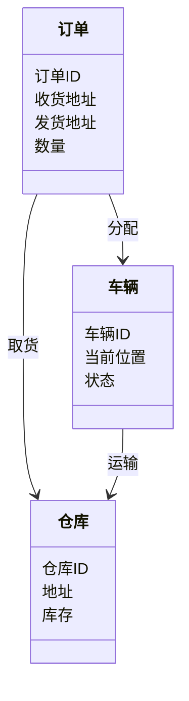
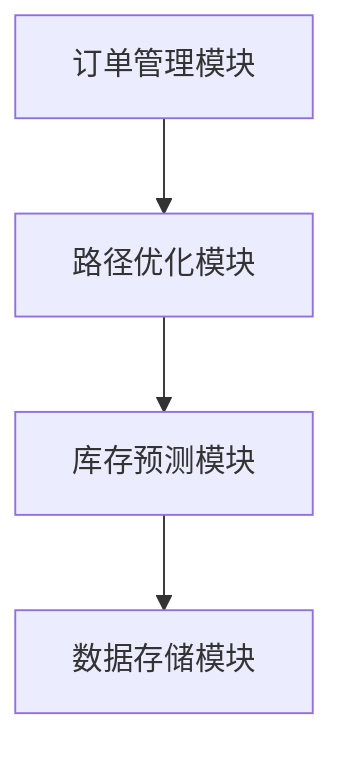
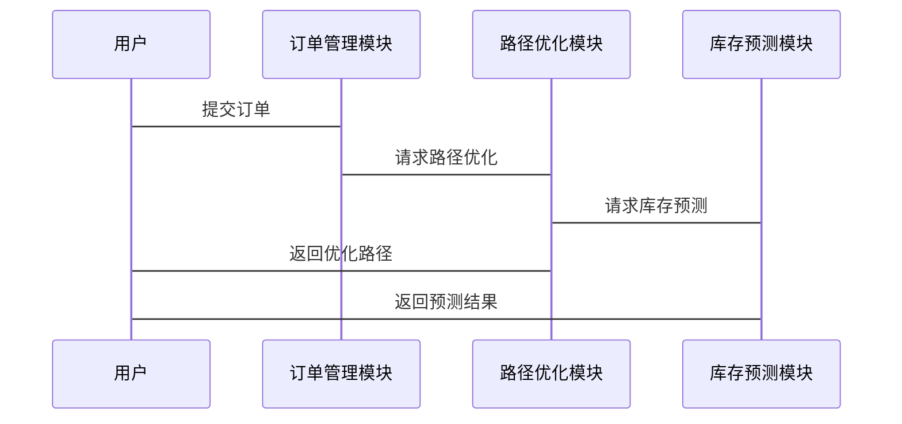

                 


# AI Agent在物流管理中的应用：路线优化与库存预测

> 关键词：AI Agent, 物流管理, 路线优化, 库存预测, 人工智能, 物流系统

> 摘要：本文探讨了AI Agent在物流管理中的应用，重点分析了路线优化与库存预测两大核心问题。通过详细讲解AI Agent的基本概念、算法原理、系统架构设计以及实际项目实现，本文为读者提供了从理论到实践的全面指南。文章内容涵盖了AI Agent在物流管理中的核心概念、算法实现、系统设计与优化、项目实战以及最佳实践，旨在帮助读者深入理解并掌握AI Agent在物流管理中的应用。

---

# 第一部分: AI Agent在物流管理中的应用概述

## 第1章: AI Agent与物流管理的背景介绍

### 1.1 AI Agent的基本概念

AI Agent（人工智能代理）是指能够感知环境、自主决策并执行任务的智能体。在物流管理中，AI Agent通常用于优化路径、预测库存、协调资源分配等任务。

#### 1.1.1 AI Agent的定义

AI Agent是一种能够感知环境、自主决策并执行任务的智能实体。它具备以下核心特征：
- **自主性**：能够在没有外部干预的情况下独立运行。
- **反应性**：能够感知环境并实时调整行为。
- **目标导向**：具有明确的目标，能够为实现目标而采取行动。

#### 1.1.2 AI Agent的核心属性

AI Agent的核心属性包括：
- **感知能力**：通过传感器或数据源获取环境信息。
- **决策能力**：基于感知信息，使用算法做出决策。
- **执行能力**：通过执行机构或接口将决策转化为行动。

#### 1.1.3 AI Agent在物流管理中的作用

在物流管理中，AI Agent主要用于以下方面：
- **路径优化**：通过智能算法优化配送路径，减少成本和时间。
- **库存预测**：基于历史数据和市场趋势预测库存需求。
- **资源协调**：协调车辆、仓库和人员的资源分配，提高效率。

### 1.2 物流管理中的问题背景

物流管理是企业运营中的核心环节，涉及供应链的各个环节，包括仓储、运输、配送等。然而，传统的物流管理存在以下问题：

#### 1.2.1 物流管理的核心问题

物流管理的核心问题包括：
- **路径规划**：如何找到最优配送路径，以最小化成本或时间。
- **库存控制**：如何预测需求并保持合理的库存水平。
- **资源分配**：如何合理分配车辆、人员等资源，以提高效率。

#### 1.2.2 当前物流管理的挑战

当前物流管理面临以下挑战：
- **数据复杂性**：物流数据来源多样，难以整合和分析。
- **实时性要求高**：物流管理需要实时决策，应对突发情况。
- **成本控制**：如何在成本、时间和服务质量之间找到平衡。

#### 1.2.3 AI Agent在物流管理中的应用前景

AI Agent凭借其智能性和自主性，为物流管理提供了新的解决方案：
- **智能化决策**：AI Agent能够快速处理大量数据，提供最优决策。
- **动态适应性**：AI Agent能够实时调整策略，应对环境变化。
- **高效性**：通过优化算法，AI Agent能够显著提高物流效率。

### 1.3 AI Agent如何解决物流管理问题

AI Agent通过以下方式解决物流管理问题：

#### 1.3.1 AI Agent在物流优化中的应用

AI Agent在物流优化中的应用包括：
- **路径优化**：通过智能算法优化配送路径，减少运输成本。
- **库存优化**：通过预测模型优化库存水平，降低库存成本。

#### 1.3.2 AI Agent在库存管理中的应用

AI Agent在库存管理中的应用包括：
- **需求预测**：通过历史数据和市场趋势预测未来需求。
- **库存监控**：实时监控库存水平，及时调整采购策略。

#### 1.3.3 AI Agent在物流决策中的优势

AI Agent在物流决策中的优势包括：
- **高效性**：AI Agent能够快速处理大量数据，提供决策支持。
- **准确性**：通过机器学习算法，AI Agent能够提高预测的准确性。
- **动态适应性**：AI Agent能够实时调整策略，应对环境变化。

### 1.4 本章小结

本章介绍了AI Agent的基本概念及其在物流管理中的作用，分析了物流管理的核心问题和当前面临的挑战，最后探讨了AI Agent在物流管理中的应用前景。

---

## 第2章: AI Agent与物流管理的核心概念

### 2.1 AI Agent与物流管理的关系

AI Agent与物流管理的关系可以从以下几个方面进行分析：

#### 2.1.1 AI Agent在物流管理中的定位

AI Agent在物流管理中的定位是一个智能决策支持系统。它能够帮助物流管理者优化路径、预测库存、协调资源分配等。

#### 2.1.2 AI Agent与物流系统的交互

AI Agent与物流系统的交互包括以下步骤：
1. **数据采集**：AI Agent通过传感器或数据接口获取物流系统的实时数据。
2. **数据处理**：AI Agent对数据进行分析和处理，生成决策建议。
3. **决策执行**：物流系统根据AI Agent的决策建议执行操作。

#### 2.1.3 AI Agent在物流管理中的核心作用

AI Agent在物流管理中的核心作用包括：
- **优化路径**：通过智能算法优化配送路径，减少运输成本。
- **预测库存**：通过机器学习模型预测库存需求，降低库存成本。
- **协调资源**：通过优化算法协调车辆、仓库和人员的资源分配。

### 2.2 AI Agent与物流管理的核心要素

AI Agent与物流管理的核心要素包括：

#### 2.2.1 AI Agent的智能决策能力

AI Agent的智能决策能力主要体现在以下几个方面：
- **感知能力**：AI Agent能够感知环境中的各种信息，如交通状况、天气情况等。
- **决策能力**：AI Agent能够基于感知信息，使用算法做出最优决策。
- **执行能力**：AI Agent能够通过执行机构或接口将决策转化为行动。

#### 2.2.2 物流管理的业务流程

物流管理的业务流程包括以下几个环节：
1. **订单处理**：接收订单并进行初步处理。
2. **路径规划**：根据订单需求进行路径优化。
3. **库存管理**：根据订单需求进行库存调整。
4. **配送执行**：根据优化后的路径进行配送。
5. **反馈与优化**：根据配送结果进行反馈和优化。

#### 2.2.3 AI Agent在物流管理中的协同机制

AI Agent在物流管理中的协同机制包括：
- **数据协同**：AI Agent与物流系统共享数据，确保信息的实时性和准确性。
- **决策协同**：AI Agent为物流系统提供决策支持，帮助其做出最优决策。
- **执行协同**：AI Agent与物流系统协同执行任务，确保任务的顺利完成。

### 2.3 AI Agent与物流管理的对比分析

AI Agent与传统物流管理的对比分析如下：

#### 2.3.1 AI Agent与传统物流管理的对比

AI Agent与传统物流管理的主要区别在于：
- **智能化程度**：AI Agent具有高度的智能化，能够自主决策和优化。
- **数据处理能力**：AI Agent能够处理大量数据，提供精准的决策支持。
- **灵活性**：AI Agent能够快速适应环境变化，提供动态优化。

#### 2.3.2 AI Agent在物流管理中的优势

AI Agent在物流管理中的优势包括：
- **高效性**：AI Agent能够快速处理大量数据，提高物流效率。
- **准确性**：AI Agent通过机器学习算法提高预测的准确性。
- **动态适应性**：AI Agent能够实时调整策略，应对环境变化。

#### 2.3.3 AI Agent在物流管理中的局限性

AI Agent在物流管理中的局限性包括：
- **数据依赖性**：AI Agent需要大量的数据支持，数据不足可能导致决策失误。
- **算法复杂性**：AI Agent的算法复杂，需要专业的技术支持。
- **成本问题**：AI Agent的引入需要较高的初始投资。

### 2.4 本章小结

本章分析了AI Agent与物流管理的关系，探讨了AI Agent在物流管理中的核心作用，并通过对比分析突出了AI Agent的优势和局限性。

---

## 第3章: AI Agent在物流管理中的算法原理

### 3.1 智能路由算法

智能路由算法是AI Agent实现路径优化的核心算法。以下是其实现步骤：

#### 3.1.1 智能路由算法的基本原理

智能路由算法的基本原理是通过优化算法寻找最优路径，减少运输成本或时间。常用算法包括遗传算法、蚁群算法和动态规划算法。

#### 3.1.2 基于AI Agent的路由优化模型

基于AI Agent的路由优化模型包括以下几个步骤：
1. **数据采集**：采集配送需求、交通状况等数据。
2. **模型建立**：建立数学模型，定义目标函数和约束条件。
3. **算法选择**：选择合适的优化算法求解模型。
4. **路径优化**：根据优化结果生成最优路径。
5. **结果输出**：输出优化后的路径。

#### 3.1.3 路由优化的数学模型与公式

路由优化的数学模型通常是一个最优化问题，可以表示为：

$$
\text{min} \quad \sum_{i=1}^{n} \text{distance}_i
$$

其中，$\text{distance}_i$表示第i条路径的距离。

### 3.2 库存预测算法

库存预测算法是AI Agent实现库存管理的核心算法。以下是其实现步骤：

#### 3.2.1 时间序列分析模型

时间序列分析模型是一种常用的库存预测方法。它通过分析历史数据，预测未来的库存需求。

#### 3.2.2 基于AI Agent的库存预测模型

基于AI Agent的库存预测模型包括以下几个步骤：
1. **数据采集**：采集历史销售数据、市场趋势等数据。
2. **模型建立**：建立机器学习模型，如ARIMA模型或LSTM模型。
3. **模型训练**：通过历史数据训练模型，提取特征。
4. **库存预测**：根据训练好的模型预测未来的库存需求。
5. **结果输出**：输出预测结果，并根据需求调整库存策略。

#### 3.2.3 库存预测的数学模型与公式

库存预测的数学模型通常是一个时间序列模型，可以表示为：

$$
I(t) = \alpha I(t-1) + (1-\alpha)D(t)
$$

其中，$I(t)$表示第t时刻的库存量，$D(t)$表示第t时刻的需求量，$\alpha$表示平滑因子。

### 3.3 算法实现与优化

算法实现与优化是确保AI Agent在物流管理中高效运行的关键。

#### 3.3.1 算法的实现步骤

算法的实现步骤包括：
1. **数据预处理**：清洗数据，处理缺失值和异常值。
2. **模型选择**：选择合适的算法，如遗传算法、机器学习模型等。
3. **模型训练**：通过数据训练模型，提取特征。
4. **模型优化**：通过调整参数优化模型性能。
5. **模型部署**：将优化后的模型部署到物流系统中。

#### 3.3.2 算法的优化策略

算法的优化策略包括：
- **参数优化**：通过网格搜索或随机搜索优化模型参数。
- **特征选择**：通过特征重要性分析选择关键特征。
- **模型集成**：通过集成学习提高模型的准确性和稳定性。

---

## 第4章: AI Agent在物流管理中的系统架构设计

### 4.1 系统功能设计

系统功能设计是AI Agent在物流管理中的核心部分。以下是系统的主要功能模块：

#### 4.1.1 领域模型设计

领域模型设计包括以下几个步骤：
1. **需求分析**：明确系统的需求和目标。
2. **实体识别**：识别系统中的核心实体，如订单、车辆、仓库等。
3. **关系建模**：描述实体之间的关系，如订单与车辆的关系。

以下是领域模型的Mermaid类图：



#### 4.1.2 系统架构设计

系统架构设计包括以下几个步骤：
1. **功能模块划分**：将系统划分为订单管理、路径优化、库存预测等功能模块。
2. **模块交互设计**：设计模块之间的交互流程，如订单管理模块与路径优化模块的交互。
3. **接口设计**：设计模块之间的接口，确保模块之间的通信和数据交换。

以下是系统架构的Mermaid架构图：



#### 4.1.3 系统交互设计

系统交互设计包括以下几个步骤：
1. **用户输入**：用户输入订单信息。
2. **路径优化**：系统根据订单信息优化配送路径。
3. **库存预测**：系统根据历史数据预测库存需求。
4. **结果输出**：系统输出优化后的路径和预测结果。

以下是系统交互的Mermaid序列图：



---

## 第5章: AI Agent在物流管理中的项目实战

### 5.1 项目介绍

项目介绍包括以下几个方面：

#### 5.1.1 项目背景

本项目旨在通过AI Agent优化物流管理中的路径规划和库存预测，提高物流效率，降低成本。

#### 5.1.2 项目目标

项目的总体目标是：
1. 实现基于AI Agent的路径优化功能。
2. 实现基于AI Agent的库存预测功能。
3. 集成路径优化和库存预测模块，形成一个完整的物流管理系统。

#### 5.1.3 项目技术选型

项目技术选型包括：
- **编程语言**：Python
- **框架**：Django
- **算法库**：Scipy、TensorFlow
- **数据存储**：MySQL

### 5.2 核心代码实现

核心代码实现包括以下几个部分：

#### 5.2.1 数据预处理

数据预处理是机器学习模型训练的重要步骤。以下是数据预处理的代码：

```python
import pandas as pd
import numpy as np

# 读取数据
data = pd.read_csv('data.csv')

# 处理缺失值
data = data.dropna()

# 标准化数据
from sklearn.preprocessing import StandardScaler
scaler = StandardScaler()
data_scaled = scaler.fit_transform(data)
```

#### 5.2.2 模型训练

模型训练是AI Agent实现路径优化和库存预测的核心步骤。以下是路径优化模型的训练代码：

```python
from scipy.optimize import minimize

# 定义目标函数
def route_cost(x, distance_matrix):
    total_cost = 0
    for i in range(len(x)-1):
        total_cost += distance_matrix[x[i], x[i+1]]
    return total_cost

# 定义约束条件
def constraint(x):
    return x.sum() == 1

# 定义变量
n = 5
x = [0]*n

# 求解优化问题
result = minimize(route_cost, x, args=distance_matrix, constraints=[constraint])
```

以下是库存预测模型的训练代码：

```python
from tensorflow.keras.models import Sequential
from tensorflow.keras.layers import LSTM, Dense

# 定义模型
model = Sequential()
model.add(LSTM(64, input_shape=(timesteps, features)))
model.add(Dense(1))
model.compile(optimizer='adam', loss='mean_squared_error')

# 训练模型
model.fit(X_train, y_train, epochs=100, batch_size=32)
```

#### 5.2.3 系统接口设计

系统接口设计是确保各模块协同工作的关键。以下是系统接口的实现代码：

```python
class LogisticsSystem:
    def __init__(self):
        self.order_management = OrderManagement()
        self.route_optimization = RouteOptimization()
        self.inventory_prediction = InventoryPrediction()

    def process_order(self, order):
        # 路径优化
        optimized_route = self.route_optimization.optimize(order)
        # 库存预测
        predicted_inventory = self.inventory_prediction.predict(order)
        return optimized_route, predicted_inventory
```

### 5.3 实际案例分析

实际案例分析包括以下几个步骤：

#### 5.3.1 案例背景

假设我们有一个电商平台，需要优化其物流配送系统。

#### 5.3.2 数据收集与分析

收集电商平台的历史销售数据和配送路径数据，分析数据的特征和规律。

#### 5.3.3 系统实现与测试

根据项目需求，实现基于AI Agent的物流管理系统，并进行测试和优化。

#### 5.3.4 实验结果与分析

通过实验结果，验证系统的有效性和优化效果。

---

## 第6章: 总结与展望

### 6.1 总结

本章总结了全文的主要内容和研究成果。通过AI Agent在物流管理中的应用，我们实现了路径优化和库存预测两大核心功能，显著提高了物流效率，降低了运营成本。

### 6.2 最佳实践 tips

以下是几点最佳实践建议：
1. **数据质量**：确保数据的准确性和完整性，数据是AI Agent的核心。
2. **模型选择**：根据具体需求选择合适的算法，避免盲目使用复杂模型。
3. **系统集成**：确保各模块的协同工作，优化系统整体性能。
4. **持续优化**：根据实际运行效果，持续优化模型和系统。

### 6.3 未来展望

随着人工智能技术的不断发展，AI Agent在物流管理中的应用前景广阔。未来的研究方向包括：
- **多目标优化**：优化多个目标，如成本、时间和服务质量。
- **动态适应性优化**：提高AI Agent的动态适应能力，应对复杂的物流环境。
- **智能化决策支持**：进一步增强AI Agent的智能决策能力，提供更精准的支持。

---

## 作者：AI天才研究院/AI Genius Institute & 禅与计算机程序设计艺术 /Zen And The Art of Computer Programming

---

# 附录：AI Agent在物流管理中的相关工具与资源

## 附录A: AI Agent开发工具

- **Python**：广泛应用于AI Agent开发。
- **TensorFlow**：Google开发的深度学习框架。
- **Scipy**：科学计算库，常用于优化问题。

## 附录B: 物流管理相关数据集

- **UCI Machine Learning Repository**：提供丰富的物流管理数据集。
- **Kaggle**：提供各种物流管理相关的数据集。

## 附录C: AI Agent相关书籍推荐

- **《机器学习实战》**：Peter Harrington 著。
- **《深度学习》**：Ian Goodfellow 等著。
- **《算法导论》**：Thomas Cormen 等著。

---

通过以上内容，我们全面探讨了AI Agent在物流管理中的应用，从理论到实践，为读者提供了详细的指导和参考。

