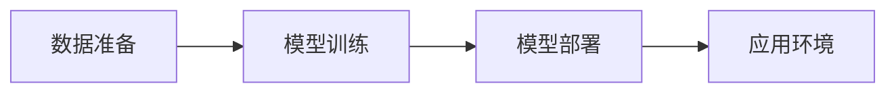
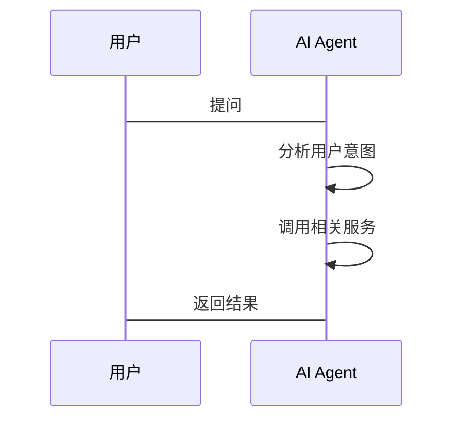
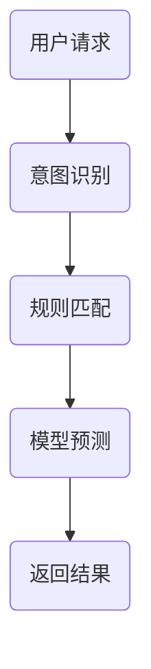
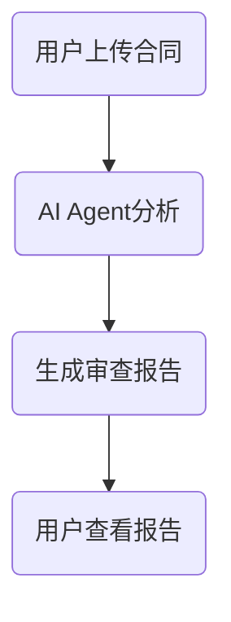
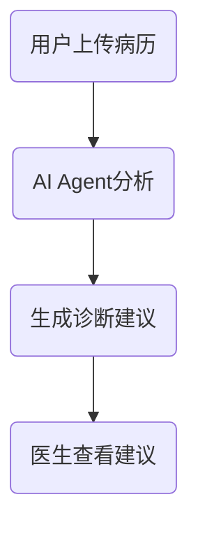
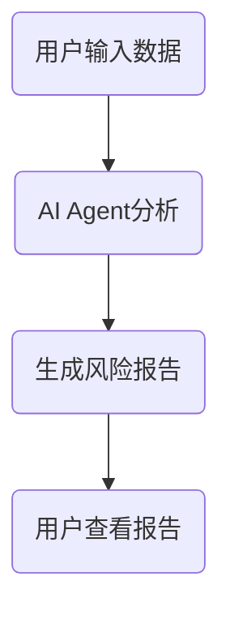
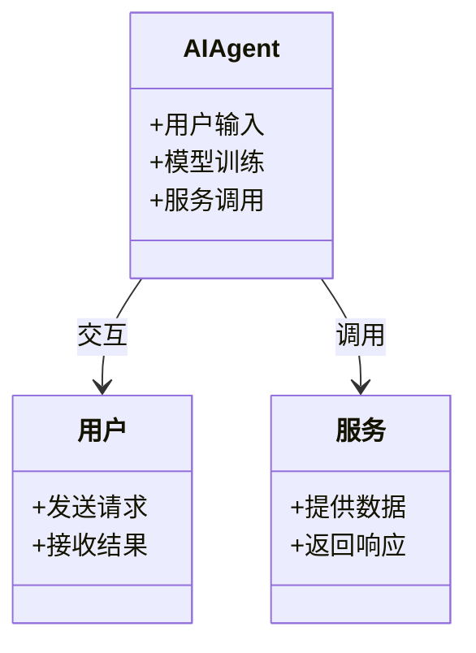
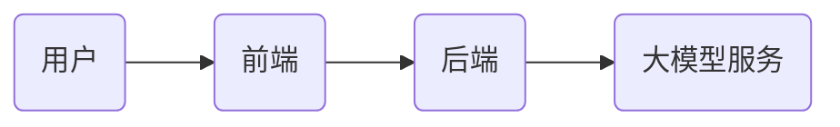
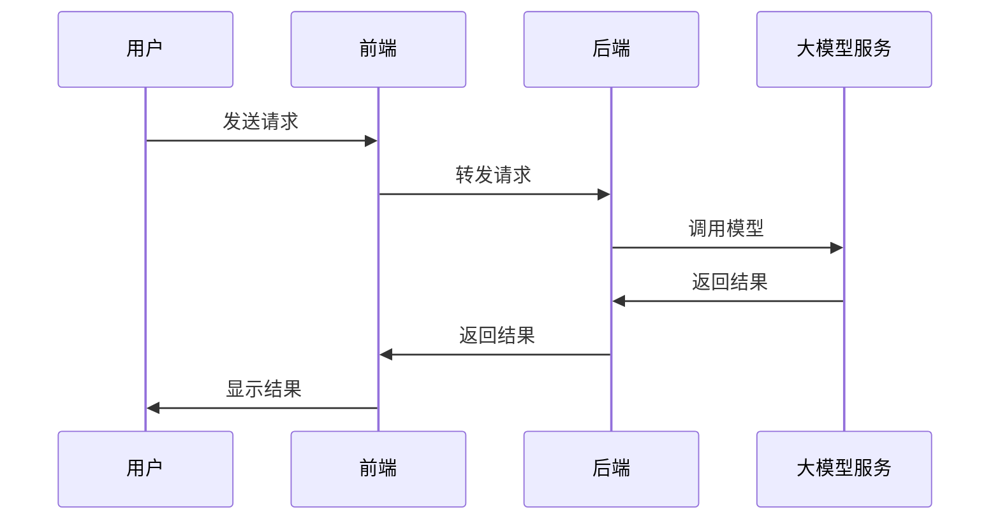

                 


# AI Agent在特定领域的深度应用：法律、医疗、金融

## 关键词：AI Agent, 大模型, 特定领域应用, 法律, 医疗, 金融

## 摘要：本文深入探讨了AI Agent在法律、医疗和金融这三个特定领域的深度应用。从技术背景、核心概念到实际应用场景，详细分析了AI Agent在这些领域的优势与挑战。通过具体案例和系统架构设计，展示了AI Agent如何通过大模型技术、多模态交互和分布式计算实现高效的智能服务。文章最后总结了AI Agent在这些领域的应用前景，并展望了未来的发展方向。

---

# 第一部分: AI Agent概述与技术背景

## 第1章: AI Agent的基本概念与技术背景

### 1.1 AI Agent的定义与核心特征

AI Agent（人工智能代理）是一种能够感知环境、自主决策并执行任务的智能实体。它通过与用户或系统的交互，理解需求并提供相应的服务或解决方案。AI Agent的核心特征包括：

- **智能性**：能够理解上下文和用户意图。
- **自主性**：无需外部干预，自主完成任务。
- **交互性**：支持多模态交互，包括文本、语音和视觉。
- **适应性**：能够根据反馈和环境变化调整行为。

### 1.2 AI Agent的技术背景

AI Agent的发展离不开以下技术的进步：

- **大模型技术**：如GPT-4等大语言模型的出现，使得AI Agent能够处理复杂的语言任务。
- **多模态交互技术**：支持文本、语音和视觉等多种交互方式。
- **云计算与分布式计算**：提供了强大的计算能力和资源分配能力。

### 1.3 AI Agent在特定领域的优势

AI Agent在法律、医疗和金融领域的应用具有独特优势：

- **法律领域**：能够快速检索法律条文、分析合同，提供法律咨询。
- **医疗领域**：能够辅助诊断、分析病历，提供个性化的医疗建议。
- **金融领域**：能够进行金融数据分析、风险评估，提供智能化的金融决策支持。

## 第2章: AI Agent的核心技术原理

### 2.1 大模型技术原理

大模型技术是AI Agent的核心驱动力。以下是一个简化的模型训练流程：

1. **数据准备**：收集并整理多模态数据，包括文本、语音和图像。
2. **模型训练**：使用大规模数据进行预训练和微调。
3. **模型部署**：将训练好的模型部署到实际应用环境中。



### 2.2 AI Agent的交互机制

AI Agent的交互机制主要依赖于自然语言处理技术。以下是一个交互流程的示例：



### 2.3 AI Agent的决策机制

AI Agent的决策机制结合了规则和深度学习模型。以下是一个决策流程的示例：



## 第3章: AI Agent在特定领域的应用场景

### 3.1 法律领域的应用场景

在法律领域，AI Agent主要用于合同审查和法律咨询。以下是一个合同审查的流程示例：



### 3.2 医疗领域的应用场景

在医疗领域，AI Agent用于病历分析和诊断辅助。以下是一个诊断辅助流程的示例：



### 3.3 金融领域的应用场景

在金融领域，AI Agent用于金融数据分析和风险评估。以下是一个风险评估流程的示例：



## 第4章: AI Agent的系统架构与设计

### 4.1 系统架构设计

AI Agent的系统架构包括以下几个模块：



### 4.2 系统功能设计

系统功能设计包括以下方面：

- **用户交互模块**：处理用户的输入和输出。
- **模型调用模块**：调用大模型进行分析和生成。
- **结果展示模块**：将分析结果展示给用户。

### 4.3 系统架构设计

系统架构设计采用分层架构：



### 4.4 系统接口设计

系统接口设计包括以下内容：

- **输入接口**：接收用户的输入请求。
- **输出接口**：返回分析结果。
- **模型接口**：调用大模型进行分析。

### 4.5 系统交互流程

系统交互流程如下：



## 第5章: 项目实战

### 5.1 项目背景与目标

项目背景：开发一个AI Agent应用于法律合同审查。

项目目标：实现合同的关键条款识别和风险评估。

### 5.2 项目环境安装

安装Python和相关库：

```bash
pip install -r requirements.txt
```

### 5.3 核心代码实现

实现合同审查的核心代码：

```python
def analyze_contract(contract_text):
    # 分析合同文本
    pass

def generate_report(results):
    # 生成审查报告
    pass
```

### 5.4 项目总结与优化

项目总结：通过AI Agent实现了高效的合同审查功能。

优化建议：进一步优化模型性能和增加更多审查规则。

## 第6章: 总结与展望

### 6.1 总结

AI Agent在法律、医疗和金融领域的应用具有广阔前景。通过大模型技术和多模态交互，AI Agent能够提供高效的智能服务。

### 6.2 展望

未来，AI Agent将在更多领域得到应用，技术也将更加成熟和智能化。

---

# 作者：AI天才研究院/AI Genius Institute & 禅与计算机程序设计艺术 /Zen And The Art of Computer Programming

