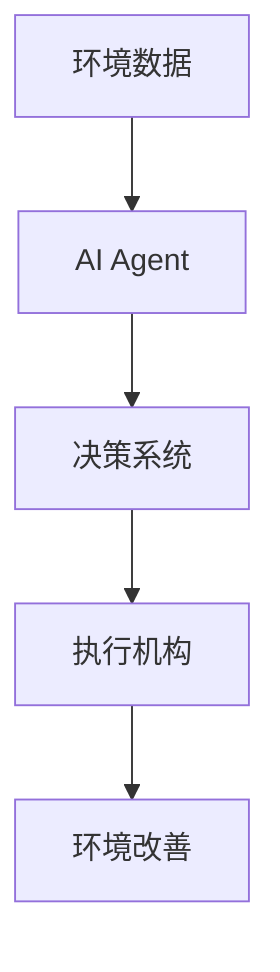
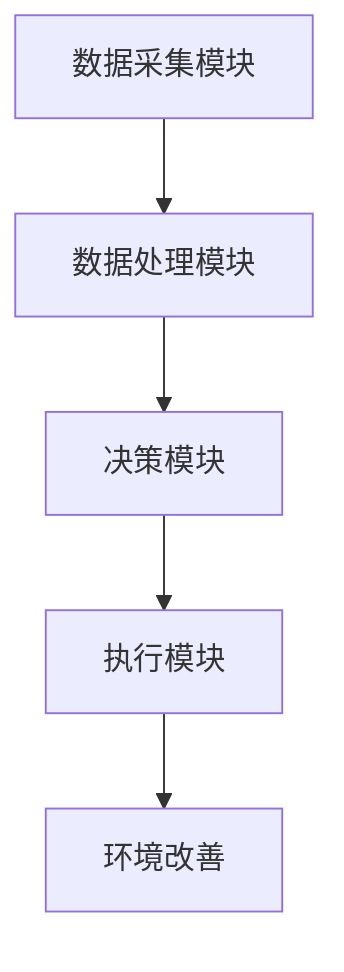

                 


# AI Agent在环境保护中的应用

## 关键词：AI Agent, 环境保护, 人工智能, 智能系统, 环境监测, 污染治理, 资源管理

## 摘要：  
AI Agent（人工智能代理）作为一种智能化的计算机系统，近年来在环境保护领域展现出巨大的潜力。本文将从AI Agent的基本概念入手，分析其在环境保护中的应用场景，探讨其算法原理和系统架构设计。通过实际案例，我们将展示AI Agent在环境监测、污染治理、资源管理等方面的应用，并展望其在未来环境保护中的发展方向。

---

## 第一部分：AI Agent的基本概念与技术基础

### 第1章：AI Agent的定义与技术基础

#### 1.1 AI Agent的基本概念
AI Agent是指一种能够感知环境、自主决策并执行任务的智能实体。它能够通过传感器获取信息，利用内部模型进行推理和规划，最终做出最优决策。与传统AI相比，AI Agent具有更强的自主性和适应性。

- **AI Agent的定义**：AI Agent是一个能够感知环境、自主决策并执行任务的智能实体。
- **AI Agent的核心技术**：
  - 知识表示与推理：通过符号逻辑或概率模型表示知识，并进行推理。
  - 行为规划与决策：基于当前状态和目标，制定行动方案。
  - 人机交互与协作：通过自然语言处理或图形界面与人类进行交互。
- **AI Agent与传统AI的区别**：AI Agent具有更强的自主性和动态适应性，能够实时响应环境变化。

#### 1.2 AI Agent的分类与特点
AI Agent可以根据功能和智能水平分为多种类型：

- **简单反射型AI Agent**：基于预定义规则进行反应，适用于简单任务。
- **基于模型的反应型AI Agent**：利用环境模型进行推理和决策，适用于复杂任务。
- **基于效用的AI Agent**：通过最大化效用函数实现目标，适用于多目标优化场景。
- **学习型AI Agent**：通过机器学习技术不断优化自身模型和策略。

---

### 第2章：AI Agent在环境保护中的背景与问题

#### 2.1 环境保护中的问题背景
环境保护是全球关注的焦点，但传统方法存在以下问题：

- **环境问题的严峻性**：气候变化、水污染、空气污染等问题日益严重。
- **传统方法的局限性**：依赖人工监测和经验判断，效率低且成本高。
- **AI Agent的潜在价值**：通过智能化手段提高环境保护效率和精准度。

#### 2.2 AI Agent在环境保护中的应用场景
AI Agent在环境保护中的应用场景广泛，主要包括：

- **环境监测**：实时监测空气质量、水质、生态多样性等。
- **污染治理**：优化污染处理流程，降低治理成本。
- **资源管理**：智能分配和调度资源，提高利用效率。
- **生态保护**：监测和保护濒危物种及其栖息地。
- **环境教育**：通过人机交互普及环保知识，提高公众参与度。

---

## 第二部分：AI Agent在环境保护中的应用场景

### 第3章：AI Agent的核心概念与联系

#### 3.1 核心概念原理
AI Agent在环境保护中的核心概念包括：

- **知识表示与推理**：通过知识图谱或概率模型表示环境数据，并进行逻辑推理。
- **行为规划与决策**：基于当前环境状态和目标，制定最优行动方案。
- **人机交互与协作**：通过自然语言处理或图形界面与人类交互，协同完成任务。

#### 3.2 核心概念属性特征对比
以下是不同类型AI Agent的属性对比：

| 类型            | 知识表示 | 决策方式 | 适应性 | 交互能力 |
|-----------------|----------|----------|--------|----------|
| 简单反射型      | 基于规则 | 简单反应 | 低     | 无或有限 |
| 基于模型的反应型 | 基于模型 | 动态推理 | 中     | 有限     |
| 基于效用的       | 基于效用 | 多目标优化 | 高     | 强        |
| 学习型          | 基于数据 | 自适应学习 | 高     | 强        |

#### 3.3 ER实体关系图架构
以下是环境保护中的AI Agent实体关系图：



---

## 第三部分：AI Agent在环境保护中的算法原理

### 第4章：环境数据处理算法

#### 4.1 数据采集与预处理
环境数据通常来自多种传感器，包括温度、湿度、空气质量等。预处理步骤包括：

- **数据清洗**：去除噪声和异常值。
- **数据归一化**：将数据标准化，便于模型处理。
- **特征提取**：提取关键特征，如时间序列特征。

#### 4.2 数据建模与分析
常用的建模方法包括：

- **时间序列分析**：使用ARIMA或LSTM模型预测环境变化。
- **分类与回归**：对环境数据进行分类（如污染程度分类）或回归（如预测污染物浓度）。
- **聚类分析**：将相似的环境数据进行分组，发现潜在模式。

#### 4.3 算法实现代码示例
以下是使用Python实现的环境数据分类示例：

```python
import numpy as np
from sklearn.svm import SVC
from sklearn.metrics import accuracy_score

# 数据预处理
X = np.array([[1, 2], [2, 3], [3, 4], [4, 5]])
y = np.array([0, 1, 1, 0])

# 模型训练
model = SVC()
model.fit(X, y)

# 模型预测
new_data = np.array([[2, 3]])
预测结果 = model.predict(new_data)

# 计算准确率
print(accuracy_score([1], 预测结果))
```

---

### 第5章：AI Agent的决策算法

#### 5.1 基于规则的决策算法
基于规则的决策算法适用于简单场景，例如：

```python
if 空气质量指数 > 100:
    发出警报
else:
    不采取行动
```

#### 5.2 基于概率的决策算法
基于概率的决策算法适用于复杂场景，例如：

```python
import numpy as np
from sklearn.naive_bayes import GaussianNB

# 训练数据
X = np.array([[1, 2], [2, 3], [3, 4], [4, 5]])
y = np.array([0, 1, 1, 0])

# 模型训练
model = GaussianNB()
model.fit(X, y)

# 模型预测
new_data = np.array([[3, 4]])
预测结果 = model.predict(new_data)

print(预测结果)
```

---

## 第四部分：AI Agent的系统架构与设计

### 第6章：系统功能设计

#### 6.1 系统功能模块
环境保护中的AI Agent系统通常包括以下模块：

- **数据采集模块**：负责采集环境数据。
- **数据处理模块**：对数据进行清洗和特征提取。
- **决策模块**：基于数据进行推理和决策。
- **执行模块**：根据决策执行具体操作。

#### 6.2 系统架构设计
以下是AI Agent系统的架构图：



---

## 第五部分：项目实战

### 第7章：环境监测与污染治理案例

#### 7.1 项目背景
某城市空气质量监测系统希望通过AI Agent优化污染治理策略。

#### 7.2 系统实现
以下是系统的实现步骤：

1. 数据采集：部署空气质量传感器，采集PM2.5、PM10等数据。
2. 数据处理：清洗数据并提取特征。
3. 模型训练：使用机器学习算法训练空气质量预测模型。
4. 决策与执行：根据预测结果调整污染治理设备。

#### 7.3 代码实现
以下是空气质量预测的代码示例：

```python
import pandas as pd
from sklearn.ensemble import RandomForestRegressor
from sklearn.metrics import mean_squared_error

# 数据加载
data = pd.read_csv('air_quality.csv')

# 特征与目标分离
X = data.drop('PM2.5', axis=1)
y = data['PM2.5']

# 模型训练
model = RandomForestRegressor(n_estimators=100)
model.fit(X, y)

# 预测与评估
预测结果 = model.predict(X)
print(mean_squared_error(y, 预测结果))
```

---

## 第六部分：总结与展望

### 第8章：总结与展望

#### 8.1 核心总结
本文详细介绍了AI Agent在环境保护中的应用，从基本概念到实际案例，全面探讨了其在环境监测、污染治理等领域的潜力。

#### 8.2 未来展望
随着AI技术的不断发展，AI Agent在环境保护中的应用将更加广泛和深入。未来的研究方向包括：

- 更高效的环境数据处理算法。
- 更智能的决策模型。
- 更人性化的交互方式。

---

## 作者：AI天才研究院/AI Genius Institute & 禅与计算机程序设计艺术 /Zen And The Art of Computer Programming

