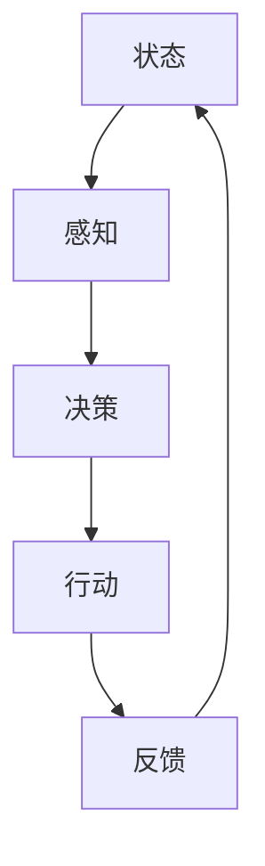
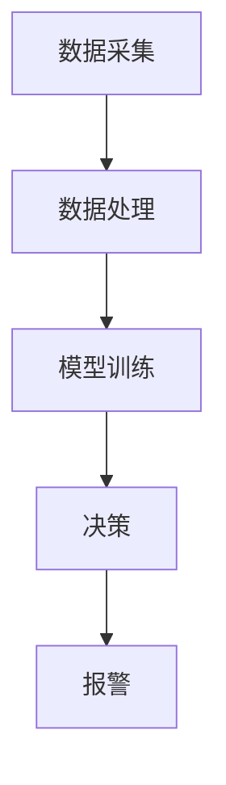
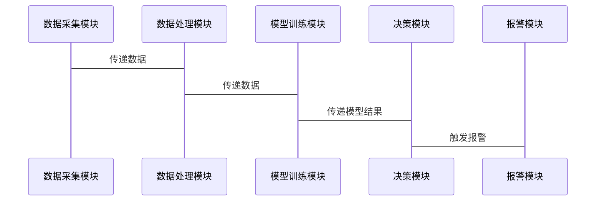

                 


# AI Agent在环境监测与保护中的角色

> 关键词：AI Agent，环境监测，智能决策，强化学习，环境保护，实时监测

> 摘要：AI Agent作为一种智能体，在环境监测与保护领域发挥着越来越重要的作用。本文将从AI Agent的基本概念出发，探讨其在环境监测中的核心角色，分析其算法原理与数学模型，并结合实际案例，详细讲解AI Agent在环境监测系统中的应用与实现。文章内容涵盖AI Agent的核心概念、系统设计、项目实战等多个方面，旨在为读者提供全面而深入的技术解读。

---

# 第一部分: AI Agent 的基础与环境监测背景

## 第1章: AI Agent 的基本概念与环境监测背景

### 1.1 AI Agent 的定义与核心概念

#### 1.1.1 AI Agent 的定义
AI Agent（人工智能代理）是一种能够感知环境、做出决策并执行动作的智能体。它通过与环境的交互，实现特定目标，例如数据采集、状态评估或问题解决。

#### 1.1.2 AI Agent 的核心特征
- **自主性**：能够在没有外部干预的情况下独立运行。
- **反应性**：能够实时感知环境变化并做出响应。
- **学习能力**：通过数据和反馈不断优化自身行为。
- **协作性**：能够与其他AI Agent或系统协同工作。

#### 1.1.3 环境监测与保护的背景与需求
环境监测是指通过技术手段对环境质量进行长期、连续的观测和分析。随着工业化和城市化的快速发展，环境问题日益严重，传统的环境监测方法效率低、成本高，难以满足实时性和精准性的要求。AI Agent的引入为环境监测提供了新的解决方案。

### 1.2 环境监测与保护的现状与挑战

#### 1.2.1 环境监测的主要领域
- **空气监测**：监测PM2.5、CO、NO2等污染物浓度。
- **水质监测**：监测pH值、溶解氧、重金属等指标。
- **土壤监测**：监测土壤中的污染物含量。
- **生态系统监测**：监测生物多样性、生态平衡等。

#### 1.2.2 传统环境监测方法的局限性
- 数据采集效率低，成本高。
- 数据分析依赖人工，耗时且易出错。
- 实时性差，难以快速响应环境变化。

#### 1.2.3 AI Agent 在环境监测中的潜在价值
- 提高数据采集和分析的效率。
- 实现环境监测的实时性和智能化。
- 通过数据驱动的决策优化环境保护措施。

### 1.3 AI Agent 在环境监测中的角色定位

#### 1.3.1 AI Agent 的功能与任务
- 数据采集与处理。
- 环境状态评估与预测。
- 异常事件的实时报警与响应。

#### 1.3.2 AI Agent 在环境监测中的优势
- 高效性：能够快速处理大量数据。
- 精准性：通过机器学习模型提高监测结果的准确性。
- 自适应性：能够根据环境变化动态调整监测策略。

#### 1.3.3 AI Agent 的应用边界与外延
- **应用边界**：专注于环境监测与保护的核心任务，不涉及外部决策。
- **外延**：可以与其他系统协同工作，例如与智慧城市系统集成。

---

## 第2章: AI Agent 的核心概念与环境监测的联系

### 2.1 AI Agent 的核心概念原理

#### 2.1.1 感知模块的原理
AI Agent通过传感器或其他数据源感知环境状态，例如空气质量传感器、水质传感器等。

#### 2.1.2 决策模块的原理
AI Agent基于感知到的数据，利用机器学习模型做出决策，例如判断是否需要发出警报。

#### 2.1.3 执行模块的原理
AI Agent根据决策结果执行动作，例如启动净化设备或向相关部门发送警报信息。

### 2.2 环境监测与保护中的关键要素

#### 2.2.1 数据采集与处理
- 数据采集：通过传感器获取环境数据。
- 数据清洗：去除噪声，确保数据准确性。
- 数据存储：将数据存储在数据库中，便于后续分析。

#### 2.2.2 环境模型构建
- 构建环境模型，模拟环境变化趋势。
- 使用机器学习算法训练模型，提高预测精度。

#### 2.2.3 监测结果的分析与反馈
- 分析环境数据，识别异常情况。
- 根据分析结果优化监测策略。

### 2.3 AI Agent 与环境监测的核心联系

#### 2.3.1 数据驱动的决策机制
AI Agent通过实时数据驱动决策，实现快速响应。

#### 2.3.2 自适应学习能力
AI Agent能够根据环境数据动态调整监测策略，提高监测效率。

#### 2.3.3 实时监测与快速响应
AI Agent能够实时监测环境变化，并在异常情况下快速响应。

---

## 第3章: AI Agent 的算法原理与数学模型

### 3.1 AI Agent 的核心算法

#### 3.1.1 强化学习算法
强化学习是一种通过试错学习的算法，AI Agent通过与环境的交互获得奖励或惩罚，从而优化决策策略。

#### 3.1.2 监督学习算法
监督学习是一种基于有标签数据的训练方法，AI Agent通过学习带标签的数据，预测环境状态。

#### 3.1.3 无监督学习算法
无监督学习是一种基于无标签数据的训练方法，AI Agent通过聚类分析等技术，发现环境数据中的隐含模式。

### 3.2 AI Agent 的数学模型

#### 3.2.1 状态空间模型
状态空间模型描述了环境的所有可能状态，通常用数学公式表示为：

$$ S = \{ s_1, s_2, \ldots, s_n \} $$

其中，$s_i$ 表示环境的一个状态。

#### 3.2.2 行动空间模型
行动空间模型描述了AI Agent可以执行的所有动作，通常用数学公式表示为：

$$ A = \{ a_1, a_2, \ldots, a_m \} $$

其中，$a_j$ 表示AI Agent的一个动作。

#### 3.2.3 奖励函数模型
奖励函数模型定义了AI Agent在特定状态下执行特定动作所获得的奖励，通常用数学公式表示为：

$$ R(s, a) = r $$

其中，$s$ 表示当前状态，$a$ 表示当前动作，$r$ 表示奖励值。

### 3.3 算法流程图



---

## 第4章: 系统分析与架构设计

### 4.1 问题场景介绍

#### 4.1.1 项目背景
本项目旨在设计一个基于AI Agent的环境监测系统，实现对空气质量的实时监测与预警。

#### 4.1.2 项目目标
- 实现实时空气质量监测。
- 提供异常情况的报警功能。
- 优化监测策略，提高监测效率。

### 4.2 系统功能设计

#### 4.2.1 系统功能模块
- 数据采集模块：负责采集空气质量数据。
- 数据处理模块：负责清洗和存储数据。
- 模型训练模块：负责训练机器学习模型。
- 决策模块：负责根据模型预测结果做出决策。
- 报警模块：负责在异常情况下发出警报。

#### 4.2.2 系统功能流程图


### 4.3 系统架构设计

#### 4.3.1 系统架构图


#### 4.3.2 系统接口设计
- 数据采集模块与数据处理模块之间的接口：数据传递接口。
- 数据处理模块与模型训练模块之间的接口：数据输入接口。
- 模型训练模块与决策模块之间的接口：模型输出接口。
- 决策模块与报警模块之间的接口：报警触发接口。

#### 4.3.3 系统交互流程图


---

## 第5章: 项目实战

### 5.1 环境安装与配置

#### 5.1.1 环境要求
- 操作系统：Linux或Windows。
- Python版本：3.6以上。
- 依赖库：numpy、pandas、scikit-learn、tensorflow。

#### 5.1.2 安装步骤
```bash
pip install numpy pandas scikit-learn tensorflow
```

### 5.2 系统核心实现源代码

#### 5.2.1 数据采集模块
```python
import numpy as np
import pandas as pd

def collect_data():
    # 模拟数据采集
    data = np.random.rand(100, 5)
    df = pd.DataFrame(data, columns=['PM2.5', 'CO', 'NO2', 'SO2', 'O3'])
    return df
```

#### 5.2.2 数据处理模块
```python
def preprocess_data(df):
    # 数据清洗
    df.dropna(inplace=True)
    return df
```

#### 5.2.3 模型训练模块
```python
from sklearn.model

