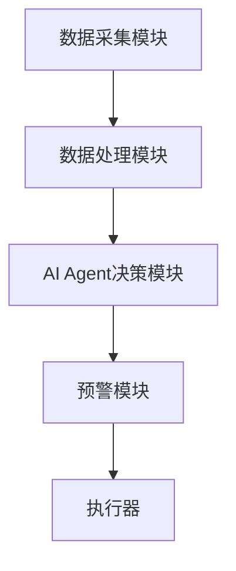

                 

# AI Agent在环境监测与预警中的实践

> **关键词**：AI Agent、环境监测、强化学习、系统架构、实时预警

> **摘要**：本文探讨了AI Agent在环境监测与预警中的实践应用。从AI Agent的基本概念出发，分析其在环境监测中的优势，详细讲解相关算法原理，设计系统架构，并通过实际案例展示AI Agent在环境监测中的应用效果。最后，总结了AI Agent在环境监测中的优势与未来发展方向。

---

## 第一部分：AI Agent与环境监测概述

### 第1章：AI Agent与环境监测的背景与概念

#### 1.1 AI Agent的基本概念
- **AI Agent的定义**：AI Agent（人工智能代理）是指能够感知环境并采取行动以实现目标的智能体。它通过传感器获取信息，利用算法做出决策，并通过执行器与环境交互。
- **环境监测与预警的定义**：环境监测是指对环境数据的采集、分析和评估，以预测和预警潜在的环境问题。AI Agent通过实时数据处理和分析，能够快速识别环境异常并发出预警信号。
- **AI Agent在环境监测中的作用**：AI Agent能够实时处理大量环境数据，快速识别潜在风险，并采取相应措施，从而提高环境监测的效率和准确性。

#### 1.2 环境监测与预警的背景与挑战
- **环境问题的现状与挑战**：随着工业化和城市化的快速发展，环境问题日益严重，如空气污染、水污染、气候变化等。传统的环境监测方法依赖于人工操作，效率低且容易出错。
- **传统环境监测方法的局限性**：传统方法通常依赖定点监测设备，数据采集和分析速度较慢，难以应对突发环境事件。此外，数据量大、类型多样，人工分析难以满足实时性要求。
- **AI Agent在环境监测中的优势**：AI Agent能够实时处理海量环境数据，利用机器学习算法快速识别异常情况，提高环境监测的实时性和准确性。此外，AI Agent还能够自主学习和优化，适应不同环境条件的变化。

#### 1.3 AI Agent在环境监测中的应用场景
- **空气质量监测**：AI Agent可以通过分析气象数据、污染物排放数据等，预测空气质量变化，提前发出预警信号。
- **水质监测**：AI Agent可以实时监测水体的温度、pH值、溶解氧等参数，识别水质异常情况，预防水污染事件。
- **地震预警与地质灾害监测**：AI Agent可以通过分析地震前兆数据，如地壳活动、地下水位变化等，提前发出地震预警信号。

---

## 第二部分：AI Agent的核心概念与原理

### 第2章：AI Agent的核心概念与环境监测的关系

#### 2.1 AI Agent的核心概念
- **状态空间与动作空间**：AI Agent通过感知环境状态，决定采取的动作。状态空间是指所有可能的状态集合，动作空间是指所有可能的动作集合。
- **环境模型与奖励机制**：环境模型是AI Agent对环境的描述，奖励机制是衡量AI Agent行为好坏的标准。
- **AI Agent的决策过程**：AI Agent通过感知环境状态，选择最优动作以实现目标。

#### 2.2 环境监测系统的核心要素
- **数据采集与处理**：环境监测系统需要采集多种环境数据，如空气质量传感器、水质传感器等，并进行预处理和特征提取。
- **数据存储与管理**：环境数据通常存储在数据库中，便于后续分析和查询。
- **数据可视化与分析**：通过数据可视化工具，环境监测人员可以直观了解环境状况，识别潜在问题。

---

## 第三部分：AI Agent的算法原理与实现

### 第3章：AI Agent的算法原理

#### 3.1 强化学习算法
- **强化学习的基本概念**：强化学习是一种机器学习方法，通过智能体与环境交互，学习最优策略以最大化累积奖励。
- **Q-learning算法**：Q-learning是一种经典的强化学习算法，通过更新Q值表，学习状态-动作价值函数。
- **DQN算法**：深度Q网络（DQN）通过深度神经网络近似Q值函数，适用于复杂环境下的决策问题。

#### 3.2 环境监测中的强化学习应用
- **状态表示**：环境监测中的状态可以表示为环境数据的特征向量，如空气质量指数、温度、湿度等。
- **动作空间**：AI Agent可以采取的动作包括触发预警信号、调整监测设备参数等。
- **奖励机制**：奖励机制需要根据环境监测目标设计，如准确预测环境变化可以获得正奖励，预测错误则获得负奖励。

#### 3.3 实验与结果分析
- **实验设计**：设计实验对比传统方法和AI Agent方法在环境监测中的表现。
- **结果分析**：通过实验结果验证AI Agent在环境监测中的优势，如提高预测准确率、减少误报漏报等。

---

## 第四部分：系统架构与设计

### 第4章：环境监测与预警系统的架构设计

#### 4.1 系统功能设计
- **数据采集模块**：负责采集环境数据，如空气质量传感器、水质传感器等。
- **数据处理模块**：对采集的数据进行预处理、特征提取和数据融合。
- **AI Agent决策模块**：基于强化学习算法，实时分析环境数据，做出决策。
- **预警模块**：根据AI Agent的决策，发出预警信号，并触发相应的应对措施。

#### 4.2 系统架构图

#### 4.3 接口设计与交互
- **数据接口**：系统需要与传感器、数据库等外部系统进行数据交互。
- **用户接口**：提供友好的用户界面，方便环境监测人员查看实时数据和预警信息。

---

## 第五部分：项目实战与案例分析

### 第5章：空气质量监测预警系统实战

#### 5.1 项目背景
- **项目目标**：实时监测空气质量，预测未来空气质量变化，发出预警信号。
- **数据来源**：空气质量传感器、气象数据、污染物排放数据等。

#### 5.2 系统实现
- **环境搭建**：安装必要的软件和硬件设备，如Python、TensorFlow、传感器等。
- **核心代码实现**：基于强化学习算法实现AI Agent决策模块。
- **功能实现**：实时采集空气质量数据，分析数据，预测未来空气质量，并发出预警信号。

#### 5.3 案例分析
- **实验结果**：通过实验验证AI Agent在空气质量预测中的准确性和实时性。
- **案例总结**：总结AI Agent在空气质量监测中的优势，如提高预测准确率、减少误报漏报等。

---

## 第六部分：总结与展望

### 第6章：总结与未来发展方向

#### 6.1 总结
- **AI Agent的优势**：AI Agent能够实时处理环境数据，快速识别潜在风险，提高环境监测的效率和准确性。
- **实际应用中的注意事项**：AI Agent的性能依赖于环境数据的质量和模型的训练效果，需要不断优化模型和算法。

#### 6.2 未来发展方向
- **模型优化**：进一步优化强化学习算法，提高AI Agent的决策能力。
- **多模态数据融合**：结合多种环境数据，如图像、文本、数值数据等，提高环境监测的准确性。
- **边缘计算与实时性优化**：通过边缘计算技术，提高AI Agent的实时性和响应速度。

---

## 作者：AI天才研究院/AI Genius Institute & 禅与计算机程序设计艺术 /Zen And The Art of Computer Programming

