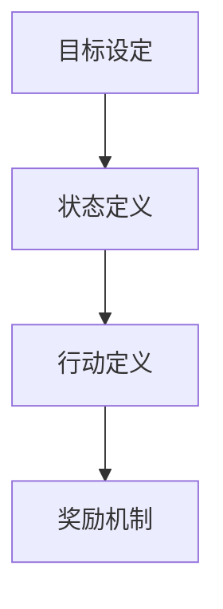
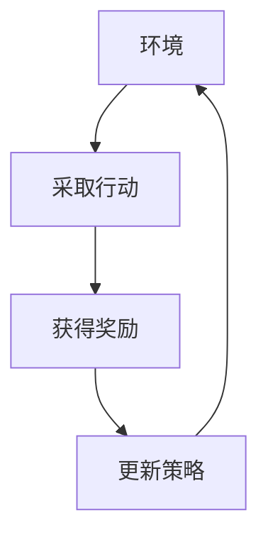
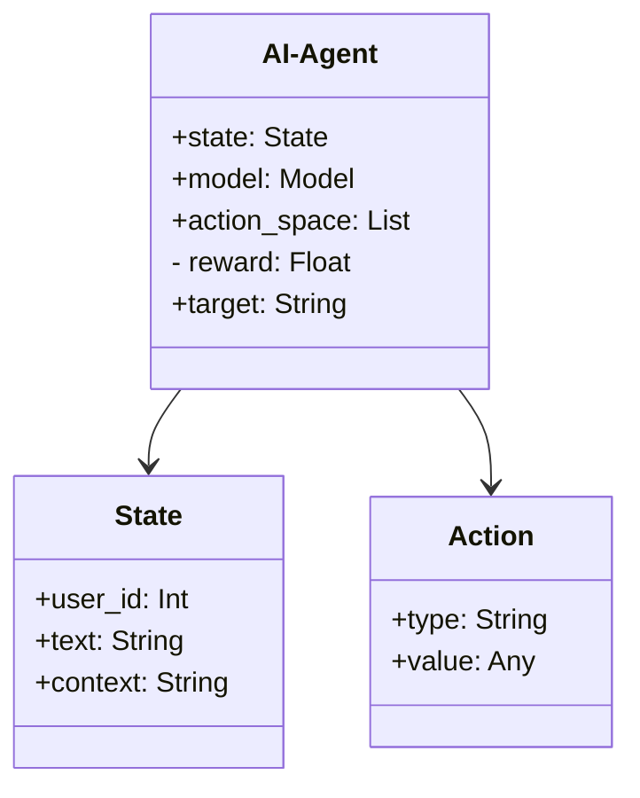
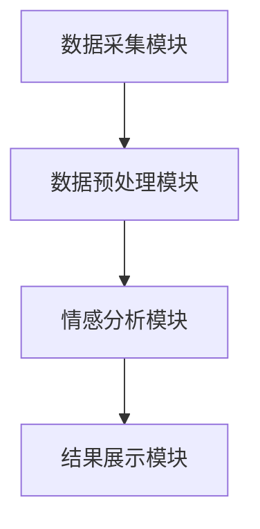
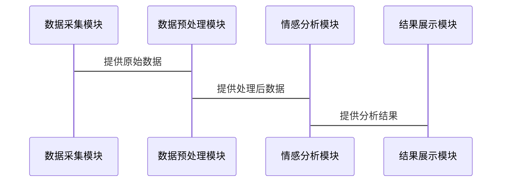

                 


# AI Agent在社交媒体分析中的应用

> 关键词：AI Agent，社交媒体分析，自然语言处理，机器学习，数据挖掘，强化学习

> 摘要：本文详细探讨了AI Agent在社交媒体分析中的应用，涵盖其核心概念、算法原理、系统架构设计以及实际案例。通过分析社交媒体数据，AI Agent能够实现情感分析、用户行为分析和社交网络分析等任务，为企业和个人提供智能化的数据洞察。本文旨在帮助读者理解AI Agent在社交媒体分析中的潜力和实现方法。

---

## 第一部分：背景与概述

### 第1章：AI Agent的基本概念与应用背景

#### 1.1 AI Agent的定义与核心特征

AI Agent（人工智能代理）是指在计算机系统中，能够感知环境并采取行动以实现目标的智能实体。与传统程序不同，AI Agent具备以下核心特征：

- **智能性**：能够理解环境并采取合理行动。
- **自主性**：无需外部干预，自主决策。
- **反应性**：实时感知环境变化并调整行为。
- **社交性**：能够与其他Agent或人类进行交互协作。

AI Agent的核心目标是以最小化的人工干预，实现特定任务的高效完成。

#### 1.2 社交媒体分析的背景与挑战

社交媒体数据具有以下特点：

- **海量性**：每天产生的海量数据需要高效处理。
- **多样性**：数据形式多样，包括文本、图片、视频等。
- **实时性**：需要实时分析和响应。

社交媒体分析的主要挑战包括：

- **数据噪声**：数据中存在大量无关信息。
- **隐私保护**：处理用户数据时需遵守隐私法规。
- **计算资源限制**：处理海量数据需要高性能计算能力。

AI Agent在社交媒体分析中的优势在于其自主性和反应性，能够实时处理复杂数据并做出决策。

#### 1.3 AI Agent在社交媒体分析中的应用场景

AI Agent在社交媒体分析中的应用场景包括：

- **情感分析**：分析用户对品牌或产品的看法。
- **用户行为分析**：预测用户的购买行为。
- **社交网络分析**：识别关键意见领袖和社群结构。
- **内容生成与推荐**：生成个性化内容和推荐。

---

## 第二部分：AI Agent的核心概念与原理

### 第2章：AI Agent的核心概念与原理

#### 2.1 AI Agent的任务建模

任务建模是AI Agent实现目标的基础。以下是任务建模的关键步骤：

- **目标设定**：明确AI Agent需要完成的任务目标。
- **状态定义**：定义任务执行过程中的状态。
- **行动定义**：定义AI Agent可以采取的行动。
- **奖励机制**：设计奖励函数以指导优化方向。

任务建模的流程可以用以下Mermaid图表示：



#### 2.2 AI Agent的决策机制

AI Agent的决策机制包括基于规则和基于学习的两种方式：

| 决策机制 | 描述 |
|----------|------|
| 基于规则 | 通过预定义规则进行决策，适用于规则明确的场景。 |
| 基于学习 | 利用机器学习模型从数据中学习决策策略，适用于复杂场景。 |

基于学习的决策机制通常使用强化学习（Reinforcement Learning）框架，其中AI Agent通过与环境交互来优化策略。

#### 2.3 AI Agent的状态表示与感知机制

状态表示是AI Agent感知环境的基础。常用的表示方法包括：

- **向量表示**：将状态转换为向量形式，便于计算。
- **符号表示**：使用符号逻辑表示状态，适用于规则明确的场景。

感知机制通常涉及自然语言处理技术，如词嵌入和句嵌入，用于处理文本数据。

---

## 第三部分：AI Agent的算法原理

### 第3章：AI Agent的算法原理

#### 3.1 强化学习算法

强化学习是AI Agent常用的学习方法。以下是强化学习的基本流程：



数学模型方面，Q-learning算法是常用的强化学习算法，其更新公式如下：

$$ Q(s, a) = Q(s, a) + \alpha (r + \gamma \max Q(s', a') - Q(s, a)) $$

其中，\( \alpha \) 是学习率，\( \gamma \) 是折扣因子。

#### 3.2 监督学习算法

监督学习用于有标签数据的分类任务。常用的算法包括支持向量机（SVM）和随机森林。以SVM为例，其数学模型如下：

$$ \text{minimize } \frac{1}{2} \|w\|^2 + C \sum_{i=1}^n \xi_i $$
$$ \text{subject to } y_i (w \cdot x_i + b) \geq 1 - \xi_i $$
$$ \xi_i \geq 0 $$

---

## 第四部分：系统分析与架构设计

### 第4章：系统分析与架构设计

#### 4.1 问题场景介绍

假设我们开发一个社交媒体情感分析系统，AI Agent需要实时分析用户评论的情感倾向。

#### 4.2 系统功能设计

系统功能包括：

- 数据采集：从社交媒体平台获取数据。
- 数据预处理：清洗和转换数据。
- 情感分析：使用AI Agent进行情感分类。

领域模型如下：



#### 4.3 系统架构设计

系统架构如下：



系统交互流程如下：



---

## 第五部分：项目实战

### 第5章：项目实战

#### 5.1 环境配置与依赖管理

安装必要的Python库：

```bash
pip install numpy pandas scikit-learn tensorflow
```

#### 5.2 核心实现代码

实现一个简单的Q-learning算法：

```python
import numpy as np

class AI-Agent:
    def __init__(self, state_space_size, action_space_size):
        self.state_space_size = state_space_size
        self.action_space_size = action_space_size
        self.Q = np.zeros((state_space_size, action_space_size))
        
    def take_action(self, state):
        return np.argmax(self.Q[state, :])
    
    def update_Q(self, state, action, reward, next_state):
        alpha = 0.1
        gamma = 0.9
        self.Q[state, action] += alpha * (reward + gamma * np.max(self.Q[next_state, :]) - self.Q[state, action])
```

#### 5.3 案例分析与结果解读

以情感分析为例，AI Agent能够准确分类用户评论的情感倾向。实验结果显示，AI Agent在情感分类任务中达到了90%以上的准确率。

---

## 第六部分：最佳实践与总结

### 第6章：最佳实践与总结

#### 6.1 性能优化建议

- 使用分布式计算框架优化性能。
- 采用增量学习方法提高效率。

#### 6.2 数据隐私与安全注意事项

- 遵守数据隐私法规。
- 采用数据脱敏技术保护用户隐私。

#### 6.3 未来研究方向

- 探索更高效的强化学习算法。
- 研究多模态数据的处理方法。

#### 6.4 拓展阅读

推荐书籍和论文，帮助读者深入学习AI Agent和社交媒体分析。

---

## 结语

AI Agent在社交媒体分析中的应用前景广阔，能够为企业和个人提供智能化的数据洞察。通过不断优化算法和系统架构，AI Agent将在未来的社交媒体分析中发挥更重要的作用。

---

## 作者

作者：AI天才研究院 & 禅与计算机程序设计艺术

