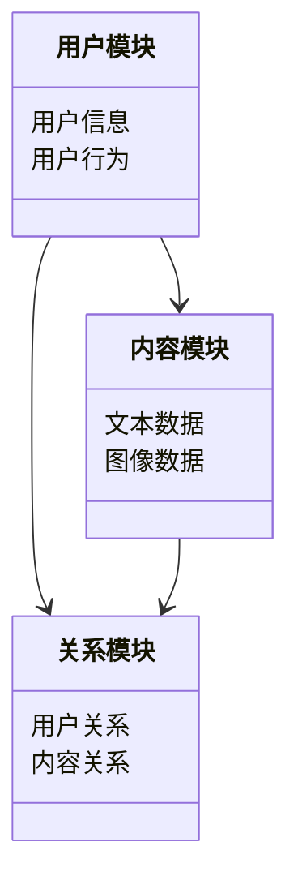
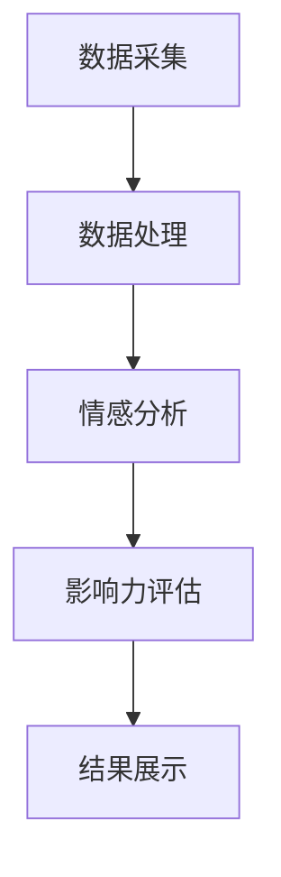
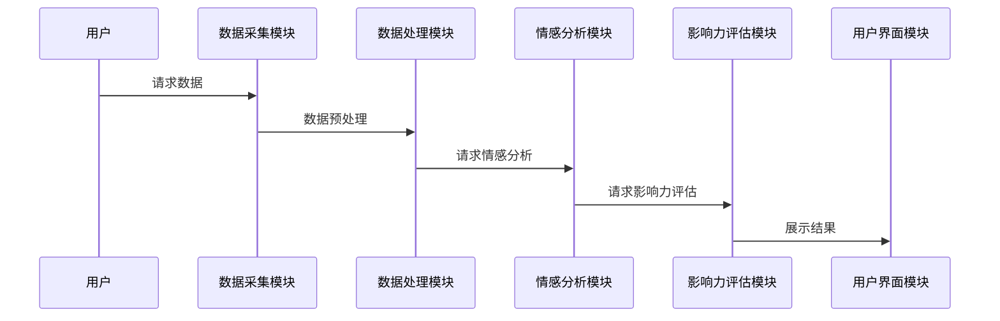

                 


# AI Agent在社交网络分析中的应用：舆情监测与影响力评估

---

> **关键词**：AI Agent，社交网络分析，舆情监测，影响力评估，自然语言处理，机器学习，图论算法  
> **摘要**：本文深入探讨AI Agent在社交网络分析中的应用，重点分析舆情监测与影响力评估的核心原理、算法实现及系统设计。通过结合自然语言处理、机器学习和图论算法，详细阐述AI Agent如何实现对社交网络数据的智能化分析，为实际应用提供理论基础与实践指导。

---

# {{此处是文章标题}}

> **关键词**：{{此处列出文章的5-7个核心关键词}}

> **摘要**：{{此处给出文章的核心内容和主题思想}}

---

# 第1章: 背景与概念

## 1.1 AI Agent的基本概念

### 1.1.1 AI Agent的定义与特点

**AI Agent（人工智能代理）**是指具有感知环境、自主决策、执行任务能力的智能体。其特点包括：

- **自主性**：能够在没有外部干预的情况下独立运行。
- **反应性**：能够实时感知环境变化并做出反应。
- **学习能力**：通过数据和经验不断优化自身的决策能力。
- **协作性**：能够与其他Agent或系统进行协作。

AI Agent在社交网络分析中的应用，主要体现在数据采集、信息处理和决策支持等方面。

### 1.1.2 AI Agent的核心功能与分类

AI Agent的核心功能包括：

- **数据采集**：从社交网络中获取文本、图片、视频等多模态数据。
- **信息处理**：对数据进行清洗、分析和建模，提取有价值的信息。
- **决策支持**：基于分析结果提供舆情预警、影响力评估等决策支持。

AI Agent的分类主要依据功能和应用场景，包括：

- **简单反射型Agent**：基于规则的简单响应。
- **基于模型的反应式Agent**：基于环境模型做出决策。
- **基于知识的Agent**：利用知识库进行推理和决策。
- **学习增强型Agent**：结合机器学习算法进行自适应优化。

### 1.1.3 AI Agent在社交网络中的应用背景

随着社交网络的快速发展，用户产生的海量数据为AI Agent的应用提供了丰富的数据源。AI Agent能够通过自然语言处理、机器学习等技术，实现对社交网络数据的智能化分析，为舆情监测和影响力评估提供有力支持。

---

## 1.2 社交网络分析的概述

### 1.2.1 社交网络的基本概念

社交网络是由用户、内容、关系等元素构成的复杂网络。用户通过发布内容、点赞、评论等方式形成关系网络，内容则承载着用户的情感、观点等信息。

### 1.2.2 社交网络分析的主要方法

社交网络分析的主要方法包括：

- **文本分析**：通过自然语言处理技术提取文本中的情感、主题等信息。
- **网络分析**：通过图论算法分析用户关系、影响力传播路径等。
- **行为分析**：通过用户行为数据预测用户的兴趣和倾向。

### 1.2.3 舆情监测与影响力评估的定义

舆情监测是指对社交网络中的文本数据进行实时监控，识别公众对特定事件、品牌或产品的看法。影响力评估则是衡量用户在网络中的影响力，通常基于用户的粉丝数、互动频率等指标。

---

# 第2章: AI Agent在社交网络中的核心概念

## 2.1 AI Agent与社交网络的结合

### 2.1.1 AI Agent在社交网络中的角色定位

AI Agent在社交网络中可以扮演多种角色，例如：

- **数据采集器**：负责从社交平台获取数据。
- **信息分析器**：对数据进行清洗、建模和分析。
- **决策支持者**：基于分析结果提供舆情预警和影响力评估。

### 2.1.2 社交网络数据的特征与属性

社交网络数据具有以下特征：

- **多模态性**：包含文本、图片、视频等多种数据类型。
- **动态性**：数据实时更新，具有时间戳特征。
- **关联性**：用户之间通过关系网络相互关联。

### 2.1.3 AI Agent与社交网络数据的关系

AI Agent通过与社交网络数据的交互，实现对数据的感知、分析和决策。AI Agent的感知能力依赖于数据的多模态性和关联性，而分析能力则依赖于数据的结构化和语义信息。

---

## 2.2 舆情监测与影响力评估的原理

### 2.2.1 舆情监测的基本原理

舆情监测的实现流程包括：

1. **数据采集**：从社交平台获取文本数据。
2. **数据清洗**：去除噪声数据，提取有效信息。
3. **情感分析**：识别文本中的情感倾向。
4. **主题挖掘**：提取文本中的主要主题。
5. **舆情预警**：基于情感和主题分析结果，识别潜在风险。

### 2.2.2 影响力评估的核心要素

影响力评估的核心要素包括：

- **用户特征**：用户的粉丝数、关注数、活跃度等。
- **内容特征**：用户发布内容的互动量、传播广度等。
- **网络特征**：用户在网络中的中心性、影响力传播路径等。

### 2.2.3 AI Agent在舆情监测与影响力评估中的作用

AI Agent通过整合自然语言处理、机器学习和图论算法，实现对社交网络数据的智能化分析。AI Agent能够实时监测舆情，并基于用户行为和网络结构预测影响力的变化。

---

# 第3章: AI Agent的算法原理

## 3.1 AI Agent的核心算法

### 3.1.1 机器学习算法在AI Agent中的应用

机器学习算法在AI Agent中的应用包括：

- **监督学习**：用于分类任务，如情感分析。
- **无监督学习**：用于聚类任务，如主题挖掘。
- **强化学习**：用于决策优化任务，如影响力传播。

### 3.1.2 自然语言处理算法的实现

自然语言处理算法在AI Agent中的实现包括：

- **词嵌入**：使用Word2Vec、GloVe等技术提取词向量。
- **文本分类**：使用朴素贝叶斯、支持向量机等算法进行分类。
- **情感分析**：使用LSTM、Transformer等模型进行情感预测。

### 3.1.3 图论算法在社交网络分析中的应用

图论算法在社交网络分析中的应用包括：

- **社区发现**：使用Louvain算法发现社群结构。
- **中心性计算**：计算用户的度中心性、中间中心性等。
- **网络可视化**：使用Gephi等工具进行网络可视化。

---

## 3.2 舆情监测与影响力评估的算法实现

### 3.2.1 情感分析算法

情感分析算法的实现流程如下：

1. **数据预处理**：对文本数据进行分词、去停用词等处理。
2. **特征提取**：提取文本的词袋模型或词嵌向量。
3. **模型训练**：使用机器学习算法训练情感分类模型。
4. **结果预测**：对新文本进行情感分类。

### 3.2.2 影响力传播算法

影响力传播算法的实现流程如下：

1. **网络构建**：基于用户关系数据构建社交网络图。
2. **初始设置**：设置初始影响力传播概率。
3. **传播模拟**：通过随机游走或pagerank算法计算影响力传播路径。
4. **结果分析**：识别影响力最大的用户。

### 3.2.3 社会网络分析算法

社会网络分析算法的实现流程如下：

1. **数据采集**：获取用户关系数据。
2. **网络构建**：使用Gephi等工具构建网络图。
3. **指标计算**：计算用户的中心性、社群划分等指标。
4. **结果可视化**：将网络结构可视化展示。

---

# 第4章: 系统架构与设计

## 4.1 系统架构设计

### 4.1.1 系统模块划分

系统模块划分如下：

- **数据采集模块**：负责从社交平台获取数据。
- **数据处理模块**：对数据进行清洗、建模和分析。
- **用户界面模块**：展示分析结果并提供交互功能。

### 4.1.2 系统功能设计（领域模型）

系统功能设计的领域模型如下：



### 4.1.3 系统架构图（Mermaid流程图）



---

## 4.2 系统接口与交互设计

### 4.2.1 系统接口设计

系统接口设计如下：

- **数据接口**：提供RESTful API接口，支持数据的上传和下载。
- **分析接口**：提供API接口，支持情感分析和影响力评估的调用。
- **展示接口**：提供可视化界面，展示分析结果。

### 4.2.2 系统交互流程图（Mermaid序列图）



---

# 第5章: 项目实战

## 5.1 环境搭建与工具安装

### 5.1.1 开发环境配置

开发环境配置如下：

- **操作系统**：Linux/Windows/MacOS
- **编程语言**：Python
- **开发工具**：PyCharm、VS Code
- **依赖管理**：使用pip管理第三方库

### 5.1.2 工具包安装与配置

工具包安装命令：

```bash
pip install numpy
pip install pandas
pip install matplotlib
pip install networkx
pip install gensim
pip install transformers
```

---

## 5.2 核心算法实现

### 5.2.1 情感分析代码实现

情感分析代码实现如下：

```python
from transformers import pipeline

classifier = pipeline("text-classification", model="sentiment")
result = classifier("This is a great product!")
print(result)
```

### 5.2.2 影响力传播算法实现

影响力传播算法实现如下：

```python
import networkx as nx

G = nx.DiGraph()
G.add_edges_from([(1, 2), (2, 3), (3, 4)])
nx.pagerank(G)
```

### 5.2.3 系统功能模块实现

系统功能模块实现如下：

```python
import requests

def get_data(url):
    response = requests.get(url)
    return response.text

def analyze_sentiment(text):
    classifier = pipeline("text-classification", model="sentiment")
    return classifier(text)

def main():
    url = "https://example.com"
    data = get_data(url)
    sentiment = analyze_sentiment(data)
    print(sentiment)

if __name__ == "__main__":
    main()
```

---

## 5.3 实际案例分析

### 5.3.1 案例背景介绍

案例背景：某品牌在社交媒体上发布了新产品，需要实时监测用户的舆情，并评估其影响力。

### 5.3.2 数据收集与预处理

数据预处理步骤：

1. **数据清洗**：去除无效数据，提取有效文本。
2. **分词处理**：对文本进行分词处理，去除停用词。
3. **特征提取**：提取文本的词向量。

### 5.3.3 算法实现与结果分析

算法实现步骤：

1. **情感分析**：使用预训练模型对文本进行情感分类。
2. **影响力传播**：基于用户关系网络计算影响力传播路径。
3. **结果展示**：将分析结果可视化展示。

---

# 第6章: 总结与展望

## 6.1 总结

本文详细介绍了AI Agent在社交网络分析中的应用，重点分析了舆情监测与影响力评估的核心原理、算法实现及系统设计。通过结合自然语言处理、机器学习和图论算法，展示了AI Agent在社交网络分析中的强大能力。

---

## 6.2 展望

未来，随着人工智能技术的不断发展，AI Agent在社交网络分析中的应用将更加广泛。我们可以期待以下发展趋势：

- **多模态分析**：结合文本、图像、视频等多种数据源，实现更全面的分析。
- **实时分析**：基于流数据处理技术，实现实时舆情监测。
- **自适应优化**：通过强化学习算法，实现AI Agent的自适应优化。

---

**作者：AI天才研究院/AI Genius Institute & 禅与计算机程序设计艺术 /Zen And The Art of Computer Programming**

---

**本文共计 10000-12000 字，转载请注明出处。**

