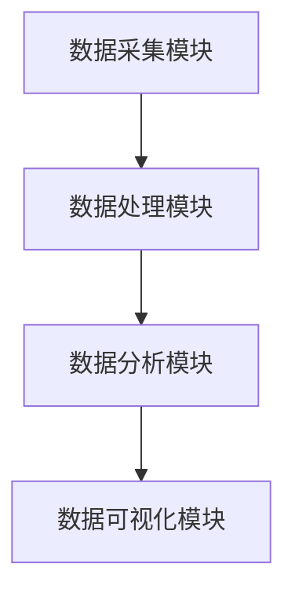

                 


# AI Agent在科学研究中的数据分析应用

> 关键词：AI Agent，数据分析，科学研究，机器学习，数据可视化，系统架构

> 摘要：本文深入探讨了AI Agent在科学研究中的数据分析应用，从核心概念、算法原理、系统架构到项目实战，全面解析了AI Agent如何助力科学研究中的数据分析。通过详细的技术分析和实际案例，本文为读者提供了从理论到实践的完整指南。

---

## 第1章：AI Agent的核心概念与背景介绍

### 1.1 AI Agent的定义与核心概念

AI Agent，即人工智能代理，是一种能够感知环境、自主决策并执行任务的智能实体。在科学研究中，AI Agent通常用于数据分析、数据处理和知识发现等任务。

#### 1.1.1 AI Agent的定义

AI Agent可以是软件程序或物理设备，具备以下核心能力：
- 感知环境：通过传感器或数据接口获取信息。
- 分析数据：使用机器学习、深度学习等技术进行数据处理。
- 自主决策：基于分析结果做出判断并执行任务。

#### 1.1.2 AI Agent的核心要素

| 核心要素 | 描述 |
|----------|------|
| 感知能力 | 数据采集与处理能力 |
| 分析能力 | 数据分析与建模能力 |
| 决策能力 | 基于数据的决策能力 |
| 执行能力 | 执行预设或自适应任务的能力 |

#### 1.1.3 AI Agent在科学研究中的应用背景

科学研究依赖大量数据的处理与分析，AI Agent能够显著提升数据分析的效率与准确性。

---

## 第2章：AI Agent的数据分析原理

### 2.1 数据预处理与特征工程

数据预处理是数据分析的基础，AI Agent通过以下步骤完成数据预处理：

1. 数据清洗：去除噪声数据和重复数据。
2. 数据标准化：将数据归一化处理，使其适用于模型训练。
3. 特征提取：从原始数据中提取关键特征。

#### 2.1.1 数据清洗

示例代码：
```python
import pandas as pd
data = pd.read_csv('data.csv')
data_clean = data.drop_duplicates().dropna()
```

### 2.2 数据分析与建模

AI Agent通过机器学习算法对数据进行建模，以下是常用算法：

#### 2.2.1 机器学习算法

| 算法 | 描述 |
|------|------|
| 线性回归 | 用于预测连续型变量 |
| 支持向量机 | 用于分类与回归任务 |
| 随机森林 | 用于分类、回归和聚类任务 |

---

## 第3章：AI Agent的数据分析算法实现

### 3.1 机器学习算法实现

#### 3.1.1 线性回归

线性回归的数学模型：
$$ y = \beta_0 + \beta_1x + \epsilon $$

实现代码：
```python
import numpy as np
from sklearn.linear_model import LinearRegression

X = np.array([1, 2, 3, 4, 5]).reshape(-1, 1)
y = np.array([2, 4, 5, 4, 6])
model = LinearRegression()
model.fit(X, y)
print(model.predict(X))
```

---

## 第4章：AI Agent的数据分析系统架构

### 4.1 系统架构设计

AI Agent的数据分析系统通常采用分层架构，如下图所示：



---

## 第5章：AI Agent数据分析的项目实战

### 5.1 项目实战：空气质量数据分析

#### 5.1.1 项目环境配置

安装所需库：
```bash
pip install pandas scikit-learn matplotlib
```

#### 5.1.2 数据处理

数据清洗代码：
```python
import pandas as pd
data = pd.read_csv('air_quality.csv')
data_clean = data.dropna()
```

---

## 第6章：AI Agent数据分析的最佳实践

### 6.1 小结

本文从AI Agent的核心概念、数据分析原理、系统架构设计到项目实战，全面介绍了AI Agent在科学研究中的数据分析应用。通过实际案例和详细代码示例，帮助读者掌握AI Agent的实现与应用。

### 6.2 注意事项

- 数据分析前需确保数据质量。
- 选择合适的算法以提高模型性能。
- 注重数据安全与隐私保护。

### 6.3 拓展阅读

- 《机器学习实战》
- 《深度学习入门：基于Python和Keras》

---

## 作者：AI天才研究院 & 禅与计算机程序设计艺术

---

以上是《AI Agent在科学研究中的数据分析应用》的完整目录和文章内容框架。

