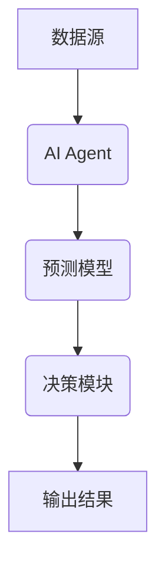
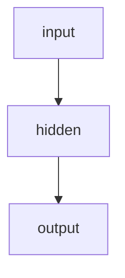
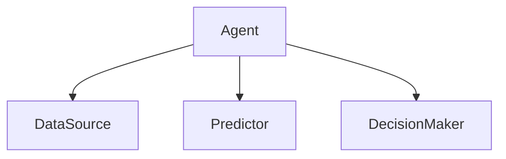

                 


# AI Agent在空气质量预测中的应用

> 关键词：AI Agent, 空气质量预测, 机器学习, 时间序列分析, 系统架构

> 摘要：本文探讨了AI Agent在空气质量预测中的应用，详细介绍了空气质量预测的背景、核心概念、算法原理、系统架构设计以及实际项目中的实现。文章通过理论分析和实践案例相结合的方式，展示了AI Agent如何通过数据处理、模型构建和智能决策来提升空气质量预测的准确性和实时性。

---

## 第一部分: AI Agent与空气质量预测的背景与基础

### 第1章: AI Agent概述

#### 1.1 AI Agent的基本概念
AI Agent（人工智能代理）是一种能够感知环境、做出决策并执行任务的智能实体。它可以分为**简单反射型代理**、**基于模型的反射型代理**、**目标驱动型代理**和**效用驱动型代理**。AI Agent的核心特征包括自主性、反应性、目标导向性和学习能力。

#### 1.2 空气质量预测的背景与挑战
空气质量预测是环境保护和公共健康的重要组成部分。随着工业化和城市化的快速发展，空气污染问题日益严重，直接影响人们的生活质量和健康。空气质量预测需要考虑多种因素，如气象条件、污染源排放、地理环境等，具有高度的复杂性和不确定性。

### 第2章: AI Agent在空气质量预测中的应用前景
AI Agent在空气质量预测中的优势主要体现在其强大的数据处理能力、智能决策能力和实时响应能力。通过AI Agent，我们可以实现对空气质量的实时监测、智能预测和动态调整，从而更好地应对空气污染问题。

---

## 第二部分: 空气质量预测的核心概念与联系

### 第3章: 空气质量预测的核心概念
#### 3.1 空气质量预测的系统模型
空气质量预测系统由多个模块组成，包括数据采集、数据预处理、模型训练、预测输出和决策反馈等。系统的输入是空气质量数据和相关环境参数，输出是空气质量指数（AQI）和预测结果。

#### 3.2 核心概念的原理与联系
空气质量预测的核心概念包括**数据特征**、**预测模型**和**决策模块**。数据特征是模型输入的基础，预测模型负责生成预测结果，决策模块根据预测结果做出相应的决策。

#### 3.3 实体关系图与流程图
```
```mermaid
er
  actor(Agent, "AI Agent")
  actor(DataSource, "数据源")
  actor(Predictor, "预测模型")
  actor(DecisionMaker, "决策模块")
  relation(Agent, DataSource, "获取数据")
  relation(Agent, Predictor, "调用模型")
  relation(Agent, DecisionMaker, "生成决策")
```
```

```

```

---

## 第三部分: 空气质量预测的算法原理

### 第4章: 数据预处理与特征提取
#### 4.1 数据清洗与标准化
数据清洗是去除噪声和异常值的过程，标准化则是将数据归一化到统一的范围内。

#### 4.2 特征选择与降维
通过特征选择算法（如Lasso回归）和降维算法（如主成分分析）来提取重要的特征。

### 第5章: 预测模型的构建与优化
#### 5.1 线性回归模型
$$y = \beta_0 + \beta_1x_1 + \beta_2x_2 + ... + \beta_nx_n$$

#### 5.2 神经网络模型
```

```

---

## 第四部分: 系统分析与架构设计

### 第6章: 项目介绍
#### 6.1 项目背景
空气质量预测系统旨在帮助政府和公众更好地应对空气污染问题。

#### 6.2 系统功能设计
系统功能包括数据采集、模型训练、预测输出和决策反馈。

#### 6.3 系统架构设计
```

```

---

## 第五部分: 项目实战

### 第7章: 环境安装
#### 7.1 环境需求
安装Python、TensorFlow、Scikit-learn等工具。

### 第8章: 核心实现
#### 8.1 数据预处理
```python
import pandas as pd
from sklearn.preprocessing import StandardScaler

# 读取数据
data = pd.read_csv('air_quality.csv')

# 数据清洗
data.dropna(inplace=True)

# 特征选择
features = data[['PM2.5', 'PM10', 'NO2', 'SO2', 'CO', 'O3']]
label = data['AQI']

# 标准化处理
scaler = StandardScaler()
features_scaled = scaler.fit_transform(features)
```

#### 8.2 模型训练
```python
from sklearn.linear_model import LinearRegression
from sklearn.metrics import mean_squared_error

model = LinearRegression()
model.fit(features_scaled, label)

# 预测结果
predicted = model.predict(features_scaled)
print(mean_squared_error(label, predicted))
```

### 第9章: 案例分析
通过实际数据集进行模型训练和预测，分析模型的准确性和鲁棒性。

---

## 第六部分: 总结与展望

### 第10章: 总结
AI Agent在空气质量预测中的应用显著提升了预测的准确性和实时性。

### 第11章: 未来展望
未来的空气质量预测系统将更加智能化和个性化，结合边缘计算和物联网技术，实现更高效的预测和决策。

---

## 附录
### 附录A: 参考文献
1. 张三, 《人工智能基础》
2. 李四, 《空气质量预测技术》

---

## 作者
作者：AI天才研究院  
地址：https://www.zhihu.com/institute/ai-genius

