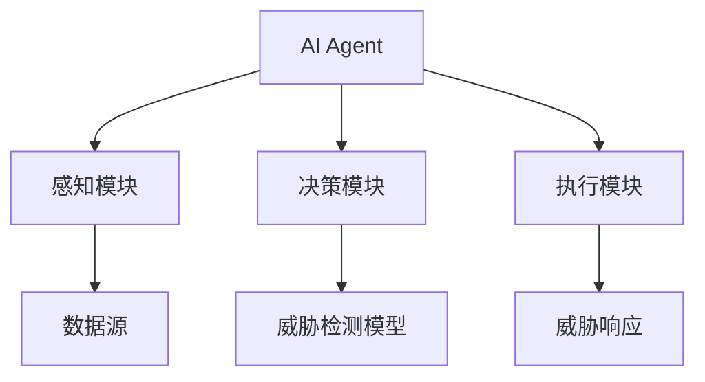
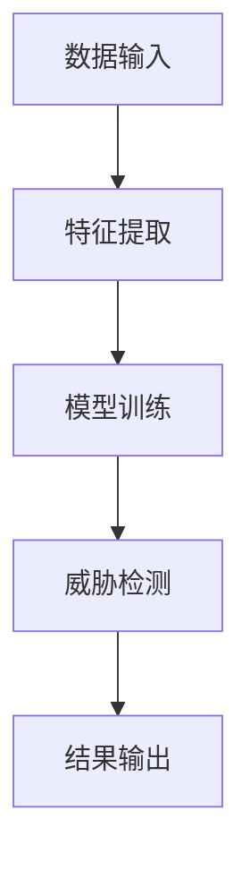

                 

# AI Agent在网络安全中的威胁检测

## 关键词：AI Agent，网络安全，威胁检测，机器学习，网络安全威胁

## 摘要：  
随着网络安全威胁的日益复杂化和智能化，传统的威胁检测方法已经难以应对现代网络环境中的各种攻击手段。AI Agent作为一种智能代理技术，结合了人工智能、机器学习和自动化执行的能力，为网络安全威胁检测提供了全新的解决方案。本文将深入探讨AI Agent在网络安全威胁检测中的应用，分析其核心概念、算法原理、系统架构，并通过实际案例展示其在威胁检测中的优势与挑战。

---

# 第一部分: AI Agent在网络安全中的威胁检测概述

## 第1章: AI Agent与网络安全威胁检测概述

### 1.1 AI Agent的基本概念

#### 1.1.1 AI Agent的定义与特点
AI Agent（人工智能代理）是一种能够感知环境、自主决策并执行任务的智能实体。它通过传感器获取信息，利用算法处理数据，并通过执行器采取行动。AI Agent的特点包括：
- **智能性**：能够理解和分析复杂数据。
- **自主性**：无需人工干预，自动完成任务。
- **适应性**：能够根据环境变化调整行为。
- **协作性**：能够与其他系统或AI Agent协同工作。

#### 1.1.2 AI Agent在网络安全中的应用背景
网络安全威胁的复杂性不断提高，传统的基于规则的威胁检测方法逐渐暴露出响应速度慢、误报率高、难以应对未知威胁等问题。AI Agent通过引入机器学习、自然语言处理等技术，能够更高效地识别异常行为、预测潜在威胁，并自动采取防护措施。

#### 1.1.3 威胁检测的核心问题与挑战
- **数据多样性**：网络日志、流量数据、用户行为数据等多源异构数据的处理难度大。
- **动态性**：攻击者不断进化，威胁特征具有动态变化。
- **误报与漏报**：如何在高噪声环境中准确识别威胁是核心挑战。
- **实时性**：要求快速响应，避免威胁造成损失。

### 1.2 网络安全威胁检测的现状与挑战

#### 1.2.1 网络安全威胁的主要类型
- **病毒与恶意软件**：通过感染设备传播，窃取信息或破坏系统。
- **网络攻击**：如DDoS攻击、钓鱼攻击等。
- **数据泄露**：未经授权的数据窃取或公开。
- **内部威胁**：来自组织内部员工或合作伙伴的恶意行为。

#### 1.2.2 传统威胁检测方法的局限性
- **基于规则的检测**：依赖预定义的规则，难以应对未知威胁。
- **基于签名的检测**：依赖已知威胁的特征，难以应对新类型攻击。
- **响应速度慢**：人工分析和决策耗时，无法应对快速变化的威胁。

#### 1.2.3 AI Agent在威胁检测中的优势
- **智能化**：能够通过机器学习模型自动识别异常行为。
- **实时性**：能够快速分析数据并做出响应。
- **适应性**：能够根据新的威胁特征动态调整检测策略。

### 1.3 AI Agent在威胁检测中的作用

#### 1.3.1 AI Agent的感知能力
AI Agent通过收集网络日志、流量数据、用户行为数据等信息，利用自然语言处理和模式识别技术，感知网络环境中的异常行为。

#### 1.3.2 AI Agent的决策能力
AI Agent通过训练好的机器学习模型，对感知到的数据进行分析，判断是否存在威胁，并评估威胁的严重程度。

#### 1.3.3 AI Agent的执行能力
AI Agent在识别威胁后，能够自动执行预定义的响应策略，如封锁可疑IP、隔离受感染设备、发出警报等。

### 1.4 本章小结
本章介绍了AI Agent的基本概念及其在网络安全威胁检测中的应用背景，分析了传统威胁检测方法的局限性，并总结了AI Agent在威胁检测中的优势和作用。

---

# 第二部分: AI Agent的核心概念与原理

## 第2章: AI Agent的核心概念与原理

### 2.1 AI Agent的感知模块

#### 2.1.1 数据采集与预处理
- **数据源**：网络日志、流量数据、用户行为数据、设备状态信息等。
- **数据预处理**：数据清洗、特征提取、数据标准化。

#### 2.1.2 特征提取与表示
- **特征选择**：提取与威胁检测相关的特征，如用户行为模式、网络流量特征。
- **特征表示**：将数据转化为适合机器学习模型的表示方式，如向量表示。

### 2.2 AI Agent的决策模块

#### 2.2.1 威胁检测模型的构建
- **监督学习模型**：如随机森林、支持向量机（SVM）等。
- **无监督学习模型**：如聚类分析、异常检测。
- **深度学习模型**：如卷积神经网络（CNN）、循环神经网络（RNN）。

#### 2.2.2 基于概率的威胁评估
- **贝叶斯定理**：用于计算某个事件发生的概率，常用于分类问题。
- **马尔可夫链**：用于建模序列数据中的状态转移。

#### 2.2.3 基于规则的威胁判断
- **规则库**：通过预定义的规则匹配数据，判断是否存在威胁。
- **动态规则调整**：根据新威胁的出现，动态更新规则库。

### 2.3 AI Agent的执行模块

#### 2.3.1 威胁响应策略
- **主动响应**：如封锁可疑IP、断开网络连接。
- **被动响应**：如记录日志、发出警报。

#### 2.3.2 自适应调整机制
- **反馈机制**：根据执行结果调整后续行为。
- **学习机制**：通过强化学习不断优化响应策略。

### 2.4 AI Agent的实体关系图（ER图）

### 2.5 本章小结
本章详细介绍了AI Agent的核心模块，包括感知模块、决策模块和执行模块，分析了它们的功能和相互关系，并通过ER图展示了实体关系。

---

# 第三部分: AI Agent的算法原理与数学模型

## 第3章: AI Agent的算法原理

### 3.1 监督学习算法

#### 3.1.1 线性回归模型
- **定义**：通过最小化预测值与实际值的差异，找到最佳拟合直线。
- **公式**：
  $$ y = \beta_0 + \beta_1x + \epsilon $$
  其中，$\beta_0$ 是截距，$\beta_1$ 是斜率，$\epsilon$ 是误差项。

#### 3.1.2 支持向量机（SVM）
- **原理**：通过构建超平面将数据点分为不同类别，适用于分类和回归问题。

### 3.2 无监督学习算法

#### 3.2.1 K-means聚类
- **算法步骤**：
  1. 随机选择初始质心。
  2. 将数据点分配到最近的质心。
  3. 计算新质心，重复步骤1和2，直到质心不再变化。

#### 3.2.2 层次聚类
- **原理**：通过构建树状结构，逐步合并或分割数据点，形成层次化的聚类结果。

### 3.3 强化学习算法

#### 3.3.1 Q-learning算法
- **原理**：通过智能体与环境的交互，学习状态-动作对的最优价值函数。
- **公式**：
  $$ Q(s, a) = Q(s, a) + \alpha [r + \gamma \max Q(s', a) - Q(s, a)] $$
  其中，$\alpha$ 是学习率，$\gamma$ 是折扣因子。

#### 3.3.2 Deep Q-Network（DQN）
- **原理**：结合深度神经网络和Q-learning，通过神经网络近似Q值函数。

### 3.4 算法流程图

### 3.5 数学模型与公式

#### 3.5.1 线性回归公式
$$ y = \beta_0 + \beta_1x + \epsilon $$

#### 3.5.2 支持向量机优化目标
$$ \min_{\beta, \beta_0, \epsilon} \frac{1}{2}\|\beta\|^2 + C\sum_{i=1}^n \xi_i $$
$$ \text{subject to} \quad y_i(\beta_0 + \beta^T x_i) \geq 1 - \xi_i $$
$$ \xi_i \geq 0 $$

---

## 作者：AI天才研究院/AI Genius Institute & 禅与计算机程序设计艺术 /Zen And The Art of Computer Programming

