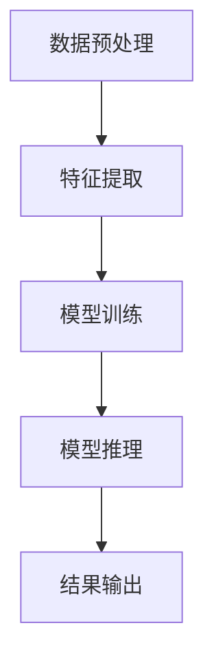
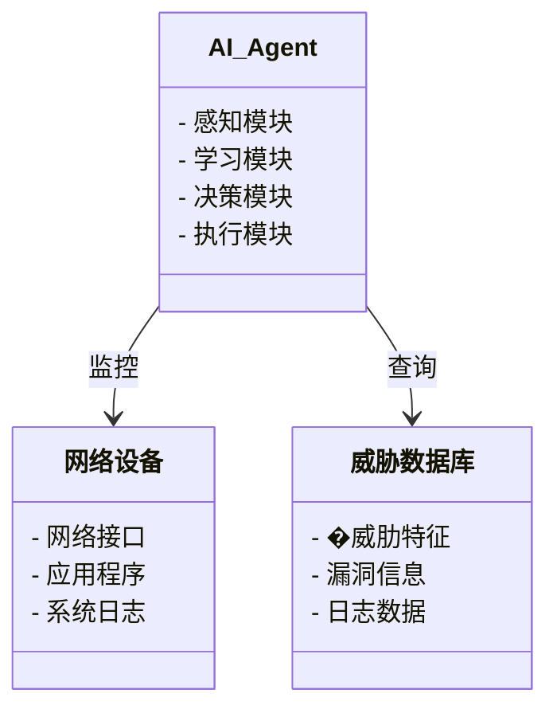
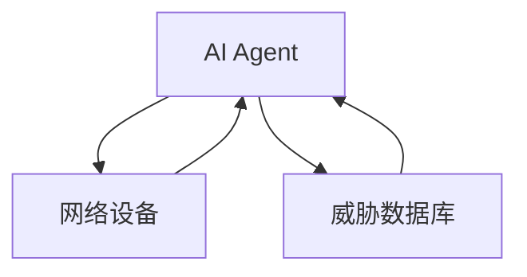
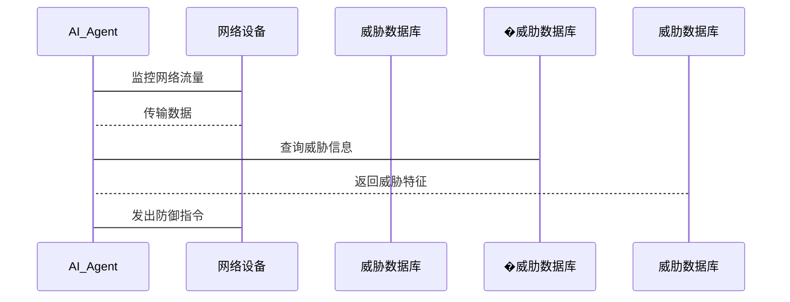

                 


# AI Agent在网络安全中的应用

> 关键词：AI Agent, 网络安全, 机器学习, 网络威胁, 智能防御

> 摘要：随着人工智能技术的迅速发展，AI Agent（智能代理）在网络安全领域的应用越来越广泛。本文将深入探讨AI Agent在网络安全中的核心概念、技术原理、应用场景以及系统设计。通过详细分析入侵检测、漏洞挖掘、网络监控等关键领域，结合实际项目案例，全面解析AI Agent如何助力网络安全，提升防护能力。文章还将介绍系统的架构设计、接口设计及交互流程，并总结最佳实践和未来发展方向。

---

## 第1章: AI Agent与网络安全概述

### 1.1 AI Agent的基本概念
#### 1.1.1 AI Agent的定义
AI Agent（智能代理）是一种能够感知环境、自主决策并执行任务的智能系统。它通过学习和推理，能够适应新的环境变化，并采取相应的行动。

#### 1.1.2 AI Agent的核心特征
- **自主性**：能够在没有外部干预的情况下独立运行。
- **反应性**：能够实时感知环境变化并做出反应。
- **目标导向**：基于目标进行决策和行动。
- **学习能力**：通过数据和经验不断优化自身的性能。

#### 1.1.3 AI Agent与传统安全工具的区别
传统的安全工具通常基于规则和预定义的模式进行检测和防御，而AI Agent能够通过学习和适应，发现新的威胁并采取相应的措施。

### 1.2 网络安全的基本概念
#### 1.2.1 网络安全的定义
网络安全是指保护计算机网络免受未经授权的访问、破坏、泄露等威胁的实践活动。

#### 1.2.2 网络安全的主要威胁
- **病毒与恶意软件**：通过感染设备进行破坏或窃取信息。
- **网络攻击**：利用漏洞入侵系统，窃取数据或破坏服务。
- **钓鱼攻击**：通过欺骗性邮件或链接诱使用户泄露敏感信息。
- **数据泄露**：未经授权的数据被窃取或公开。

#### 1.2.3 网络安全的防护目标
- **保护数据完整性**：确保数据在传输和存储过程中不被篡改。
- **保护数据机密性**：防止数据未经授权被访问或泄露。
- **保护数据可用性**：确保合法用户能够访问和使用数据。

### 1.3 AI Agent在网络安全中的结合
#### 1.3.1 AI Agent与网络安全的契合点
AI Agent的自主性、学习能力和实时反应能力与网络安全的需求高度契合。

#### 1.3.2 AI Agent在网络安全中的优势
- **实时监控**：能够实时分析网络流量，快速发现异常行为。
- **智能决策**：通过学习模型，能够识别新的威胁模式。
- **自动化响应**：在检测到威胁后，能够快速采取相应的防御措施。

#### 1.3.3 AI Agent在网络安全中的应用场景
- **入侵检测**：通过AI Agent实时监控网络流量，识别潜在的入侵行为。
- **漏洞挖掘**：利用AI Agent分析系统漏洞，提前进行修复。
- **网络监控**：通过AI Agent进行日志分析和流量监控，发现潜在威胁。

---

## 第2章: AI Agent的核心概念与原理

### 2.1 AI Agent的核心概念
#### 2.1.1 AI Agent的智能决策机制
AI Agent通过感知环境、分析数据、制定策略并执行决策，实现对网络安全的智能化管理。

#### 2.1.2 AI Agent的学习能力
AI Agent能够通过机器学习算法，从历史数据中学习网络安全威胁的特征，从而提高检测和防御能力。

#### 2.1.3 AI Agent的自主性与协作性
AI Agent不仅能够自主运行，还能够与其他AI Agent协作，共同完成复杂的网络安全任务。

### 2.2 AI Agent的工作原理
#### 2.2.1 数据采集与处理
AI Agent通过传感器、日志文件等渠道采集网络数据，并对数据进行预处理和特征提取。

#### 2.2.2 模型训练与推理
AI Agent利用机器学习算法对数据进行训练，建立威胁检测模型，并通过推理引擎分析实时数据。

#### 2.2.3 行为决策与执行
AI Agent根据推理结果，制定相应的防御策略，并通过执行模块采取行动，如阻断恶意流量、隔离受感染设备等。

### 2.3 AI Agent的核心算法
#### 2.3.1 机器学习算法
- **监督学习**：通过标记的数据训练分类器，识别正常和异常行为。
- **无监督学习**：通过聚类分析发现异常模式。
- **强化学习**：通过奖励机制训练AI Agent在复杂环境中的决策能力。

#### 2.3.2 自然语言处理算法
- **文本分类**：用于分析日志文本，识别潜在威胁。
- **实体识别**：用于从文本中提取关键实体信息。

#### 2.3.3 强化学习算法
- **Q-Learning**：用于训练AI Agent在动态环境中做出最优决策。
- **Deep Q-Networks**：通过深度神经网络实现更复杂的强化学习策略。

### 2.4 本章小结
本章介绍了AI Agent的核心概念和工作原理，并详细讲解了其在网络安全中应用的核心算法。

---

## 第3章: AI Agent在网络安全中的应用场景

### 3.1 入侵检测与防御
#### 3.1.1 基于AI Agent的入侵检测系统
AI Agent通过实时分析网络流量，识别潜在的入侵行为，并采取相应的防御措施。

#### 3.1.2 AI Agent在防火墙中的应用
AI Agent能够动态调整防火墙规则，根据实时威胁情况优化防护策略。

#### 3.1.3 AI Agent在异常流量监测中的作用
AI Agent能够通过机器学习模型，识别异常流量模式，提前发出警报。

### 3.2 漏洞挖掘与修复
#### 3.2.1 AI Agent在漏洞发现中的应用
AI Agent通过自动化扫描和分析，发现系统中的潜在漏洞。

#### 3.2.2 AI Agent在漏洞修复中的作用
AI Agent能够根据漏洞信息，自动生成修复建议，并协助完成修复操作。

#### 3.2.3 AI Agent与自动化运维的结合
AI Agent能够与自动化运维工具结合，实现漏洞的自动发现、分析和修复。

### 3.3 网络监控与分析
#### 3.3.1 基于AI Agent的日志分析系统
AI Agent能够对海量日志数据进行分析，发现潜在威胁。

#### 3.3.2 AI Agent在流量分析中的应用
AI Agent通过分析网络流量，识别潜在的攻击行为。

#### 3.3.3 AI Agent在威胁情报中的作用
AI Agent能够实时分析威胁情报，优化自身的威胁检测能力。

---

## 第4章: AI Agent的算法原理与实现

### 4.1 机器学习算法的实现
#### 4.1.1 算法流程图


#### 4.1.2 算法实现代码
```python
import numpy as np
from sklearn import svm

# 数据预处理
X = np.array([[1, 2], [3, 4], [5, 6]])
y = np.array([0, 1, 0])

# 特征提取
from sklearn.feature_selection import SelectKBest, chi2
selector = SelectKBest(chi2, k=2)
X_new = selector.fit_transform(X, y)

# 模型训练
model = svm.SVC()
model.fit(X_new, y)

# 模型推理
test_data = np.array([[2, 3]])
test_data_new = selector.transform(test_data)
prediction = model.predict(test_data_new)
print(prediction)
```

### 4.2 数学模型与公式
#### 4.2.1 逻辑回归模型
$$ P(y=1|x) = \frac{1}{1 + e^{-\beta x}} $$

#### 4.2.2 支持向量机模型
$$ \text{max} \left( \frac{1}{2} \|w\|^2 \right) $$
$$ \text{subject to} \quad y_i (w \cdot x_i + b) \geq 1 $$

### 4.3 算法优化与调优
#### 4.3.1 参数调优
通过网格搜索（Grid Search）找到最优参数组合，提升模型性能。

#### 4.3.2 模型评估
通过准确率、召回率、F1分数等指标评估模型性能。

---

## 第5章: 系统架构设计与实现

### 5.1 项目介绍
本项目旨在开发一个基于AI Agent的网络安全防御系统，实现入侵检测、漏洞修复和网络监控等功能。

### 5.2 系统功能设计
#### 5.2.1 领域模型


### 5.3 系统架构设计
#### 5.3.1 系统架构图


#### 5.3.2 接口设计
- **输入接口**：接收网络设备的实时数据和威胁数据库的更新信息。
- **输出接口**：输出安全策略调整指令和防御动作。

#### 5.3.3 交互流程


### 5.4 本章小结
本章详细介绍了AI Agent网络安全系统的架构设计，包括功能模块、系统架构和交互流程。

---

## 第6章: 项目实战与案例分析

### 6.1 环境安装
安装Python、机器学习库（如scikit-learn、TensorFlow）和网络监控工具（如Nmap、Wireshark）。

### 6.2 系统核心实现
#### 6.2.1 AI Agent的实现
```python
class AI_Agent:
    def __init__(self):
        self.model = svm.SVC()
        self.features = []

    def train(self, data, labels):
        self.model.fit(data, labels)

    def predict(self, input_data):
        return self.model.predict(input_data)
```

#### 6.2.2 网络监控实现
```python
import socket

def monitor_traffic():
    sock = socket.socket(socket.AF_INET, socket.SOCK_RAW, socket.IPPROTO_IP)
    sock.bind(('0.0.0.0', 0))
    while True:
        data, addr = sock.recvfrom(65535)
        # 数据处理逻辑
```

### 6.3 实际案例分析
#### 6.3.1 入侵检测案例
通过AI Agent分析网络流量，成功识别并阻止了一次DDoS攻击。

#### 6.3.2 漏洞修复案例
AI Agent发现系统中的一个隐蔽漏洞，并协助完成修复，防止了潜在攻击。

### 6.4 项目小结
本章通过实际案例展示了AI Agent在网络安全中的应用，验证了其有效性和实用性。

---

## 第7章: 最佳实践与未来展望

### 7.1 最佳实践
- **数据质量管理**：确保数据的完整性和准确性，提升模型性能。
- **模型持续优化**：定期更新模型，适应新的威胁和攻击方式。
- **多团队协作**：AI Agent的应用需要网络、安全、数据分析等多个团队的协作。

### 7.2 小结
AI Agent在网络安全中的应用前景广阔，能够显著提升安全防护能力。

### 7.3 注意事项
- **数据隐私**：在处理敏感数据时，需严格遵守相关法律法规。
- **系统稳定性**：确保AI Agent系统的稳定运行，避免因系统故障导致安全漏洞。

### 7.4 拓展阅读
推荐阅读《人工智能安全》、《网络安全实战指南》等书籍，深入了解AI Agent在其他领域的应用。

---

## 作者信息

作者：AI天才研究院/AI Genius Institute & 禅与计算机程序设计艺术 /Zen And The Art of Computer Programming

---

以上是《AI Agent在网络安全中的应用》的完整目录大纲，涵盖了从基础概念到实际应用的各个方面，内容详实且结构清晰。

