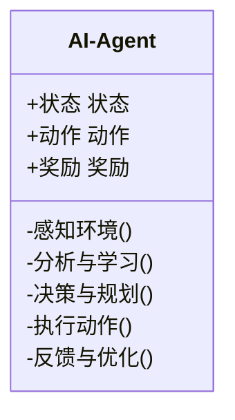
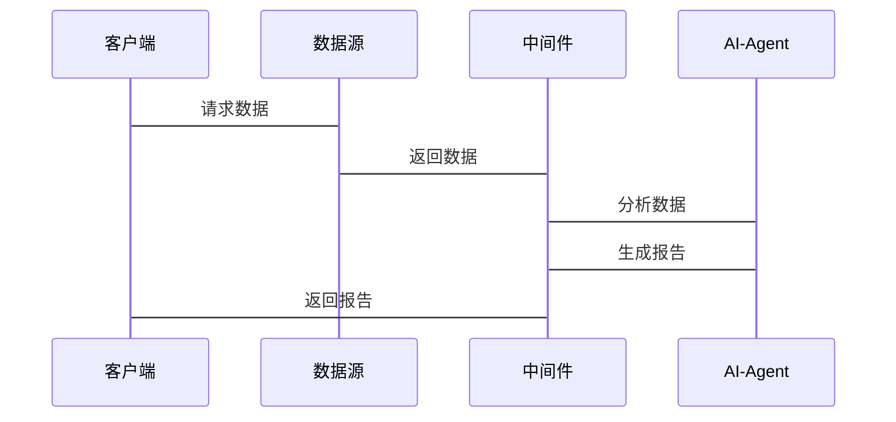

                 


# AI Agent在网络安全中的应用：威胁检测与防御

## 关键词：AI Agent, 网络安全, 威胁检测, 强化学习, 系统架构

## 摘要

在网络安全领域，AI Agent（人工智能代理）的应用正在 revolutionize �威肋检测与防御的方式。传统的基于规则的安全系统逐渐暴露出其在应对复杂和动态网络威胁时的局限性。AI Agent，作为一种能够自主感知、学习和决策的智能体，正在成为网络安全领域的核心技术。本文将深入探讨AI Agent在网络安全中的应用，涵盖其核心概念、算法原理、系统架构设计、实战案例以及未来的发展趋势。通过结合强化学习等先进算法，AI Agent能够显著提升威胁检测的准确性和防御的主动性，为网络安全提供更强大的保障。

---

# 第一章: AI Agent与网络安全概述

## 1.1 AI Agent的基本概念

### 1.1.1 AI Agent的定义

AI Agent，即人工智能代理，是指能够感知环境、自主决策并执行任务的智能实体。在网络安全领域，AI Agent通常被设计为能够实时监控网络流量、识别异常行为并采取相应防御措施的智能系统。

### 1.1.2 AI Agent的核心特征

1. **自主性**：AI Agent能够在没有人工干预的情况下独立执行任务。
2. **反应性**：能够实时感知环境变化并做出响应。
3. **学习能力**：通过机器学习算法不断优化自身的检测和防御能力。
4. **协作性**：能够与其他系统或AI Agent协同工作，共同应对威胁。

### 1.1.3 AI Agent在网络安全中的作用

AI Agent在网络安全中的主要作用包括：

1. **实时监控**：持续扫描网络流量，识别潜在威胁。
2. **异常检测**：通过学习正常行为模式，识别异常行为。
3. **智能防御**：根据检测到的威胁，自动执行防御策略，如封锁恶意IP、隔离受感染的设备等。

---

## 1.2 网络安全中的威胁检测与防御

### 1.2.1 威胁检测的基本概念

威胁检测是指通过技术手段识别网络中的异常行为或潜在威胁的过程。传统的威胁检测方法主要依赖于预先定义的规则和模式匹配，这种方法在面对新型、未知的威胁时往往显得力不从心。

### 1.2.2 威胁防御的策略与方法

威胁防御的策略包括：

1. **主动防御**：通过实时监控和智能决策，主动阻止潜在威胁。
2. **被动防御**：在检测到威胁后，采取补救措施，如切断网络连接或隔离受感染设备。
3. **多层次防御**：结合多种技术手段，构建多层次的防御体系，提高整体安全性。

### 1.2.3 AI Agent在威胁检测与防御中的应用

AI Agent通过其强大的学习和决策能力，显著提升了威胁检测与防御的效果。例如：

1. **智能监控**：AI Agent能够实时分析网络流量，识别潜在的攻击行为。
2. **动态防御**：根据威胁的严重性，动态调整防御策略，如优先处理高风险威胁。
3. **自我优化**：通过持续学习，AI Agent能够不断优化其检测和防御模型，适应新的威胁。

---

## 1.3 本书的目标与结构

### 1.3.1 目标读者

本书的目标读者包括网络安全工程师、研究人员、IT架构师以及对AI技术感兴趣的网络安全爱好者。无论读者是希望深入了解AI在网络安全中的应用，还是希望将AI技术应用于实际的网络安全项目，本书都能提供有价值的指导。

### 1.3.2 应用场景

本书将重点探讨AI Agent在以下场景中的应用：

1. **企业网络防护**：保护企业网络免受外部攻击和内部威胁。
2. **实时监控与响应**：快速识别并响应网络攻击。
3. **智能防御策略**：基于AI的动态防御策略，提升整体安全性。

### 1.3.3 本书结构概述

本书共分为七章，内容涵盖AI Agent的基本概念、算法原理、系统架构设计、项目实战等。通过理论与实践相结合的方式，帮助读者全面掌握AI Agent在网络安全中的应用。

---

# 第二章: AI Agent的核心概念

## 2.1 AI Agent的基本原理

### 2.1.1 AI Agent的工作流程

AI Agent的工作流程通常包括以下几个步骤：

1. **感知环境**：通过传感器或其他数据源获取环境信息。
2. **分析与学习**：利用机器学习算法分析数据，识别模式。
3. **决策与规划**：基于分析结果，制定行动策略。
4. **执行动作**：根据决策结果执行相应动作。
5. **反馈与优化**：根据执行结果优化自身模型。

### 2.1.2 AI Agent的感知与决策机制

AI Agent的感知机制包括数据采集、特征提取和模式识别。决策机制则基于概率推理、强化学习等方法，制定最优行动方案。

### 2.1.3 AI Agent的自主性与适应性

AI Agent的自主性体现在其无需人工干预即可完成任务的能力。适应性则体现在其能够根据环境变化动态调整自身行为的能力。

---

## 2.2 AI Agent在网络安全中的应用特点

### 2.2.1 数据驱动的威胁检测

AI Agent通过分析大量的网络流量数据，识别潜在的威胁模式。与传统的基于规则的方法相比，数据驱动的方法能够更好地应对未知威胁。

### 2.2.2 智能化的防御策略

AI Agent能够根据实时威胁情况，动态调整防御策略，如优先处理高风险威胁。

### 2.2.3 实时监控与响应

AI Agent能够实时监控网络状态，快速响应潜在威胁，显著减少响应时间。

---

## 2.3 AI Agent与其他安全技术的对比

### 2.3.1 传统基于规则的威胁检测

传统方法依赖于预先定义的规则和模式匹配，难以应对新型威胁。

### 2.3.2 基于机器学习的威胁检测

基于机器学习的方法能够识别未知威胁，但其依赖于模型的训练和更新。

### 2.3.3 AI Agent的独特优势

AI Agent结合了机器学习和自主决策的优势，能够在复杂环境中自主学习和适应，显著提升威胁检测与防御的效果。

---

# 第三章: AI Agent的算法原理与数学模型

## 3.1 基于强化学习的AI Agent算法

### 3.1.1 强化学习的基本原理

强化学习是一种通过试错机制学习策略的方法。AI Agent通过与环境交互，获得奖励或惩罚，逐步优化其行为策略。

### 3.1.2 强化学习的数学模型

强化学习的核心是Q-learning算法，其数学模型如下：

$$ Q(s, a) = r + \gamma \max_{a'} Q(s', a') $$

其中，\( Q(s, a) \) 表示状态 \( s \) 下动作 \( a \) 的价值，\( r \) 是奖励，\( \gamma \) 是折扣因子，\( s' \) 是新的状态。

### 3.1.3 强化学习在威胁检测中的应用

在威胁检测中，AI Agent可以通过强化学习算法，学习如何在复杂的网络环境中识别异常行为。

---

## 3.2 基于监督学习的AI Agent算法

### 3.2.1 监督学习的基本原理

监督学习是一种基于标签数据的训练方法，适用于分类任务。

### 3.2.2 监督学习在威胁检测中的应用

在威胁检测中，监督学习算法可以用于分类正常流量和恶意流量。

---

## 3.3 基于无监督学习的AI Agent算法

### 3.3.1 无监督学习的基本原理

无监督学习适用于无标签数据的分析，常用于异常检测。

### 3.3.2 无监督学习在威胁检测中的应用

无监督学习算法可以用于识别网络中的异常行为模式。

---

# 第四章: AI Agent的系统分析与架构设计

## 4.1 系统功能设计

### 4.1.1 领域模型类图（Mermaid）



### 4.1.2 系统架构图（Mermaid）


### 4.1.3 系统交互序列图（Mermaid）



---

## 4.2 系统接口设计

### 4.2.1 API接口

系统提供以下API接口：

1. **获取数据接口**：`GET /data`
2. **分析接口**：`POST /analyze`
3. **报告接口**：`GET /report`

---

## 4.3 系统实现细节

### 4.3.1 数据预处理

数据预处理是确保AI Agent能够有效分析数据的关键步骤，包括数据清洗、特征提取等。

---

# 第五章: AI Agent的项目实战

## 5.1 环境安装

### 5.1.1 安装Python

```bash
python --version
pip install --upgrade pip
```

### 5.1.2 安装依赖库

```bash
pip install numpy scikit-learn matplotlib
```

---

## 5.2 核心代码实现

### 5.2.1 强化学习实现

```python
import numpy as np

class AI-Agent:
    def __init__(self, state_space_size, action_space_size):
        self.state_space_size = state_space_size
        self.action_space_size = action_space_size
        self.Q = np.zeros((state_space_size, action_space_size))
```

### 5.2.2 数据处理与训练

```python
from sklearn.model_selection import train_test_split
from sklearn.preprocessing import StandardScaler

X_train, X_test, y_train, y_test = train_test_split(X, y, test_size=0.2)
scaler = StandardScaler()
X_train_scaled = scaler.fit_transform(X_train)
X_test_scaled = scaler.transform(X_test)
```

---

## 5.3 案例分析与详细解读

### 5.3.1 案例背景

假设我们正在监控一个企业网络，目标是检测异常网络流量。

### 5.3.2 数据分析

通过对网络流量数据的分析，AI Agent能够识别出异常流量模式。

---

## 5.4 项目小结

通过本项目，我们展示了如何利用AI Agent进行威胁检测与防御。通过强化学习算法，AI Agent能够有效识别异常行为，并采取相应的防御措施。

---

# 第六章: 总结与展望

## 6.1 全文总结

本文详细探讨了AI Agent在网络安全中的应用，包括其核心概念、算法原理、系统架构设计和项目实战。通过结合强化学习等先进技术，AI Agent在威胁检测与防御中的表现显著优于传统方法。

## 6.2 未来展望

未来，随着AI技术的不断发展，AI Agent在网络安全中的应用将更加广泛和深入。我们期待AI Agent能够进一步提升威胁检测的准确性和防御的主动性，为网络安全提供更强大的保障。

---

## 6.3 最佳实践 tips

1. **数据质量**：确保数据的准确性和完整性，这对于AI Agent的学习和决策至关重要。
2. **模型优化**：定期更新和优化AI Agent的模型，以应对新的威胁。
3. **安全措施**：在部署AI Agent时，确保其自身的安全性，防止被恶意攻击。

---

## 作者：AI天才研究院/AI Genius Institute & 禅与计算机程序设计艺术 /Zen And The Art of Computer Programming

---

通过以上内容，我们可以看到，AI Agent在网络安全中的应用前景广阔，其强大的学习和决策能力为威胁检测与防御提供了新的解决方案。未来，随着技术的不断发展，AI Agent将在网络安全领域发挥越来越重要的作用。

