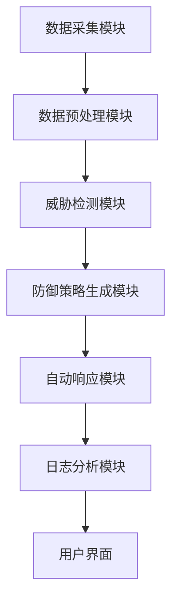

                 


# AI Agent在网络安全防御中的应用

> 关键词：AI Agent, 网络安全, 威胁检测, 防御策略, 机器学习, 深度学习, 系统架构

> 摘要：  
> 随着网络安全威胁的日益复杂化，传统的网络安全防御手段已经难以应对新型攻击方式。本文探讨了AI Agent在网络安全防御中的应用，从基本概念到核心原理，再到实际应用，全面分析了AI Agent在威胁检测、防御策略生成以及系统架构设计中的作用。文章结合实际案例，详细介绍了基于AI Agent的网络安全防御系统的构建过程，包括环境安装、代码实现和案例分析。通过本文的阐述，读者可以深入了解AI Agent在网络安全中的潜力和实现方式。

---

# 目录大纲

---

# 第1章: AI Agent与网络安全概述

## 1.1 AI Agent的基本概念

### 1.1.1 AI Agent的定义与特点
AI Agent（人工智能代理）是一种能够感知环境、自主决策并采取行动的智能实体。其核心特点包括：  
1. **自主性**：能够自主决策和行动，无需外部干预。  
2. **反应性**：能够实时感知环境并做出响应。  
3. **目标导向**：具有明确的目标，通过行动实现目标。  
4. **学习能力**：能够通过数据和经验不断优化自身行为。  

### 1.1.2 AI Agent在网络安全中的作用
AI Agent在网络安全中的应用主要体现在以下几个方面：  
1. **威胁检测**：通过分析网络流量和日志数据，识别潜在的入侵行为。  
2. **异常行为分析**：基于用户行为分析（UBA），检测异常用户行为，防止内部威胁。  
3. **自动响应**：在检测到威胁后，AI Agent可以自动采取隔离、阻断等措施，减少攻击影响。  

### 1.1.3 网络安全防御的现状与挑战
当前网络安全防御面临的主要挑战包括：  
1. **复杂性**：网络攻击手段多样化，传统的基于规则的防御方式难以应对。  
2. **实时性**：攻击往往发生在瞬间，需要快速响应。  
3. **数据量大**：网络流量和日志数据量庞大，人工分析效率低下。  

---

## 1.2 AI Agent与网络安全的结合

### 1.2.1 AI Agent在网络安全中的应用场景
AI Agent在网络安全中的应用场景包括：  
1. **入侵检测系统（IDS）**：通过机器学习模型分析网络流量，识别异常行为。  
2. **入侵防御系统（IPS）**：实时监控网络流量，阻止潜在的攻击。  
3. **安全事件管理（SIEM）**：整合多个安全工具的数据，进行统一分析和响应。  

### 1.2.2 网络安全防御中的智能化需求
网络安全防御的智能化需求主要体现在以下几个方面：  
1. **自动化响应**：AI Agent能够快速识别威胁并采取行动，减少人工干预。  
2. **自适应防御**：根据实时环境变化调整防御策略，提高防御效率。  
3. **预测性分析**：基于历史数据和模式识别，预测潜在的攻击行为。  

### 1.2.3 AI Agent的优势与局限性

#### 优势
1. **高效性**：AI Agent能够快速处理大量数据，提高威胁检测和响应效率。  
2. **自适应性**：能够根据环境变化动态调整行为，适应新的威胁。  
3. **可扩展性**：适用于各种规模的网络环境，能够轻松扩展。  

#### 局限性
1. **误报与漏报**：AI模型可能存在误报或漏报的情况，需要结合人工审核。  
2. **模型依赖**：AI Agent的性能高度依赖训练数据和算法选择，可能存在过拟合或欠拟合问题。  
3. **可解释性**：部分AI模型（如深度学习模型）具有较高的黑箱特性，难以解释其决策过程。  

---

## 1.3 本章小结  
本章主要介绍了AI Agent的基本概念、在网络安全中的作用以及与网络安全防御的结合方式。通过分析网络安全防御的现状与挑战，阐述了AI Agent在网络安全中的潜在价值和应用前景。

---

# 第2章: AI Agent的核心原理

## 2.1 AI Agent的基本原理

### 2.1.1 知识表示与推理
知识表示是AI Agent理解环境的基础。常见的知识表示方法包括：  
1. **符号表示法**：使用符号逻辑表示知识，例如规则引擎。  
2. **语义网络**：通过节点和边表示概念及其关系。  
3. **概率图模型**：通过概率分布表示不确定性知识，例如贝叶斯网络。  

推理是AI Agent根据知识库中的知识，通过逻辑推理得出结论的过程。常见的推理方法包括：  
1. **演绎推理**：从一般性知识推导出具体结论。  
2. **归纳推理**：从具体实例推导出一般性知识。  
3. ** abduction推理**：从观察到的现象推导出可能的原因。  

### 2.1.2 行为规划与决策
行为规划是AI Agent根据目标和环境状态，制定行动方案的过程。常见的行为规划方法包括：  
1. **基于规则的规划**：通过预定义的规则生成行动方案。  
2. **基于搜索的规划**：通过搜索算法（如A*算法）生成最优路径。  
3. **基于强化学习的规划**：通过强化学习算法，学习最优行动策略。  

### 2.1.3 状态感知与反馈
状态感知是AI Agent通过传感器或数据源获取环境信息的过程。常见的状态感知方法包括：  
1. **基于传感器的感知**：通过摄像头、麦克风等物理传感器获取环境信息。  
2. **基于数据的感知**：通过分析日志、流量数据等获取环境信息。  
3. **基于模型的感知**：通过模拟环境状态获取信息。  

反馈是AI Agent根据环境的响应，调整自身行为的过程。常见的反馈机制包括：  
1. **闭环控制**：根据反馈不断调整行动策略。  
2. **强化学习**：通过奖励机制优化行动策略。  

---

## 2.2 AI Agent与网络安全的结合原理

### 2.2.1 网络安全中的状态建模
在网络安全中，状态建模是通过数学模型描述网络系统的运行状态。常见的状态建模方法包括：  
1. **状态机模型**：通过状态转移图描述系统的运行状态。  
2. **概率图模型**：通过贝叶斯网络描述系统的不确定性。  
3. **时序模型**：通过马尔可夫链描述系统的时序依赖关系。  

### 2.2.2 AI Agent的威胁检测机制
威胁检测是AI Agent的核心功能之一。常见的威胁检测方法包括：  
1. **基于统计的检测**：通过统计分析发现异常行为。  
2. **基于机器学习的检测**：通过训练分类器识别异常行为。  
3. **基于深度学习的检测**：通过神经网络提取深层次特征，识别潜在威胁。  

### 2.2.3 AI Agent的防御策略生成
防御策略生成是AI Agent根据威胁检测结果，制定防御措施的过程。常见的策略生成方法包括：  
1. **基于规则的策略生成**：通过预定义的规则生成防御策略。  
2. **基于强化学习的策略生成**：通过强化学习算法，学习最优防御策略。  
3. **基于博弈论的策略生成**：通过模拟攻击者与防御者的博弈过程，生成最优防御策略。  

---

## 2.3 本章小结  
本章主要介绍了AI Agent的核心原理，包括知识表示与推理、行为规划与决策、状态感知与反馈等方面。同时，详细探讨了AI Agent在网络安全中的结合原理，包括状态建模、威胁检测和防御策略生成。

---

# 第3章: 基于AI Agent的威胁检测

## 3.1 威胁检测的基本原理

### 3.1.1 威胁检测的分类与特点
威胁检测可以分为以下几类：  
1. **基于网络的威胁检测**：通过分析网络流量数据发现异常行为。  
2. **基于主机的威胁检测**：通过分析主机日志和行为发现异常行为。  
3. **基于用户行为的威胁检测**：通过分析用户行为模式发现异常行为。  

每种威胁检测方法都有其特点：  
- **网络流量分析**：适用于发现外部攻击，例如DDoS攻击。  
- **主机日志分析**：适用于发现内部威胁，例如恶意软件行为。  
- **用户行为分析**：适用于发现内部员工的异常行为，例如数据泄露。  

### 3.1.2 基于传统方法的威胁检测
传统的威胁检测方法主要包括：  
1. **基于规则的威胁检测**：通过预定义的规则匹配异常行为。  
2. **基于模式匹配的威胁检测**：通过匹配已知攻击模式发现威胁。  
3. **基于统计的威胁检测**：通过统计分析发现异常行为。  

### 3.1.3 基于AI的威胁检测优势
基于AI的威胁检测具有以下优势：  
1. **高效性**：能够快速处理大量数据，发现潜在威胁。  
2. **自适应性**：能够根据环境变化动态调整检测策略。  
3. **准确性**：通过机器学习算法，提高威胁检测的准确性。  

---

## 3.2 基于AI Agent的威胁检测模型

### 3.2.1 模型输入与输出
基于AI Agent的威胁检测模型通常包括以下输入：  
- **网络流量数据**：包括源IP、目标IP、端口号、数据包大小等。  
- **主机日志数据**：包括系统日志、应用程序日志等。  
- **用户行为数据**：包括登录时间、操作记录等。  

模型输出包括：  
- **威胁评分**：对每个事件进行威胁评分，评分越高表示威胁可能性越大。  
- **威胁类型**：例如DDoS攻击、病毒传播、数据泄露等。  
- **建议措施**：例如隔离受感染主机、阻断异常流量等。  

### 3.2.2 模型训练与优化
模型训练是基于AI Agent的威胁检测模型的核心步骤。常见的训练方法包括：  
1. **监督学习**：使用标记的数据训练分类器，例如随机森林、支持向量机（SVM）。  
2. **无监督学习**：使用无标记数据训练聚类模型，例如K-means。  
3. **半监督学习**：结合标记数据和无标记数据进行训练。  

模型优化可以通过以下方式实现：  
1. **参数调优**：通过网格搜索（Grid Search）优化模型参数。  
2. **特征选择**：通过特征重要性分析选择关键特征。  
3. **集成学习**：通过集成多个模型（如随机森林、梯度提升树）提高模型性能。  

### 3.2.3 模型评估与验证
模型评估是验证威胁检测模型性能的关键步骤。常见的评估指标包括：  
1. **准确率（Accuracy）**：正确分类的样本数占总样本数的比例。  
2. **召回率（Recall）**：真实威胁样本中被正确识别的比例。  
3. **精确率（Precision）**：识别为威胁的样本中实际是威胁的比例。  
4. **F1分数**：精确率和召回率的调和平均数。  

---

## 3.3 实际案例分析

### 3.3.1 某企业网络入侵事件分析
假设某企业遭受了勒索软件攻击，AI Agent通过分析网络流量数据和主机日志数据，成功识别出异常行为，并给出了威胁评分和建议措施。

### 3.3.2 AI Agent在事件中的表现与效果
在上述案例中，AI Agent通过监督学习模型识别出勒索软件的特征，并通过无监督学习模型发现异常流量。最终，AI Agent成功阻止了攻击的进一步蔓延，保护了企业的核心数据。

---

## 3.4 本章小结  
本章主要介绍了基于AI Agent的威胁检测模型，包括模型输入与输出、训练与优化、评估与验证等方面。通过实际案例分析，展示了AI Agent在威胁检测中的实际应用效果。

---

# 第4章: 基于AI Agent的防御策略生成

## 4.1 防御策略生成的基本原理

### 4.1.1 防御策略生成的分类与特点
防御策略生成可以分为以下几类：  
1. **基于规则的策略生成**：通过预定义的规则生成防御策略。  
2. **基于机器学习的策略生成**：通过机器学习模型生成防御策略。  
3. **基于强化学习的策略生成**：通过强化学习算法优化防御策略。  

每种策略生成方法都有其特点：  
- **基于规则的策略生成**：简单易懂，但缺乏灵活性。  
- **基于机器学习的策略生成**：能够适应复杂环境，但可能需要大量数据支持。  
- **基于强化学习的策略生成**：能够通过试错优化策略，但训练时间较长。  

### 4.1.2 基于规则的策略生成
基于规则的策略生成方法主要包括：  
1. **预定义规则**：例如防火墙规则、入侵防御规则等。  
2. **规则优先级**：根据规则的重要性确定策略的执行顺序。  

### 4.1.3 基于AI的策略生成优势
基于AI的策略生成具有以下优势：  
1. **自适应性**：能够根据环境变化动态调整策略。  
2. **灵活性**：能够应对多种复杂的网络安全威胁。  
3. **高效性**：通过机器学习算法快速生成最优策略。  

---

## 4.2 基于AI Agent的防御策略模型

### 4.2.1 模型输入与输出
基于AI Agent的防御策略模型通常包括以下输入：  
- **威胁情报**：包括已知威胁、潜在威胁等。  
- **网络状态**：包括网络拓扑、主机状态等。  
- **历史数据**：包括历史攻击事件、防御记录等。  

模型输出包括：  
- **防御策略**：例如防火墙规则、入侵防御策略等。  
- **策略优先级**：根据威胁严重性确定策略执行顺序。  
- **策略效果评估**：包括策略覆盖率、误报率、漏报率等。  

### 4.2.2 模型训练与优化
模型训练是基于AI Agent的防御策略模型的核心步骤。常见的训练方法包括：  
1. **监督学习**：使用标记的数据训练分类器，例如随机森林、支持向量机（SVM）。  
2. **强化学习**：通过试错优化策略，例如Q-learning算法。  
3. **集成学习**：通过集成多个模型（如随机森林、梯度提升树）提高模型性能。  

模型优化可以通过以下方式实现：  
1. **参数调优**：通过网格搜索（Grid Search）优化模型参数。  
2. **特征选择**：通过特征重要性分析选择关键特征。  
3. **策略评估**：通过模拟攻击场景验证策略的有效性。  

### 4.2.3 模型评估与验证
模型评估是验证防御策略生成模型性能的关键步骤。常见的评估指标包括：  
1. **策略覆盖率**：防御策略能够覆盖的威胁数量占总威胁数量的比例。  
2. **误报率**：正常流量被错误标记为威胁的比例。  
3. **漏报率**：实际威胁未被识别的比例。  
4. **响应时间**：从识别威胁到采取防御措施的时间间隔。  

---

## 4.3 实际案例分析

### 4.3.1 某企业网络入侵防御策略生成
假设某企业遭受了DDoS攻击，AI Agent通过分析网络流量数据和威胁情报，生成了相应的防御策略，包括流量限制、源IP封锁等。

### 4.3.2 AI Agent在策略生成中的表现与效果
在上述案例中，AI Agent通过强化学习算法优化了防御策略，减少了攻击的影响。与传统基于规则的防御策略相比，AI Agent生成的策略更具灵活性和适应性。

---

## 4.4 本章小结  
本章主要介绍了基于AI Agent的防御策略生成模型，包括模型输入与输出、训练与优化、评估与验证等方面。通过实际案例分析，展示了AI Agent在防御策略生成中的实际应用效果。

---

# 第5章: AI Agent网络安全防御系统架构

## 5.1 系统应用场景介绍

### 5.1.1 网络安全防御的典型场景
AI Agent网络安全防御系统的典型应用场景包括：  
1. **企业网络防护**：保护企业内部网络免受外部攻击。  
2. **云安全防护**：保护云服务提供商的基础设施安全。  
3. **物联网安全防护**：保护物联网设备免受攻击。  

### 5.1.2 AI Agent在系统中的角色
在AI Agent网络安全防御系统中，AI Agent主要承担以下角色：  
1. **威胁检测**：实时监控网络流量和日志数据，识别潜在威胁。  
2. **异常行为分析**：基于用户行为分析（UBA）检测异常行为。  
3. **自动响应**：在检测到威胁后，自动采取隔离、阻断等措施。  

### 5.1.3 系统的预期目标与功能
系统的预期目标是通过AI Agent实现智能化的网络安全防御，具体功能包括：  
1. **实时监控**：持续监控网络流量、主机日志和用户行为。  
2. **威胁检测**：通过机器学习模型识别潜在威胁。  
3. **防御策略生成**：根据威胁情况动态生成防御策略。  
4. **自动响应**：在检测到威胁后，自动采取防御措施。  
5. **日志分析**：分析历史日志，总结威胁事件，优化防御策略。  

---

## 5.2 系统功能设计

### 5.2.1 系统功能模块划分
AI Agent网络安全防御系统可以划分为以下几个功能模块：  
1. **数据采集模块**：负责采集网络流量、主机日志和用户行为数据。  
2. **威胁检测模块**：通过机器学习模型识别潜在威胁。  
3. **防御策略生成模块**：根据威胁情况动态生成防御策略。  
4. **自动响应模块**：在检测到威胁后，自动采取防御措施。  
5. **日志分析模块**：分析历史日志，总结威胁事件，优化防御策略。  

### 5.2.2 系统功能的实现流程
系统功能的实现流程如下：  
1. **数据采集**：通过传感器或API接口采集网络流量、主机日志和用户行为数据。  
2. **威胁检测**：将采集到的数据输入机器学习模型，识别潜在威胁。  
3. **防御策略生成**：根据检测到的威胁生成防御策略。  
4. **自动响应**：根据生成的防御策略，自动采取隔离、阻断等措施。  
5. **日志分析**：分析历史日志，总结威胁事件，优化防御策略。  

---

## 5.3 系统架构设计

### 5.3.1 系统架构图
以下是AI Agent网络安全防御系统的架构图：



### 5.3.2 系统接口设计
系统接口设计如下：  
1. **数据采集接口**：通过API接口采集网络流量、主机日志和用户行为数据。  
2. **威胁检测接口**：通过REST API提供威胁检测服务。  
3. **防御策略生成接口**：通过API生成防御策略。  
4. **自动响应接口**：通过API自动采取防御措施。  
5. **日志分析接口**：通过API提供日志分析服务。  

### 5.3.3 系统交互流程
系统交互流程如下：  
1. **数据采集**：通过传感器或API接口采集数据。  
2. **数据预处理**：对采集到的数据进行清洗、归一化等预处理。  
3. **威胁检测**：将预处理后的数据输入机器学习模型，识别潜在威胁。  
4. **防御策略生成**：根据检测到的威胁生成防御策略。  
5. **自动响应**：根据生成的防御策略，自动采取隔离、阻断等措施。  
6. **日志分析**：分析历史日志，总结威胁事件，优化防御策略。  
7. **用户界面**：通过用户界面展示系统状态、威胁事件和防御策略。  

---

## 5.4 项目实战

### 5.4.1 环境安装
以下是AI Agent网络安全防御系统的环境安装步骤：  
1. **安装操作系统**：选择合适的操作系统（如Linux、Windows）。  
2. **安装开发工具**：安装Python、Jupyter Notebook等开发工具。  
3. **安装机器学习库**：安装Scikit-learn、TensorFlow等机器学习库。  
4. **安装网络接口库**：安装Scapy、 requests等网络接口库。  
5. **安装可视化工具**：安装Matplotlib、Seaborn等可视化工具。  

### 5.4.2 系统核心实现源代码
以下是AI Agent网络安全防御系统的核心实现代码：

```python
import numpy as np
import pandas as pd
from sklearn.model_selection import train_test_split
from sklearn.ensemble import RandomForestClassifier
from sklearn.metrics import accuracy_score, recall_score, precision_score

# 数据加载
data = pd.read_csv('network_traffic.csv')
X = data.drop('label', axis=1)
y = data['label']

# 数据分割
X_train, X_test, y_train, y_test = train_test_split(X, y, test_size=0.2, random_state=42)

# 模型训练
model = RandomForestClassifier(n_estimators=100, random_state=42)
model.fit(X_train, y_train)

# 模型预测
y_pred = model.predict(X_test)

# 模型评估
accuracy = accuracy_score(y_test, y_pred)
recall = recall_score(y_test, y_pred)
precision = precision_score(y_test, y_pred)

print(f'Accuracy: {accuracy}')
print(f'Recall: {recall}')
print(f'Precision: {precision}')
```

### 5.4.3 代码应用解读与分析
上述代码实现了基于随机森林算法的威胁检测模型。首先，数据加载模块读取网络流量数据，然后数据分割模块将数据划分为训练集和测试集。接下来，模型训练模块使用随机森林算法训练分类器。最后，模型预测模块对测试数据进行预测，并通过准确率、召回率和精确率评估模型性能。

### 5.4.4 实际案例分析
假设我们有一个包含网络流量数据的CSV文件`network_traffic.csv`，其中包含以下列：  
- 源IP（source_ip）  
- 目标IP（destination_ip）  
- 端口号（port）  
- 数据包大小（packet_size）  
- 标签（label，表示是否为威胁）  

代码读取该数据集，训练随机森林分类器，并对测试数据进行预测。通过评估指标（准确率、召回率、精确率）验证模型性能。

---

## 5.5 本章小结  
本章主要介绍了AI Agent网络安全防御系统的架构设计和实现过程，包括环境安装、核心代码实现、案例分析等方面。通过实际案例分析，展示了AI Agent在网络安全防御中的实际应用效果。

---

# 第6章: 总结与展望

## 6.1 总结
通过本文的阐述，我们可以看到AI Agent在网络安全防御中的巨大潜力。AI Agent能够通过机器学习算法快速处理大量数据，识别潜在威胁，并根据环境变化动态调整防御策略。与传统网络安全防御手段相比，AI Agent具有高效性、自适应性和灵活性等优势。

---

## 6.2 展望
尽管AI Agent在网络安全防御中展现出巨大潜力，但仍存在一些挑战：  
1. **可解释性**：部分AI模型（如深度学习模型）具有较高的黑箱特性，难以解释其决策过程。  
2. **数据依赖性**：AI模型的性能高度依赖训练数据和算法选择，可能存在过拟合或欠拟合问题。  
3. **安全性**：AI Agent本身也可能成为攻击目标，需要确保其安全性和鲁棒性。  

未来，随着人工智能技术的不断发展，AI Agent在网络安全防御中的应用将更加广泛和深入。通过结合边缘计算、区块链等新兴技术，AI Agent有望实现更加智能化、自主化的网络安全防御。

---

# 作者：AI天才研究院/AI Genius Institute & 禅与计算机程序设计艺术 /Zen And The Art of Computer Programming

---

通过本文的详细阐述，我们深入探讨了AI Agent在网络安全防御中的应用，从理论基础到实际案例，全面分析了其在威胁检测、防御策略生成和系统架构设计中的作用。希望本文能够为读者提供有价值的参考，进一步推动AI Agent在网络安全领域的研究与应用。

