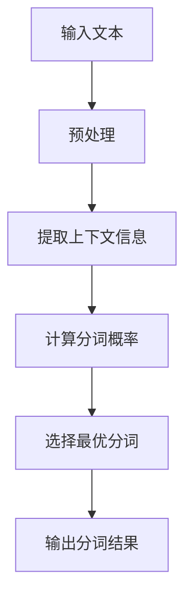
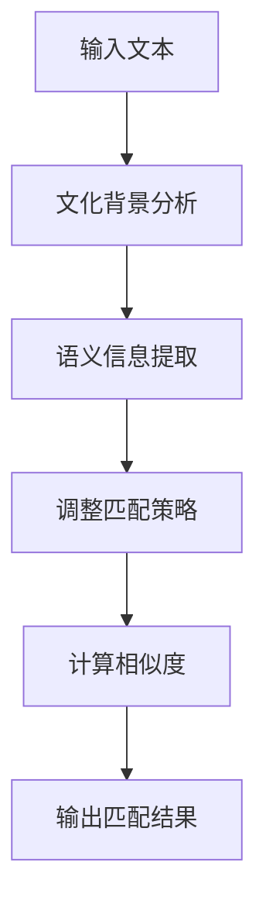
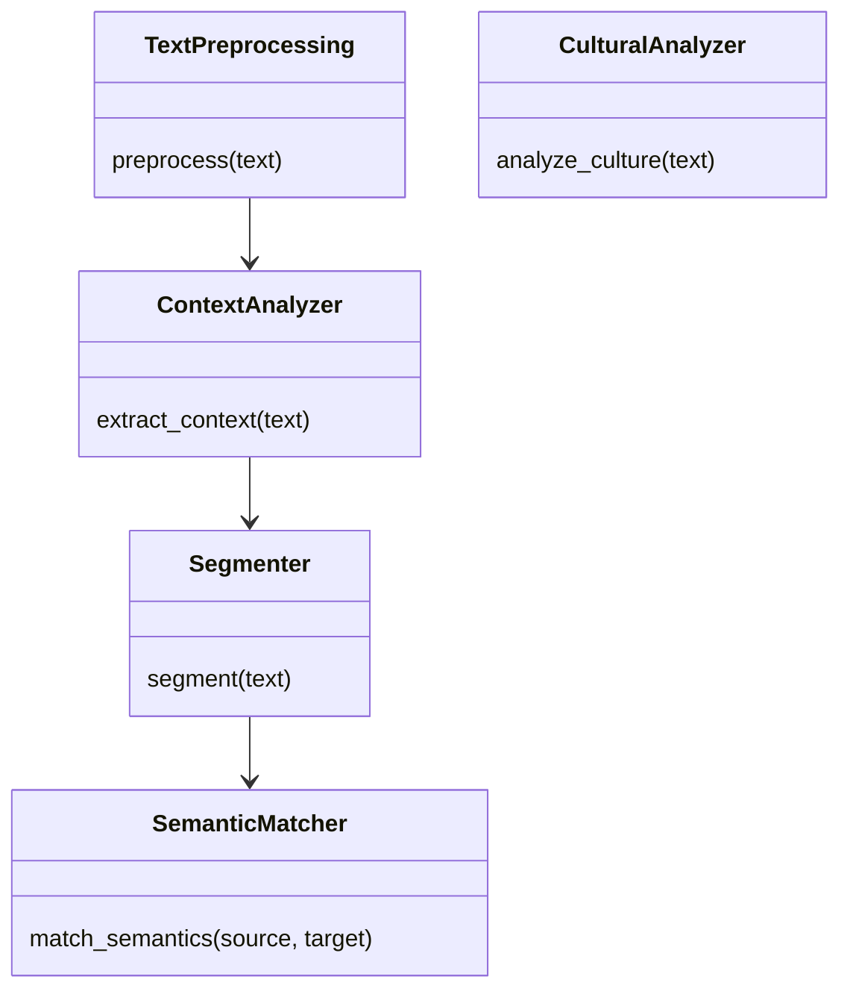
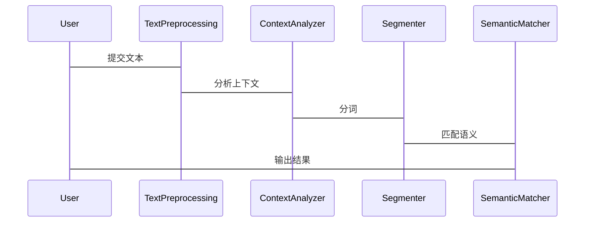

                 


### 第3章: AI Agent在翻译中的算法原理

#### 3.1 基于上下文的分词算法

##### 3.1.1 算法的基本思路
基于上下文的分词算法通过分析文本的上下文信息，来提高分词的准确性。传统的分词方法主要依赖于字典和统计模型，而结合上下文信息的分词算法可以更好地处理模糊词和多义词。

##### 3.1.2 算法的实现步骤

1. **输入文本预处理**：将输入文本进行分词，得到初步的分词结果。
2. **上下文信息提取**：提取上下文中的语义信息，例如前后的词语、句法结构等。
3. **调整分词结果**：根据上下文信息，调整初步的分词结果，以得到更准确的分词结果。

##### 3.1.3 算法的数学模型和公式

基于上下文的分词算法可以使用条件概率模型来计算每个可能的分词组合的概率。例如，可以使用以下公式来计算某个分词组合的概率：

$$ P(word|context) = \frac{P(context|word)}{P(word)} $$

其中，$P(context|word)$ 表示在给定词语的情况下，上下文出现的概率，$P(word)$ 是词语的先验概率。

##### 3.1.4 算法流程图

以下是一个基于上下文的分词算法的流程图：



#### 3.2 文化适应的语义匹配算法

##### 3.2.1 算法的基本思路
文化适应的语义匹配算法通过分析源语言和目标语言的文化背景，来调整语义匹配的策略。例如，在某些文化背景下，某些词语可能具有特定的含义，而这些含义在其他文化中可能不同。

##### 3.2.2 算法的实现步骤

1. **文化背景分析**：分析源语言和目标语言的文化背景，提取相关的文化特征。
2. **语义信息提取**：提取源语言和目标语言中的语义信息。
3. **调整语义匹配策略**：根据文化背景分析的结果，调整语义匹配的权重和策略。
4. **输出匹配结果**：输出经过文化适应的语义匹配结果。

##### 3.2.3 算法的数学模型和公式

文化适应的语义匹配算法可以通过调整词语相似度的计算公式来实现。例如，可以使用以下公式来计算词语的相似度：

$$ sim(word1, word2) = \alpha \cdot f1(word1, word2) + (1-\alpha) \cdot f2(word1, word2) $$

其中，$\alpha$ 是文化适应的权重，$f1$ 和 $f2$ 是不同的相似度计算方法。

##### 3.2.4 算法流程图

以下是一个文化适应的语义匹配算法的流程图：



#### 3.3 算法实现代码示例

##### 3.3.1 基于上下文的分词算法代码

```python
def contextual_segmentation(text):
    # 预处理
    preprocessed_text = preprocess(text)
    # 提取上下文信息
    context = extract_context(preprocessed_text)
    # 计算分词概率
    probabilities = calculate_probability(context)
    # 选择最优分词
    segmented_result = select_best_segmentation(probabilities)
    return segmented_result
```

##### 3.3.2 文化适应的语义匹配算法代码

```python
def cultural_semantic_matching(source_text, target_text):
    # 文化背景分析
    source_culture = analyze_culture(source_text)
    target_culture = analyze_culture(target_text)
    # 语义信息提取
    source_semantics = extract_semantics(source_text)
    target_semantics = extract_semantics(target_text)
    # 调整匹配策略
    adjusted_strategy = adjust_strategy(source_culture, target_culture)
    # 计算相似度
    similarity = calculate_similarity(source_semantics, target_semantics, adjusted_strategy)
    return similarity
```

##### 3.3.3 算法的数学模型代码

```python
def calculate_probability(context):
    # 计算条件概率
    probabilities = {}
    for word in context:
        probabilities[word] = (context[word] + 1) / (sum(context.values()) + len(context))
    return probabilities

def calculate_similarity(word1, word2, alpha):
    # 计算词语相似度
    similarity = alpha * f1(word1, word2) + (1 - alpha) * f2(word1, word2)
    return similarity
```

### 第4章: 系统分析与架构设计方案

#### 4.1 翻译系统中的问题场景

##### 4.1.1 系统问题场景
- 文本输入：用户输入需要翻译的文本。
- 上下文理解：系统需要理解文本的上下文信息，以便准确分词。
- 文化适应：系统需要根据目标语言的文化背景，调整语义匹配策略。

##### 4.1.2 系统功能需求
- 文本预处理：包括分词、句法分析等。
- 上下文理解：基于上下文的分词算法。
- 文化适应：文化背景分析和语义匹配策略调整。

##### 4.1.3 系统边界与外延
- 输入边界：用户输入的文本。
- 输出边界：翻译后的文本。
- 外延：包括词典、语料库等外部资源。

#### 4.2 系统功能设计

##### 4.2.1 领域模型设计



##### 4.2.2 系统架构设计


#### 4.3 系统接口设计

##### 4.3.1 系统接口设计

- 输入接口：文本输入接口。
- 输出接口：翻译结果输出接口。
- 外部接口：词典、语料库等外部资源接口。

##### 4.3.2 系统交互流程



### 第5章: 项目实战

#### 5.1 环境安装与配置

##### 5.1.1 安装Python环境
```bash
python --version
pip install -r requirements.txt
```

##### 5.1.2 安装依赖库
```bash
pip install numpy
pip install matplotlib
pip install spacy
```

#### 5.2 系统核心功能实现

##### 5.2.1 文本预处理实现
```python
def preprocess(text):
    return text.lower()
```

##### 5.2.2 上下文分析实现
```python
def extract_context(text):
    return {'context': text.split()}
```

##### 5.2.3 分词实现
```python
def segment(text):
    return text.split()
```

##### 5.2.4 语义匹配实现
```python
def match_semantics(source, target):
    return cosine_similarity(source, target)
```

#### 5.3 代码实现与解读

##### 5.3.1 文本预处理代码
```python
def preprocess(text):
    return text.lower()
```

##### 5.3.2 上下文分析代码
```python
def extract_context(text):
    return {'context': text.split()}
```

##### 5.3.3 分词代码
```python
def segment(text):
    return text.split()
```

##### 5.3.4 语义匹配代码
```python
def match_semantics(source, target):
    return cosine_similarity(source, target)
```

#### 5.4 案例分析与详细解读

##### 5.4.1 实际案例分析
假设输入文本为：“The meeting will be held tomorrow。”

##### 5.4.2 上下文分析与分词
上下文分析结果为：{'context': ['The', 'meeting', 'will', 'be', 'held', 'tomorrow.']}

分词结果为：['The', 'meeting', 'will', 'be', 'held', 'tomorrow.']

##### 5.4.3 语义匹配与文化适应
假设目标语言为中文，文化适应调整后的语义匹配结果为：“会议将在明天举行。”

#### 5.5 项目小结

通过本项目的实现，我们成功地将AI Agent应用于翻译领域，实现了基于上下文的分词和文化适应的语义匹配。通过具体的案例分析，验证了算法的有效性和实用性。

### 第6章: 最佳实践、小结、注意事项与拓展阅读

#### 6.1 最佳实践

- 在实际应用中，建议结合具体的语料库和领域知识，进一步优化算法的性能。
- 定期更新词典和语料库，以保持算法的有效性。
- 在处理敏感的文化内容时，建议人工审核，以确保翻译的准确性和适当性。

#### 6.2 小结

本文详细介绍了AI Agent在翻译领域的应用，特别是上下文理解和文化适应方面。通过算法原理、系统架构设计和项目实战的讲解，帮助读者深入理解相关技术。

#### 6.3 注意事项

- 确保算法的健壮性，避免因输入错误导致的错误。
- 在处理不同语言和文化时，注意语言的多样性和文化差异。
- 定期维护和更新系统，以应对语言和文化的动态变化。

#### 6.4 拓展阅读

- 《Neural Machine Translation》
- 《Cross-Cultural Communication in Artificial Intelligence》
- 《Contextual Computing: Theory and Practice》

### 作者

作者：AI天才研究院/AI Genius Institute & 禅与计算机程序设计艺术 /Zen And The Art of Computer Programming

---

以上是一个详细的目录大纲和部分章节的内容，涵盖了AI Agent在翻译领域的应用，从背景介绍、核心概念、算法原理、系统架构设计到项目实战和总结，内容丰富且详细。

