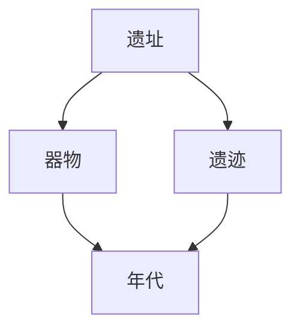
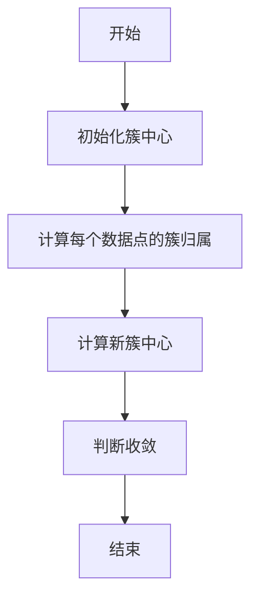
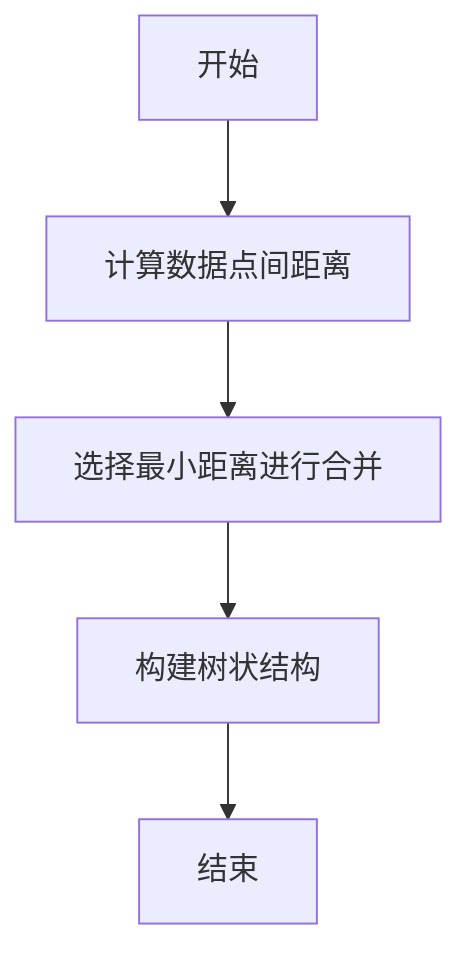
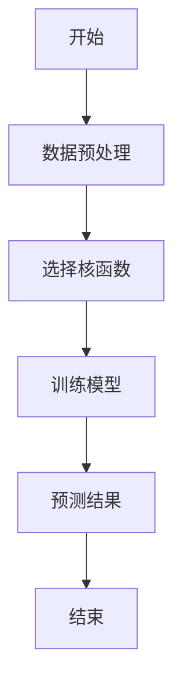
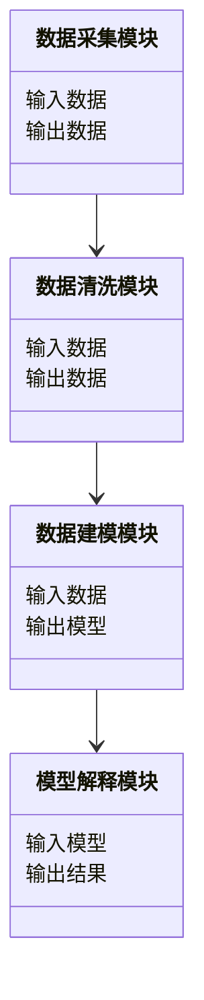
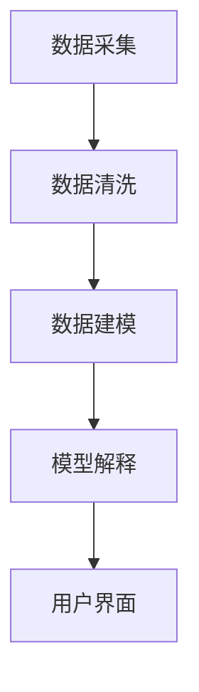

                 


# AI Agent在考古发掘中的数据分析

> 关键词：AI Agent，考古数据分析，聚类算法，分类算法，回归算法，数据预处理，实体关系图

> 摘要：本文将详细探讨AI Agent在考古发掘中的数据分析应用。通过背景介绍、核心概念、算法原理、系统分析与架构设计、项目实战等多方面的内容，系统阐述AI Agent如何助力考古学研究。文章从数据预处理到特征提取，从算法选择到模型构建，从系统设计到项目实现，全面解析AI Agent在考古数据分析中的重要作用。

---

## 第一部分：背景介绍

### 第1章：问题背景

#### 1.1 考古发掘中的数据分析需求
考古学作为一门研究人类历史的重要学科，依赖于对大量复杂数据的分析。这些数据包括但不限于遗址分布、器物特征、年代测定、遗迹结构等。传统的数据分析方法效率低下，难以应对海量数据的挑战。AI Agent的引入为考古学提供了新的可能性。

#### 1.2 AI Agent在考古学中的应用潜力
AI Agent（智能体）是一种能够感知环境并采取行动以实现目标的智能系统。在考古学中，AI Agent可以用于数据分析、模式识别、知识推理等任务，帮助考古学家更快、更准确地解读数据。

#### 1.3 当前考古数据分析的挑战与痛点
- 数据量大且类型多样，传统方法难以高效处理。
- 数据中的模式和关联需要更高级的算法来识别。
- 考古学领域的知识库缺乏系统性，限制了数据分析的深度。

### 第2章：问题描述

#### 2.1 数据分析在考古研究中的重要性
数据分析是考古研究的核心环节，通过对数据的挖掘和分析，可以揭示遗址的形成过程、文化演变规律等重要信息。

#### 2.2 AI Agent在数据处理中的角色
AI Agent可以作为考古数据分析的工具，负责数据的采集、清洗、建模和解释，帮助考古学家从数据中提取有价值的信息。

#### 2.3 数据分析的边界与外延
- 数据分析的边界：主要关注考古学领域内的数据。
- AI Agent的应用范围：从数据预处理到结果解释的全过程。
- 相关领域的交叉：与计算机科学、统计学等领域的交叉。

### 第3章：核心概念

#### 3.1 AI Agent的基本原理
AI Agent通过感知环境、分析数据、制定策略并采取行动来完成任务。在考古数据分析中，AI Agent可以用于数据分类、聚类、回归等任务。

#### 3.2 数据分析的核心要素
- 数据预处理：清洗、转换、标准化。
- 特征提取：从数据中提取有用的特征。
- 模型构建：选择合适的算法并训练模型。
- 结果解释：将分析结果转化为可理解的解释。

#### 3.3 考古学与AI Agent的结合点
- 利用AI Agent进行遗址分类和年代测定。
- 通过数据挖掘揭示遗址之间的关联。
- 利用知识图谱进行文化演变研究。

---

## 第二部分：核心概念与联系

### 第4章：核心概念解析

#### 4.1 AI Agent的原理
AI Agent通过感知环境、分析数据、制定策略并采取行动来完成任务。在考古数据分析中，AI Agent可以用于数据分类、聚类、回归等任务。

#### 4.2 数据分析的核心算法
- 聚类算法：K-means、层次聚类。
- 分类算法：支持向量机（SVM）、随机森林。
- 回归算法：线性回归、逻辑回归。

#### 4.3 考古数据的特殊性
- 数据的多样性：包括文本、图像、数值等多种类型。
- 数据的稀疏性：部分数据可能缺失或不完整。
- 数据的关联性：遗址、器物、年代之间的关联性较强。

### 第5章：核心概念对比

#### 5.1 数据分析方法对比表
| 方法 | 描述 | 优点 | 缺点 |
|------|------|------|------|
| 聚类 | 将数据分成相似的组别 | 发现数据的内在结构 | 需要人工干预确定组别数 |
| 分类 | 根据特征对数据进行分类 | 预测能力强 | 对特征工程依赖较大 |
| 回归 | 预测目标变量 | 可解释性强 | 对异常值敏感 |

#### 5.2 AI Agent与传统数据分析的差异
- AI Agent具有自主性和智能性，能够根据环境动态调整分析策略。
- 传统数据分析方法通常需要人工干预，缺乏灵活性。

#### 5.3 实体关系图（ER图）


---

## 第三部分：算法原理讲解

### 第6章：聚类算法

#### 6.1 K-means算法
K-means是一种常见的聚类算法，通过迭代优化簇中心位置，将数据分成K个簇。



#### 6.2 层次聚类算法
层次聚类是一种基于距离的聚类方法，通过构建树状结构来划分数据。



### 第7章：分类算法

#### 7.1 支持向量机（SVM）
SVM是一种监督学习算法，通过构建超平面将数据分成两类。



#### 7.2 随机森林
随机森林是一种基于树的集成算法，通过投票机制进行分类。

### 第8章：回归算法

#### 8.1 线性回归
线性回归是一种简单回归算法，通过最小化误差平方和来拟合数据。

#### 8.2 逻辑回归
逻辑回归用于分类问题，通过sigmoid函数将输出压缩到0-1范围。

---

## 第四部分：数学模型与公式

### 第9章：聚类算法的数学模型

#### 9.1 K-means算法的数学推导
目标函数：
$$
J = \sum_{i=1}^{n} \sum_{j=1}^{k} w_{ij} ||x_i - c_j||^2
$$
其中，$w_{ij}$为数据点$x_i$属于簇$j$的权重，$c_j$为簇$j$的中心。

### 第10章：分类算法的数学模型

#### 10.1 支持向量机（SVM）
目标函数：
$$
\max_{\xi} \min_{\alpha} \sum_{i=1}^{n} \alpha_i + \xi
$$
约束条件：
$$
y_i (\omega \cdot x_i + b) \geq 1 - \xi_i
$$

---

## 第五部分：系统分析与架构设计

### 第11章：问题场景介绍

#### 11.1 考古数据分析系统
系统目标：通过AI Agent实现考古数据的高效分析。
系统功能：数据采集、清洗、建模、解释。

### 第12章：系统架构设计

#### 12.1 类图


#### 12.2 架构图


---

## 第六部分：项目实战

### 第13章：环境安装

#### 13.1 Python环境
安装Python、Pandas、NumPy、Scikit-learn等库。

### 第14章：核心代码实现

#### 14.1 聚类算法实现
```python
from sklearn.cluster import KMeans
from sklearn.metrics import silhouette_score

# 数据预处理
X = df.drop('label', axis=1).values

# K-means聚类
kmeans = KMeans(n_clusters=3, random_state=42)
kmeans.fit(X)

# 计算轮廓系数
score = silhouette_score(X, kmeans.labels_)
print(score)
```

### 第15章：案例分析

#### 15.1 数据分析案例
通过K-means算法对遗址进行分类，发现遗址之间的关联性。

---

## 第七部分：总结与展望

### 第16章：最佳实践

#### 16.1 数据预处理的重要性
确保数据质量是数据分析成功的关键。

#### 16.2 模型选择的注意事项
根据数据特点选择合适的算法。

### 第17章：小结

通过本文的介绍，我们详细探讨了AI Agent在考古数据分析中的应用，从算法原理到系统设计，再到项目实战，全面展示了AI Agent在考古学研究中的巨大潜力。

### 第18章：注意事项

- 数据隐私问题需要重视。
- 模型的可解释性需要加强。
- 多领域知识的结合是未来研究的方向。

### 第19章：拓展阅读

建议读者进一步学习相关领域的知识，如深度学习在考古学中的应用。

---

## 作者信息

作者：AI天才研究院/AI Genius Institute  
联系邮箱：[contact@aicenter.com](mailto:contact@aicenter.com)  
个人简介：专注于人工智能与考古学的交叉研究，致力于通过技术手段推动考古学的发展。

---

通过以上内容，您可以系统地了解AI Agent在考古数据分析中的应用，从理论到实践，全面掌握相关知识。

