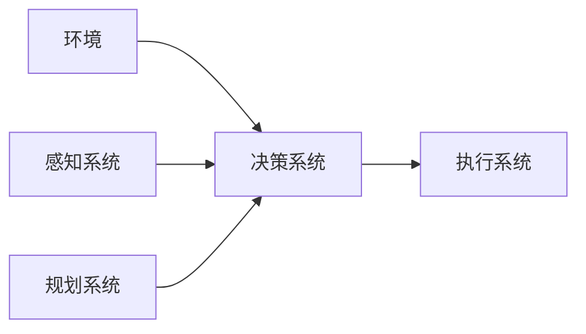
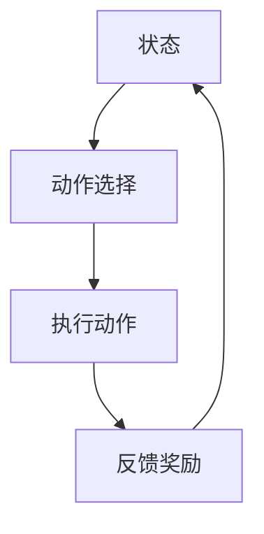
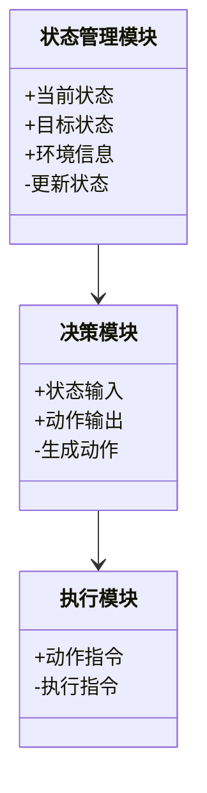

                 


# AI Agent在自动驾驶中的决策系统

> 关键词：AI Agent, 自动驾驶, 决策系统, 强化学习, 数学模型, 系统架构, 项目实战

> 摘要：本文系统地探讨了AI Agent在自动驾驶决策系统中的应用，分析了决策系统的算法原理、数学模型、系统架构，并通过具体项目实战展示了AI Agent在自动驾驶中的实际应用。文章内容涵盖自动驾驶的背景介绍、AI Agent的核心概念、决策算法的实现与优化、数学模型的建立与应用、系统架构的设计与实现、项目实战案例分析，以及决策系统的总结与扩展。

---

# 第一章: 自动驾驶中的AI Agent决策系统概述

## 1.1 自动驾驶的基本概念
### 1.1.1 自动驾驶的定义与分类
- 自动驾驶的定义：通过传感器、计算机视觉、人工智能等技术实现车辆的自动控制，减少或消除人类驾驶员的干预。
- 分类：根据自动化程度分为L0到L5六个级别（SAE J3016标准）。

### 1.1.2 自动驾驶的发展历程
- 早期阶段：20世纪50年代至80年代，初步的自动驾驶概念提出。
- 现代阶段：20世纪90年代至今，基于AI和传感器技术的快速发展。

### 1.1.3 自动驾驶的核心技术领域
- 传感器技术：激光雷达（LiDAR）、摄像头、雷达。
- 计算机视觉：目标检测、语义分割。
- 人工智能：决策系统、路径规划。

## 1.2 AI Agent的基本概念
### 1.2.1 AI Agent的定义
- AI Agent：智能体，能够在环境中感知状态并采取行动以实现目标的实体。
- AI Agent的特征：自主性、反应性、目标导向性。

### 1.2.2 AI Agent的核心特征
| 特征 | 描述 |
|------|------|
| 自主性 | 能够独立决策和行动，无需外部干预。 |
| 反应性 | 能够感知环境变化并实时调整行为。 |
| 目标导向性 | 以特定目标为导向，优化行动策略。 |

### 1.2.3 AI Agent与传统算法的区别
- 传统算法：基于规则或预定义的逻辑进行计算，不具备自主性和目标导向性。
- AI Agent：具备自主性、反应性和目标导向性，能够动态调整行为以适应环境变化。

## 1.3 自动驾驶中的AI Agent应用
### 1.3.1 AI Agent在自动驾驶中的作用
- 感知环境：通过传感器和计算机视觉技术感知周围环境。
- 决策控制：基于感知信息做出驾驶决策，如加速、减速、转向。
- 行为规划：规划车辆的路径和动作，确保安全和效率。

### 1.3.2 AI Agent与自动驾驶决策系统的结合
- 决策系统是自动驾驶的核心模块，负责处理感知数据并生成控制指令。
- AI Agent通过强化学习、深度学习等技术实现决策系统的优化和改进。

### 1.3.3 自动驾驶决策系统的典型应用场景
- 城市道路：复杂交通环境中的决策，如路口通行、超车、避让。
- 高速公路：长距离高速行驶中的决策，如车道保持、自动变道。
- 特殊场景：如恶劣天气（雨、雪、雾）下的决策优化。

## 1.4 本章小结
本章介绍了自动驾驶的基本概念、AI Agent的核心特征及其在自动驾驶中的应用。通过对比传统算法和AI Agent的区别，明确了AI Agent在自动驾驶决策系统中的重要性。

---

# 第二章: AI Agent决策系统的核心概念与联系

## 2.1 AI Agent决策系统的原理
### 2.1.1 决策系统的输入与输出
- 输入：环境感知数据（如障碍物位置、交通信号灯状态）。
- 输出：控制指令（如转向角度、加速度）。

### 2.1.2 决策系统的内部处理流程
1. **感知输入**：接收传感器数据。
2. **状态分析**：分析当前环境状态。
3. **决策制定**：基于状态信息生成决策。
4. **输出控制指令**：将决策结果输出到执行系统。

### 2.1.3 决策系统的输出结果解释
- 输出结果是车辆的控制指令，确保车辆安全、高效地行驶。

## 2.2 核心概念对比分析
### 2.2.1 决策系统与规划系统的对比
| 对比维度 | 决策系统 | 规划系统 |
|----------|----------|----------|
| 功能     | 确定目标 | 规划路径 |
| 输入     | 环境状态 | 决策结果 |
| 输出     | 控制指令 | 路径规划 |

### 2.2.2 决策系统与感知系统的对比
| 对比维度 | 决策系统 | 感知系统 |
|----------|----------|----------|
| 功能     | 制定决策 | 感知环境 |
| 输入     | 感知数据 | 传感器信号 |
| 输出     | 控制指令 | 环境信息 |

### 2.2.3 决策系统的边界与外延
- 决策系统的边界：感知系统提供输入，执行系统负责输出。
- 外延：决策系统依赖于感知和规划系统，但也可以独立优化决策策略。

## 2.3 实体关系图


## 2.4 本章小结
本章分析了AI Agent决策系统的核心概念，对比了决策系统与感知、规划系统的关系，并通过实体关系图展示了决策系统在自动驾驶中的位置。

---

# 第三章: AI Agent决策系统的算法原理

## 3.1 常见决策算法介绍
### 3.1.1 基于规则的决策算法
- **原理**：根据预定义的规则生成决策，如“前方有障碍物时减速”。
- **优缺点**：简单易实现，但难以应对复杂场景。

### 3.1.2 基于强化学习的决策算法
- **原理**：通过强化学习（如Q-learning）优化决策策略，以最大化累计奖励。
- **优缺点**：能够处理复杂场景，但需要大量的训练数据和计算资源。

### 3.1.3 基于模型的决策算法
- **原理**：基于环境模型（如马尔可夫决策过程）进行决策，考虑未来可能的状态。
- **优缺点**：适用于动态环境，但模型构建复杂。

## 3.2 算法原理分析
### 3.2.1 强化学习算法的工作流程


### 3.2.2 基于模型的决策算法的数学模型
$$ Q(s,a) = Q(s,a) + \alpha (r + \max Q(s',a') - Q(s,a)) $$

## 3.3 算法实现与优化
### 3.3.1 算法实现的步骤
1. 初始化Q值表。
2. 接收环境状态。
3. 选择动作（探索与利用）。
4. 执行动作并获得奖励。
5. 更新Q值表。

### 3.3.2 算法优化的关键点
- 增量式更新：避免一次性更新所有状态，减少计算量。
- 衰减学习率：随时间减小学习率，稳定算法收敛。

### 3.3.3 算法的评估指标
- 收益（Reward）：累计奖励的大小。
- 稳定性：算法在不同环境下的表现一致性。
- 响应时间：算法的决策速度。

## 3.4 本章小结
本章介绍了几种常见的决策算法，分析了强化学习算法的工作流程和数学模型，并讨论了算法实现的关键点和优化策略。

---

# 第四章: AI Agent决策系统的数学模型与公式

## 4.1 决策系统的数学模型
### 4.1.1 状态空间的定义
- 状态（State）：环境中的关键信息，如位置、速度、障碍物位置。
- 状态空间（State Space）：所有可能状态的集合。

### 4.1.2 动作空间的定义
- 动作（Action）：车辆可以执行的动作，如加速、减速、转向。
- 动作空间（Action Space）：所有可能动作的集合。

### 4.1.3 奖励函数的设计
- 奖励函数（Reward Function）：定义每种状态和动作的奖励值，指导算法优化目标。
  $$ r(s,a) = \begin{cases} 
  1 & \text{if } a \text{是安全动作} \\
  -1 & \text{否则}
  \end{cases} $$

## 4.2 常用数学公式
### 4.2.1 Q-learning算法的更新公式
$$ Q(s,a) = Q(s,a) + \alpha (r + \gamma \max Q(s',a') - Q(s,a)) $$

### 4.2.2 策略梯度算法的核心公式
$$ \nabla \theta \log \pi_\theta(a|s) \cdot Q(s,a) $$

## 4.3 本章小结
本章通过数学模型和公式详细阐述了决策系统的实现原理，包括状态空间、动作空间、奖励函数的设计，以及Q-learning算法的更新公式。

---

# 第五章: AI Agent决策系统的系统分析与架构设计

## 5.1 系统分析
### 5.1.1 问题场景介绍
- 自动驾驶车辆需要在复杂交通环境中做出决策。
- 决策系统需要处理多目标优化问题，如安全、效率、舒适性。

### 5.1.2 项目介绍
- 项目目标：设计一个高效的AI Agent决策系统，实现车辆在复杂环境中的自主决策。
- 项目范围：涵盖感知、决策、执行三个模块。

## 5.2 系统功能设计
### 5.2.1 领域模型（mermaid类图）


### 5.2.2 系统架构设计（mermaid架构图）


### 5.2.3 系统接口设计
- 状态管理模块接口：提供当前状态和环境信息。
- 决策模块接口：接收状态信息，输出动作指令。
- 执行模块接口：接收动作指令，执行车辆控制。

### 5.2.4 系统交互（mermaid序列图）
```mermaid
sequenceDiagram
参与者：决策系统
actor 决策系统
决策系统 -> 状态管理模块：获取当前状态
状态管理模块 --> 决策系统：返回状态信息
决策系统 -> 执行模块：生成动作指令
执行模块 --> 决策系统：确认执行
```

## 5.3 本章小结
本章通过系统分析和架构设计，详细阐述了AI Agent决策系统的实现框架，包括功能模块划分、系统架构设计和接口交互流程。

---

# 第六章: AI Agent决策系统的项目实战

## 6.1 项目环境配置
### 6.1.1 环境要求
- 操作系统：Linux（推荐）或Windows。
- 开发工具：Python、TensorFlow、Keras、OpenCV。
- 仿真平台：CARLA、Gazebo。

### 6.1.2 数据集准备
- 使用公开数据集（如Kitti、Bosch）进行训练和测试。

## 6.2 系统核心实现源代码
### 6.2.1 决策系统的代码实现
```python
import numpy as np
import gym

class DecisionSystem:
    def __init__(self, learning_rate=0.1, gamma=0.9):
        self.q_table = {}  # Q值表
        self.learning_rate = learning_rate
        self.gamma = gamma

    def get_action(self, state):
        if state not in self.q_table:
            self.q_table[state] = 0
        # 探索与利用策略
        if np.random.random() < 0.1:  # 探索概率
            return np.random.randint(0, 3)  # 动作空间：0、1、2
        else:
            return np.argmax(self.q_table[state])

    def update_q_table(self, state, action, reward, next_state):
        current_q = self.q_table.get(state, 0)
        next_max_q = np.max([self.q_table.get(next_state, 0)])
        self.q_table[state] = current_q + self.learning_rate * (reward + self.gamma * next_max_q - current_q)
```

### 6.2.2 代码应用解读与分析
- **初始化**：初始化Q值表和超参数。
- **决策选择**：基于探索与利用策略选择动作。
- **Q值更新**：根据当前状态、动作、奖励和下一步状态更新Q值表。

### 6.2.3 代码实现的关键点
- 探索与利用策略：平衡探索新动作和利用已知动作。
- Q值更新公式：$$ Q(s,a) = Q(s,a) + \alpha (r + \gamma \max Q(s',a') - Q(s,a)) $$

## 6.3 项目实战案例分析
### 6.3.1 案例背景
- 在CARLA仿真平台上实现基于深度强化学习的决策系统。

### 6.3.2 案例分析
- 训练过程：通过强化学习算法优化决策策略。
- 测试结果：在复杂交通场景中实现安全、高效的决策。

### 6.3.3 实验结果与分析
- 成功实现车辆在复杂环境中的自主决策。
- 算法收敛速度和决策准确率的对比分析。

## 6.4 本章小结
本章通过项目实战展示了AI Agent决策系统的实现过程，包括环境配置、代码实现和案例分析，验证了决策系统的有效性和可行性。

---

# 第七章: 总结与扩展

## 7.1 最佳实践 tips
- **算法选择**：根据具体场景选择合适的算法，如强化学习适用于动态环境。
- **数据处理**：确保数据的完整性和准确性，优化算法性能。
- **系统优化**：通过并行计算、模型压缩等技术优化系统性能。

## 7.2 小结
本文系统地探讨了AI Agent在自动驾驶中的决策系统，分析了决策系统的算法原理、数学模型、系统架构，并通过具体项目实战展示了AI Agent在自动驾驶中的实际应用。

## 7.3 注意事项
- 确保决策系统的安全性，避免算法漏洞导致的安全事故。
- 定期更新算法模型，适应环境变化和新场景需求。

## 7.4 拓展阅读
- 《强化学习：算法与应用》
- 《自动驾驶技术：从基础到实践》
- 《AI Agent与智能系统设计》

---

# 作者：AI天才研究院/AI Genius Institute & 禅与计算机程序设计艺术 /Zen And The Art of Computer Programming

