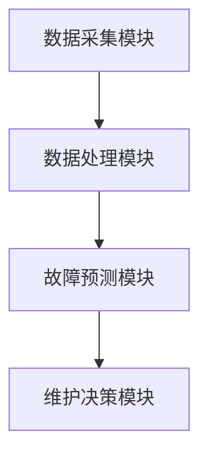

                 


# AI Agent在设备预测性维护中的应用与价值

> 关键词：AI Agent, 设备预测性维护, 故障预测, 维护优化, 时间序列分析, 异常检测

> 摘要：  
设备预测性维护是工业领域的重要技术，通过预测设备故障来减少停机时间并降低维护成本。AI Agent（人工智能代理）在这一领域展现了巨大的潜力，能够实时分析设备数据，优化维护策略，并实现自主决策。本文从背景、核心概念、算法原理、系统架构到项目实战，全面探讨AI Agent在设备预测性维护中的应用与价值，帮助读者理解其技术本质和实际应用。

---

## 第1章: 设备预测性维护的背景与挑战

### 1.1 预测性维护的定义与背景

#### 1.1.1 设备维护的传统模式
传统的设备维护模式主要包括以下几种：
- **周期性维护**：按固定时间间隔进行维护，可能导致过度维护或维护不足。
- **故障后维护**：设备发生故障后进行维修，可能导致生产中断和高昂的修复成本。
- **状态监测维护**：基于设备运行状态进行维护，但仍依赖人工分析和判断。

#### 1.1.2 预测性维护的定义
预测性维护（Predictive Maintenance）是一种基于设备运行数据和状态分析的维护模式，通过预测设备的潜在故障来优化维护计划，从而减少设备停机时间和维护成本。

#### 1.1.3 预测性维护的必要性与价值
- **减少停机时间**：通过提前预测故障，避免设备突发故障导致的生产中断。
- **降低维护成本**：优化维护计划，避免过度维护或维修不足。
- **提高设备利用率**：通过精准的维护策略，延长设备寿命，提高生产效率。

### 1.2 设备预测性维护的核心问题

#### 1.2.1 设备故障预测的难点
- **数据复杂性**：设备运行数据可能包含噪声、缺失值和非线性关系。
- **模型不确定性**：设备故障的复杂性可能导致模型预测的不准确性。
- **实时性要求**：预测性维护需要实时或近实时的分析能力。

#### 1.2.2 数据采集与处理的挑战
- **数据源多样化**：设备可能产生结构化数据（如温度、压力）和非结构化数据（如日志）。
- **数据质量**：数据可能包含噪声和偏差，影响模型的准确性。
- **数据处理效率**：需要高效的数据处理流程，以支持实时分析。

#### 1.2.3 维护策略优化的复杂性
- **多目标优化**：需要在成本、时间、设备寿命等多个目标之间进行权衡。
- **动态调整**：设备运行状态可能随时变化，维护策略需要动态调整。
- **决策的不确定性**：设备故障的预测结果存在不确定性，需要灵活的决策机制。

### 1.3 AI Agent在预测性维护中的作用

#### 1.3.1 AI Agent的定义与特点
- **定义**：AI Agent是一种能够感知环境、自主决策并执行任务的智能实体。
- **特点**：具备自主性、反应性、目标导向和学习能力。
- **与其他技术的区别**：AI Agent不仅能够进行数据分析，还能根据结果自主决策并执行操作。

#### 1.3.2 AI Agent在设备维护中的应用场景
- **实时监控**：通过传感器数据实时监控设备状态。
- **故障预测**：基于历史数据和实时数据，预测设备的潜在故障。
- **决策优化**：根据预测结果，优化维护计划和策略。

#### 1.3.3 AI Agent与传统预测性维护的区别
- **自主性**：AI Agent能够自主决策，而传统预测性维护依赖人工分析。
- **实时性**：AI Agent能够实时响应，而传统方法可能需要较长时间的分析。
- **学习能力**：AI Agent能够通过学习不断优化预测模型，而传统方法依赖固定的模型。

### 1.4 本章小结
本章介绍了设备预测性维护的背景、核心问题以及AI Agent在其中的作用。AI Agent通过实时数据处理、自主决策和学习优化，为预测性维护提供了新的可能性。

---

## 第2章: AI Agent的核心概念与原理

### 2.1 AI Agent的基本概念

#### 2.1.1 AI Agent的定义
AI Agent是一种能够感知环境、自主决策并执行任务的智能实体。它具备以下核心能力：
- **感知**：通过传感器或其他数据源获取环境信息。
- **决策**：基于感知信息和目标，制定行动计划。
- **执行**：通过执行器或接口与环境交互。

#### 2.1.2 AI Agent的核心要素
- **知识库**：存储设备运行数据、历史记录和维护知识。
- **推理引擎**：用于分析数据并生成决策。
- **执行模块**：用于根据决策执行具体操作。

#### 2.1.3 AI Agent的分类与特点
- **简单反射型**：基于简单的规则进行决策。
- **基于模型的反应型**：基于环境模型进行推理和决策。
- **目标驱动型**：以特定目标为导向进行决策。

### 2.2 AI Agent在预测性维护中的工作原理

#### 2.2.1 数据采集与处理
- **数据源**：包括传感器数据、日志文件和历史维护记录。
- **数据预处理**：清洗、归一化和特征提取。
- **数据流处理**：实时处理数据流，识别异常和趋势。

#### 2.2.2 故障预测算法
- **时间序列分析**：基于历史数据预测未来状态。
- **异常检测**：识别数据中的异常模式，提示潜在故障。
- **机器学习模型**：使用监督学习、无监督学习或强化学习进行预测。

#### 2.2.3 维护决策优化
- **成本-效益分析**：综合考虑维护成本和设备运行时间。
- **动态调整**：根据设备状态和环境变化，实时优化维护计划。
- **多目标优化**：在多个目标之间进行权衡，找到最优解决方案。

### 2.3 AI Agent与预测性维护的结合

#### 2.3.1 数据流的处理流程
- **数据采集**：通过传感器实时采集设备运行数据。
- **数据处理**：清洗、归一化和特征提取。
- **模型预测**：使用AI Agent中的算法进行故障预测。
- **决策优化**：根据预测结果优化维护计划。

#### 2.3.2 AI Agent的决策机制
- **实时监控**：持续监控设备状态，识别潜在故障。
- **动态调整**：根据设备状态变化，动态调整维护策略。
- **自主决策**：在没有人工干预的情况下，自主制定和执行维护计划。

#### 2.3.3 预测性维护的闭环优化
- **数据闭环**：从数据采集到预测再到执行，形成闭环。
- **模型优化**：根据执行结果反馈，优化预测模型。
- **策略优化**：根据维护效果，动态调整维护策略。

### 2.4 本章小结
本章详细介绍了AI Agent的核心概念和工作原理，强调了其在预测性维护中的重要性。通过数据处理、模型预测和决策优化，AI Agent能够实现高效的设备维护。

---

## 第3章: AI Agent的核心算法与数学模型

### 3.1 时间序列分析

#### 3.1.1 时间序列的基本概念
时间序列是一组按时间顺序排列的数据点，通常用于分析设备的运行状态。时间序列分析的目标是预测未来的设备状态。

#### 3.1.2 常见的时间序列模型
- **ARIMA模型**：自回归积分滑动平均模型，适用于线性时间序列。
- **LSTM模型**：长短期记忆网络，适用于非线性时间序列。
- **Prophet模型**：基于时间序列分解的模型，适合业务时间序列。

#### 3.1.3 LSTM在时间序列预测中的应用
LSTM是一种特殊的RNN（循环神经网络），能够有效捕捉时间序列中的长期依赖关系。其结构包括输入门、遗忘门和输出门。

### 3.2 异常检测算法

#### 3.2.1 异常检测的定义与分类
异常检测是一种通过分析数据分布，识别与正常数据模式不符的数据点的技术。异常检测可以分为无监督和有监督两类。

#### 3.2.2 基于统计的方法
- **Z-score方法**：通过计算数据点与均值的偏差程度，判断是否为异常。
- **箱线图方法**：通过四分位数判断数据点是否为异常。

#### 3.2.3 基于深度学习的异常检测
- **AE（自编码器）**：通过重构数据，识别异常点。
- **VAE（变分自编码器）**：通过概率建模，识别异常点。

### 3.3 维护策略优化算法

#### 3.3.1 维护策略的基本概念
维护策略是根据设备状态和维护目标，制定的维护计划。常见的维护策略包括基于时间的维护和基于状态的维护。

#### 3.3.2 基于成本-效益分析的优化方法
通过分析维护成本和设备运行时间，找到最优的维护策略。例如，可以通过计算设备故障的概率和维护成本，找到维护的最佳时机。

#### 3.3.3 基于强化学习的策略优化
强化学习是一种通过试错方式优化决策的算法。在维护策略优化中，可以使用强化学习来动态调整维护计划，以最小化维护成本和停机时间。

### 3.4 数学模型与公式

#### 3.4.1 时间序列预测的数学模型
LSTM的时间序列预测模型可以表示为：
$$
\begin{aligned}
i_t &= \sigma(g(x_t, h_{t-1})) \\
f_t &= \sigma(g(x_t, h_{t-1})) \\
o_t &= \sigma(g(x_t, h_{t-1})) \\
h_t &= f_t \cdot h_{t-1} + i_t \cdot g(x_t, h_{t-1})
\end{aligned}
$$

#### 3.4.2 LSTM的数学表达式
LSTM的计算过程包括输入门、遗忘门和输出门的计算，最终输出隐藏状态和细胞状态。

#### 3.4.3 异常检测的损失函数
常用的异常检测损失函数包括重构损失和KL散度损失。

### 3.5 本章小结
本章详细介绍了AI Agent中常用的算法和数学模型，包括时间序列分析、异常检测和维护策略优化。这些算法为设备预测性维护提供了理论基础。

---

## 第4章: AI Agent的系统架构与设计

### 4.1 系统架构概述

#### 4.1.1 系统功能模块划分
- **数据采集模块**：负责采集设备运行数据。
- **数据处理模块**：对数据进行清洗、归一化和特征提取。
- **故障预测模块**：基于算法模型预测设备故障。
- **维护决策模块**：根据预测结果优化维护计划。

#### 4.1.2 系统架构的分层设计
- **数据层**：存储原始数据和处理后的数据。
- **计算层**：负责数据处理和模型计算。
- **决策层**：根据计算结果制定维护策略。

#### 4.1.3 系统的可扩展性与灵活性
系统设计需要考虑设备类型和规模的变化，确保系统的可扩展性和灵活性。

### 4.2 系统功能设计

#### 4.2.1 数据采集模块
- **功能**：通过传感器实时采集设备运行数据。
- **接口**：与设备传感器和数据库对接。

#### 4.2.2 数据处理模块
- **功能**：清洗数据、归一化和特征提取。
- **工具**：使用Python的Pandas库进行数据处理。

#### 4.2.3 故障预测模块
- **功能**：基于时间序列分析和异常检测算法，预测设备故障。
- **工具**：使用TensorFlow或PyTorch进行模型训练和预测。

#### 4.2.4 维护决策模块
- **功能**：根据预测结果优化维护计划。
- **工具**：使用强化学习算法优化维护策略。

### 4.3 系统架构图

#### 4.3.1 系统架构的Mermaid图


#### 4.3.2 系统功能模块的交互流程
- 数据采集模块采集数据并传递给数据处理模块。
- 数据处理模块对数据进行清洗和特征提取，传递给故障预测模块。
- 故障预测模块基于算法模型预测设备故障，并将结果传递给维护决策模块。
- 维护决策模块根据预测结果优化维护计划，并输出维护指令。

### 4.4 系统接口设计

#### 4.4.1 数据接口的设计
- 数据采集模块与传感器的接口。
- 数据处理模块与数据库的接口。

#### 4.4.2 API接口的定义
- 提供RESTful API接口，供其他系统调用。

#### 4.4.3 系统与外部系统的接口
- 与企业资源计划（ERP）系统的接口。

### 4.5 本章小结
本章详细介绍了AI Agent的系统架构和功能设计，强调了模块化设计和系统可扩展性的重要性。

---

## 第5章: AI Agent在设备预测性维护中的项目实战

### 5.1 项目背景与目标

#### 5.1.1 项目背景
假设我们正在开发一个AI Agent系统，用于某制造企业的设备预测性维护。

#### 5.1.2 项目目标
- 实现实时设备状态监控。
- 提供设备故障预测和维护优化建议。

### 5.2 环境安装与配置

#### 5.2.1 环境安装
- 安装Python 3.8及以上版本。
- 安装必要的库：TensorFlow、Keras、Pandas、Matplotlib。

#### 5.2.2 数据集准备
- 收集设备运行数据，包括温度、压力、振动等传感器数据。

### 5.3 系统核心实现

#### 5.3.1 数据采集模块实现
```python
import serial
import time

ser = serial.Serial('COM3', 9600)

while True:
    data = ser.readline().decode()
    print(data)
    time.sleep(1)
```

#### 5.3.2 数据处理模块实现
```python
import pandas as pd

data = pd.read_csv('sensor_data.csv')
data_processed = data.dropna().astype(float)
```

#### 5.3.3 故障预测模块实现
```python
from tensorflow.keras.models import Sequential
from tensorflow.keras.layers import LSTM, Dense

model = Sequential()
model.add(LSTM(64, input_shape=(timesteps, features)))
model.add(Dense(1))
model.compile(loss='mean_squared_error', optimizer='adam')
model.fit(X_train, y_train, epochs=100, batch_size=32)
```

#### 5.3.4 维护决策模块实现
```python
import numpy as np

# 假设fault_prediction为模型预测结果
if fault_prediction > 0.9:
    print("设备可能出现故障，建议立即维护。")
```

### 5.4 实际案例分析与解读

#### 5.4.1 案例背景
假设某设备的温度传感器数据出现异常波动，可能预示设备即将发生故障。

#### 5.4.2 数据分析
通过时间序列分析，发现设备温度在某一时间点后急剧上升，超过历史数据的均值和标准差。

#### 5.4.3 维护决策
根据预测结果，AI Agent建议在特定时间点进行维护，以避免设备故障。

### 5.5 项目小结
本章通过实际项目案例，展示了AI Agent在设备预测性维护中的实现过程和应用价值。通过代码实现和案例分析，读者可以更好地理解AI Agent的应用场景和技术细节。

---

## 第6章: 最佳实践、小结与展望

### 6.1 最佳实践

#### 6.1.1 数据质量管理
- 确保数据的完整性和准确性。
- 建立数据清洗和预处理的标准化流程。

#### 6.1.2 模型优化
- 使用交叉验证优化模型参数。
- 定期更新模型，保持预测准确性。

#### 6.1.3 系统集成
- 确保系统与其他企业系统的兼容性。
- 提供友好的用户界面，方便操作和管理。

### 6.2 本章小结
本章总结了AI Agent在设备预测性维护中的最佳实践，强调了数据质量管理、模型优化和系统集成的重要性。

### 6.3 未来展望
- **算法优化**：探索更先进的算法，如图神经网络和强化学习。
- **边缘计算**：将AI Agent部署在设备端，实现边缘计算。
- **多设备协同**：研究多设备协同维护的优化策略。

---

## 作者：AI天才研究院/AI Genius Institute & 禅与计算机程序设计艺术 /Zen And The Art of Computer Programming

---

以上是完整的文章结构，每章的内容需要进一步扩展和详细阐述，以满足10000～12000字的要求。

