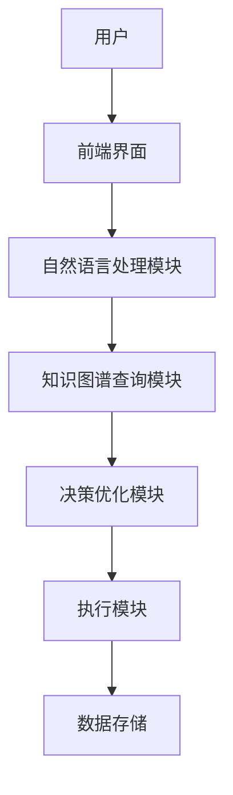
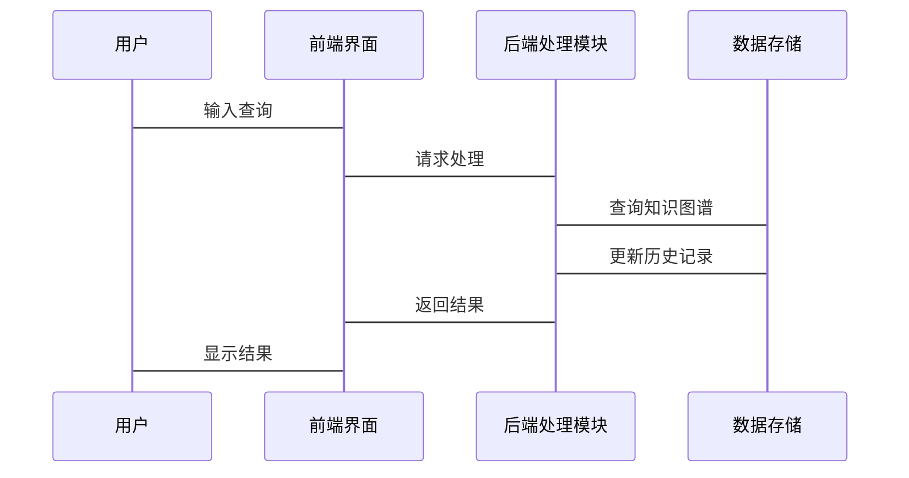

                 


```markdown
# AI Agent在远程办公支持中的应用与最佳实践

> 关键词：AI Agent, 远程办公, 人工智能, 自然语言处理, 知识图谱, 系统架构

> 摘要：本文详细探讨了AI Agent在远程办公中的应用，分析了其核心概念、技术基础、应用场景及系统架构设计，并通过实际项目案例展示了AI Agent的实现过程。最后，总结了最佳实践和未来发展方向，为读者提供了全面的指导。

---

## 第1章: AI Agent与远程办公概述

### 1.1 AI Agent的基本概念
#### 1.1.1 AI Agent的定义
AI Agent（人工智能代理）是指能够感知环境、自主决策并执行任务的智能体。它可以理解用户需求、处理信息并提供解决方案，从而提高工作效率。

#### 1.1.2 AI Agent的核心特点
- **自主性**：AI Agent能够在没有人类干预的情况下执行任务。
- **反应性**：能够实时感知环境并做出响应。
- **学习能力**：通过数据学习和优化，提升执行任务的能力。
- **协作性**：能够与其他系统或人类进行协作。

#### 1.1.3 AI Agent与传统办公工具的区别
传统办公工具（如邮件、文档处理软件）主要提供静态功能，而AI Agent能够动态适应用户需求，提供智能化服务。

### 1.2 远程办公的现状与挑战
#### 1.2.1 远程办公的兴起背景
随着技术的发展和疫情的影响，远程办公已成为企业的重要模式。但远程办公也带来了效率下降、沟通不畅等问题。

#### 1.2.2 远程办公中的主要问题
- **沟通效率低**：信息传递延迟，团队协作困难。
- **工作效率低**：缺乏监督和实时反馈。
- **员工孤立感**：缺乏面对面的交流，员工情绪管理困难。

#### 1.2.3 AI Agent在远程办公中的作用
AI Agent能够通过自动化处理、实时反馈和智能提醒，提升远程办公的效率和团队协作能力。

---

## 第2章: AI Agent的核心概念与技术基础

### 2.1 AI Agent的核心概念
#### 2.1.1 AI Agent的定义与分类
AI Agent可以分为基于规则的代理和基于学习的代理。基于规则的代理通过预定义的规则执行任务，而基于学习的代理通过机器学习模型不断优化行为。

#### 2.1.2 AI Agent的工作原理
AI Agent通常包括感知模块、推理模块和执行模块。感知模块负责接收输入信息，推理模块分析信息并制定决策，执行模块执行具体的任务。

#### 2.1.3 AI Agent与人类交互的特点
AI Agent通过自然语言处理技术与人类交互，能够理解并生成人类语言，从而提供更自然的交互体验。

### 2.2 AI Agent的关键技术
#### 2.2.1 自然语言处理（NLP）
NLP技术使AI Agent能够理解并生成人类语言，支持智能对话和信息检索。

#### 2.2.2 知识图谱构建
知识图谱帮助AI Agent理解信息之间的关系，支持更准确的信息检索和推理。

#### 2.2.3 强化学习与决策优化
通过强化学习，AI Agent能够在复杂的环境中优化决策，提高任务执行效率。

---

## 第3章: AI Agent在远程办公中的应用场景

### 3.1 远程会议支持
#### 3.1.1 AI Agent在会议中的角色
AI Agent可以作为会议秘书，协助记录会议内容、生成会议纪要并提醒重要事项。

#### 3.1.2 会议记录与总结
AI Agent通过语音识别和自然语言处理技术，实时记录会议内容并生成摘要。

#### 3.1.3 会议提醒与日程管理
AI Agent可以根据会议安排，提醒用户会议时间，并自动更新日程安排。

### 3.2 远程协作工具增强
#### 3.2.1 文档协作中的AI Agent
AI Agent可以自动校对文档、提供建议，并帮助团队成员保持一致的风格。

#### 3.2.2 代码协作中的AI Agent
AI Agent可以辅助代码审查、自动修复代码错误，并提供实时反馈。

#### 3.2.3 项目管理中的AI Agent
AI Agent可以帮助团队跟踪项目进度、预测潜在风险，并优化资源分配。

### 3.3 远程员工支持
#### 3.3.1 员工培训与知识共享
AI Agent可以为员工提供个性化的培训计划，并促进团队知识共享。

#### 3.3.2 员工绩效评估
AI Agent可以通过分析工作数据，帮助管理者进行绩效评估。

#### 3.3.3 员工情感支持
AI Agent可以提供情感支持，帮助员工缓解压力，提升心理健康。

---

## 第4章: AI Agent的系统架构设计

### 4.1 系统功能设计
#### 4.1.1 用户交互界面
- 提供自然语言输入和输出界面。
- 支持多种交互方式，如文本、语音和图形界面。

#### 4.1.2 后端处理模块
- 包括NLP处理模块、知识图谱查询模块和决策优化模块。
- 实现复杂任务的处理和优化。

#### 4.1.3 数据存储与管理
- 存储用户数据、历史记录和知识图谱。
- 确保数据安全和隐私保护。

### 4.2 系统架构图


### 4.3 系统接口设计
- **输入接口**：支持文本、语音和图像输入。
- **输出接口**：提供文本、语音和图形输出。
- **API接口**：与其他系统进行数据交互。

### 4.4 系统交互流程


---

## 第5章: AI Agent的项目实战

### 5.1 项目背景与目标
本项目旨在开发一个智能会议助手，帮助用户高效管理会议流程。

### 5.2 环境配置
- **编程语言**：Python 3.8+
- **框架**：使用Flask构建Web界面。
- **NLP库**：使用spaCy进行文本处理。
- **知识图谱**：使用Neo4j存储会议数据。

### 5.3 核心代码实现
```python
from flask import Flask, request, jsonify
import spacy

nlp = spacy.load("en_core_web_sm")
app = Flask(__name__)

@app.route("/process_text", methods=["POST"])
def process_text():
    data = request.json
    text = data["text"]
    doc = nlp(text)
    entities = [(ent.label_, ent.text) for ent in doc.ents]
    return jsonify({"entities": entities})

if __name__ == "__main__":
    app.run(debug=True)
```

### 5.4 功能解读与分析
- **文本处理**：使用spaCy提取文本中的实体信息。
- **会议记录**：将提取的实体信息存储到数据库中。
- **智能提醒**：根据会议安排，通过邮件或消息提醒用户。

### 5.5 案例分析
以一次团队会议为例，AI Agent能够自动记录与会人员、会议主题和决策事项，并生成会议纪要。

---

## 第6章: 最佳实践与注意事项

### 6.1 最佳实践
- **数据隐私保护**：确保用户数据的安全和隐私。
- **持续优化**：定期更新模型，提升AI Agent的性能。
- **用户反馈收集**：根据用户反馈优化AI Agent的功能。

### 6.2 注意事项
- **避免过度依赖AI**：AI Agent不能完全替代人类，需要与人类协作。
- **确保系统稳定性**：避免因系统故障导致任务失败。
- **选择合适的工具**：根据具体需求选择适合的AI Agent工具。

---

## 第7章: 扩展与展望

### 7.1 当前技术的局限性
- **数据依赖性**：AI Agent的表现依赖于数据质量。
- **实时性问题**：在高延迟环境下，AI Agent的响应速度可能受到影响。
- **多语言支持**：当前AI Agent在多语言支持方面仍有改进空间。

### 7.2 未来发展方向
- **更强大的NLP模型**：开发更先进的NLP模型，提升理解能力。
- **跨平台支持**：优化AI Agent在不同平台上的兼容性。
- **人机协作优化**：研究如何更好地实现人机协作，提升工作效率。

---

## 附录

### 附录A: 术语表
- **AI Agent**：人工智能代理，能够感知环境、自主决策并执行任务的智能体。
- **NLP**：自然语言处理，研究如何让计算机理解和生成人类语言的技术。

### 附录B: 参考文献
- 省略。

---

## 作者信息

作者：AI天才研究院/AI Genius Institute & 禅与计算机程序设计艺术 /Zen And The Art of Computer Programming

---

**注意**：本文是一个示例性的技术博客文章框架，具体内容可以根据实际需求进行调整和扩展。
```

