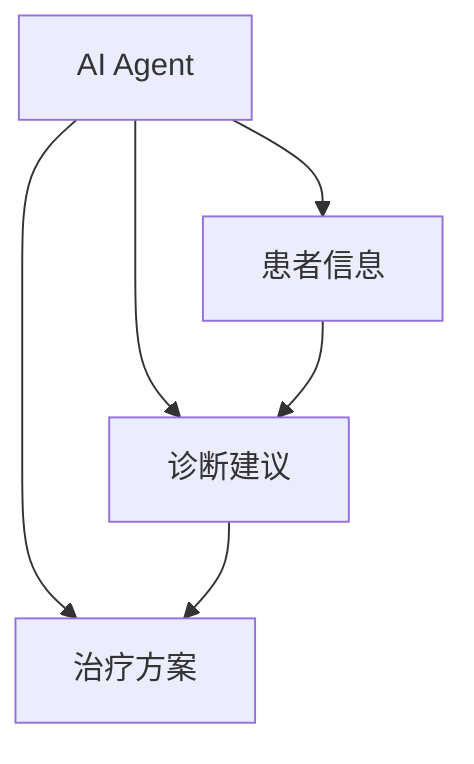
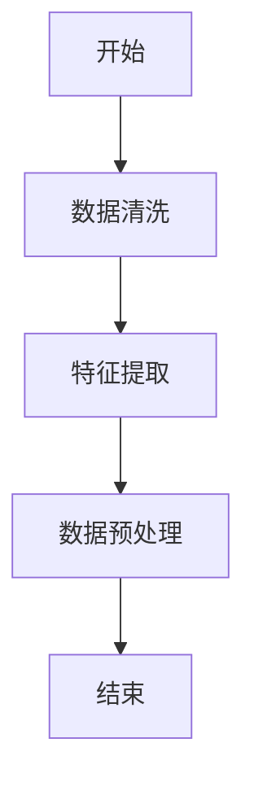
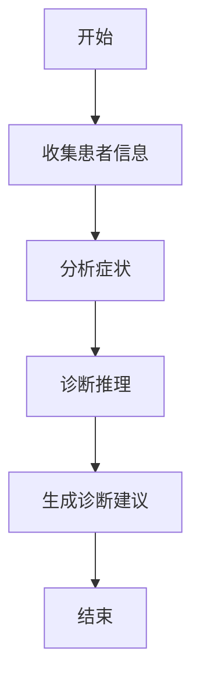

                 


# AI Agent在远程医疗中的应用：初步诊断与治疗建议

---

## 关键词：AI Agent, 远程医疗, 初步诊断, 治疗建议, 人工智能, 医疗技术

---

## 摘要：  
本文探讨了AI Agent在远程医疗中的应用，重点分析了AI Agent在远程医疗中的核心概念、算法原理、系统架构以及实际应用案例。通过详细的技术分析和实例解读，展示了AI Agent如何通过信息处理、诊断推理和治疗建议生成等流程，为远程医疗提供高效、精准的解决方案。文章还结合了实际项目，提供了从环境搭建到代码实现的完整技术路线，并提出了最佳实践和未来发展方向的建议。

---

## 第一部分: AI Agent在远程医疗中的应用概述

### 第1章: AI Agent与远程医疗的背景介绍

#### 1.1 AI Agent的基本概念

##### 1.1.1 AI Agent的定义  
AI Agent（人工智能代理）是指能够感知环境、自主决策并执行任务的智能实体。它能够通过数据输入、信息处理和决策输出，帮助用户完成特定任务。  

##### 1.1.2 AI Agent的核心特征  
AI Agent具有以下核心特征：  
1. **自主性**：能够自主决策，无需外部干预。  
2. **反应性**：能够实时感知环境并做出响应。  
3. **学习能力**：能够通过数据不断优化自身的决策能力。  
4. **交互性**：能够与用户或其他系统进行交互。  

##### 1.1.3 AI Agent与传统医疗的区别  
AI Agent与传统医疗的主要区别在于其智能化和自动化能力。AI Agent能够通过数据分析和机器学习算法，提供个性化的诊断和治疗建议，而传统医疗则依赖于医生的主观判断和经验。

#### 1.2 远程医疗的发展现状

##### 1.2.1 远程医疗的定义  
远程医疗是指通过通信技术，实现患者与医生之间的远程诊疗过程，包括病情咨询、诊断建议和治疗方案的制定。  

##### 1.2.2 远程医疗的主要应用场景  
远程医疗的主要应用场景包括：  
1. **偏远地区医疗资源匮乏**：通过远程医疗，患者可以方便地获得优质医疗资源。  
2. **紧急情况下的快速诊断**：在紧急情况下，远程医疗能够快速提供诊断建议，节省时间。  
3. **慢性病管理**：通过远程监测和管理，帮助患者更好地控制病情。  

##### 1.2.3 远程医疗的技术挑战  
远程医疗面临的主要技术挑战包括：  
1. **数据隐私与安全**：患者数据的隐私保护是远程医疗的核心问题。  
2. **通信延迟**：在偏远地区，网络延迟可能影响诊断的实时性。  
3. **诊断准确性**：远程诊断的准确性依赖于数据的完整性和算法的准确性。  

#### 1.3 AI Agent在远程医疗中的结合点

##### 1.3.1 AI Agent在远程医疗中的作用  
AI Agent在远程医疗中的作用主要体现在以下几个方面：  
1. **信息收集与处理**：AI Agent能够通过多种数据源（如传感器、电子健康记录等）收集患者信息，并进行整合和分析。  
2. **诊断推理**：通过机器学习算法，AI Agent能够对患者的症状、病史和检查结果进行诊断推理，提供初步诊断建议。  
3. **治疗建议生成**：AI Agent能够基于诊断结果和患者的个体化情况，生成个性化的治疗方案。  

##### 1.3.2 AI Agent与远程医疗的协同效应  
AI Agent与远程医疗的协同效应主要体现在以下几点：  
1. **提高诊断效率**：AI Agent能够快速处理大量数据，缩短诊断时间。  
2. **增强诊断准确性**：通过机器学习算法，AI Agent能够提高诊断的准确性。  
3. **优化治疗方案**：AI Agent能够根据患者的个体情况，提供个性化的治疗建议。  

##### 1.3.3 AI Agent在远程医疗中的潜在价值  
AI Agent在远程医疗中的潜在价值包括：  
1. **降低医疗成本**：通过自动化和智能化的诊疗流程，减少医疗资源的浪费。  
2. **提高医疗服务的可及性**：通过远程医疗，让更多患者能够获得优质医疗服务。  
3. **推动医疗技术创新**：AI Agent的应用将推动医疗技术的不断创新，提升医疗服务的整体水平。  

#### 1.4 本章小结  
本章主要介绍了AI Agent和远程医疗的基本概念、发展现状以及它们的结合点。通过分析AI Agent在远程医疗中的作用和协同效应，我们能够更好地理解AI Agent在远程医疗中的重要性。

---

### 第2章: AI Agent与远程医疗的核心概念与联系

#### 2.1 AI Agent的核心原理

##### 2.1.1 AI Agent的信息处理机制  
AI Agent的信息处理机制包括以下几个步骤：  
1. **数据收集**：通过传感器、数据库等获取患者的相关信息。  
2. **数据预处理**：对收集到的数据进行清洗、标准化和特征提取。  
3. **信息分析**：通过机器学习算法对数据进行分析，提取有用的信息。  
4. **决策生成**：根据分析结果，生成相应的诊断建议或治疗方案。  

##### 2.1.2 AI Agent的决策模型  
AI Agent的决策模型主要包括以下几种类型：  
1. **基于规则的决策模型**：通过预定义的规则进行决策。  
2. **基于机器学习的决策模型**：通过训练模型进行预测和决策。  
3. **基于知识图谱的决策模型**：通过知识图谱进行推理和决策。  

##### 2.1.3 AI Agent的学习与优化  
AI Agent的学习与优化主要包括以下内容：  
1. **监督学习**：通过标注数据进行训练，优化模型的预测能力。  
2. **无监督学习**：通过聚类、降维等技术，发现数据中的潜在规律。  
3. **强化学习**：通过与环境的交互，逐步优化决策策略。  

#### 2.2 远程医疗的核心要素

##### 2.2.1 远程医疗的患者信息管理  
远程医疗的患者信息管理包括：  
1. **患者数据的采集与存储**：通过传感器、电子健康记录等采集患者数据，并存储在云端或本地数据库中。  
2. **患者数据的隐私保护**：通过加密、访问控制等技术，保护患者数据的隐私和安全。  

##### 2.2.2 远程医疗的诊断流程  
远程医疗的诊断流程主要包括：  
1. **症状分析**：根据患者的症状描述，进行初步的疾病筛查。  
2. **病史分析**：结合患者的病史和用药记录，进一步 narrowing down 可能的疾病。  
3. **检查建议**：根据分析结果，建议患者进行进一步的检查。  

##### 2.2.3 远程医疗的治疗建议生成  
远程医疗的治疗建议生成主要包括：  
1. **治疗方案推荐**：根据诊断结果，推荐合适的治疗方案。  
2. **用药建议**：根据患者的病情和药物过敏史，推荐合适的药物和剂量。  
3. **随访计划**：根据治疗方案，制定患者的随访计划。  

#### 2.3 AI Agent与远程医疗的实体关系图

##### 2.3.1 实体关系图  
以下是一个简单的实体关系图，展示了AI Agent与远程医疗之间的关系：  


#### 2.4 本章小结  
本章主要介绍了AI Agent的核心原理和远程医疗的核心要素，并通过实体关系图展示了AI Agent与远程医疗之间的联系。

---

### 第3章: AI Agent在远程医疗中的算法原理

#### 3.1 AI Agent的核心算法

##### 3.1.1 信息收集与处理算法  
信息收集与处理算法主要包括数据清洗、特征提取和数据预处理等步骤。以下是一个简单的数据清洗流程图：  


##### 3.1.2 诊断推理算法  
诊断推理算法主要包括以下几种类型：  
1. **基于规则的诊断推理**：通过预定义的规则进行疾病诊断。  
2. **基于机器学习的诊断推理**：通过训练模型进行疾病预测。  
3. **基于知识图谱的诊断推理**：通过知识图谱进行疾病推理。  

##### 3.1.3 治疗建议生成算法  
治疗建议生成算法主要包括以下几种类型：  
1. **基于规则的治疗建议生成**：通过预定义的规则生成治疗方案。  
2. **基于机器学习的治疗建议生成**：通过训练模型生成治疗方案。  
3. **基于知识图谱的治疗建议生成**：通过知识图谱生成治疗方案。  

#### 3.2 算法流程图

##### 3.2.1 算法流程图  
以下是一个AI Agent的诊断推理流程图：  


##### 3.2.2 诊断推理的数学模型  
诊断推理的数学模型可以表示为一个分类问题，如下所示：  
$$ y = f(x) $$  
其中，\( x \) 是患者的症状和病史，\( y \) 是诊断结果，\( f \) 是分类模型。

#### 3.3 项目实战

##### 3.3.1 项目环境搭建  
以下是一个简单的项目环境搭建步骤：  
1. 安装Python和必要的库（如TensorFlow、Keras等）。  
2. 安装远程医疗相关的软件（如远程医疗平台、数据库等）。  
3. 配置网络环境，确保数据可以实时传输和处理。  

##### 3.3.2 核心代码实现  
以下是一个简单的诊断推理代码示例：  
```python
import numpy as np
from sklearn import tree

# 数据准备
X = np.array([[40, 1], [50, 0], [60, 1], [70, 0]])
y = np.array([0, 1, 2, 3])

# 训练决策树模型
clf = tree.DecisionTreeClassifier()
clf = clf.fit(X, y)

# 进行预测
new_patient = np.array([[55, 1]])
prediction = clf.predict(new_patient)
print("诊断结果:", prediction)
```

##### 3.3.3 案例分析  
以下是一个实际案例分析：  
假设一个患者出现咳嗽、发热等症状，AI Agent通过分析症状和病史，诊断出患者可能患有流感，并建议患者服用退烧药和多休息。

#### 3.4 本章小结  
本章主要介绍了AI Agent在远程医疗中的核心算法和项目实战，并通过代码示例和案例分析，展示了AI Agent的实际应用。

---

## 第四部分: 总结与展望

### 4.1 总结  
通过本文的介绍，我们了解了AI Agent在远程医疗中的应用，包括其核心概念、算法原理和实际应用案例。AI Agent通过智能化和自动化的方式，为远程医疗提供了高效、精准的解决方案。

### 4.2 展望  
随着人工智能技术的不断发展，AI Agent在远程医疗中的应用前景广阔。未来，AI Agent将更加智能化和个性化，能够更好地满足患者的医疗需求。

---

## 作者：AI天才研究院/AI Genius Institute & 禅与计算机程序设计艺术 /Zen And The Art of Computer Programming

