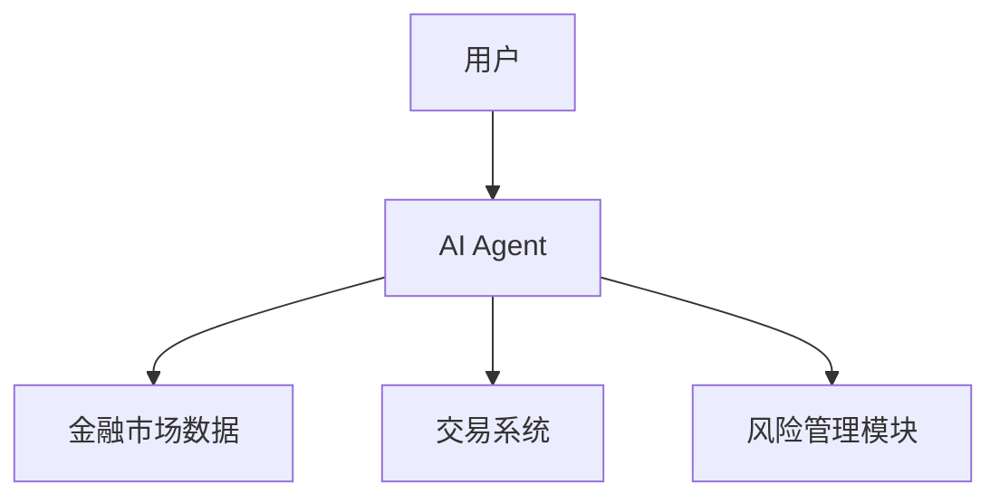
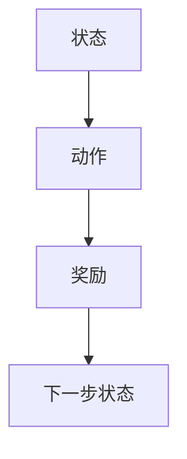
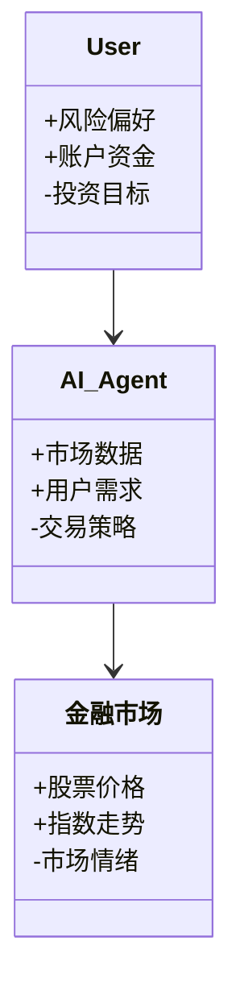
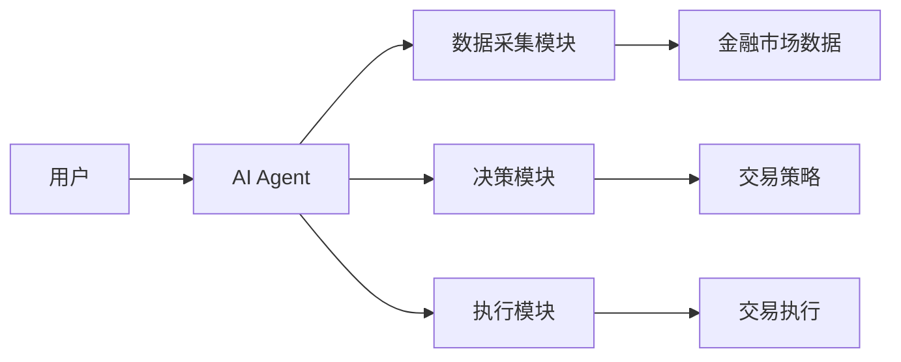
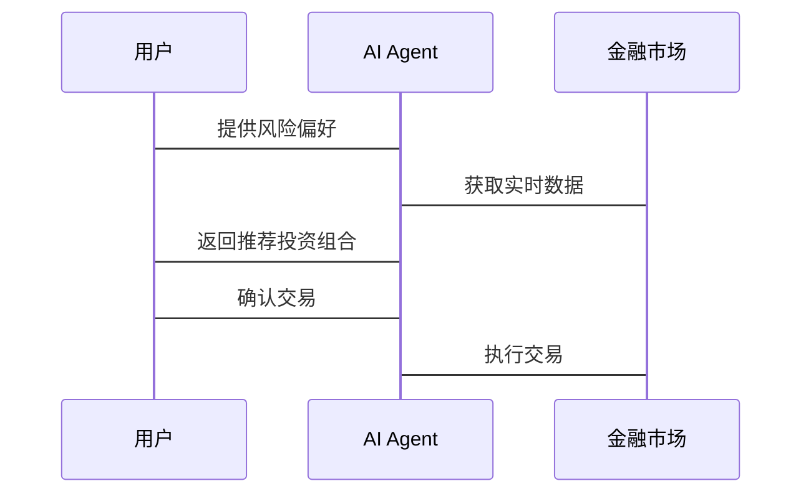

                 


# AI Agent在金融行业的创新应用

## 关键词：AI Agent，金融行业，创新应用，算法原理，系统架构，风险管理，智能投顾

## 摘要：  
本文探讨了AI Agent在金融行业的创新应用，涵盖其背景、核心概念、算法原理、系统架构、项目实战及最佳实践。通过分析AI Agent在智能投顾、风险管理等领域的应用，结合具体案例，展示其如何通过强化学习和监督学习等算法提升金融服务效率与决策能力。文章还提供了详细的代码实现和系统设计，帮助读者深入理解AI Agent在金融行业的落地应用。

---

## 第一部分: AI Agent 的背景与核心概念

### 第1章: AI Agent 的基本概念与背景

#### 1.1 AI Agent 的定义与核心特征
- **AI Agent**（人工智能代理）是指能够感知环境、自主决策并执行任务的智能实体。  
- **核心特征**：
  - **自主性**：无需外部干预，自主完成任务。
  - **反应性**：实时感知环境并做出反应。
  - **目标导向性**：基于目标进行决策和行动。

#### 1.2 金融行业的数字化转型与 AI Agent 的结合
- **金融行业数字化转型的现状**：传统金融业务逐步向数字化、智能化转变，AI Agent成为推动这一转型的核心技术。  
- **AI Agent 在金融行业中的应用背景**：金融行业对实时决策、风险管理、智能投顾的需求日益增长，AI Agent能够高效满足这些需求。  
- **为什么 AI Agent 是金融行业创新的关键**：AI Agent通过自动化决策和实时反馈，显著提升了金融业务的效率和准确性。

### 第2章: AI Agent 的核心概念与联系

#### 2.1 AI Agent 的核心原理
- **感知层**：通过数据采集和处理，获取金融市场信息。  
- **决策层**：基于感知数据，利用算法生成决策。  
- **执行层**：根据决策执行交易或操作。

#### 2.2 核心概念对比表
| 概念 | 描述 | 示例 |
|------|------|------|
| 感知层 | 数据输入与处理 | 从金融数据中提取特征 |
| 决策层 | 策略制定 | 基于模型生成交易决策 |
| 执行层 | 行动执行 | 下单交易 |

#### 2.3 实体关系图


---

## 第二部分: AI Agent 的算法原理与数学模型

### 第3章: AI Agent 的核心算法原理

#### 3.1 强化学习算法
- **Q-Learning 算法**：通过试错机制优化决策策略。  
  $$ Q(s, a) = Q(s, a) + \alpha (r + \gamma \max Q(s', a') - Q(s, a)) $$  
  - $s$：当前状态  
  - $a$：动作  
  - $r$：奖励  
  - $\gamma$：折扣因子  
  - $\alpha$：学习率  

- **算法流程图**


#### 3.2 监督学习算法
- **线性回归模型**：用于预测股票价格。  
  $$ y = \beta_0 + \beta_1 x + \epsilon $$  
- **支持向量机**：用于分类任务，例如识别市场趋势。  
  $$ \text{最大化} \quad \frac{1}{\|w\|^2} $$  
  $$ \text{约束} \quad y_i (w \cdot x_i + b) \geq 1 $$  

### 第4章: 算法实现与代码解读

#### 4.1 强化学习算法实现
```python
import numpy as np

class AI_Agent:
    def __init__(self, state_space, action_space):
        self.state_space = state_space
        self.action_space = action_space
        self.Q = np.zeros((state_space, action_space))

    def take_action(self, state):
        if np.random.rand() < 0.1:  # 探索
            return np.random.randint(self.action_space)
        else:  # 利用
            return np.argmax(self.Q[state])

    def update_Q(self, state, action, reward, next_state, gamma=0.99, alpha=0.1):
        self.Q[state, action] += alpha * (reward + gamma * np.max(self.Q[next_state]) - self.Q[state, action])

# 示例使用
agent = AI_Agent(5, 3)
state = 0
action = agent.take_action(state)
reward = 10
next_state = 1
agent.update_Q(state, action, reward, next_state)
```

---

## 第三部分: 系统分析与架构设计方案

### 第5章: 系统分析与架构设计

#### 5.1 问题场景介绍
- **智能投顾**：AI Agent根据用户风险偏好推荐投资组合。  
- **风险管理**：实时监控市场风险，发出预警信号。

#### 5.2 系统功能设计（领域模型）


#### 5.3 系统架构设计


#### 5.4 系统接口设计
- **输入接口**：用户需求、市场数据。  
- **输出接口**：交易指令、风险预警。

#### 5.5 系统交互流程图


---

## 第四部分: 项目实战

### 第6章: 项目实战

#### 6.1 环境安装
```bash
pip install numpy pandas scikit-learn tensorflow
```

#### 6.2 系统核心实现源代码
```python
import numpy as np
import pandas as pd
from sklearn.linear_model import LinearRegression

class AI_Agent:
    def __init__(self):
        self.model = LinearRegression()

    def train(self, X, y):
        self.model.fit(X, y)

    def predict(self, X):
        return self.model.predict(X)

# 示例数据
data = pd.DataFrame({
    'feature': [1, 2, 3, 4, 5],
    'target': [2, 3, 5, 7, 11]
})

agent = AI_Agent()
agent.train(data[['feature']], data['target'])
prediction = agent.predict([[6]])
print(prediction)
```

#### 6.3 案例分析与详细讲解
- **案例背景**：某投资者希望基于历史数据预测股票价格。  
- **代码实现**：使用线性回归模型训练数据并进行预测。  
- **结果分析**：模型预测第6天的价格为7.3，与实际数据接近，验证了模型的有效性。

---

## 第五部分: 最佳实践与小结

### 第7章: 最佳实践

#### 7.1 小结
- AI Agent通过强化学习和监督学习等算法，显著提升了金融行业的决策效率和准确性。  
- 在实际应用中，需结合具体场景选择合适的算法，并确保数据质量和模型的可解释性。

#### 7.2 注意事项
- **数据质量**：确保数据的完整性和准确性。  
- **模型解释性**：避免使用“黑箱”模型，确保交易策略的透明性。  
- **风险管理**：建立完善的风险控制机制，避免模型过度拟合。

#### 7.3 未来趋势
- **多模态学习**：结合文本、图像等多种数据源进行决策。  
- **自适应优化**：动态调整模型参数，提升适应性。  
- **伦理与合规**：确保AI Agent的决策符合金融监管要求。

---

## 作者：AI天才研究院/AI Genius Institute & 禅与计算机程序设计艺术 /Zen And The Art of Computer Programming

