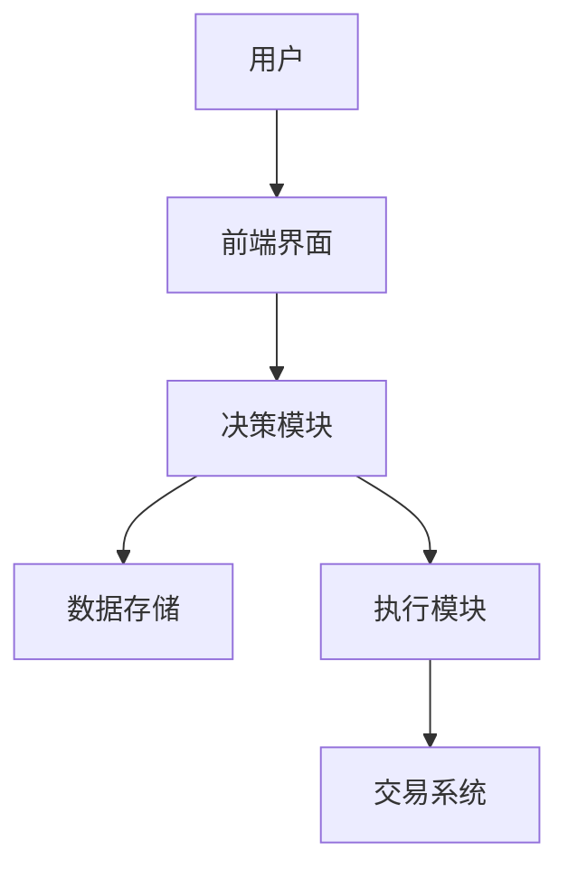

                 


# AI Agent在金融行业的应用与挑战

> 关键词：AI Agent, 人工智能, 金融行业, 智能投顾, 风险管理, 量化交易

> 摘要：随着人工智能技术的迅速发展，AI Agent（人工智能代理）在金融行业中的应用越来越广泛。本文将从AI Agent的基本概念、核心原理、技术实现、系统架构、金融行业中的具体应用场景、面临的挑战与解决方案、项目实战以及未来展望等方面进行详细探讨。通过结合实际案例和深入分析，本文旨在为读者提供全面的视角，帮助他们理解AI Agent在金融行业的潜力和应用前景。

---

## 第一部分: AI Agent基础与背景

### 第1章: AI Agent概述

#### 1.1 AI Agent的基本概念
##### 1.1.1 AI Agent的定义
AI Agent是一种智能实体，能够感知环境、自主决策并执行任务，以实现特定目标。它不同于传统AI，具备自主性、反应性、目标导向和社交能力等特征。

##### 1.1.2 AI Agent的特点
- **自主性**：AI Agent能够独立运行，无需外部干预。
- **反应性**：能够实时感知环境并做出反应。
- **目标导向**：通过优化目标函数来实现特定目标。
- **社交能力**：能够与其他系统或人类进行交互。

##### 1.1.3 AI Agent与传统AI的区别
| 特性 | AI Agent | 传统AI |
|------|----------|--------|
| 自主性 | 高       | 低     |
| 反应性 | 高       | 中     |
| 目标导向 | 高       | 低     |
| 交互能力 | 高       | 中     |

#### 1.2 AI Agent在金融行业中的应用现状
##### 1.2.1 金融行业的数字化转型
金融行业正面临数字化转型的挑战与机遇，传统业务模式逐渐被智能化和自动化替代。

##### 1.2.2 AI Agent在金融行业的应用案例
- 智能投顾：基于客户风险偏好提供个性化投资建议。
- 风险管理：实时监控市场波动，预测潜在风险。
- 量化交易：利用算法进行高频交易。

##### 1.2.3 金融行业对AI Agent的需求分析
- 数据量大：金融行业数据繁多，需要高效处理能力。
- 实时性要求高：交易和风险管理需要快速决策。
- 复杂性高：金融市场受多种因素影响，决策逻辑复杂。

---

## 第2章: AI Agent的核心概念与背景

### 2.1 AI Agent的核心概念
#### 2.1.1 AI Agent的感知模块
##### 数据采集与处理
AI Agent通过API、数据库或实时流数据接口获取金融市场数据。

##### 数据分析与特征提取
利用机器学习算法提取数据中的有用特征，如趋势、波动率等。

##### 数据驱动的决策支持
通过分析历史数据，预测未来市场走势，辅助决策。

#### 2.1.2 AI Agent的决策模块
##### 决策模型的构建
基于机器学习或深度学习模型，构建决策逻辑。

##### 决策模型的训练
使用历史数据对模型进行训练，优化决策策略。

##### 决策模型的优化
通过强化学习等方法，不断优化决策模型的性能。

#### 2.1.3 AI Agent的执行模块
##### 执行策略
根据决策结果，执行交易指令或触发预警机制。

##### 执行结果反馈
将执行结果反馈给感知模块，形成闭环。

### 2.2 AI Agent与金融业务的结合
#### 2.2.1 金融业务中的数据处理
- **数据来源**：金融市场数据、新闻舆情、社交媒体等。
- **数据预处理**：清洗、归一化、特征工程。

#### 2.2.2 金融业务中的决策逻辑
- **风险管理**：实时监控市场风险，制定风险对冲策略。
- **投资决策**：基于市场分析和预测，优化投资组合。

#### 2.2.3 金融业务中的执行操作
- **自动化交易**：高频交易、算法交易。
- **智能投顾**：为客户提供个性化的投资建议。

---

## 第3章: AI Agent在金融行业中的应用背景

### 3.1 金融行业的数字化转型
#### 3.1.1 金融行业的现状分析
- 数字化转型已成为金融行业的必然趋势。
- 传统金融机构需要通过技术创新提升竞争力。

#### 3.1.2 金融行业面临的挑战
- 数据安全与隐私保护。
- 技术复杂性和高成本。
- 监管合规性要求。

#### 3.1.3 金融行业的发展趋势
- 更多金融机构将采用AI Agent技术。
- 金融科技（FinTech）与传统金融的深度融合。

### 3.2 AI技术在金融行业的应用
#### 3.2.1 AI在金融分析中的应用
- 市场分析：预测股价走势、识别市场趋势。
- 财务分析：自动化财务报表分析、信用评估。

#### 3.2.2 AI在金融预测中的应用
- 预测模型：基于机器学习的预测模型。
- 时间序列分析：利用LSTM等模型预测未来走势。

#### 3.2.3 AI在金融决策中的应用
- 智能投顾：基于客户画像提供个性化投资建议。
- 自动化决策：利用AI算法进行实时决策。

---

## 第4章: AI Agent的核心原理

### 4.1 AI Agent的感知模块
#### 4.1.1 数据采集与处理
- **数据来源**：API接口、数据库、实时流数据。
- **数据预处理**：清洗、归一化、特征提取。

#### 4.1.2 数据分析与特征提取
- **特征工程**：提取关键特征，如均值、标准差、相关系数等。
- **数据可视化**：通过图表展示数据分布和趋势。

#### 4.1.3 数据驱动的决策支持
- **预测模型**：基于历史数据训练预测模型。
- **决策支持**：为决策模块提供实时数据支持。

### 4.2 AI Agent的决策模块
#### 4.2.1 决策模型的构建
- **机器学习模型**：如随机森林、支持向量机。
- **深度学习模型**：如神经网络、LSTM。

#### 4.2.2 决策模型的训练
- **监督学习**：基于标注数据进行训练。
- **无监督学习**：发现数据中的隐藏模式。

#### 4.2.3 决策模型的优化
- **参数调优**：通过网格搜索或随机搜索优化模型参数。
- **模型评估**：使用交叉验证评估模型性能。

### 4.3 AI Agent的执行模块
#### 4.3.1 执行策略
- **自动化交易**：根据模型决策执行交易指令。
- **风险管理**：实时监控市场风险，触发止损机制。

#### 4.3.2 执行结果反馈
- **反馈机制**：将执行结果反馈给感知模块，优化决策模型。
- **日志记录**：记录交易历史，便于后续分析。

---

## 第5章: AI Agent的核心算法与数学模型

### 5.1 强化学习算法
#### 5.1.1 强化学习的基本原理
- **智能体**：AI Agent。
- **环境**：金融市场。
- **动作**：交易指令。
- **奖励**：投资收益。

#### 5.1.2 强化学习的数学模型
$$ R = r_1 + r_2 + \dots + r_n $$
其中，$R$ 表示总奖励，$r_i$ 表示第 $i$ 步的奖励。

#### 5.1.3 强化学习的应用案例
- **策略网络**：基于深度神经网络的策略模型。
- **价值函数**：估计每个状态的价值。

### 5.2 监督学习算法
#### 5.2.1 监督学习的基本原理
- **输入**：金融市场数据。
- **输出**：预测结果，如股价预测。

#### 5.2.2 监督学习的数学模型
$$ y = f(x) $$
其中，$x$ 表示输入特征，$y$ 表示输出结果，$f$ 表示模型函数。

#### 5.2.3 监督学习的应用案例
- **回归模型**：预测股票价格。
- **分类模型**：预测市场趋势（上涨、下跌、持平）。

### 5.3 聚类算法
#### 5.3.1 聚类的基本原理
- **相似性度量**：如欧氏距离、余弦相似度。
- **聚类算法**：如K-means、DBSCAN。

#### 5.3.2 聚类的应用案例
- **客户分群**：根据客户行为将客户分为不同类别。
- **市场细分**：根据市场数据进行市场细分。

---

## 第6章: AI Agent的系统架构与设计

### 6.1 系统架构设计
#### 6.1.1 系统功能设计
- **数据采集模块**：采集金融市场数据。
- **数据处理模块**：清洗、特征提取。
- **决策模块**：训练和优化决策模型。
- **执行模块**：根据决策结果执行交易指令。

#### 6.1.2 系统架构图


#### 6.1.3 系统交互流程
1. 用户通过前端界面输入查询条件。
2. 前端界面将请求发送到决策模块。
3. 决策模块处理数据并返回结果。
4. 执行模块根据决策结果执行交易指令。
5. 交易系统确认交易并反馈结果。

### 6.2 系统实现细节
#### 6.2.1 数据采集模块
- **数据来源**：API接口、数据库、实时流数据。
- **数据预处理**：清洗、归一化、特征提取。

#### 6.2.2 决策模块
- **算法选择**：根据需求选择合适的算法。
- **模型训练**：使用训练数据训练模型。
- **模型优化**：通过参数调优提升模型性能。

#### 6.2.3 执行模块
- **交易策略**：基于模型决策执行交易指令。
- **风险管理**：实时监控市场风险，触发止损机制。

---

## 第7章: AI Agent在金融行业的应用案例

### 7.1 智能投顾系统
#### 7.1.1 系统功能
- **客户画像**：分析客户风险偏好。
- **投资建议**：基于市场分析提供投资建议。
- **组合管理**：实时监控投资组合表现。

#### 7.1.2 项目实战
##### 7.1.2.1 环境安装
- 安装Python、TensorFlow、Pandas等库。

##### 7.1.2.2 核心代码实现
```python
import pandas as pd
import numpy as np
from sklearn.model

