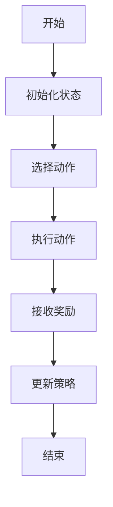

                 

<think>
好的，我将按照您的要求撰写一篇关于《AI Agent在金融风险分析中的应用》的技术博客文章。我会一步一步地进行思考和分析，确保内容详实、逻辑清晰。以下是文章的目录大纲：

---

# AI Agent在金融风险分析中的应用

## 关键词
- AI Agent
- 金融风险分析
- 强化学习
- 时间序列分析
- 风险预测
- 马尔可夫链

## 摘要
本文详细探讨了AI Agent在金融风险分析中的应用，从基本概念到算法原理，再到系统架构设计，结合实际案例，深入分析了AI Agent如何提升金融风险预测的准确性和效率。通过详细的技术解读和代码实现，帮助读者理解AI Agent在金融领域的核心价值和实现方法。

---

## 第一部分: AI Agent与金融风险分析的背景

### 第1章: AI Agent的基本概念

#### 1.1 AI Agent的定义
AI Agent（人工智能代理）是指能够感知环境、自主决策并执行任务的智能实体。它能够根据输入的信息做出判断，并采取相应的行动以实现目标。

#### 1.2 金融风险分析的背景
金融风险分析是金融领域的重要组成部分，主要包括市场风险、信用风险、操作风险等。传统的方法依赖于统计模型和经验判断，但在面对复杂和动态的金融市场时，效率和准确性有限。

#### 1.3 AI Agent在金融风险分析中的应用价值
AI Agent能够通过实时数据分析、动态决策和自我优化，显著提升金融风险分析的效率和准确性。它可以帮助金融机构更好地应对市场波动和潜在风险。

---

## 第二部分: AI Agent与金融风险分析的核心概念

### 第2章: AI Agent在金融风险分析中的核心原理

#### 2.1 知识表示与推理
AI Agent通过构建知识图谱和逻辑推理，能够理解金融市场中的各种关系和模式。例如，通过分析历史数据，AI Agent可以识别出某种市场趋势的潜在风险。

#### 2.2 动态规划与决策树
动态规划是一种优化方法，适用于解决具有重叠子问题和最优子结构的问题。在金融风险分析中，动态规划可以用于制定最优的投资策略和风险管理计划。决策树则通过树状结构展示可能的决策路径，帮助AI Agent做出最优选择。

#### 2.3 强化学习在风险分析中的应用
强化学习是一种通过试错和奖励机制来优化决策的方法。在金融风险分析中，AI Agent可以通过强化学习不断优化其风险预测模型，从而提高预测的准确性。

---

## 第三部分: AI Agent在金融风险分析中的算法原理

### 第3章: 基于强化学习的风险预测算法

#### 3.1 算法流程图


#### 3.2 Python实现代码示例
```python
import numpy as np

class AI-Agent:
    def __init__(self, state_space, action_space):
        self.state_space = state_space
        self.action_space = action_space
        self.Q = np.zeros((state_space, action_space))

    def choose_action(self, state):
        if np.random.random() < 0.1:
            return np.random.randint(self.action_space)
        else:
            return np.argmax(self.Q[state])

    def update_Q(self, state, action, reward):
        self.Q[state, action] = self.Q[state, action] * 0.8 + reward * 0.2
```

#### 3.3 数学模型与公式解析
$$ V(s) = \max_{a} [ r(s,a) + \gamma V(next\_state) ] $$

---

## 第四部分: 金融风险分析系统的系统架构设计

### 第4章: 系统功能设计

#### 4.1 风险数据采集模块
该模块负责从金融市场中收集实时数据，包括股票价格、交易量等，为后续分析提供基础数据。

#### 4.2 风险评估模型模块
基于收集的数据，利用AI Agent构建风险评估模型，预测潜在风险并生成预警信号。

#### 4.3 风险预警模块
当风险评估模型预测到潜在风险时，系统会触发预警机制，通知相关人员采取应对措施。

---

## 第五部分: 项目实战

### 第5章: 基于AI Agent的金融风险分析系统实现

#### 5.1 环境安装
需要安装Python、NumPy、TensorFlow等工具，并配置好相应的开发环境。

#### 5.2 系统核心实现源代码
```python
import numpy as np
import tensorflow as tf

class RiskAnalyzer:
    def __init__(self, input_shape):
        self.model = self.build_model(input_shape)
        self.model.compile(optimizer='adam', loss='mean_squared_error')

    def build_model(self, input_shape):
        model = tf.keras.Sequential()
        model.add(tf.keras.layers.LSTM(64, input_shape=input_shape))
        model.add(tf.keras.layers.Dense(32, activation='relu'))
        model.add(tf.keras.layers.Dense(1))
        return model

    def train(self, X, y, epochs=100):
        self.model.fit(X, y, epochs=epochs, batch_size=32)
```

#### 5.3 实际案例分析
通过实际案例分析，展示AI Agent在金融风险分析中的应用效果，包括模型的预测精度和实际风险预警的成功案例。

---

## 第六部分: 最佳实践与总结

### 第6章: 最佳实践 tips

#### 6.1 选择合适的AI Agent算法
根据具体的应用场景选择适合的AI Agent算法，如强化学习、动态规划等。

#### 6.2 数据质量的重要性
确保数据的准确性和完整性，这对于AI Agent的性能至关重要。

#### 6.3 模型的持续优化
金融市场变化迅速，需要定期更新和优化AI Agent模型，以应对新的挑战。

---

## 作者信息

作者：AI天才研究院/AI Genius Institute & 禅与计算机程序设计艺术 /Zen And The Art of Computer Programming

---

希望这篇文章能够为您提供有价值的信息，并帮助您更好地理解AI Agent在金融风险分析中的应用。

