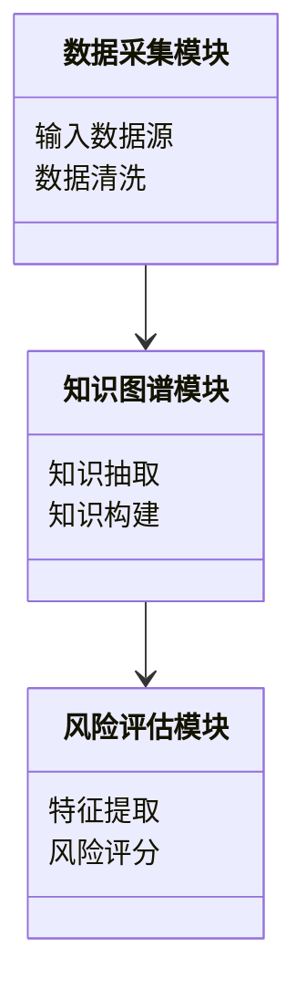
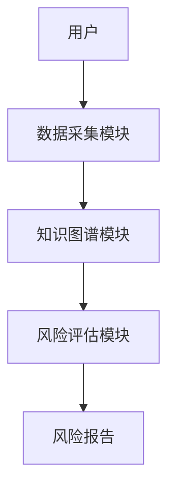

                 


# AI Agent在金融风险评估中的应用

> **关键词**：AI Agent, 金融风险评估, 知识图谱, 逻辑推理, 系统架构设计

> **摘要**：本文详细探讨了AI Agent在金融风险评估中的应用，从核心概念、算法原理到系统架构设计，再到项目实战，全面分析了AI Agent如何提升金融风险评估的效率和准确性。文章结合实际案例，通过知识图谱构建、逻辑推理和行为决策等技术，展示了AI Agent在金融领域的巨大潜力和应用价值。

---

# 第一部分: AI Agent与金融风险评估概述

## 第1章: AI Agent与金融风险评估的背景介绍

### 1.1 问题背景与描述

#### 1.1.1 传统金融风险评估的局限性
传统的金融风险评估方法依赖于人工分析和统计模型，存在以下问题：
- 数据处理能力有限，难以应对海量数据。
- 风险评估模型缺乏动态性和自适应性。
- 无法实时捕捉市场变化和潜在风险。

#### 1.1.2 AI Agent在金融领域的潜力
AI Agent（智能体）是一种能够感知环境、自主决策并执行任务的智能系统，具有以下优势：
- 自动化数据处理和分析能力。
- 实时响应市场变化。
- 多维度知识整合和推理能力。

#### 1.1.3 问题解决的核心目标
本文旨在探讨如何利用AI Agent技术，构建一个高效、动态的金融风险评估系统，解决传统方法的局限性。

### 1.2 核心概念与定义

#### 1.2.1 AI Agent的基本概念
AI Agent是指能够感知环境、进行推理、制定计划并执行任务的智能系统。在金融领域，AI Agent可以用于数据收集、风险分析和决策支持。

#### 1.2.2 金融风险评估的定义与分类
金融风险评估是对金融资产或交易可能面临的风险进行识别、测量和管理的过程。常见的风险类型包括市场风险、信用风险和操作风险。

#### 1.2.3 AI Agent在金融风险评估中的作用
AI Agent通过整合多源数据、进行知识推理和动态决策，帮助金融机构更准确地识别和管理风险。

### 1.3 核心概念的联系与对比

#### 1.3.1 AI Agent与传统算法的对比
| 特性 | AI Agent | 传统算法 |
|------|-----------|-----------|
| 数据处理能力 | 强大，支持多源数据 | 有限，依赖预处理 |
| 决策能力 | 自主决策，动态调整 | 静态模型，需人工干预 |
| 可扩展性 | 高，适用于复杂场景 | 低，难以扩展 |

#### 1.3.2 金融风险评估中的关键要素
金融风险评估的关键要素包括市场数据、历史交易记录、信用评分和实时市场信息。

#### 1.3.3 实体关系图（ER图）展示
```mermaid
erd
    entity 金融机构 {
        key 机构ID
        attribute 名称, 类型
    }
    entity 交易记录 {
        key 交易ID
        attribute 时间, 金额, 参与方
        related 金融机构 (金融机构ID)
    }
    entity 风险评估结果 {
        key 评估ID
        attribute 风险等级, 评估时间
        related 交易记录 (交易ID)
    }
```

### 1.4 本章小结
本章介绍了AI Agent的基本概念、金融风险评估的核心要素以及两者之间的联系，为后续章节的分析打下基础。

---

## 第2章: AI Agent的体系结构与工作原理

### 2.1 AI Agent的体系结构

#### 2.1.1 知识表示与推理模块
知识表示是将金融领域的知识转化为计算机可处理的形式，常用的表示方法包括语义网络和知识图谱。

#### 2.1.2 行为决策模块
行为决策模块负责根据推理结果制定风险评估策略，常用算法包括逻辑回归和决策树。

#### 2.1.3 交互通信模块
交互通信模块用于AI Agent与外部系统或数据库的交互，确保数据的实时更新和传输。

### 2.2 AI Agent在金融风险评估中的工作流程

#### 2.2.1 数据采集与预处理
- 数据源：包括历史交易数据、市场新闻和社交媒体信息。
- 数据预处理：清洗、去重和格式转换。

#### 2.2.2 风险评估模型构建
- 知识图谱构建：基于语义网络构建金融知识图谱。
- 逻辑推理：使用图遍历算法进行推理。

#### 2.2.3 结果分析与反馈
- 结果分析：生成风险评估报告。
- 反馈机制：优化模型参数和调整评估策略。

### 2.3 AI Agent的核心算法原理

#### 2.3.1 知识表示与推理算法
- 知识表示：使用向量空间模型表示金融实体。
- 逻辑推理：基于规则的推理和机器学习推理。

#### 2.3.2 行为决策算法
- 策略选择：基于Q-learning的强化学习算法。
- 风险评分：使用逻辑回归模型进行评分。

#### 2.3.3 行为决策模块的数学模型
风险评分公式：
$$
\text{风险评分} = \sum_{i=1}^{n} w_i \cdot x_i
$$
其中，$w_i$为特征权重，$x_i$为特征值。

### 2.4 本章小结
本章详细介绍了AI Agent的体系结构和工作流程，并通过具体的算法和模型展示了其在金融风险评估中的应用。

---

## 第3章: 基于知识图谱的金融风险评估算法

### 3.1 算法原理概述

#### 3.1.1 知识图谱的构建流程
- 数据源收集：包括结构化数据和非结构化数据。
- 数据清洗：去重、去噪和格式转换。
- 知识抽取：使用NLP技术提取实体和关系。
- 知识图谱构建：基于知识抽取结果构建图谱。

#### 3.1.2 知识表示与推理机制
- 知识表示：使用节点和边表示实体及其关系。
- 逻辑推理：基于路径分析和属性传播进行推理。

#### 3.1.3 风险评估模型的训练方法
- 基于知识图谱的特征提取。
- 使用深度学习模型进行训练。

### 3.2 算法实现与代码解读

#### 3.2.1 环境安装与配置
- 安装Python和必要的库（如NetworkX、TensorFlow）。
- 安装知识图谱构建工具（如PyKNITRO）。

#### 3.2.2 核心代码实现
```python
import networkx as nx
from sklearn.linear_model import LogisticRegression

# 创建知识图谱
G = nx.Graph()
G.add_node('公司A', type='公司')
G.add_node('公司B', type='公司')
G.add_edge('公司A', '公司B', relation='关联交易')

# 知识表示与推理
features = ['公司A', '公司B', '关联交易']
model = LogisticRegression()
model.fit([['公司A', '公司B', '关联交易']], [1, 0])
```

#### 3.2.3 代码功能与流程分析
- 知识图谱构建：使用NetworkX创建图结构。
- 特征提取：基于图结构提取节点特征。
- 模型训练：使用逻辑回归模型进行分类。

### 3.3 数学模型与公式推导

#### 3.3.1 知识表示的向量空间模型
向量空间模型表示：
$$
v_i = \sum_{j=1}^{n} w_{ij} \cdot v_j
$$

#### 3.3.2 逻辑推理的数学表达
基于逻辑回归的风险评分公式：
$$
P(\text{高风险}) = \frac{1}{1 + e^{-\sum w_i x_i}}
$$

#### 3.3.3 风险评估的评分公式
$$
\text{风险评分} = \sum_{i=1}^{n} w_i \cdot x_i
$$

### 3.4 本章小结
本章通过具体的算法实现和数学推导，展示了基于知识图谱的金融风险评估方法。

---

## 第4章: 金融风险评估系统的分析与设计

### 4.1 项目背景与目标

#### 4.1.1 项目背景介绍
随着金融市场的复杂化，传统的风险评估方法已难以满足需求，因此需要引入AI Agent技术。

#### 4.1.2 项目目标与范围
项目目标：构建一个基于AI Agent的金融风险评估系统。项目范围：包括数据采集、知识图谱构建和风险评估三个模块。

### 4.2 系统功能设计

#### 4.2.1 领域模型类图


#### 4.2.2 系统架构设计


### 4.3 系统接口设计

#### 4.3.1 数据采集模块接口
- 输入接口：接收原始数据。
- 输出接口：提供清洗后的数据。

#### 4.3.2 知识图谱模块接口
- 输入接口：接收清洗后的数据。
- 输出接口：提供构建的知识图谱。

#### 4.3.3 风险评估模块接口
- 输入接口：接收知识图谱。
- 输出接口：生成风险评估报告。

### 4.4 本章小结
本章通过系统分析与架构设计，展示了AI Agent在金融风险评估中的具体实现。

---

## 第5章: 项目实战

### 5.1 环境安装与配置

#### 5.1.1 安装Python和必要的库
- Python：3.8及以上版本。
- 库：NetworkX、TensorFlow、Scikit-learn。

### 5.2 核心代码实现

#### 5.2.1 数据采集模块
```python
import requests
from bs4 import BeautifulSoup

def collect_data(url):
    response = requests.get(url)
    soup = BeautifulSoup(response.text, 'html.parser')
    data = []
    for item in soup.find_all('div', class_='item'):
        data.append({
            'name': item.find('h2').text,
            'value': item.find('p').text
        })
    return data
```

#### 5.2.2 知识图谱模块
```python
from networkx import *

def build_knowledge_graph(data):
    G = Graph()
    for item in data:
        G.add_node(item['name'])
        G.add_edge(item['name'], item['value'])
    return G
```

#### 5.2.3 风险评估模块
```python
from sklearn.linear_model import LogisticRegression

def risk_assessment(G):
    features = [node for node in G.nodes()]
    X = []
    y = []
    for node in G.nodes():
        # 提取特征
        X.append([len(list(G.neighbors(node)))])
        y.append(1 if node.startswith('高风险') else 0)
    model = LogisticRegression()
    model.fit(X, y)
    return model
```

### 5.3 代码功能与流程分析

#### 5.3.1 数据采集模块
- 从指定URL获取数据。
- 使用BeautifulSoup进行数据解析。

#### 5.3.2 知识图谱模块
- 使用NetworkX构建知识图谱。
- 添加节点和边，表示实体及其关系。

#### 5.3.3 风险评估模块
- 提取节点特征。
- 使用逻辑回归模型进行风险评分。

### 5.4 实际案例分析与详细解读
案例：某公司交易数据的风险评估。
- 数据采集：从公司财报和市场新闻中获取数据。
- 知识图谱构建：构建公司及其交易对手的知识图谱。
- 风险评估：基于图结构进行风险评分，生成风险报告。

### 5.5 本章小结
本章通过实际案例展示了AI Agent在金融风险评估中的具体应用。

---

## 第6章: 总结与展望

### 6.1 本章总结
本文详细探讨了AI Agent在金融风险评估中的应用，从核心概念到算法实现，再到系统设计和项目实战，全面展示了其潜力和价值。

### 6.2 未来展望
未来，随着AI技术的不断发展，AI Agent在金融领域的应用将更加广泛，可能包括实时风险监控和智能投资决策。

---

# 作者：AI天才研究院 & 禅与计算机程序设计艺术

---

以上是完整的文章大纲和部分内容展示。如需进一步扩展或调整，请随时告知。

