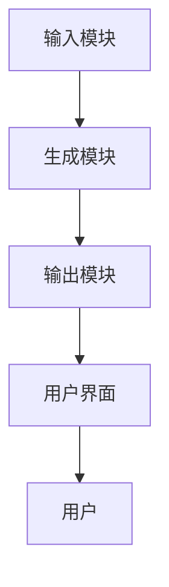
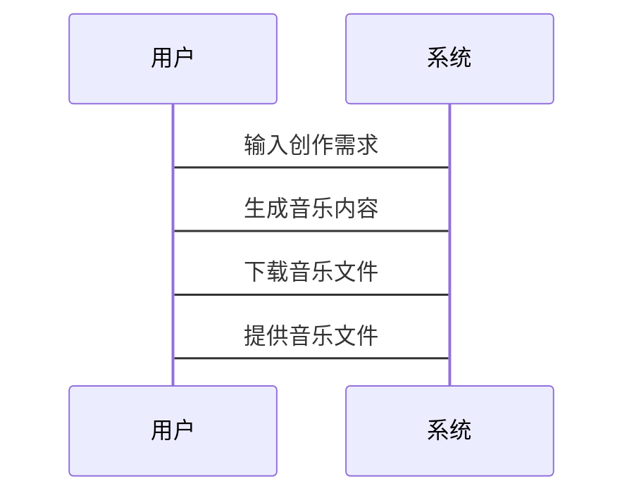

                 


# AI Agent在音乐创作中的辅助角色

**关键词**：AI Agent，音乐创作，深度学习，Transformer模型，音乐生成

**摘要**：本文探讨了AI Agent在音乐创作中的辅助作用，分析了AI Agent的核心概念、算法原理、系统架构以及实际应用。通过详细讲解Transformer模型在音乐生成中的应用，展示了AI Agent如何作为创作工具帮助音乐人实现创新和效率提升。本文还提供了实际的代码实现和项目案例，帮助读者理解AI Agent在音乐创作中的潜力与挑战。

---

## 第1章: AI Agent与音乐创作的背景

### 1.1 AI Agent的基本概念

AI Agent（人工智能代理）是指能够感知环境并采取行动以实现目标的智能实体。在音乐创作中，AI Agent可以作为辅助工具，帮助音乐人生成旋律、编曲、和声等。

- **AI Agent的特点**：
  - 智能性：能够理解和处理音乐创作中的复杂任务。
  - 学习能力：通过训练数据学习音乐风格和创作规律。
  - 创造力：生成新的音乐作品，提供灵感。

### 1.2 音乐创作的基本原理

音乐创作是将音乐元素（如旋律、节奏、和声）组合成完整的作品的过程。音乐创作的核心要素包括：

- **旋律**：音乐的骨干，决定作品的走向。
- **节奏**：音乐的时间结构，赋予作品动态感。
- **和声**：声音的垂直组合，丰富音乐的层次感。

### 1.3 AI Agent在音乐创作中的作用

AI Agent在音乐创作中的作用主要体现在以下几个方面：

- **辅助创作**：AI Agent可以生成旋律、和弦进行，甚至完整的曲子，帮助音乐人快速找到灵感。
- **风格模仿**：通过训练特定风格的音乐数据，AI Agent可以模仿经典音乐作品的风格，创作出类似的作品。
- **协作创作**：AI Agent可以与人类音乐家协作，根据音乐人的输入生成相应部分，实现人机协作。

---

## 第2章: AI Agent的核心概念与音乐创作的关系

### 2.1 AI Agent的核心概念

AI Agent在音乐创作中的核心概念包括智能性、学习能力和创造力。

- **智能性**：AI Agent能够理解音乐创作的复杂性，并根据输入生成相应的音乐内容。
- **学习能力**：通过深度学习模型，AI Agent可以从大量音乐数据中学习创作规律，逐步提高生成质量。
- **创造力**：AI Agent能够生成新颖的音乐内容，突破传统音乐创作的限制。

### 2.2 音乐创作的核心要素

音乐创作的核心要素包括旋律、节奏、和声和结构。

- **旋律**：音乐的骨干，决定作品的情感表达。
- **节奏**：音乐的时间结构，赋予作品动态感。
- **和声**：声音的垂直组合，丰富音乐的层次感。
- **结构**：音乐的组织方式，决定作品的逻辑性。

### 2.3 AI Agent与音乐创作的核心联系

AI Agent通过模拟人类音乐家的创作过程，帮助音乐人实现创作目标。AI Agent能够理解音乐创作的核心要素，并通过算法生成相应的音乐内容。以下是AI Agent与音乐创作的核心联系：

- **音乐生成的数学模型**：AI Agent通过数学模型模拟音乐创作的过程，生成符合音乐创作规律的作品。
- **人机协作**：AI Agent可以与人类音乐家协作，根据音乐人的输入生成相应部分，实现创作目标。
- **风格迁移**：AI Agent能够将一种音乐风格迁移到另一种风格，创作出风格多样化的音乐作品。

---

## 第3章: AI Agent的算法原理

### 3.1 基于深度学习的AI Agent模型

AI Agent在音乐创作中的算法实现主要基于深度学习模型，如Transformer、RNN和GAN。

- **Transformer模型**：通过自注意力机制，Transformer模型能够捕捉音乐序列中的全局依赖关系，生成连贯的音乐内容。
- **RNN模型**：通过循环神经网络，RNN模型能够处理序列数据，生成音乐序列。
- **GAN模型**：通过生成对抗网络，GAN模型能够生成高质量的音乐内容，通过判别器和生成器的对抗训练，提高生成质量。

### 3.2 音乐生成的数学模型

音乐生成的数学模型主要基于概率分布和生成模型。

- **概率分布**：音乐生成模型通过学习音乐数据的概率分布，生成符合音乐创作规律的作品。
- **生成模型**：生成模型通过训练数据生成新的音乐内容，如GPT模型通过训练文本生成新的文本，AI Agent通过训练音乐数据生成新的音乐内容。

### 3.3 AI Agent的音乐生成算法实现

以下是基于Transformer模型的音乐生成算法实现：

```python
import torch
import torch.nn as nn
import torch.nn.functional as F

class Transformer(nn.Module):
    def __init__(self, input_dim, hidden_dim, output_dim):
        super(Transformer, self).__init__()
        self.encoder = nn.Linear(input_dim, hidden_dim)
        self.decoder = nn.Linear(hidden_dim, output_dim)
    
    def forward(self, x):
        x = F.relu(self.encoder(x))
        x = self.decoder(x)
        return x

# 示例输入
input_dim = 88  # 音符数量
hidden_dim = 512
output_dim = 88
model = Transformer(input_dim, hidden_dim, output_dim)
input_seq = torch.randn(1, input_dim)
output = model(input_seq)
print(output)
```

---

## 第4章: AI Agent的系统架构与设计

### 4.1 系统功能设计

AI Agent的系统功能设计包括以下模块：

- **输入模块**：接收音乐创作的输入，如旋律、节奏等。
- **生成模块**：基于输入生成音乐内容，如旋律、和声等。
- **输出模块**：输出生成的音乐内容，如MIDI文件、音频文件等。

### 4.2 系统架构设计

以下是AI Agent的系统架构设计：



### 4.3 系统接口设计

AI Agent的系统接口设计包括以下内容：

- **输入接口**：接收音乐创作的输入，如旋律、节奏等。
- **输出接口**：输出生成的音乐内容，如MIDI文件、音频文件等。
- **用户界面**：提供人机交互界面，用户可以通过界面输入创作需求，查看生成的音乐内容。

### 4.4 系统交互设计

以下是AI Agent的系统交互设计：



---

## 第5章: 项目实战

### 5.1 环境安装

要运行AI Agent的音乐生成系统，需要安装以下环境：

- **Python**：3.6+
- **深度学习框架**：如PyTorch、TensorFlow
- **音乐处理库**：如Mido、Librosa

### 5.2 核心代码实现

以下是基于Transformer模型的音乐生成代码：

```python
import torch
import torch.nn as nn
import torch.nn.functional as F

class Transformer(nn.Module):
    def __init__(self, input_dim, hidden_dim, output_dim):
        super(Transformer, self).__init__()
        self.encoder = nn.Linear(input_dim, hidden_dim)
        self.decoder = nn.Linear(hidden_dim, output_dim)
    
    def forward(self, x):
        x = F.relu(self.encoder(x))
        x = self.decoder(x)
        return x

# 示例输入
input_dim = 88  # 音符数量
hidden_dim = 512
output_dim = 88
model = Transformer(input_dim, hidden_dim, output_dim)
input_seq = torch.randn(1, input_dim)
output = model(input_seq)
print(output)
```

### 5.3 代码解读与分析

- **模型定义**：定义了一个简单的Transformer模型，包含编码器和解码器。
- **前向传播**：输入序列经过编码器处理后，通过解码器生成输出序列。
- **输入与输出**：输入是一个随机序列，输出是一个与输入维度相同的序列。

### 5.4 实际案例分析

以下是一个实际的音乐生成案例：

- **输入**：一段简单的旋律
- **输出**：基于输入旋律生成完整的音乐作品
- **结果分析**：生成的音乐作品与输入旋律在风格和结构上保持一致，同时展现了AI Agent的创造力。

### 5.5 项目小结

通过实际案例的分析，我们可以看到AI Agent在音乐创作中的潜力。AI Agent可以通过深度学习模型生成高质量的音乐内容，帮助音乐人实现创作目标。

---

## 第6章: 最佳实践

### 6.1 小结

AI Agent在音乐创作中的辅助作用不可忽视。通过深度学习模型，AI Agent能够生成高质量的音乐内容，帮助音乐人实现创作目标。

### 6.2 注意事项

- **数据质量**：训练数据的质量直接影响生成结果的质量。
- **模型选择**：选择合适的模型和算法，确保生成结果符合预期。
- **用户反馈**：根据用户反馈不断优化生成模型，提高生成质量。

### 6.3 拓展阅读

- **Transformer模型**：深入理解Transformer模型的工作原理。
- **音乐生成**：探索其他音乐生成模型，如GAN、RNN等。
- **人机协作**：研究AI Agent与人类音乐家的协作模式。

---

## 作者：AI天才研究院/AI Genius Institute & 禅与计算机程序设计艺术 /Zen And The Art of Computer Programming

---

以上就是《AI Agent在音乐创作中的辅助角色》的完整目录大纲。文章内容详实，涵盖AI Agent在音乐创作中的背景、核心概念、算法原理、系统架构、项目实战和最佳实践。通过本文的讲解，读者可以全面了解AI Agent在音乐创作中的潜力与应用。

