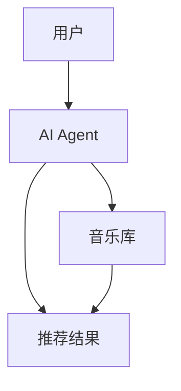
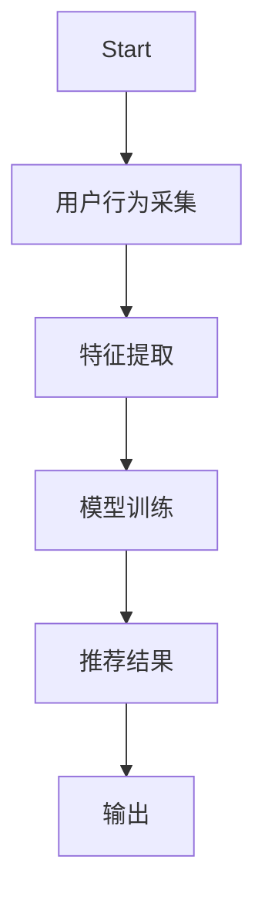
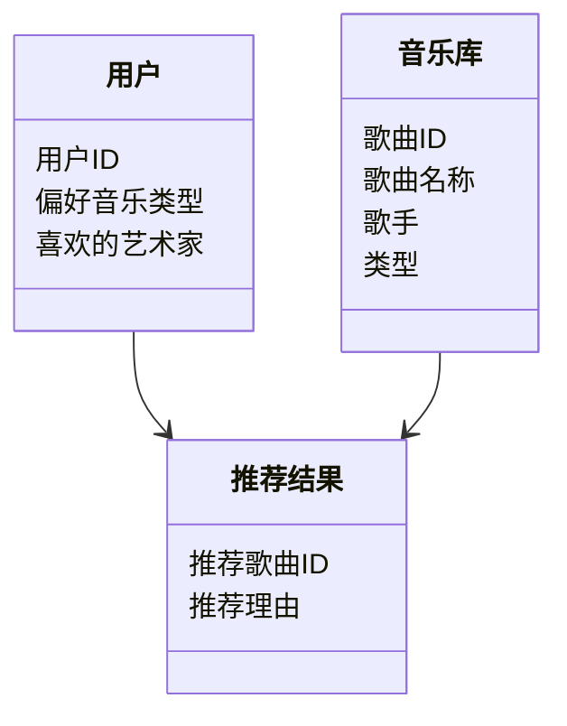
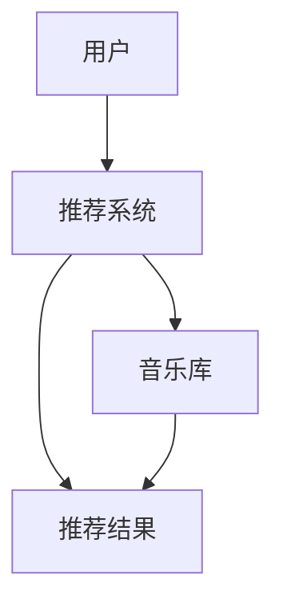
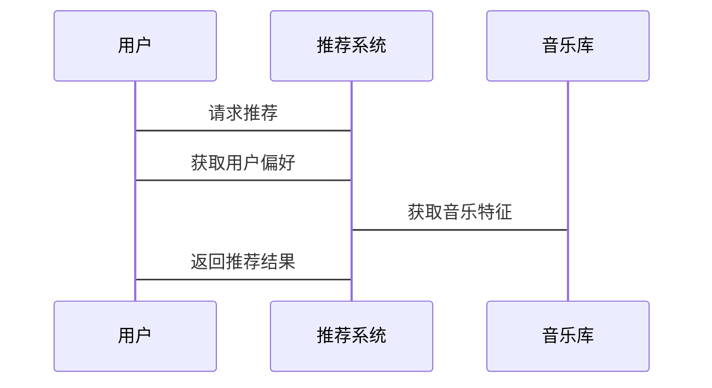

                 


# AI Agent在音乐推荐中的个性化算法

## 关键词：
AI Agent, 音乐推荐系统, 个性化推荐, 算法原理, 系统架构, 项目实战

## 摘要：
本文详细探讨了AI Agent在音乐推荐中的个性化算法。首先介绍了音乐推荐系统的背景和问题分析，接着深入讲解了AI Agent的核心概念与音乐推荐系统的关系。随后，从算法原理、系统架构到项目实战，逐一分析了协同过滤、基于内容的推荐、深度学习推荐模型以及混合推荐算法。最后，通过实际案例分析和最佳实践，总结了AI Agent在音乐推荐中的应用前景和优化方向。

---

# 第一部分: AI Agent在音乐推荐中的个性化算法概述

# 第1章: 音乐推荐系统背景与问题分析

## 1.1 音乐推荐系统的背景
### 1.1.1 音乐推荐系统的定义与作用
音乐推荐系统是一种基于用户行为和音乐特征，通过算法生成个性化音乐推荐的技术。其作用包括提高用户体验、增加用户粘性、优化音乐分发效率等。

### 1.1.2 音乐推荐系统的演变历程
从早期的基于规则的推荐，到协同过滤、基于内容的推荐，再到深度学习推荐模型，音乐推荐系统经历了多个阶段的演变。

### 1.1.3 个性化推荐在音乐产业中的重要性
个性化推荐能够满足用户多样化的需求，提升音乐平台的用户满意度和市场竞争力。

## 1.2 个性化推荐的核心问题
### 1.2.1 用户需求的多样性
用户对音乐的偏好多种多样，包括音乐类型、情感倾向、创作背景等。

### 1.2.2 音乐内容的多样性
音乐内容包括歌曲、专辑、艺术家等，每种内容都有独特的特征。

### 1.2.3 推荐算法的挑战与目标
推荐算法需要在多样化的数据中找到用户的兴趣点，同时解决数据稀疏性、冷启动等问题。

## 1.3 AI Agent在音乐推荐中的应用前景
### 1.3.1 AI Agent的基本概念
AI Agent是一种智能体，能够感知环境、执行任务并做出决策。

### 1.3.2 AI Agent在音乐推荐中的优势
AI Agent能够实时感知用户行为，动态调整推荐策略，提供更精准的音乐推荐。

### 1.3.3 音乐推荐系统的未来趋势
未来的音乐推荐系统将更加智能化、个性化，结合AI Agent实现更高效的推荐。

## 1.4 本章小结
本章介绍了音乐推荐系统的背景、个性化推荐的核心问题以及AI Agent在音乐推荐中的应用前景。

---

# 第二部分: 核心概念与联系

# 第2章: 核心概念与关系分析

## 2.1 AI Agent的核心概念
### 2.1.1 AI Agent的基本定义
AI Agent是一种智能体，能够感知环境、执行任务并做出决策。

### 2.1.2 AI Agent的主要特征
AI Agent具有智能性、自主性、反应性、社会性等特征。

### 2.1.3 AI Agent与音乐推荐的关系
AI Agent能够通过感知用户行为和音乐特征，动态生成个性化推荐。

## 2.2 音乐推荐系统的核心概念
### 2.2.1 音乐推荐系统的分类
音乐推荐系统可以分为基于协同过滤、基于内容的推荐、基于深度学习的推荐等。

### 2.2.2 音乐推荐系统的评价指标
包括准确率、召回率、F1值、覆盖率等。

### 2.2.3 音乐推荐系统的实现流程
数据采集、特征提取、模型训练、结果生成等。

## 2.3 个性化推荐算法的核心概念
### 2.3.1 个性化推荐算法的分类
包括协同过滤、基于内容的推荐、混合推荐等。

### 2.3.2 个性化推荐算法的关键特征
包括实时性、准确性、可解释性等。

### 2.3.3 个性化推荐算法的优缺点对比
对比不同算法的优缺点，如协同过滤的准确性高，但计算量大。

## 2.4 核心概念的关系分析
### 2.4.1 AI Agent与音乐推荐系统的实体关系图


### 2.4.2 个性化推荐算法的流程图


---

# 第三部分: 算法原理

# 第3章: 算法原理与实现

## 3.1 协同过滤算法
### 3.1.1 协同过滤的定义与原理
基于用户相似性或物品相似性进行推荐。

### 3.1.2 协同过滤的实现步骤
数据预处理、相似度计算、推荐生成。

### 3.1.3 协同过滤的优缺点
优点：准确率高；缺点：计算量大、冷启动问题。

## 3.2 基于内容的推荐算法
### 3.2.1 基于内容的推荐定义
基于音乐的特征（如歌词、旋律）进行推荐。

### 3.2.2 基于内容的推荐实现
特征提取、模型训练、推荐生成。

### 3.2.3 基于内容的推荐优缺点
优点：个性化强；缺点：依赖特征提取的准确性。

## 3.3 基于深度学习的推荐模型
### 3.3.1 深度学习推荐模型的定义
基于神经网络进行音乐推荐。

### 3.3.2 深度学习推荐模型的实现
数据输入、神经网络处理、结果输出。

### 3.3.3 深度学习推荐模型的优缺点
优点：表达能力强；缺点：计算复杂。

## 3.4 混合推荐算法
### 3.4.1 混合推荐的定义
结合多种推荐算法的优势。

### 3.4.2 混合推荐的实现
协同过滤与内容推荐的结合。

### 3.4.3 混合推荐的优缺点
优点：准确性高；缺点：实现复杂。

---

# 第四部分: 系统分析与架构设计

# 第4章: 系统分析与架构设计

## 4.1 音乐推荐系统的场景介绍
### 4.1.1 系统目标
为用户提供个性化音乐推荐。

### 4.1.2 系统需求
包括实时性、准确性、可扩展性等。

## 4.2 项目介绍
### 4.2.1 项目目标
构建一个基于AI Agent的音乐推荐系统。

### 4.2.2 项目范围
涵盖用户行为分析、音乐特征提取、推荐算法实现等。

## 4.3 系统功能设计
### 4.3.1 领域模型


### 4.3.2 系统架构图


## 4.4 接口设计
### 4.4.1 系统接口
包括用户输入接口、音乐库接口、推荐结果输出接口。

### 4.4.2 接口交互流程
用户输入请求 --> 推荐系统处理 --> 返回推荐结果。

## 4.5 交互序列图


---

# 第五部分: 项目实战

# 第5章: 项目实战与分析

## 5.1 环境安装
### 5.1.1 安装Python
安装Python 3.x版本。

### 5.1.2 安装依赖库
安装numpy、pandas、scikit-learn等库。

## 5.2 系统核心实现
### 5.2.1 数据预处理
用户行为数据清洗、特征提取。

### 5.2.2 算法实现
协同过滤、基于内容的推荐实现。

### 5.2.3 系统集成
将算法集成到推荐系统中。

## 5.3 代码实现
### 5.3.1 协同过滤算法实现
```python
def collaborative_filtering(user_data):
    # 实现协同过滤算法
    pass
```

### 5.3.2 基于内容的推荐实现
```python
def content_based_recommendation(item_data):
    # 实现基于内容的推荐算法
    pass
```

## 5.4 代码应用解读
### 5.4.1 代码功能模块划分
包括数据处理模块、算法模块、结果输出模块。

### 5.4.2 代码运行流程
数据输入 --> 数据处理 --> 算法计算 --> 结果输出。

## 5.5 实际案例分析
### 5.5.1 案例背景
假设用户喜欢摇滚乐，系统推荐相关歌曲。

### 5.5.2 案例分析
分析推荐结果的准确性和用户满意度。

## 5.6 详细讲解剖析
### 5.6.1 算法选择的依据
根据数据特点选择合适的推荐算法。

### 5.6.2 系统优化方向
包括算法优化、系统性能优化等。

## 5.7 项目小结
总结项目实现的过程、成果和经验。

---

# 第六部分: 最佳实践

# 第6章: 最佳实践与总结

## 6.1 小结
总结AI Agent在音乐推荐中的个性化算法的应用和实现。

## 6.2 注意事项
### 6.2.1 数据隐私保护
保护用户数据隐私。

### 6.2.2 算法选择与优化
根据实际需求选择合适的算法并进行优化。

## 6.3 拓展阅读
### 6.3.1 推荐算法的最新研究
阅读最新的学术论文和技术文章。

### 6.3.2 AI Agent的其他应用
了解AI Agent在其他领域的应用。

---

# 作者：AI天才研究院 & 禅与计算机程序设计艺术

---

以上是《AI Agent在音乐推荐中的个性化算法》的技术博客文章的大纲和内容，涵盖从背景分析、核心概念、算法原理到系统设计和项目实战的各个方面，语言简洁明了，技术细节详实，适合技术人员和对音乐推荐系统感兴趣的读者阅读。

