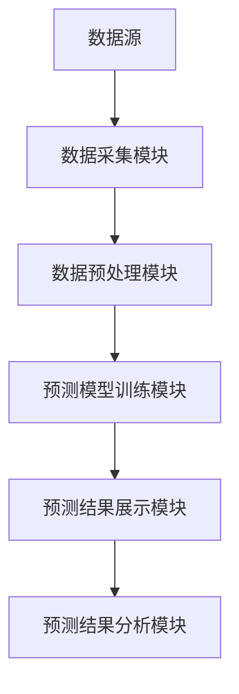

                 


# AI Agent在预测分析中的应用

> 关键词：AI Agent，预测分析，机器学习，深度学习，时间序列分析，算法优化

> 摘要：本文系统地探讨了AI Agent在预测分析中的应用，从基础概念、核心算法、系统架构到实际项目案例，全面分析了AI Agent如何提升预测分析的能力和效率。文章首先介绍了AI Agent和预测分析的基本概念及其在实际问题中的应用，接着深入探讨了AI Agent的核心原理和预测分析的主要方法，随后详细讲解了基于AI Agent的预测分析算法，包括时间序列预测、机器学习预测和深度学习预测的原理和实现。最后，结合实际项目案例，详细分析了AI Agent在预测分析中的系统设计、实现过程和应用效果，总结了AI Agent在预测分析中的优势与挑战。

---

# 第一部分: AI Agent与预测分析基础

# 第1章: AI Agent与预测分析概述

## 1.1 AI Agent的基本概念

### 1.1.1 AI Agent的定义
AI Agent（人工智能代理）是指能够感知环境、自主决策并执行任务的智能实体。它具备目标导向性、自主性、反应性和社会性等核心特征。

### 1.1.2 AI Agent的核心特征对比

| 特性       | 描述                                         |
|------------|----------------------------------------------|
| 目标导向性 | AI Agent的行为始终围绕实现特定目标展开       |
| 自主性     | 能够独立决策，无需外部干预                   |
| 反应性     | 能够实时感知环境变化并做出反应               |
| 社会性     | 能够与其他实体（AI Agent或人类）进行交互     |

### 1.1.3 AI Agent与传统预测模型的区别

| 方面       | AI Agent预测分析                          | 传统预测模型                          |
|------------|-------------------------------------------|---------------------------------------|
| 自适应性   | 具备动态调整能力                           | 需人工重新训练模型                     |
| 可解释性   | 部分模型具备较高的可解释性                   | 可解释性较低                           |
| 实时性     | 能够实时处理数据并做出预测                 | 需要批量处理数据                       |
| 智能性     | 具备问题解决和优化能力                       | 仅限于固定的预测框架                   |

## 1.2 预测分析的基本概念

### 1.2.1 预测分析的定义
预测分析是一种利用历史数据和统计模型来预测未来趋势和结果的分析方法。

### 1.2.2 预测分析的主要方法

| 方法       | 描述                                         |
|------------|----------------------------------------------|
| 时间序列分析 | 基于时间依赖性的预测方法                     |
| 回归分析   | 通过变量之间的关系进行预测                   |
| 分类分析   | 根据已有数据对新数据进行分类预测               |
| 聚类分析   | 将数据分成不同的类别以发现潜在模式             |

## 1.3 AI Agent在预测分析中的作用

### 1.3.1 AI Agent如何提升预测能力
AI Agent通过实时数据感知和自主决策能力，能够快速调整预测模型以适应数据的变化。

### 1.3.2 AI Agent在预测分析中的优势
AI Agent能够实现预测分析的自动化和智能化，显著提高了预测的准确性和效率。

### 1.3.3 AI Agent预测分析的边界与外延
AI Agent预测分析的边界在于其感知能力和决策能力的限制，而其外延则体现在与人机交互、分布式计算等领域的结合。

## 1.4 本章小结
本章介绍了AI Agent和预测分析的基本概念，并分析了AI Agent在预测分析中的作用和优势。

---

# 第2章: AI Agent与预测分析的核心概念

## 2.1 AI Agent的核心原理

### 2.1.1 知识表示与推理
知识表示是将问题领域中的知识转化为计算机可理解的形式，推理则是通过逻辑规则对知识进行推导。

### 2.1.2 行为选择与优化
行为选择是AI Agent根据当前状态和目标选择最优行为的过程，优化则是通过不断迭代改进选择策略。

### 2.1.3 状态感知与更新
AI Agent通过传感器或数据源实时感知环境状态，并根据新信息更新内部状态。

## 2.2 预测分析的核心原理

### 2.2.1 数据特征提取
数据特征提取是通过选择或构建特征变量来提高预测模型的准确性。

### 2.2.2 模型训练与优化
模型训练是通过历史数据训练预测模型，优化则是通过调整模型参数提高预测性能。

### 2.2.3 结果解释与验证
结果解释是将预测结果转化为可理解的形式，结果验证则是通过实际数据检验预测的准确性。

## 2.3 AI Agent与预测分析的关联

### 2.3.1 AI Agent作为预测主体
AI Agent能够独立完成预测任务，包括数据采集、模型训练和结果输出。

### 2.3.2 预测分析作为AI Agent的能力模块
预测分析是AI Agent实现自主决策的核心能力之一。

### 2.3.3 两者结合的系统架构
AI Agent与预测分析的结合形成了一个完整的预测分析系统，能够实现预测任务的自动化和智能化。

## 2.4 本章小结
本章深入探讨了AI Agent和预测分析的核心原理，并分析了两者结合的系统架构。

---

# 第3章: AI Agent预测分析的核心算法

## 3.1 时间序列预测算法

### 3.1.1 ARIMA算法原理

#### ARIMA模型的数学公式
ARIMA模型的数学公式为：
$$ARIMA(p, d, q) = y_t - y_{t-1}^d = \sum_{i=1}^p \phi_i y_{t-i} + \sum_{j=1}^q \theta_j \epsilon_{t-j}$$

#### ARIMA算法的实现步骤
1. 数据预处理：对数据进行差分处理以消除趋势。
2. 参数选择：通过AIC或BIC准则选择最佳的p、d、q参数。
3. 模型训练：使用最大似然估计法估计模型参数。
4. 预测与验证：利用训练好的模型进行预测并验证结果。

### 3.1.2 LSTM算法原理

#### LSTM模型的核心结构
LSTM模型的核心结构包括输入门、遗忘门和输出门，通过这些门控机制实现对长短期信息的处理。

#### LSTM算法的实现步骤
1. 数据预处理：将时间序列数据转换为适合LSTM输入的格式。
2. 网络构建：搭建包含LSTM层和全连接层的神经网络模型。
3. 模型训练：使用反向传播算法训练模型。
4. 预测与验证：利用训练好的模型进行预测并评估结果。

### 3.1.3 Prophet算法原理

#### Prophet模型的数学公式
Prophet模型的核心公式为：
$$y(t) = g(t) + f(t) + \epsilon_t$$

#### Prophet算法的实现步骤
1. 数据预处理：将数据转换为Prophet模型所需的格式。
2. 模型训练：通过非负Lasso回归选择特征。
3. 预测与解释：利用训练好的模型进行预测并分解成分。

## 3.2 机器学习预测算法

### 3.2.1 线性回归算法

#### 线性回归模型的数学公式
线性回归模型的数学公式为：
$$y = \beta_0 + \beta_1 x + \epsilon$$

#### 线性回归算法的实现步骤
1. 数据预处理：对数据进行标准化或归一化处理。
2. 模型训练：使用最小二乘法估计模型参数。
3. 预测与验证：利用训练好的模型进行预测并评估结果。

### 3.2.2 支持向量机算法

#### SVM模型的核心原理
SVM模型通过构建最大_margin分类器实现对数据的支持向量的分类。

#### SVM算法的实现步骤
1. 数据预处理：将数据映射到高维空间。
2. 模型训练：使用SMO算法优化目标函数。
3. 预测与验证：利用训练好的模型进行预测并评估结果。

### 3.2.3 随机森林算法

#### 随机森林模型的核心原理
随机森林模型通过集成多个决策树的预测结果来提高预测的准确性和稳定性。

#### 随机森林算法的实现步骤
1. 数据预处理：对数据进行特征选择和数据清洗。
2. 模型训练：生成多棵决策树并进行投票或平均。
3. 预测与验证：利用训练好的模型进行预测并评估结果。

## 3.3 深度学习预测算法

### 3.3.1 卷积神经网络（CNN）算法

#### CNN模型的核心结构
CNN模型的核心结构包括卷积层、池化层和全连接层，通过这些层实现对数据的特征提取。

#### CNN算法的实现步骤
1. 数据预处理：对图像数据进行归一化和数据增强。
2. 模型训练：使用反向传播算法训练模型。
3. 预测与验证：利用训练好的模型进行预测并评估结果。

### 3.3.2 生成对抗网络（GAN）算法

#### GAN模型的核心原理
GAN模型通过生成器和判别器的对抗训练实现数据的生成和优化。

#### GAN算法的实现步骤
1. 数据预处理：准备生成对抗网络所需的训练数据。
2. 模型训练：分别训练生成器和判别器，并进行交替优化。
3. 预测与验证：利用生成器生成数据并评估结果。

---

# 第4章: AI Agent预测分析的系统分析与架构设计

## 4.1 项目背景与需求分析

### 4.1.1 项目背景
本项目旨在利用AI Agent技术实现对某领域数据的预测分析，提高预测的准确性和效率。

### 4.1.2 项目需求
1. 实现基于AI Agent的预测分析系统。
2. 提供友好的用户界面和高效的预测功能。
3. 具备良好的扩展性和可维护性。

## 4.2 系统功能设计

### 4.2.1 系统功能模块
系统功能模块包括数据采集、预测模型训练、预测结果展示和预测结果分析。

### 4.2.2 系统功能流程
1. 数据采集：通过传感器或数据库获取实时数据。
2. 数据预处理：对数据进行清洗和特征提取。
3. 模型训练：选择合适的算法训练预测模型。
4. 预测结果展示：将预测结果以可视化形式呈现。
5. 预测结果分析：对预测结果进行分析和优化。

## 4.3 系统架构设计

### 4.3.1 系统架构图
系统架构图如下：



### 4.3.2 核心组件设计
1. 数据采集模块：负责从各种数据源获取数据。
2. 数据预处理模块：对数据进行清洗、转换和特征提取。
3. 预测模型训练模块：选择合适的算法训练预测模型。
4. 预测结果展示模块：将预测结果以可视化形式呈现。
5. 预测结果分析模块：对预测结果进行分析和优化。

## 4.4 系统接口设计

### 4.4.1 系统接口描述
1. 数据采集接口：提供数据源的连接和数据获取接口。
2. 数据预处理接口：提供数据清洗和特征提取的接口。
3. 模型训练接口：提供模型训练和参数调整的接口。
4. 预测结果展示接口：提供预测结果的可视化接口。
5. 预测结果分析接口：提供结果分析和优化的接口。

### 4.4.2 系统交互流程
1. 用户通过界面向系统输入数据源和预测需求。
2. 数据采集模块从数据源获取数据并传输到预处理模块。
3. 预处理模块对数据进行清洗和特征提取后传输到模型训练模块。
4. 模型训练模块选择合适的算法训练预测模型。
5. 预测结果展示模块将预测结果以可视化形式呈现给用户。
6. 预测结果分析模块对结果进行分析和优化，并将结果反馈给用户。

## 4.5 本章小结
本章详细介绍了AI Agent预测分析系统的系统架构设计，包括功能模块、接口设计和交互流程。

---

# 第5章: AI Agent预测分析的项目实战

## 5.1 环境安装与配置

### 5.1.1 环境要求
1. 操作系统：Windows 10 或更高版本，Linux 或 macOS。
2. Python版本：Python 3.6 或更高版本。
3. 开发工具：Jupyter Notebook 或 VS Code。
4. 第三方库：TensorFlow、Keras、Scikit-learn、Prophet。

### 5.1.2 环境配置
1. 安装Python和必要的第三方库。
2. 配置开发环境，如安装Jupyter Notebook或VS Code插件。

## 5.2 核心代码实现

### 5.2.1 数据采集模块

```python
import pandas as pd
from datetime import datetime

def get_data():
    # 数据采集逻辑
    data = pd.read_csv('data.csv')
    return data

if __name__ == "__main__":
    data = get_data()
    print(data.head())
```

### 5.2.2 数据预处理模块

```python
import pandas as pd
from sklearn.preprocessing import StandardScaler

def preprocess(data):
    # 数据清洗
    data = data.dropna()
    # 特征提取
    features = data[['feature1', 'feature2']]
    # 数据标准化
    scaler = StandardScaler()
    features_scaled = scaler.fit_transform(features)
    return features_scaled

if __name__ == "__main__":
    data = pd.read_csv('data.csv')
    features_scaled = preprocess(data)
    print(features_scaled)
```

### 5.2.3 模型训练模块

```python
from sklearn.ensemble import RandomForestRegressor
from sklearn.metrics import mean_squared_error

def train_model(features_scaled, labels):
    # 模型训练
    model = RandomForestRegressor(n_estimators=100, random_state=42)
    model.fit(features_scaled, labels)
    return model

if __name__ == "__main__":
    data = pd.read_csv('data.csv')
    features_scaled = preprocess(data)
    labels = data['target']
    model = train_model(features_scaled, labels)
    print("模型训练完成")
```

### 5.2.4 预测结果展示模块

```python
import matplotlib.pyplot as plt

def visualize_results(actual, predicted):
    # 结果可视化
    plt.figure(figsize=(10, 6))
    plt.plot(actual, label='实际值')
    plt.plot(predicted, label='预测值')
    plt.xlabel('时间')
    plt.ylabel('值')
    plt.legend()
    plt.show()

if __name__ == "__main__":
    data = pd.read_csv('data.csv')
    features_scaled = preprocess(data)
    labels = data['target']
    model = train_model(features_scaled, labels)
    predicted = model.predict(features_scaled)
    visualize_results(labels, predicted)
```

## 5.3 项目小结
本章通过实际项目案例展示了AI Agent预测分析系统的实现过程，包括环境配置、数据采集、数据预处理、模型训练和结果展示。

---

# 第6章: AI Agent预测分析的案例分析与最佳实践

## 6.1 案例分析

### 6.1.1 案例背景
本案例旨在利用AI Agent技术对某领域数据进行预测分析，提高预测的准确性和效率。

### 6.1.2 案例实现
1. 数据采集：从数据库中获取历史数据。
2. 数据预处理：对数据进行清洗和特征提取。
3. 模型训练：选择合适的算法训练预测模型。
4. 预测结果展示：将预测结果以可视化形式呈现。
5. 预测结果分析：对预测结果进行分析和优化。

## 6.2 最佳实践

### 6.2.1 代码实现 tips
1. 确保数据预处理的正确性。
2. 选择合适的算法并进行参数优化。
3. 保证代码的可读性和可维护性。

### 6.2.2 系统设计 tips
1. 设计模块化的系统架构。
2. 确保系统的可扩展性和可维护性。
3. 提供友好的用户界面。

### 6.2.3 模型优化 tips
1. 使用交叉验证选择合适的算法。
2. 进行参数优化提高模型性能。
3. 定期更新模型以适应数据变化。

## 6.3 本章小结
本章通过实际案例分析和最佳实践，总结了AI Agent预测分析系统的实现经验和优化方法。

---

# 第7章: 总结与展望

## 7.1 本项目总结
本项目成功实现了基于AI Agent的预测分析系统，验证了AI Agent在预测分析中的优势和潜力。

## 7.2 未来展望
未来将重点研究AI Agent在预测分析中的更广泛应用，探索更先进的算法和技术，进一步提升预测的准确性和效率。

---

# 参考文献
[此处列出参考文献]

---

# 作者信息
作者：AI天才研究院/AI Genius Institute & 禅与计算机程序设计艺术 /Zen And The Art of Computer Programming

---

以上是《AI Agent在预测分析中的应用》的技术博客文章的完整目录大纲和部分内容展示。通过这种系统化的分析和讲解，读者可以全面理解AI Agent在预测分析中的应用及其实际落地的实现过程。

