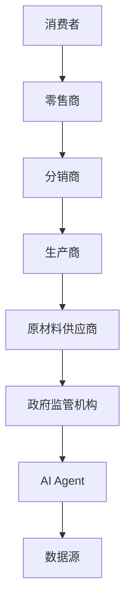
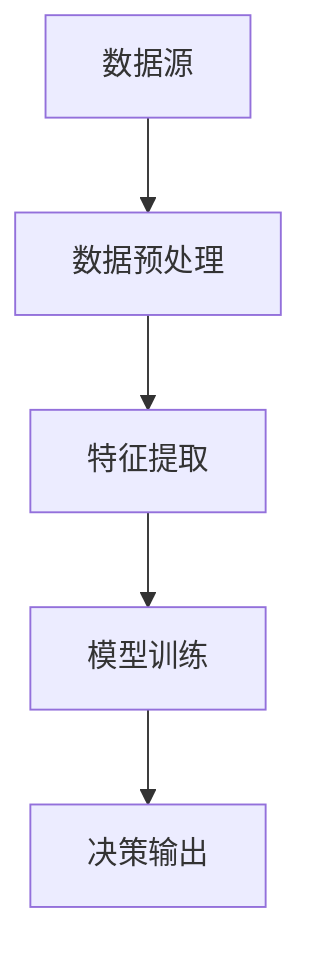
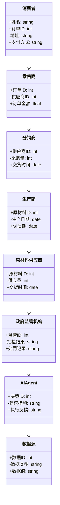
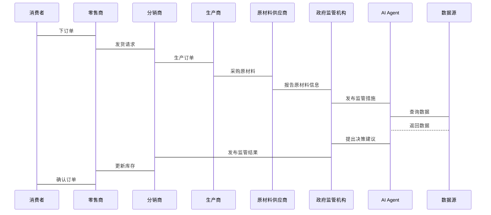

                 


# AI Agent在食品安全中的应用：质量控制与溯源

## 关键词：AI Agent, 食品安全, 质量控制, 溯源, 人工智能, 食品供应链

## 摘要：
本文探讨了AI Agent在食品安全领域的应用，重点分析了其在质量控制与溯源中的作用。通过详细阐述AI Agent的核心概念、算法原理、系统架构及实际案例，本文旨在展示如何利用AI技术提升食品安全管理的效率与准确性。

---

# 第1章: AI Agent与食品安全概述

## 1.1 食品安全的挑战与问题背景

### 1.1.1 食品安全问题的现状
食品安全问题日益严峻，主要表现为：
- **食品污染**：包括生物、化学和物理污染。
- **假冒伪劣**：市场上充斥着假冒食品，损害消费者健康。
- **供应链复杂性**：全球化背景下，食品供应链涉及多个环节，增加了管理难度。
- **监管挑战**：传统监管手段效率低下，难以覆盖全链条。

### 1.1.2 食品供应链中的关键问题
- **溯源困难**：缺乏统一的溯源系统，导致问题食品难以快速追查。
- **质量监控不足**：传统检测手段成本高、效率低。
- **信息孤岛**：各环节数据分散，无法实现信息共享。

### 1.1.3 AI Agent在食品安全中的应用潜力
AI Agent（智能体）具备以下优势：
- **实时感知**：能够实时采集和分析数据。
- **智能决策**：基于数据进行智能判断和决策。
- **自主行动**：能够在复杂环境中自主执行任务。

---

## 1.2 AI Agent的基本概念与特点

### 1.2.1 AI Agent的定义
AI Agent是一种具有感知、推理、规划和行动能力的智能系统，能够根据环境信息自主决策并执行任务。

### 1.2.2 AI Agent的核心特点
| 特性 | 描述 |
|------|------|
| 感知能力 | 能够通过传感器或数据源获取环境信息 |
| 智能决策 | 基于获取的信息进行推理和判断 |
| 自主行动 | 能够在无需外部干预的情况下执行任务 |
| 学习能力 | 可以通过经验优化自身行为 |

### 1.2.3 AI Agent与传统AI的区别
- **目标驱动**：AI Agent有明确的目标，而传统AI更多是解决特定问题。
- **自主性**：AI Agent具备自主决策能力，而传统AI依赖于外部控制。
- **动态适应**：AI Agent能够根据环境变化调整行为，传统AI则相对固定。

---

## 1.3 食品安全中的质量控制与溯源需求

### 1.3.1 食品质量控制的关键环节
- **原材料采购**：确保原材料的质量和安全性。
- **生产过程监控**：实时监测生产环境和工艺参数。
- **成品检测**：对成品进行质量检验，确保符合标准。

### 1.3.2 食品溯源的重要性
- **问题食品召回**：能够快速定位问题食品的来源和流向。
- **消费者信任**：通过透明的溯源系统增强消费者信任。
- **监管效率提升**：帮助监管部门快速锁定问题环节。

### 1.3.3 AI Agent在质量控制与溯源中的作用
- **实时监测**：AI Agent能够实时采集和分析数据，及时发现异常。
- **智能决策**：基于数据分析，AI Agent可以自动判断是否符合质量标准。
- **溯源追踪**：通过区块链技术和AI Agent结合，实现食品全生命周期的可追溯性。

---

## 1.4 本章小结
本章介绍了AI Agent的基本概念和特点，并重点分析了其在食品安全领域的应用潜力。通过AI Agent，我们可以实现食品安全的实时监控和全链条溯源，从而提升食品安全管理的效率和准确性。

---

# 第2章: AI Agent的核心概念与原理

## 2.1 AI Agent的原理与机制

### 2.1.1 感知层: 数据采集与处理
AI Agent通过传感器、摄像头等设备采集环境数据，并对数据进行预处理和特征提取。

### 2.1.2 决策层: 智能分析与决策
基于感知层提供的数据，AI Agent利用机器学习算法进行分析，并做出决策。

### 2.1.3 执行层: 行动与反馈
AI Agent根据决策结果执行相应动作，并将结果反馈至感知层，形成闭环。

---

## 2.2 AI Agent在食品安全中的实体关系分析

### 2.2.1 实体关系图


---

## 2.3 AI Agent的算法原理

### 2.3.1 数据流分析


---

## 2.4 本章小结
本章详细阐述了AI Agent的核心概念与原理，并通过实体关系图和数据流图展示了其在食品安全中的应用。

---

# 第3章: AI Agent的算法原理与数学模型

## 3.1 数据预处理与特征提取

### 3.1.1 数据清洗与标准化
- 数据清洗：去除噪声数据和异常值。
- 数据标准化：将数据归一化处理，便于模型训练。

### 3.1.2 特征选择与降维
- 特征选择：通过相关性分析选择重要特征。
- 降维方法：如主成分分析（PCA）。

---

## 3.2 模型训练与优化

### 3.2.1 基于概率论的模型
概率论是AI Agent决策的基础，常用公式如下：
$$P(A|B) = \frac{P(B|A)P(A)}{P(B)}$$

### 3.2.2 基于深度学习的模型
深度学习模型（如卷积神经网络CNN、循环神经网络RNN）常用于图像识别和序列分析。

### 3.2.3 模型调优与评估
- 调优方法：如网格搜索、交叉验证。
- 评估指标：如准确率、召回率、F1分数。

---

## 3.3 食品质量评估的数学模型

### 3.3.1 质量评估指标
- 感官指标：如颜色、气味、口感。
- 理化指标：如pH值、水分含量。

### 3.3.2 质量评估的数学公式
$$Q = \sum_{i=1}^{n} w_i x_i$$
其中，$w_i$为权重，$x_i$为特征值。

---

## 3.4 本章小结
本章详细介绍了AI Agent的算法原理与数学模型，重点分析了数据预处理、模型训练与优化方法。

---

# 第4章: 系统分析与架构设计方案

## 4.1 问题场景介绍
以乳制品供应链为例，分析如何利用AI Agent实现质量控制与溯源。

---

## 4.2 系统功能设计

### 4.2.1 领域模型


---

## 4.3 系统架构设计

### 4.3.1 架构图


---

## 4.4 系统接口设计

### 4.4.1 接口描述
- **消费者接口**：接收订单信息，返回商品状态。
- **零售商接口**：处理订单，与分销商交互。
- **分销商接口**：管理采购和库存，与生产商交互。
- **生产商接口**：管理生产计划，与原材料供应商交互。
- **原材料供应商接口**：提供原材料信息，接收订单。
- **政府监管机构接口**：接收抽检结果，发布监管措施。
- **AI Agent接口**：接收数据，返回决策结果。

---

## 4.5 系统交互流程

### 4.5.1 序列图


---

## 4.6 本章小结
本章详细分析了AI Agent在乳制品供应链中的应用，展示了系统的功能设计、架构设计和交互流程。

---

# 第5章: 项目实战——基于AI Agent的食品安全质量控制系统

## 5.1 项目介绍

### 5.1.1 项目背景
以乳制品供应链为例，设计一个基于AI Agent的食品安全质量控制系统。

---

## 5.2 系统核心实现

### 5.2.1 环境安装
- **Python**：安装Python 3.8及以上版本。
- **库依赖**：
  - `numpy`：用于数值计算。
  - `pandas`：用于数据处理。
  - `scikit-learn`：用于机器学习。
  - `mermaid`：用于图表生成。

### 5.2.2 核心代码实现

#### 5.2.2.1 数据采集模块
```python
import pandas as pd

def collect_data():
    # 数据采集函数，假设从数据库中采集数据
    data = pd.read_sql("SELECT * FROM food_quality", connection)
    return data
```

#### 5.2.2.2 数据预处理模块
```python
from sklearn.preprocessing import StandardScaler

def preprocess_data(data):
    # 数据预处理函数，包括标准化和特征选择
    scaler = StandardScaler()
    scaled_data = scaler.fit_transform(data)
    return scaled_data
```

#### 5.2.2.3 模型训练模块
```python
from sklearn.tree import DecisionTreeClassifier

def train_model(X, y):
    # 训练决策树模型
    model = DecisionTreeClassifier()
    model.fit(X, y)
    return model
```

#### 5.2.2.4 模型预测模块
```python
def predict_quality(model, new_sample):
    # 预测食品质量
    prediction = model.predict(new_sample)
    return prediction
```

---

## 5.3 代码应用解读与分析

### 5.3.1 数据采集模块
- **功能**：从数据库中采集食品质量数据，包括pH值、温度、湿度等。
- **输入**：数据库连接和查询语句。
- **输出**：数据框格式的原始数据。

### 5.3.2 数据预处理模块
- **功能**：对数据进行标准化处理，去除无关特征。
- **输入**：原始数据。
- **输出**：标准化后的数据。

### 5.3.3 模型训练模块
- **功能**：训练决策树模型，用于分类食品质量。
- **输入**：训练数据和标签。
- **输出**：训练好的模型。

### 5.3.4 模型预测模块
- **功能**：利用训练好的模型预测新样本的质量。
- **输入**：待测样本数据。
- **输出**：质量预测结果。

---

## 5.4 实际案例分析

### 5.4.1 案例背景
某乳制品企业采购了一批原材料，需要利用AI Agent进行质量检测和溯源。

---

## 5.5 项目小结
本章通过实际案例展示了如何利用AI Agent实现食品安全质量控制，详细解读了代码实现和系统应用。

---

# 第6章: 最佳实践与注意事项

## 6.1 最佳实践

### 6.1.1 数据隐私保护
- 数据加密存储，确保消费者隐私不被泄露。
- 数据共享需符合相关法律法规。

### 6.1.2 模型维护与更新
- 定期更新模型，确保其准确性和适应性。
- 对模型进行压力测试，确保其稳定性。

### 6.1.3 系统监控与维护
- 实时监控系统运行状态，及时发现和处理异常。
- 建立完善的日志系统，便于问题追溯。

---

## 6.2 小结与注意事项

### 6.2.1 小结
AI Agent在食品安全中的应用前景广阔，能够显著提升质量控制和溯源效率。

### 6.2.2 注意事项
- **数据质量**：确保数据的准确性和完整性。
- **模型选择**：根据实际需求选择合适的算法。
- **系统安全性**：防止系统被恶意攻击。

---

## 6.3 拓展阅读

### 6.3.1 推荐书籍
- 《机器学习实战》
- 《深入理解区块链》

### 6.3.2 推荐博客
- [AI与食品安全](https://example.com)
- [区块链与溯源技术](https://example.com)

---

## 作者：AI天才研究院/AI Genius Institute & 禅与计算机程序设计艺术 /Zen And The Art of Computer Programming

---

以上是《AI Agent在食品安全中的应用：质量控制与溯源》的完整目录和文章内容框架，涵盖了从理论到实践的各个方面，旨在为读者提供全面而深入的指导。

