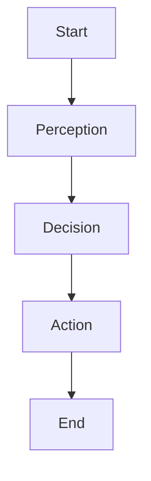
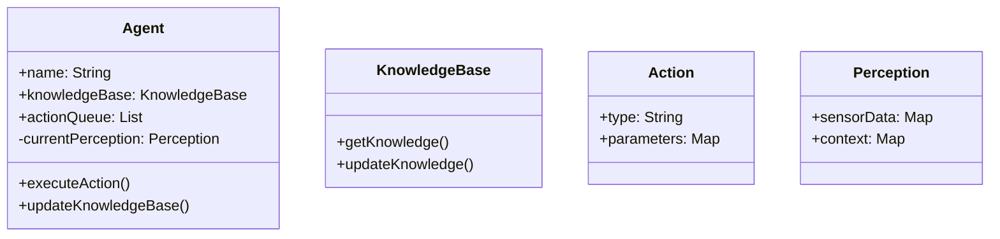
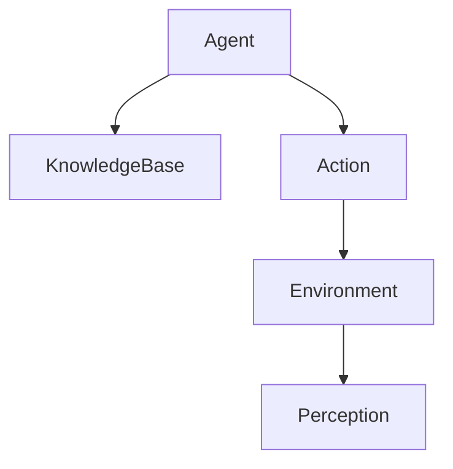
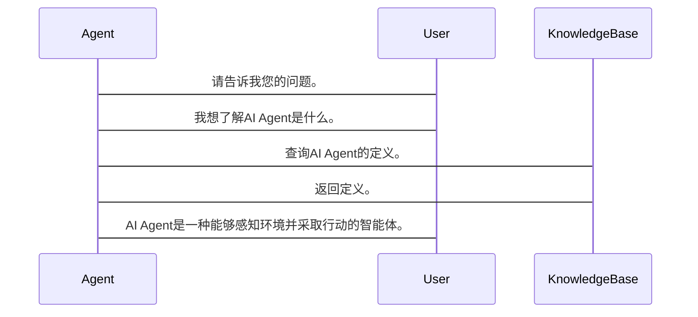

                 


# AI Agent基础概念介绍

> 关键词：AI Agent, 人工智能, 机器学习, 系统架构, 算法原理

> 摘要：AI Agent（人工智能代理）是一种能够感知环境并采取行动以实现目标的智能体。本文将从基础概念、核心原理、算法实现、系统架构到实际应用，全面介绍AI Agent的相关知识。通过详细的原理分析和实际案例，帮助读者理解AI Agent的设计与实现过程。

---

## 第1章: AI Agent概述

### 1.1 AI Agent的基本概念

#### 1.1.1 什么是AI Agent
AI Agent（人工智能代理）是一种智能体，能够感知环境、自主决策并采取行动以实现目标。AI Agent可以是软件程序、机器人或其他智能系统。

#### 1.1.2 AI Agent的定义与特点
- **定义**：AI Agent是具有自主性、反应性、目标导向和社交能力的智能体。
- **特点**：
  1. 自主性：能够在没有外部干预的情况下运行。
  2. 反应性：能够感知环境并实时调整行为。
  3. 目标导向：基于目标进行决策和行动。
  4. 适应性：能够通过学习和自适应来改进性能。

#### 1.1.3 AI Agent的核心要素
1. **感知**：通过传感器或数据输入感知环境。
2. **决策**：基于感知信息做出决策。
3. **行动**：执行决策结果，影响环境。
4. **知识库**：存储和处理相关知识和经验。

### 1.2 AI Agent的分类

#### 1.2.1 简单反射式Agent
- 仅根据当前感知做出反应，没有内部状态或目标。

#### 1.2.2 基于模型的反射式Agent
- 维护内部状态和环境模型，能够预测未来状态。

#### 1.2.3 目标驱动式Agent
- 以目标为导向，通过规划和推理来实现目标。

#### 1.2.4 计划式Agent
- 具备复杂规划能力，能够处理多步骤任务。

#### 1.2.5 学习式Agent
- 能够通过学习改进性能，适应新环境。

### 1.3 AI Agent的应用场景

#### 1.3.1 个人助手
- 如 Siri、Alexa 等，帮助用户完成日常任务。

#### 1.3.2 智能客服
- 自动处理客户咨询和问题解决。

#### 1.3.3 自动交易
- 在金融市场中进行自动交易和投资决策。

#### 1.3.4 智能家居
- 控制家中设备，优化能源使用和居住体验。

#### 1.3.5 游戏AI
- 在游戏中扮演玩家角色或对手，提供智能交互。

### 1.4 本章小结
本章介绍了AI Agent的基本概念、分类和应用场景，为后续章节奠定了基础。

---

## 第2章: AI Agent的核心概念与联系

### 2.1 AI Agent的核心原理

#### 2.1.1 感知与决策
- 感知：通过传感器或数据输入获取环境信息。
- 决策：基于感知信息选择最优行动方案。

#### 2.1.2 行为与交互
- 行为：根据决策结果执行具体操作。
- 交互：与环境或其他Agent进行信息交换。

#### 2.1.3 知识与推理
- 知识表示：将知识以结构化形式存储。
- 推理：通过逻辑推理得出新的结论。

### 2.2 AI Agent的属性特征对比

| 属性 | 简单反射式Agent | 基于模型的反射式Agent | 目标驱动式Agent | 计划式Agent | 学习式Agent |
|------|------------------|-----------------------|-----------------|------------|------------|
| 自主性 | 低               | 中                    | 高              | 高         | 高         |
| 反应性 | 高               | 高                    | 中              | 中         | 中         |
| 目标导向 | 低               | 中                    | 高              | 高         | 高         |
| 适应性 | 低               | 中                    | 中              | 中         | 高         |

### 2.3 AI Agent的ER实体关系图

```mermaid
erd
    客户
    项目
    任务
    用户
    知识库
    行为
    决策
    感知
    环境
```

### 2.4 本章小结
本章通过核心原理和属性对比，深入分析了AI Agent的内在联系。

---

## 第3章: AI Agent的算法原理

### 3.1 AI Agent的核心算法

#### 3.1.1 搜索算法
- **广度优先搜索 (BFS)**：适用于寻找最短路径的问题。
- **深度优先搜索 (DFS)**：适用于探索未知领域的问题。

#### 3.1.2 机器学习算法
- **监督学习**：基于标记数据进行分类或回归。
- **无监督学习**：通过聚类发现数据中的隐藏结构。
- **强化学习**：通过奖励机制优化决策策略。

#### 3.1.3 自然语言处理算法
- **分词**：将文本分割成词语或短语。
- **句法分析**：分析句子的语法结构。
- **情感分析**：判断文本的情感倾向。

### 3.2 AI Agent的算法流程图



### 3.3 AI Agent的数学模型

#### 3.3.1 搜索算法的数学模型
$$f(n) = g(n) + h(n)$$
其中，$g(n)$ 表示从起点到当前节点的已知成本，$h(n)$ 表示从当前节点到目标节点的估计成本。

#### 3.3.2 机器学习算法的数学模型
$$y = \theta^T x + b$$
其中，$\theta$ 是参数，$x$ 是输入，$b$ 是偏置。

### 3.4 本章小结
本章通过算法原理和数学模型，详细讲解了AI Agent的核心技术。

---

## 第4章: AI Agent的系统分析与架构设计

### 4.1 项目背景与需求分析

#### 4.1.1 项目背景
- 开发一个智能客服AI Agent，用于自动处理客户咨询。

#### 4.1.2 需求分析
- 实现客户咨询的自动响应。
- 支持多轮对话和上下文理解。

### 4.2 系统功能设计

#### 4.2.1 领域模型



### 4.3 系统架构设计

#### 4.3.1 系统架构图



#### 4.3.2 接口设计
- **API接口**：提供RESTful API供其他系统调用。
- **数据接口**：与数据库或其他数据源进行交互。

#### 4.3.3 交互流程



### 4.4 本章小结
本章通过系统分析和架构设计，展示了AI Agent的实际应用过程。

---

## 第5章: AI Agent的项目实战

### 5.1 项目背景与目标

#### 5.1.1 项目背景
- 开发一个简单的AI Agent，用于自动回答常见问题。

#### 5.1.2 项目目标
- 实现基本的问答功能。
- 支持简单的上下文理解。

### 5.2 系统核心实现

#### 5.2.1 环境配置
```bash
pip install python
pip install numpy
pip install scikit-learn
```

#### 5.2.2 核心代码实现

```python
class Agent:
    def __init__(self, knowledge_base):
        self.knowledge_base = knowledge_base
        self.perception = None

    def execute_action(self):
        # 根据当前感知做出决策并执行动作
        pass

    def update_knowledge_base(self):
        # 更新知识库
        pass

def main():
    kb = KnowledgeBase()
    agent = Agent(kb)
    agent.perception = Perception(sensors_input)
    agent.execute_action()

if __name__ == "__main__":
    main()
```

#### 5.2.3 代码应用解读与分析
- **知识库**：存储常见问题及答案。
- **感知**：接收用户输入并解析。
- **决策**：根据感知信息选择合适的回答。
- **行动**：通过API返回结果。

### 5.3 实际案例分析

#### 5.3.1 案例分析
- 用户输入：我需要了解AI Agent是什么？
- 系统处理：查询知识库，返回定义。

### 5.4 本章小结
本章通过实际案例分析，展示了AI Agent的实现过程。

---

## 第6章: 总结与展望

### 6.1 本章总结
AI Agent是一种能够感知环境、自主决策并采取行动的智能体。本文从基础概念、核心原理、算法实现到系统架构和实际应用，全面介绍了AI Agent的相关知识。

### 6.2 注意事项
- 在实际应用中，需注意数据安全和隐私保护。
- 需根据具体场景选择合适的算法和架构。

### 6.3 未来展望
- 随着AI技术的发展，AI Agent将更加智能化和个性化。
- 在更多领域实现广泛应用，推动智能化社会的发展。

### 6.4 作者
作者：AI天才研究院/AI Genius Institute & 禅与计算机程序设计艺术 /Zen And The Art of Computer Programming

---

# 结束语
通过本文的详细介绍，读者可以全面掌握AI Agent的基础知识，并能够将其应用于实际场景中。

