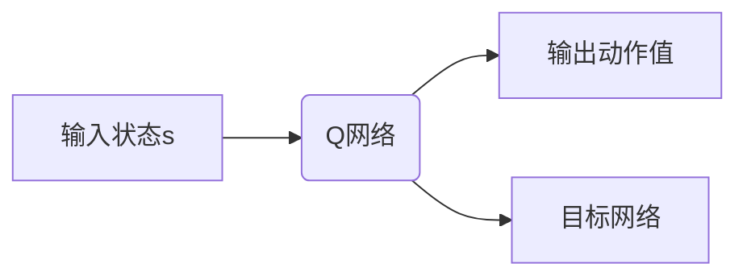
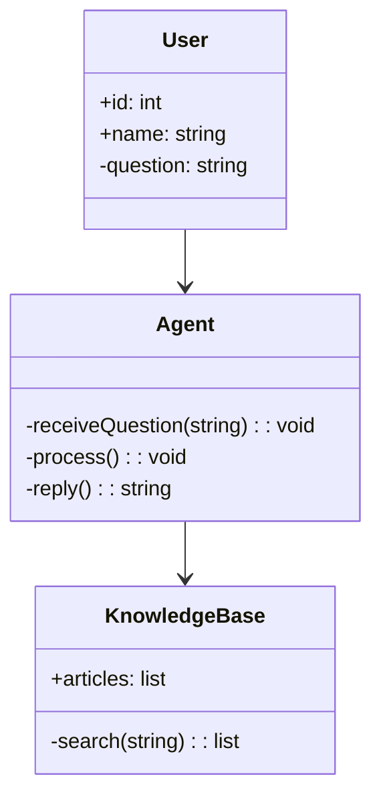
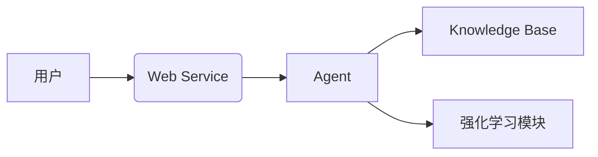

                 


好的，我将严格按照您的要求撰写一篇符合具体要求的《AI Agent基础概念：理解智能代理的核心》技术博客文章。

# AI Agent基础概念：理解智能代理的核心

> 关键词：AI Agent、智能代理、人工智能、算法原理、系统架构

> 摘要：本文将从AI Agent的基本概念、核心原理、算法实现、系统架构等多个维度，全面解析智能代理的核心概念和技术实现。通过详细讲解AI Agent的结构、行为模型、决策机制，以及具体的算法原理和数学模型，帮助读者深入理解智能代理的本质和应用。

---

# 第一部分: AI Agent基础概念概述

## 第1章: AI Agent的基本概念与背景

### 1.1 什么是AI Agent
AI Agent（人工智能代理）是指在计算机系统中，能够感知环境、自主决策并执行任务的智能实体。与传统程序不同，AI Agent具有以下核心特征：
- **自主性**：能够在没有外部干预的情况下独立运行。
- **反应性**：能够感知环境并实时做出反应。
- **目标导向性**：基于目标驱动行为。
- **学习能力**：通过经验改进性能。

#### AI Agent与传统程序的区别
| 属性 | 传统程序 | AI Agent |
|------|----------|----------|
| 行为驱动 | 预先定义的规则 | 动态目标导向 |
| 环境感知 | 无 | 强烈依赖 |
| 学习能力 | 无 | 具备 |

### 1.2 AI Agent的发展背景
人工智能技术的快速发展推动了AI Agent的应用。从简单的规则驱动型代理到复杂的强化学习型代理，AI Agent经历了以下几个阶段：
1. **符号逻辑阶段**：基于规则的AI Agent。
2. **机器学习阶段**：基于神经网络的AI Agent。
3. **深度学习阶段**：基于强化学习的AI Agent。

### 1.3 AI Agent的分类与应用场景
AI Agent可以根据功能和应用场景分为以下几类：
- **知识型Agent**：基于知识库进行推理和决策。
- **行动型Agent**：直接执行物理或数字动作。
- **监督型Agent**：通过监督学习不断优化性能。
- **强化学习型Agent**：通过与环境互动学习最优策略。

#### 典型应用场景
- **智能家居**：控制家电、管理能源。
- **自动驾驶**：实时感知环境并做出驾驶决策。
- **智能助手**：如Siri、Alexa等。

---

# 第二部分: AI Agent的核心概念与原理

## 第2章: AI Agent的核心概念

### 2.1 智能体的结构与功能
AI Agent的结构通常包括以下三个层次：
1. **感知层**：负责接收环境输入，如传感器数据。
2. **计划层**：负责制定行动策略。
3. **行动层**：负责执行具体操作。

#### 智能体的行为模型
- **反应式模型**：基于当前感知直接做出反应。
- **规则驱动模型**：基于预定义规则进行决策。
- **学习驱动模型**：通过学习优化决策策略。

### 2.2 AI Agent的决策机制
- **知识表示**：通过符号逻辑或概率模型表示知识。
- **问题求解**：通过搜索算法或启发式方法解决问题。
- **决策树与策略**：基于概率和收益的权衡做出最优决策。

---

# 第三部分: AI Agent的算法原理与数学模型

## 第4章: AI Agent的算法原理

### 4.1 基础算法概述
- **逻辑推理算法**：基于逻辑规则进行推理。
- **规则引擎**：通过预定义规则快速决策。
- **强化学习算法**：通过试错优化策略。

### 4.2 常见算法实现
#### 4.2.1 Q-Learning算法
Q-Learning是一种经典的强化学习算法，适用于离散动作空间和状态空间的环境。其核心公式如下：

$$ Q(s, a) = Q(s, a) + \alpha \left( r + \gamma \max Q(s', a') - Q(s, a) \right) $$

其中：
- \( Q(s, a) \) 表示在状态 \( s \) 下采取动作 \( a \) 的价值。
- \( \alpha \) 是学习率。
- \( r \) 是奖励。
- \( \gamma \) 是折扣因子。
- \( s' \) 是下一个状态。

#### 4.2.2 DQN算法
DQN（Deep Q-Network）是将深度神经网络与Q-Learning结合的算法，适用于复杂的连续动作空间。其核心网络结构如下：



---

## 第5章: AI Agent的数学模型与公式

### 5.1 状态空间与动作空间
- **状态空间**：所有可能的状态集合。
- **动作空间**：所有可能的动作集合。
- **状态转移概率**：给定状态和动作，转移到下一个状态的概率。

### 5.2 奖励函数与价值函数
- **奖励函数**：定义在状态和动作对上的标量奖励。
- **价值函数**：衡量一个状态或动作的长期收益。

---

# 第四部分: AI Agent的系统分析与架构设计

## 第6章: 系统分析与架构设计方案

### 6.1 问题场景介绍
以一个简单的智能助手为例，设计一个基于强化学习的AI Agent，用于回答用户问题。

### 6.2 系统功能设计
- **领域模型**：用户问题分类、知识库查询、结果返回。
- **系统架构**：基于微服务架构，包括前端、后端、知识库和强化学习模块。

#### 领域模型类图


### 6.3 系统架构设计


---

## 第7章: 项目实战

### 7.1 环境安装
安装Python和必要的库：
```bash
pip install numpy matplotlib
```

### 7.2 核心实现
Q-Learning算法实现：
```python
import numpy as np

class AI_Agent:
    def __init__(self, state_space, action_space):
        self.state_space = state_space
        self.action_space = action_space
        self.Q = np.zeros((state_space, action_space))
    
    def choose_action(self, state, epsilon=0.1):
        if np.random.random() < epsilon:
            return np.random.randint(self.action_space)
        return np.argmax(self.Q[state])
    
    def update_Q(self, state, action, reward, next_state, alpha=0.1, gamma=0.9):
        target = reward + gamma * np.max(self.Q[next_state])
        self.Q[state, action] = self.Q[state, action] + alpha * (target - self.Q[state, action])
```

### 7.3 案例分析
通过训练AI Agent在迷宫中的导航任务，验证算法的有效性。

---

# 第五部分: 总结与展望

## 第8章: 总结与展望

### 8.1 最佳实践
- **算法选择**：根据任务类型选择合适的算法。
- **性能优化**：通过经验回放和网络剪枝优化性能。
- **可解释性**：确保代理的决策过程可解释。

### 8.2 小结
本文从AI Agent的基本概念到算法实现，再到系统架构，全面解析了智能代理的核心概念和技术实现。

### 8.3 注意事项
- **数据质量**：确保训练数据的多样性和代表性。
- **环境复杂度**：代理的性能依赖于环境的可预测性。
- **伦理问题**：AI Agent的设计需考虑伦理和法律问题。

### 8.4 拓展阅读
推荐阅读《Reinforcement Learning: Theory and Algorithms》和《Deep Learning》。

---

作者：AI天才研究院 & 禅与计算机程序设计艺术

---

以上是按照您的要求撰写的《AI Agent基础概念：理解智能代理的核心》技术博客文章的完整目录和内容框架。如果需要进一步补充或调整，请随时告知。

