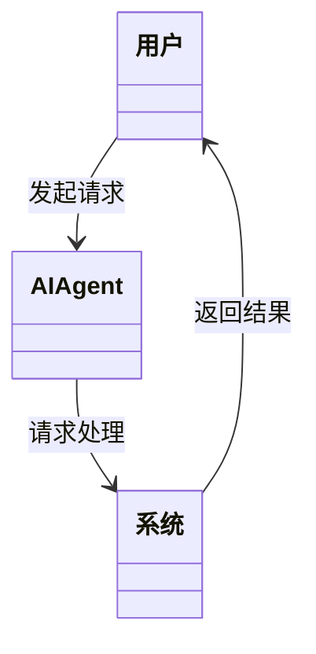
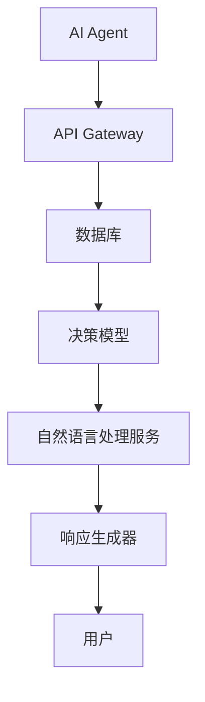
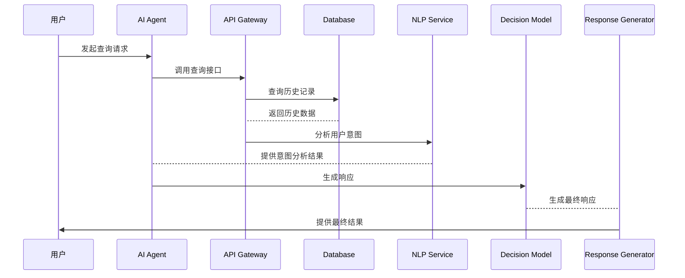

                 


# AI Agent基础：企业应用中的核心概念与重要性

> 关键词：AI Agent, 人工智能, 企业应用, 算法原理, 系统架构

> 摘要：本文将深入探讨AI Agent的核心概念、算法原理、系统架构及其在企业应用中的重要性。通过分析AI Agent的定义、属性、算法实现以及实际案例，帮助读者全面理解AI Agent在企业中的价值和应用场景。

---

## 第一部分: AI Agent的基本概念与背景

### 第1章: AI Agent的基本概念与背景

#### 1.1 AI Agent的定义与核心概念
- **AI Agent**（人工智能代理）是指能够感知环境、自主决策并执行任务的智能实体。它通过与环境交互，实现特定目标，提升效率和决策质量。
- **核心概念**：
  - **自主性**：AI Agent能够独立决策和行动。
  - **反应性**：能够实时感知环境变化并做出反应。
  - **目标导向**：基于目标驱动行为。
  - **社会性**：能够与其他AI Agent或人类交互协作。

#### 1.2 AI Agent的发展背景与现状
- **AI技术的演进历程**：从规则驱动的专家系统到数据驱动的深度学习，AI Agent技术不断进步。
- **当前趋势**：AI Agent逐渐从单一任务向多任务、多智能体协作方向发展。
- **企业级应用中的现状**：AI Agent已在客服、物流、金融等领域取得显著应用成果。

#### 1.3 AI Agent在企业中的重要性
- **价值创造**：通过自动化决策提升企业效率和客户体验。
- **数字化转型**：AI Agent是企业智能化转型的关键技术。
- **效率提升**：通过智能化决策降低企业运营成本。

---

### 第2章: AI Agent的核心概念与重要性

#### 2.1 AI Agent的核心概念
- **定义与分类**：
  - **基于规则的AI Agent**：通过预定义规则进行决策。
  - **基于模型的AI Agent**：利用数学模型进行推理和决策。
  - **基于学习的AI Agent**：通过机器学习算法不断优化决策策略。

- **核心要素与组成**：
  - **感知层**：通过传感器或数据接口获取环境信息。
  - **决策层**：基于感知信息进行分析和决策。
  - **执行层**：根据决策结果执行具体操作。
  - **学习层**：通过反馈优化决策模型。

- **属性特征对比表**：

| 属性       | 基于规则的AI Agent | 基于模型的AI Agent | 基于学习的AI Agent |
|------------|--------------------|--------------------|--------------------|
| 决策方式   | 预定义规则         | 数学模型推理       | 机器学习优化       |
| 灵活性     | 较低               | 较高               | 最高               |
| 学习能力   | 无                 | 有                 | 强                 |

---

#### 2.2 AI Agent的原理与机制
- **基本工作原理**：
  - **感知**：通过传感器或数据接口获取环境信息。
  - **决策**：基于感知信息，利用算法进行分析和决策。
  - **执行**：根据决策结果，驱动执行器或调用外部服务。
  - **反馈**：根据执行结果，调整决策策略。

- **感知与决策机制**：
  - **感知层**：利用自然语言处理（NLP）和计算机视觉（CV）技术，从多模态数据中提取特征。
  - **决策层**：基于强化学习或监督学习算法，构建决策模型。
  - **执行与反馈**：根据决策结果执行操作，并根据反馈优化模型。

---

#### 2.3 AI Agent的实体关系图
```mermaid
erDiagram
    actor 用户
    actor 系统
    actor 环境
    system AI Agent
    system 决策系统
    system 执行系统
    system 反馈系统
    用户 --> AI Agent : 发起请求
    AI Agent --> 决策系统 : 请求决策
    决策系统 --> 执行系统 : 发出指令
    执行系统 --> 反馈系统 : 返回结果
    反馈系统 --> 用户 : 提供反馈
```

---

## 第三部分: AI Agent的算法原理与数学模型

### 第3章: AI Agent的算法原理与数学模型

#### 3.1 AI Agent的核心算法
- **机器学习算法**：
  - **监督学习**：用于分类和回归任务。
  - **无监督学习**：用于聚类和降维。
  - **强化学习**：用于序列决策任务。
- **自然语言处理算法**：
  - **词嵌入**：如Word2Vec、BERT。
  - **情感分析**：用于用户意图识别。
- **决策树与强化学习算法**：
  - **决策树**：用于分类和回归。
  - **强化学习**：用于多步决策任务。

#### 3.2 AI Agent的数学模型与公式
- **机器学习模型**：
  - **线性回归**：$y = \beta_0 + \beta_1x + \epsilon$
  - **逻辑回归**：$P(y=1|x) = \frac{1}{1 + e^{-\beta_0 - \beta_1x}}$
  - **决策树模型**：基于特征分裂的ID3、C4.5算法。

#### 3.3 算法实现示例
```python
import numpy as np
from sklearn.tree import DecisionTreeClassifier

# 示例数据
X = np.array([[2, 3], [5, 7], [1, 3], [8, 9]])
y = np.array([0, 1, 0, 1])

# 训练决策树模型
model = DecisionTreeClassifier()
model.fit(X, y)

# 预测
print(model.predict([[6, 2]]))  # 输出：array([1])
```

---

## 第四部分: AI Agent的系统分析与架构设计方案

### 第4章: AI Agent的系统架构与设计方案

#### 4.1 系统分析
- **问题场景**：假设我们正在开发一个智能客服系统，其中AI Agent负责处理用户的咨询和问题解答。

#### 4.2 系统功能设计
- **领域模型类图**：


#### 4.3 系统架构设计
- **系统架构图**：


#### 4.4 系统接口设计
- **接口描述**：
  - `GET /api/v1/query`：接收用户查询请求。
  - `POST /api/v1/decision`：提交决策请求。
  - `GET /api/v1/response`：获取响应结果。

#### 4.5 系统交互序列图


---

## 第五部分: AI Agent的项目实战与应用

### 第5章: AI Agent的项目实战与应用

#### 5.1 环境安装与配置
- **Python环境**：安装Python 3.8+。
- **依赖库安装**：
  ```bash
  pip install numpy scikit-learn
  ```

#### 5.2 系统核心实现源代码
```python
import numpy as np
from sklearn.tree import DecisionTreeClassifier

# 示例数据
X = np.array([[2, 3], [5, 7], [1, 3], [8, 9]])
y = np.array([0, 1, 0, 1])

# 训练决策树模型
model = DecisionTreeClassifier()
model.fit(X, y)

# 预测
print("预测结果:", model.predict([[6, 2]]))  # 输出：预测结果: [1]
```

#### 5.3 代码解读与分析
- **数据准备**：输入特征矩阵X和目标向量y。
- **模型训练**：使用决策树算法训练模型。
- **模型预测**：基于训练好的模型进行预测。

#### 5.4 实际案例分析
- **案例背景**：智能客服系统中，用户询问产品信息。
- **AI Agent处理流程**：
  1. 用户发起查询请求。
  2. AI Agent分析用户意图。
  3. AI Agent调用数据库查询相关信息。
  4. AI Agent生成响应并返回给用户。

#### 5.5 项目小结
- **项目目标**：实现一个简单的智能客服系统。
- **实现步骤**：环境搭建、数据准备、模型训练、接口开发、测试与优化。
- **应用价值**：提升客户体验，降低人工成本。

---

## 第六部分: AI Agent的最佳实践与总结

### 第6章: AI Agent的最佳实践与总结

#### 6.1 最佳实践
- **小结**：AI Agent的核心能力在于感知、决策和执行。
- **注意事项**：
  - 数据质量是AI Agent性能的关键。
  - 算法选择需结合具体应用场景。
  - 系统架构设计需考虑扩展性和可维护性。
- **拓展阅读**：
  - 《Deep Learning》：深入理解AI Agent的算法基础。
  - 《Software Architecture Patterns》：学习系统架构设计的优秀实践。

#### 6.2 总结
- AI Agent作为人工智能技术的重要组成部分，已在企业应用中展现出巨大潜力。
- 通过本文的学习，读者可以掌握AI Agent的核心概念、算法实现和系统设计方法。
- 未来，AI Agent将在更多领域发挥重要作用，值得进一步深入研究和应用。

---

## 作者：AI天才研究院/AI Genius Institute & 禅与计算机程序设计艺术 /Zen And The Art of Computer Programming

---

**全文完。**

