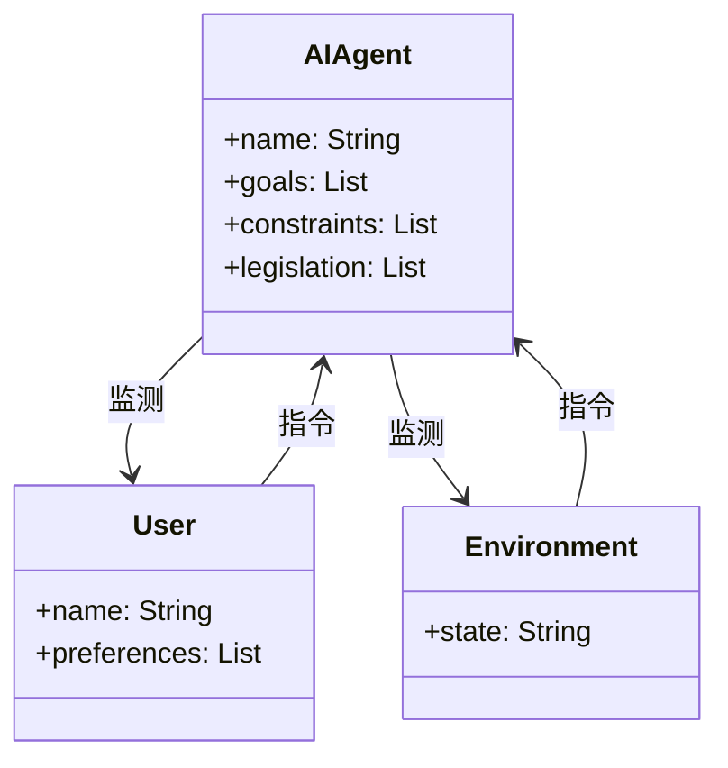
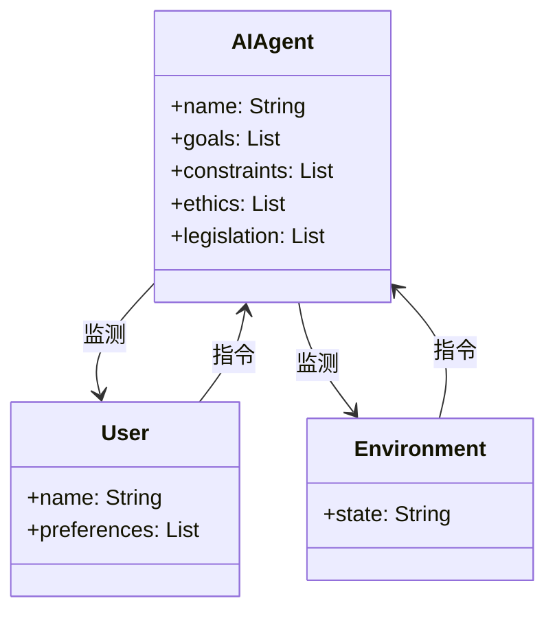

                 


# AI Agent开发中的伦理考量与法律风险

> 关键词：AI Agent, 伦理考量, 法律风险, 系统架构, 案例分析

> 摘要：本文探讨了AI Agent开发中的伦理与法律问题，分析了其对AI Agent设计和应用的影响，并提出了相应的解决方案和实践建议。

---

# 第一部分: AI Agent开发中的伦理考量与法律风险背景介绍

## 第1章: AI Agent的核心概念与背景

### 1.1 问题背景

#### 1.1.1 AI Agent的定义与分类
AI Agent（人工智能代理）是指能够感知环境、自主决策并采取行动以实现特定目标的智能实体。根据功能和应用场景的不同，AI Agent可以分为以下几类：
- **简单反射型代理**：基于固定的规则做出反应，适用于简单任务。
- **基于模型的反射型代理**：使用内部模型来表示世界状态，适用于复杂任务。
- **目标驱动型代理**：根据目标选择最优行动。
- **效用驱动型代理**：通过最大化效用函数来决策。

#### 1.1.2 AI Agent的演进历程
AI Agent的概念起源于人工智能领域的研究，经历了从专家系统到机器学习模型的演变。近年来，随着深度学习和强化学习技术的发展，AI Agent在游戏AI、自动驾驶、智能助手等领域得到了广泛应用。

#### 1.1.3 当前AI Agent技术的现状与趋势
当前，AI Agent技术呈现出以下几个发展趋势：
1. **多智能体协作**：AI Agent不再孤立运作，而是通过协作实现更复杂的任务。
2. **人机协作**：AI Agent与人类用户共同完成任务，强调人机交互的自然性。
3. **边缘计算**：AI Agent逐渐向边缘计算方向发展，以减少延迟和依赖云服务。

### 1.2 问题描述

#### 1.2.1 AI Agent开发中的伦理问题
AI Agent的开发和应用涉及诸多伦理问题，包括：
- **隐私保护**：AI Agent可能收集和处理大量用户数据，如何保护用户隐私成为一个挑战。
- **透明度**：AI Agent的决策过程是否透明，用户是否有权了解AI Agent的决策依据。
- **公平性**：AI Agent是否在决策过程中存在偏见，是否对不同用户公平对待。

#### 1.2.2 AI Agent开发中的法律风险
AI Agent的法律风险主要体现在以下几个方面：
- **数据主权**：AI Agent可能涉及跨境数据流动，如何处理不同国家的法律法规。
- **责任分配**：当AI Agent的行为导致损害时，责任应由谁承担。
- **合规性**：AI Agent的设计和应用是否符合相关法律法规。

#### 1.2.3 伦理与法律问题对AI Agent开发的影响
伦理和法律问题对AI Agent的开发和应用有着深远的影响：
- 伦理问题影响AI Agent的设计目标和决策规则。
- 法律风险可能限制AI Agent的应用范围，甚至导致法律纠纷。

### 1.3 问题解决

#### 1.3.1 伦理考量在AI Agent开发中的重要性
伦理考量是AI Agent开发的核心要素之一，它决定了AI Agent是否符合人类社会的价值观和道德标准。

#### 1.3.2 法律风险对AI Agent开发的约束
法律风险是AI Agent开发中的一个重要挑战，它要求开发者在设计和应用过程中必须遵守相关法律法规。

#### 1.3.3 伦理与法律问题的相互作用
伦理与法律问题相互作用，共同影响AI Agent的开发和应用。伦理问题为法律提供了道德基础，而法律为伦理提供了实施保障。

### 1.4 边界与外延

#### 1.4.1 AI Agent与其他AI技术的边界
AI Agent与其他AI技术（如机器学习模型）的边界在于其自主性和目标导向性。AI Agent不仅需要处理数据，还需要根据目标采取行动。

#### 1.4.2 伦理与法律问题的外延
伦理与法律问题的外延涉及更广泛的社会、经济和文化因素。AI Agent的伦理和法律问题不仅仅是技术问题，还涉及到社会规范和价值观念。

#### 1.4.3 伦理与法律问题的复杂性
伦理与法律问题的复杂性体现在其动态性和多学科交叉性。随着技术的发展和社会的变化，伦理和法律问题也在不断变化。

### 1.5 核心概念结构与组成

#### 1.5.1 AI Agent的组成要素
AI Agent的组成要素包括：
- **感知模块**：用于感知环境状态。
- **决策模块**：用于根据感知信息做出决策。
- **行动模块**：用于执行决策。
- **学习模块**：用于改进自身性能。

#### 1.5.2 伦理考量的核心要素
伦理考量的核心要素包括：
- **隐私保护**：确保用户数据的安全性和隐私性。
- **透明度**：让用户了解AI Agent的决策过程。
- **公平性**：确保AI Agent的决策不偏不倚。

#### 1.5.3 法律风险的核心要素
法律风险的核心要素包括：
- **数据主权**：确保数据的合法性和合规性。
- **责任分配**：明确AI Agent行为的责任主体。
- **合规性**：确保AI Agent的设计和应用符合相关法律法规。

---

# 第二部分: AI Agent开发中的伦理考量

## 第2章: 伦理考量的核心原理

### 2.1 伦理考量的原理

#### 2.1.1 伦理的基本概念
伦理是关于道德原则和规范的体系，用于指导人类行为。

#### 2.1.2 AI Agent开发中的伦理原则
AI Agent开发中的伦理原则包括：
- **尊重隐私**：保护用户隐私权。
- **透明性**：向用户公开AI Agent的决策过程。
- **公平性**：确保AI Agent的决策不偏不倚。

#### 2.1.3 伦理考量的系统性分析
伦理考量需要从系统层面进行分析，包括AI Agent的感知、决策和行动模块。

### 2.2 伦理考量的属性特征对比

#### 2.2.1 伦理属性对比表
| 伦理属性 | 描述 |
|----------|------|
| 隐私保护 | 确保用户数据的安全性和隐私性 |
| 透明度 | 向用户公开AI Agent的决策过程 |
| 公平性 | 确保AI Agent的决策不偏不倚 |

### 2.3 伦理考量的ER实体关系图

```mermaid
er
actor: 用户
agent: AI Agent
ethic_concern: 伦理考量
constraint: 约束条件
goal: 目标
```

---

## 第3章: 伦理考量的系统架构与设计

### 3.1 问题场景介绍

#### 3.1.1 AI Agent的开发场景
AI Agent的开发场景包括：
- **目标设定**：明确AI Agent的目标和任务。
- **数据收集**：收集与任务相关的数据。
- **模型训练**：训练AI Agent的决策模型。
- **系统部署**：将AI Agent部署到实际环境中。

#### 3.1.2 伦理问题在系统中的体现
伦理问题在系统中的体现包括：
- **数据隐私**：如何处理用户数据。
- **决策透明**：如何让用户了解AI Agent的决策过程。
- **公平性**：如何确保AI Agent的决策不偏不倚。

### 3.2 系统功能设计

#### 3.2.1 领域模型设计


---

# 第三部分: AI Agent开发中的法律风险

## 第4章: 法律风险的核心原理

### 4.1 法律风险的基本概念
法律风险是指在AI Agent的开发和应用过程中，因法律法规的不合规而导致的法律纠纷和责任承担。

### 4.2 法律风险的分类
法律风险可以分为以下几类：
- **数据风险**：涉及数据的收集、存储和使用。
- **责任风险**：涉及AI Agent行为的责任分配。
- **合规风险**：涉及AI Agent是否符合相关法律法规。

### 4.3 法律风险的评估方法
法律风险的评估方法包括：
- **法律尽职调查**：了解相关法律法规。
- **风险评估**：评估AI Agent在不同场景下的法律风险。
- **合规性测试**：确保AI Agent的设计和应用符合法律法规。

## 第5章: 法律风险的系统架构与设计

### 5.1 问题场景介绍

#### 5.1.1 AI Agent的法律风险场景
AI Agent的法律风险场景包括：
- **数据主权**：AI Agent涉及跨境数据流动。
- **责任分配**：AI Agent的行为导致损害时的责任承担。
- **合规性**：AI Agent的设计和应用是否符合相关法律法规。

### 5.2 系统功能设计

#### 5.2.1 领域模型设计


---

# 第四部分: AI Agent开发中的系统架构与设计

## 第6章: 系统分析与架构设计

### 6.1 问题场景介绍

#### 6.1.1 AI Agent的开发场景
AI Agent的开发场景包括：
- **目标设定**：明确AI Agent的目标和任务。
- **数据收集**：收集与任务相关的数据。
- **模型训练**：训练AI Agent的决策模型。
- **系统部署**：将AI Agent部署到实际环境中。

#### 6.1.2 伦理与法律问题在系统中的体现
伦理与法律问题在系统中的体现包括：
- **数据隐私**：如何处理用户数据。
- **决策透明**：如何让用户了解AI Agent的决策过程。
- **公平性**：如何确保AI Agent的决策不偏不倚。
- **数据主权**：AI Agent涉及跨境数据流动。
- **责任分配**：AI Agent的行为导致损害时的责任承担。
- **合规性**：AI Agent的设计和应用是否符合相关法律法规。

### 6.2 系统功能设计

#### 6.2.1 领域模型设计


---

# 第五部分: 总结与展望

## 第7章: 总结与展望

### 7.1 总结
本文从伦理和法律两个角度分析了AI Agent开发中的问题，探讨了其对AI Agent设计和应用的影响，并提出了相应的解决方案和实践建议。

### 7.2 展望
未来，随着AI技术的不断发展，AI Agent的伦理和法律问题将更加复杂和重要。需要进一步研究和探索如何在AI Agent的开发和应用中平衡伦理和法律的要求。

---

# 作者：AI天才研究院/AI Genius Institute & 禅与计算机程序设计艺术 /Zen And The Art of Computer Programming

