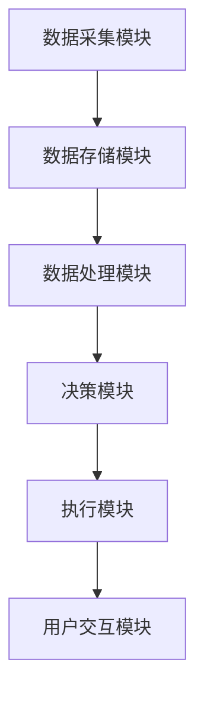

                 


# AI Agent开发中的法律合规与伦理考量

> **关键词**：AI Agent、法律合规、伦理考量、数据隐私、算法责任、系统架构

> **摘要**：本文系统地探讨了AI Agent开发中的法律合规与伦理考量，分析了AI Agent的基本概念、应用场景、法律与伦理挑战，并提出了相应的解决方案和系统架构设计。文章从法律与伦理的双重角度出发，结合实际案例，为AI Agent的合规开发提供了理论与实践指导。

---

## 第一部分：AI Agent的基本概念与应用

### 第1章：AI Agent的基本概念与核心特征

#### 1.1 AI Agent的定义与核心特征

AI Agent（人工智能代理）是指能够感知环境、自主决策并执行任务的智能系统。与传统软件不同，AI Agent具有以下核心特征：

1. **自主性**：能够自主决策，无需外部干预。
2. **反应性**：能够实时感知环境并做出反应。
3. **目标导向**：具有明确的目标，驱动其行为。
4. **学习能力**：能够通过数据和经验不断优化自身性能。

#### 1.2 AI Agent的分类与应用场景

AI Agent可以根据智能水平和功能类型进行分类：

1. **基于智能水平**：
   - **反应式AI Agent**：仅响应当前输入，不依赖历史信息。
   - **认知式AI Agent**：具备推理、规划能力，能够处理复杂任务。
2. **基于功能类型**：
   - **监视型AI Agent**：用于监控环境，如安全监控系统。
   - **交互型AI Agent**：与用户交互，提供服务，如智能助手。

### 第2章：AI Agent的应用场景

#### 2.1 AI Agent在各领域的应用

1. **智能助手**：如Siri、Alexa，提供信息查询、日程管理等服务。
2. **自动驾驶**：如特斯拉、Waymo，通过感知环境实现自动驾驶。
3. **智能客服**：通过自然语言处理技术，提供24/7的客户支持。
4. **医疗辅助**：AI Agent辅助医生进行诊断和治疗方案推荐。

---

## 第二部分：AI Agent开发中的法律合规框架

### 第3章：数据隐私与保护

#### 3.1 数据隐私的基本概念

数据隐私是指个人对个人数据的控制权，确保数据不被未经授权的第三方访问或使用。AI Agent在开发和使用过程中，涉及大量数据的收集、处理和存储，因此数据隐私是合规的核心问题。

#### 3.2 GDPR对AI Agent的影响

《通用数据保护条例》（GDPR）是欧盟出台的严格数据保护法规，对AI Agent的开发和应用提出了以下要求：

1. **数据最小化**：仅收集实现目的所需的最少数据。
2. **数据存储期限**：明确数据存储时间，及时删除过期数据。
3. **用户同意**：在收集和处理数据前，必须获得用户的明确同意。

#### 3.3 数据收集与处理的合规要求

1. **透明性**：向用户明示数据收集的目的、方式和范围。
2. **数据安全**：采取技术措施保护数据不被泄露或篡改。
3. **用户访问权**：用户有权访问、更正或删除其个人数据。

---

## 第三部分：AI Agent开发中的伦理考量

### 第4章：伦理原则与AI Agent的交互

#### 4.1 尊重用户自主权

AI Agent的设计必须尊重用户的自主权，避免强制或误导用户做出决策。例如，在智能助手的设计中，用户应能够随时关闭或暂停AI Agent的服务。

#### 4.2 避免算法偏见

算法偏见是指AI Agent在决策过程中基于数据中的偏差而产生的不公平结果。例如，招聘系统中的性别偏见可能影响求职者的公平性。

#### 4.3 保护用户隐私

AI Agent的设计应确保用户隐私不被侵犯，数据处理过程透明，避免滥用用户数据。

---

## 第四部分：法律与伦理的结合与冲突

### 第5章：法律与伦理的相互作用

#### 5.1 法律对伦理的约束

法律为AI Agent的开发设定了底线，例如数据隐私的法律要求确保了用户隐私的保护。

#### 5.2 伦理对法律的指导

伦理为法律提供了更高的指导原则，例如GDPR中的数据保护要求不仅仅是合规，更是对用户隐私权的尊重。

#### 5.3 法律与伦理的冲突与协调

在某些情况下，法律与伦理可能存在冲突。例如，法律可能要求AI Agent在特定场景下做出特定决策，但这种决策可能违背伦理原则。因此，需要通过协调机制在法律与伦理之间找到平衡点。

---

## 第五部分：系统分析与架构设计方案

### 第6章：系统架构设计

#### 6.1 系统功能模块划分

1. **数据采集模块**：负责收集环境数据和用户输入。
2. **决策模块**：基于数据进行推理和决策。
3. **执行模块**：根据决策结果执行操作。
4. **用户交互模块**：与用户进行实时互动。

#### 6.2 系统架构设计

以下是AI Agent系统的架构图：



#### 6.3 系统接口设计

1. **数据采集接口**：用于采集环境数据和用户输入。
2. **决策接口**：接收数据处理模块的输出，生成决策指令。
3. **执行接口**：将决策指令传递给执行模块。
4. **交互接口**：与用户进行实时互动，提供反馈。

---

## 第六部分：项目实战

### 第7章：AI Agent开发实战

#### 7.1 环境安装

1. **安装Python**：确保Python 3.8以上版本已安装。
2. **安装依赖库**：如numpy、pandas、scikit-learn等。

#### 7.2 核心代码实现

以下是AI Agent的核心代码示例：

```python
import numpy as np
from sklearn import tree

# 数据处理
X = np.array([[2, 3], [5, 7], [8, 2], [10, 10]])
y = np.array([0, 1, 2, 3])

# 训练模型
model = tree.DecisionTreeClassifier()
model.fit(X, y)

# 预测
print(model.predict([[7, 4]]))  # 输出：[1]
```

#### 7.3 代码解读与分析

1. **数据处理**：使用numpy和scikit-learn库进行数据预处理。
2. **模型训练**：使用决策树算法训练模型。
3. **模型预测**：基于训练好的模型进行预测。

---

## 第七部分：总结与展望

### 第8章：总结与展望

#### 8.1 总结

AI Agent的开发需要在法律合规与伦理考量之间找到平衡。通过遵守数据隐私法规、避免算法偏见、尊重用户自主权，可以确保AI Agent的开发和应用符合伦理和法律要求。

#### 8.2 展望

未来，随着AI技术的不断发展，AI Agent的法律与伦理问题将更加复杂。需要加强国际合作，制定统一的伦理审查标准，推动AI技术的健康发展。

---

**作者：AI天才研究院（AI Genius Institute） & 禅与计算机程序设计艺术（Zen And The Art of Computer Programming）**

