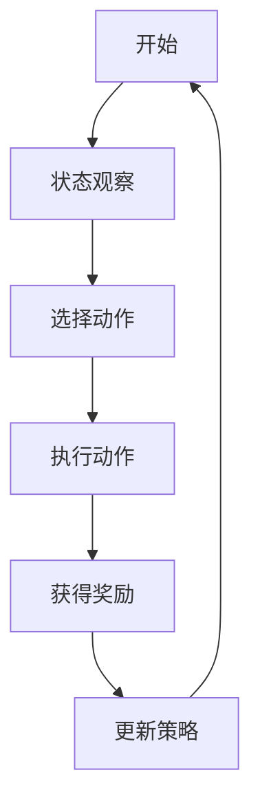
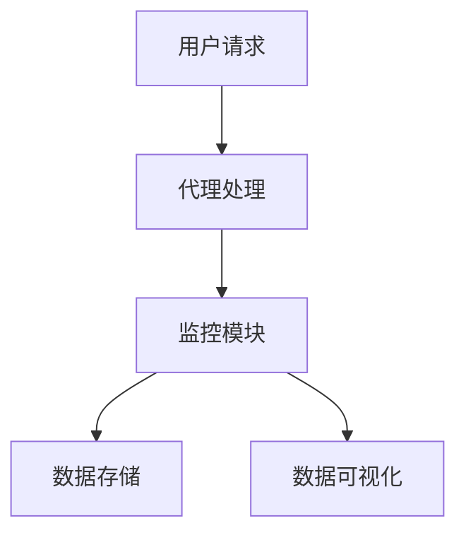

                 


# AI Agent性能监控与调优策略

## 关键词：AI Agent、性能监控、调优策略、系统架构、算法优化

## 摘要

AI Agent作为人工智能领域的重要组成部分，在企业应用中发挥着越来越关键的作用。然而，AI Agent的性能监控与调优却常常被忽视，导致系统运行效率低下，用户体验受损。本文旨在通过系统化的分析与实践，探讨如何有效监控AI Agent的性能，并制定科学的调优策略。文章从AI Agent的基本概念出发，深入分析性能监控的核心指标与方法，结合实际案例，详细阐述调优策略的理论基础与实现方案，最后总结经验与未来发展方向。

---

## 第1章：AI Agent的基本概念与性能监控的重要性

### 1.1 AI Agent的定义与核心特征

AI Agent（智能体）是指能够感知环境并采取行动以实现目标的实体。它具备以下核心特征：

- **自主性**：能在没有外部干预的情况下独立运作。
- **反应性**：能够根据环境变化实时调整行为。
- **目标导向**：所有行动都以实现特定目标为导向。
- **社会能力**：能够与其他系统或人类进行交互协作。

AI Agent广泛应用于自动驾驶、智能助手、推荐系统等领域。

### 1.2 性能监控的必要性

在实际应用中，AI Agent的性能监控至关重要，原因如下：

- **及时发现问题**：通过监控，可以快速识别系统中的瓶颈和异常。
- **提升用户体验**：优化性能能显著提高用户满意度。
- **降低运维成本**：及时调优可避免资源浪费，降低运维成本。

---

## 第2章：AI Agent性能监控的核心指标与方法

### 2.1 性能监控的核心指标

以下是衡量AI Agent性能的关键指标：

| **指标**      | **定义**                                                                 |
|---------------|--------------------------------------------------------------------------|
| 响应时间      | 系统对请求的响应所需的时间                                           |
| 吞吐量        | 单位时间内系统处理的请求数量                                         |
| 资源利用率    | CPU、内存等资源的使用情况                                             |
| 错误率        | 系统出现错误的频率                                                     |

### 2.2 监控方法与工具

常用工具包括日志分析工具（如ELK）、性能测试工具（如JMeter）以及监控平台（如Prometheus）。

---

## 第3章：AI Agent调优策略的理论基础

### 3.1 性能调优的基本原则

- **目标导向**：明确调优目标，避免盲目优化。
- **逐步优化**：优先解决关键问题，逐步推进。
- **数据驱动**：基于监控数据进行决策。

### 3.2 算法优化策略

#### 3.2.1 强化学习优化

**算法流程图：**



**Python代码示例：**

```python
class AI-Agent:
    def __init__(self):
        self.memory = []
        self.model = self.build_model()

    def build_model(self):
        # 构建深度学习模型
        pass

    def remember(self, state, action, reward, next_state):
        self.memory.append((state, action, reward, next_state))

    def replay(self):
        # 回放记忆进行训练
        pass
```

**数学模型：**

$$ \text{奖励} = \sum_{i=1}^{n} r_i \times a_i $$

其中，\( r_i \) 是每个动作的奖励值，\( a_i \) 是动作权重。

---

## 第4章：系统架构设计与性能监控

### 4.1 系统架构设计原则

- **模块化设计**：将系统划分为独立模块，便于维护和升级。
- **可扩展性**：确保系统能够适应未来的需求变化。

#### 4.2 系统架构图



---

## 第5章：项目实战——构建AI Agent性能监控系统

### 5.1 项目环境搭建

- **开发环境**：建议使用Python和Django框架。
- **工具安装**：安装Prometheus和Grafana进行监控。

### 5.2 系统核心实现

#### 5.2.1 监控模块实现

```python
import time

def monitor_performance():
    while True:
        time.sleep(1)
        # 数据采集逻辑
        pass
```

#### 5.2.2 数据分析与可视化

使用Matplotlib进行数据可视化：

```python
import matplotlib.pyplot as plt

# 示例数据
times = [0.5, 1.0, 0.8, 2.0, 1.5]
plt.plot(times, label='响应时间')
plt.xlabel('时间（秒）')
plt.ylabel('响应时间（秒）')
plt.legend()
plt.show()
```

---

## 第6章：总结与展望

### 6.1 经验总结

- **监控的重要性**：及时监控有助于快速发现问题。
- **调优的策略**：结合理论与实践，制定合理的优化方案。

### 6.2 未来发展趋势

- **自动化监控**：AI Agent的监控将更加自动化和智能化。
- **边缘计算**：在边缘设备上实现更高效的监控与调优。

---

## 第7章：附录与参考文献

### 7.1 工具安装指南

- **Prometheus安装**：参考官方网站文档。
- **Grafana安装**：按照官方教程配置。

### 7.2 术语表与索引

- **AI Agent**：智能体。
- **性能监控**：性能监测与优化。

---

## 作者：AI天才研究院 & 禅与计算机程序设计艺术

---

通过以上结构，您可以逐步展开每一章的内容，确保每个部分都详细具体，结合理论与实践，帮助读者全面理解AI Agent的性能监控与调优策略。

