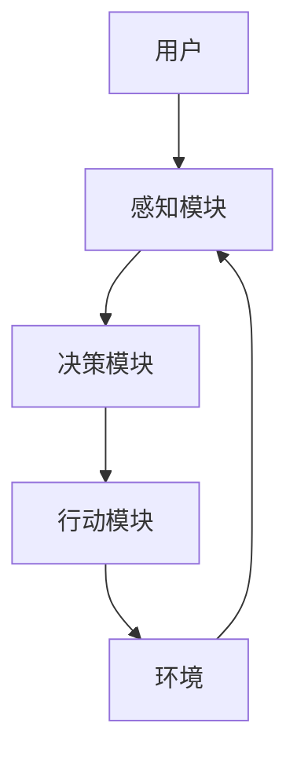

                 


# AI Agent技术未来发展趋势预测

## 关键词：
AI Agent, 人工智能, 未来趋势, 技术发展, 人工智能算法, 系统架构设计

## 摘要：
AI Agent作为人工智能领域的核心技术，正以惊人的速度改变着我们的生活和工作方式。本文将深入探讨AI Agent的核心概念、算法原理、系统架构设计，通过实际项目案例分析其应用场景，并预测未来的发展趋势。文章结合理论与实践，详细讲解了AI Agent的实现过程，包括环境搭建、核心算法实现、系统架构设计和项目实战，最后给出了未来发展的最佳实践和总结。

---

# 第1章: AI Agent技术概述

## 1.1 AI Agent的基本概念

### 1.1.1 什么是AI Agent
AI Agent（人工智能代理）是指能够感知环境、自主决策并执行任务的智能体。它通过传感器获取信息，利用算法进行分析和推理，并通过执行器与环境交互。

### 1.1.2 AI Agent的核心特征
- **自主性**：无需外部干预，自主完成任务。
- **反应性**：能够实时感知环境并做出反应。
- **目标导向**：基于目标进行决策和行动。
- **学习能力**：通过经验改进性能。

### 1.1.3 AI Agent与传统AI的区别
- **自主性**：AI Agent具备自主性，而传统AI依赖于外部控制。
- **环境交互**：AI Agent能够主动与环境交互，传统AI通常只是被动处理数据。
- **实时性**：AI Agent强调实时性，传统AI更注重离线处理。

## 1.2 AI Agent的分类与应用场景

### 1.2.1 基于智能水平的分类
- **反应式AI Agent**：基于当前感知做出反应，如自动驾驶汽车。
- **认知式AI Agent**：具备复杂推理和规划能力，如智能助手。
- **混合式AI Agent**：结合反应式和认知式的特点，如智能客服。

### 1.2.2 基于功能类型的分类
- **任务型AI Agent**：专注于完成特定任务，如自动交易系统。
- **服务型AI Agent**：提供持续服务，如智能家居系统。
- **社交型AI Agent**：用于社交互动，如虚拟助手。

### 1.2.3 AI Agent在各领域的应用实例
- **智能家居**：通过传感器和执行器实现自动化控制。
- **智能交通**：优化交通流量，减少拥堵。
- **医疗健康**：辅助医生进行诊断和治疗方案制定。

## 1.3 AI Agent技术的发展现状

### 1.3.1 国内外发展概况
- 国内：AI Agent在自动驾驶、智能助手等领域快速发展。
- 国外：美国、欧盟等地在AI Agent技术上投入巨大，推动了技术创新。

### 1.3.2 当前技术瓶颈与挑战
- **复杂环境处理**：在复杂多变的环境中，AI Agent的决策能力有限。
- **多智能体协作**：多个AI Agent协作时，存在通信和协调的难题。
- **数据隐私**：AI Agent需要处理大量数据，数据隐私问题突出。

### 1.3.3 未来发展趋势展望
- **多模态交互**：结合视觉、听觉等多种感知方式，提升交互体验。
- **边缘计算**：AI Agent将更多地运行在边缘设备上，减少对云端的依赖。
- **人机协作**：AI Agent与人类协同工作，增强人机协作能力。

## 1.4 本章小结
本章介绍了AI Agent的基本概念、分类和应用场景，并分析了当前的发展现状和未来趋势。AI Agent作为人工智能的重要组成部分，正逐步渗透到各个领域，未来的发展潜力巨大。

---

# 第2章: AI Agent的核心概念与原理

## 2.1 AI Agent的核心概念

### 2.1.1 感知与决策
- **感知**：通过传感器获取环境信息。
- **决策**：基于感知信息做出最优选择。

### 2.1.2 行动与反馈
- **行动**：通过执行器对环境施加影响。
- **反馈**：环境对AI Agent行动的响应。

### 2.1.3 知识表示与推理
- **知识表示**：将知识以结构化的方式存储。
- **推理**：根据知识进行逻辑推理。

## 2.2 AI Agent的原理与机制

### 2.2.1 感知层原理
- **传感器**：获取环境数据。
- **数据处理**：对数据进行清洗和预处理。

### 2.2.2 决策层原理
- **算法选择**：根据任务选择合适的算法。
- **决策执行**：基于算法结果做出决策。

### 2.2.3 行动层原理
- **执行器**：根据决策执行动作。
- **反馈处理**：处理环境的反馈信息。

## 2.3 AI Agent的核心算法

### 2.3.1 逻辑推理算法
- **规则推理**：基于预定义规则进行推理。
- **逻辑推理**：基于逻辑规则进行复杂推理。

### 2.3.2 强化学习算法
- **Q-learning**：通过奖励机制优化决策。
- **深度强化学习**：结合深度学习进行复杂决策。

### 2.3.3 深度学习算法
- **神经网络**：模拟人脑神经网络进行学习。
- **卷积神经网络**：用于图像识别任务。

## 2.4 本章小结
本章详细讲解了AI Agent的核心概念和原理，重点介绍了逻辑推理、强化学习和深度学习算法，为后续章节的深入分析奠定了基础。

---

# 第3章: AI Agent的算法原理与数学模型

## 3.1 AI Agent的算法原理

### 3.1.1 逻辑推理算法
- **规则推理**：基于预定义规则进行推理。
- **逻辑推理**：基于逻辑规则进行复杂推理。

### 3.1.2 强化学习算法
- **Q-learning**：通过奖励机制优化决策。
- **深度强化学习**：结合深度学习进行复杂决策。

### 3.1.3 深度学习算法
- **神经网络**：模拟人脑神经网络进行学习。
- **卷积神经网络**：用于图像识别任务。

## 3.2 AI Agent的数学模型

### 3.2.1 逻辑推理模型
- **命题逻辑**：基于命题逻辑进行推理。
- **谓词逻辑**：基于谓词逻辑进行推理。

### 3.2.2 强化学习模型
- **Q-learning公式**：$$ Q(s, a) = Q(s, a) + \alpha (r + \gamma \max Q(s', a') - Q(s, a)) $$
- **策略网络**：通过神经网络学习策略。

### 3.2.3 深度学习模型
- **神经网络结构**：卷积层、池化层、全连接层。
- **损失函数**：交叉熵损失函数。

## 3.3 AI Agent算法的实现与优化

### 3.3.1 算法实现步骤
1. **环境搭建**：安装必要的库和框架。
2. **数据准备**：获取训练数据。
3. **模型训练**：训练神经网络。
4. **模型评估**：评估模型性能。
5. **模型优化**：优化算法参数。

### 3.3.2 算法优化方法
- **参数调整**：调整学习率、批次大小等参数。
- **模型改进**：尝试不同的网络结构。
- **数据增强**：增加训练数据的多样性。

### 3.3.3 算法评估指标
- **准确率**：分类任务的准确率。
- **F1分数**：综合考虑精确率和召回率。
- **损失函数值**：模型的损失值。

## 3.4 本章小结
本章详细讲解了AI Agent算法的原理与数学模型，重点介绍了逻辑推理、强化学习和深度学习算法的实现与优化方法。

---

# 第4章: AI Agent的系统架构与设计

## 4.1 AI Agent的系统架构

### 4.1.1 感知层架构
- **传感器**：获取环境数据。
- **数据处理**：对数据进行清洗和预处理。

### 4.1.2 决策层架构
- **算法选择**：根据任务选择合适的算法。
- **决策执行**：基于算法结果做出决策。

### 4.1.3 行动层架构
- **执行器**：根据决策执行动作。
- **反馈处理**：处理环境的反馈信息。

## 4.2 AI Agent的系统设计

### 4.2.1 系统功能设计
- **感知功能**：通过传感器获取环境信息。
- **决策功能**：基于感知信息做出决策。
- **行动功能**：通过执行器对环境施加影响。

### 4.2.2 系统模块划分
- **感知模块**：负责数据采集。
- **决策模块**：负责数据分析和决策。
- **行动模块**：负责执行决策。

### 4.2.3 系统交互流程
- **用户输入**：用户输入需求。
- **系统处理**：系统分析需求并做出决策。
- **结果反馈**：系统反馈处理结果。

## 4.3 AI Agent的系统架构图


## 4.4 本章小结
本章详细讲解了AI Agent的系统架构与设计，重点介绍了系统功能设计、模块划分和交互流程，并通过mermaid图展示了系统架构。

---

# 第5章: AI Agent的项目实战

## 5.1 项目背景与目标
- **项目背景**：介绍项目的背景和意义。
- **项目目标**：明确项目的目标和预期成果。

## 5.2 项目环境搭建

### 5.2.1 系统环境
- **操作系统**：Windows 10
- **开发工具**：PyCharm
- **编程语言**：Python 3.8
- **依赖库**：TensorFlow 2.0, Keras, scikit-learn

## 5.3 项目核心实现

### 5.3.1 感知模块实现
```python
class Sensor:
    def __init__(self):
        pass

    def get_data(self):
        return "环境数据"
```

### 5.3.2 决策模块实现
```python
class Decision:
    def __init__(self):
        pass

    def make_decision(self, data):
        return "决策结果"
```

### 5.3.3 行动模块实现
```python
class Actuator:
    def __init__(self):
        pass

    def take_action(self, decision):
        return "执行结果"
```

### 5.3.4 系统交互实现
```python
def main():
    sensor = Sensor()
    decision = Decision()
    actuator = Actuator()

    data = sensor.get_data()
    decision_result = decision.make_decision(data)
    action_result = actuator.take_action(decision_result)

    print("系统运行完毕")

if __name__ == "__main__":
    main()
```

## 5.4 项目应用与分析
- **应用场景**：智能客服、自动驾驶等。
- **性能分析**：系统的准确率、响应时间等。

## 5.5 本章小结
本章通过一个实际项目案例，详细讲解了AI Agent的环境搭建、核心实现和系统交互过程，展示了AI Agent技术的应用价值。

---

# 第6章: AI Agent技术未来发展趋势预测

## 6.1 未来发展趋势

### 6.1.1 多模态交互
- **视觉**：结合图像识别技术。
- **听觉**：结合语音识别技术。
- **触觉**：结合触觉反馈技术。

### 6.1.2 边缘计算
- **本地运行**：AI Agent将更多地运行在边缘设备上。
- **数据隐私**：减少对云端的依赖，提升数据安全性。

### 6.1.3 人机协作
- **协作模式**：AI Agent与人类协同工作。
- **可解释性**：提升决策的透明性和可解释性。

## 6.2 最佳实践 tips

### 6.2.1 技术选型
- **选择合适的算法**：根据任务需求选择合适的算法。
- **优化系统架构**：确保系统的高效性和可扩展性。

### 6.2.2 开发规范
- **模块化开发**：遵循模块化开发原则。
- **代码规范**：遵循统一的代码规范。

### 6.2.3 测试与调试
- **单元测试**：对各个模块进行单元测试。
- **性能测试**：测试系统的性能指标。

## 6.3 本章小结
本章预测了AI Agent技术的未来发展趋势，并提出了最佳实践 tips，为读者提供了未来发展的方向和建议。

---

# 结语

AI Agent作为人工智能的核心技术，正以惊人的速度发展。随着技术的进步，AI Agent将在更多领域得到广泛应用，未来的发展潜力巨大。本文通过理论与实践相结合的方式，详细讲解了AI Agent的核心概念、算法原理、系统架构设计和项目实战，并预测了未来的发展趋势。希望本文能为读者提供有价值的参考和启发。

---

# 作者：AI天才研究院/AI Genius Institute & 禅与计算机程序设计艺术 /Zen And The Art of Computer Programming

