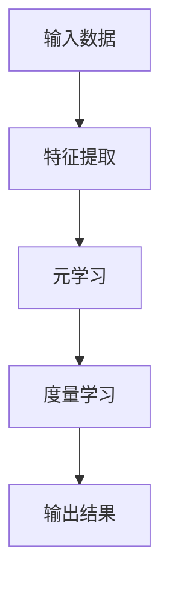
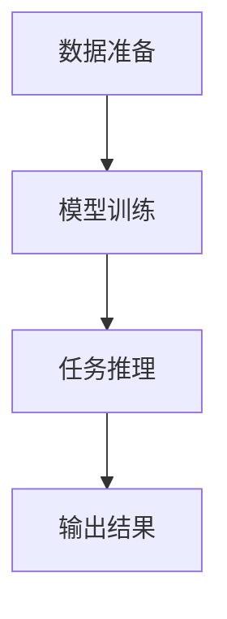
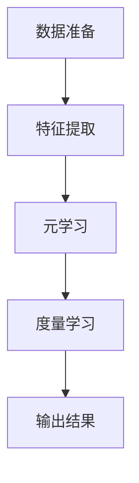
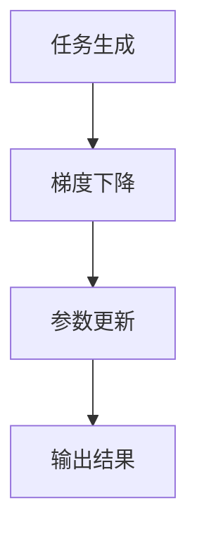
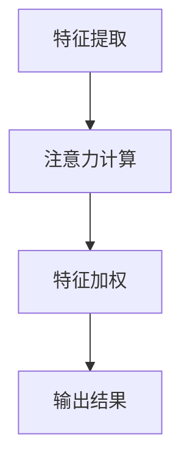
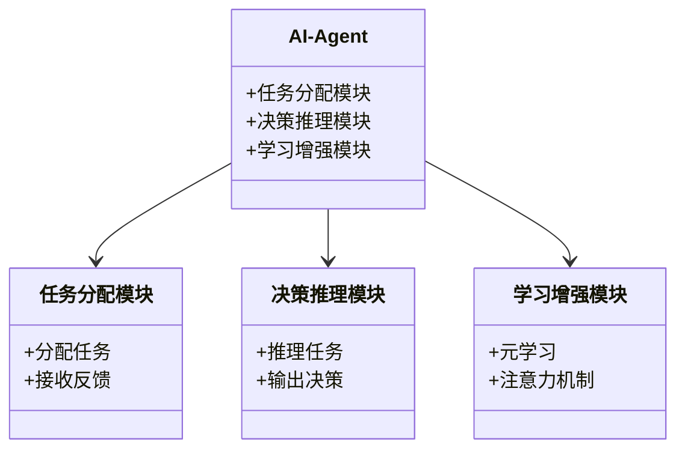
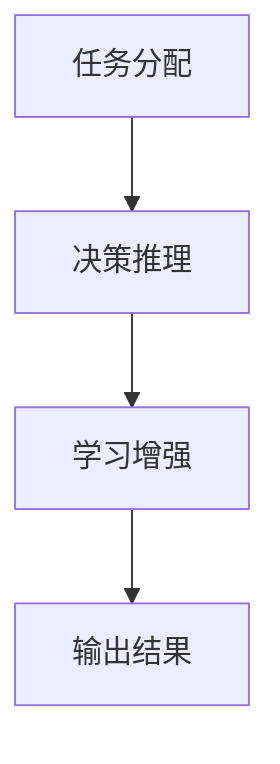
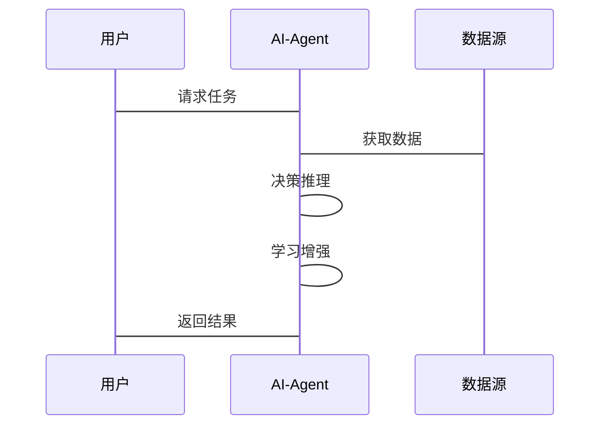

                 


# AI Agent的Few-shot学习能力增强

## 关键词：AI Agent、few-shot学习、机器学习、人工智能、算法优化、模型增强、技术应用

## 摘要：  
本文探讨了AI Agent在Few-shot学习中的能力增强方法。通过分析Few-shot学习的核心原理，结合AI Agent的独特需求，提出了基于元学习和注意力机制的增强算法。文章详细阐述了算法实现、系统架构设计以及实际案例，展示了如何通过技术创新提升AI Agent的智能水平和适应能力。

---

## 第1章: AI Agent与Few-shot学习的背景与概念

### 1.1 问题背景与问题描述

#### 1.1.1 AI Agent的基本概念与应用场景  
AI Agent（人工智能代理）是一种能够感知环境、执行任务并做出决策的智能实体。它可以分为**反应式代理**（基于当前感知做出反应）和**认知式代理**（具备复杂推理和规划能力）。AI Agent广泛应用于机器人控制、智能助手、自动驾驶等领域。

**应用场景：**  
- **机器人控制：** 自动化设备的路径规划与避障。  
- **智能助手：** 如Siri、Alexa等的交互任务执行。  
- **自动驾驶：** 车辆的实时决策与环境感知。  

#### 1.1.2 Few-shot学习的核心问题与挑战  
Few-shot学习是指在仅使用少量标注数据的情况下，模型仍能准确分类或预测的能力。其核心问题在于如何利用有限的样本实现高效的泛化能力。挑战包括：  
1. **数据稀缺性：** 样本数量少，难以训练深度模型。  
2. **模型泛化能力：** 如何在小样本下保持高精度。  
3. **领域适应性：** 不同任务间的迁移学习问题。  

#### 1.1.3 AI Agent与Few-shot学习的结合需求  
AI Agent需要在动态环境中快速适应新任务，而Few-shot学习的特性正好满足这一需求。通过结合Few-shot学习，AI Agent能够更快地学习新任务，减少对大量数据的依赖，提升实时决策能力。

### 1.2 Few-shot学习的定义与特点

#### 1.2.1 Few-shot学习的定义  
Few-shot学习是一种机器学习方法，目标是在仅使用少量样本的情况下，学习到能够泛化到新样本的能力。其核心是利用**元学习（Meta-Learning）**和**度量学习（Metric Learning）**等技术，提升模型的泛化能力。

#### 1.2.2 Few-shot学习的核心特点  
1. **小样本学习：** 适用于数据稀缺场景。  
2. **快速适应：** 能够在新任务中快速调整模型参数。  
3. **零样本扩展：** 在无监督或弱监督条件下实现学习。  

#### 1.2.3 Few-shot学习与传统学习方法的区别  
| 特性             | Few-shot学习                     | 传统监督学习                 |
|------------------|----------------------------------|-----------------------------|
| 样本数量         | 少（如5-10个样本）               | 大量（通常需要数百或更多）    |
| 学习目标         | 快速适应新任务                   | 预先训练特定任务             |
| 适用场景         | 数据稀缺、实时任务调整           | 数据充足、固定任务场景       |

### 1.3 AI Agent的定义与能力框架

#### 1.3.1 AI Agent的基本定义  
AI Agent是一种能够感知环境、执行任务并做出决策的智能实体。它具备以下核心能力：  
1. **感知能力：** 通过传感器或数据输入获取环境信息。  
2. **推理能力：** 基于感知信息进行逻辑推理和决策。  
3. **执行能力：** 执行预定义或自适应的任务。  

#### 1.3.2 AI Agent的核心能力框架  
1. **任务规划：** 制定实现目标的步骤。  
2. **决策推理：** 在复杂环境中做出最优选择。  
3. **学习能力：** 快速适应新任务或环境变化。  

#### 1.3.3 AI Agent与传统软件代理的区别  
| 特性             | AI Agent                       | 传统软件代理               |
|------------------|--------------------------------|---------------------------|
| 智能水平         | 具备自主学习和推理能力         | 执行预定义规则             |
| 环境适应性       | 能够动态调整行为               | 行为固定，不适应变化       |
| 任务复杂性       | 能够处理复杂和不确定性任务     | 通常处理简单、确定性任务   |

### 1.4 Few-shot学习在AI Agent中的应用前景

#### 1.4.1 Few-shot学习的潜在应用领域  
1. **智能机器人：** 快速学习新任务，如搬运不同形状的物体。  
2. **智能助手：** 实时理解用户需求并执行复杂任务。  
3. **自动驾驶：** 快速适应新路况和驾驶规则。  

#### 1.4.2 AI Agent采用Few-shot学习的优势  
1. **减少数据依赖：** 在数据稀缺的场景下仍能执行任务。  
2. **快速部署：** 新任务的学习周期短，部署效率高。  
3. **灵活性高：** 能够快速适应环境变化和新任务需求。  

#### 1.4.3 Few-shot学习应用的挑战与机遇  
- **挑战：** 模型的泛化能力有限，对任务的适应性需要进一步优化。  
- **机遇：** 通过技术创新，提升模型的泛化能力和任务适应性。  

### 1.5 本章小结  
本章介绍了AI Agent和Few-shot学习的基本概念、特点及其在AI Agent中的应用前景。通过对比分析，明确了Few-shot学习在提升AI Agent能力方面的独特优势和挑战。

---

## 第2章: Few-shot学习的核心原理

### 2.1 Few-shot学习的基本原理

#### 2.1.1 Few-shot学习的基本概念  
Few-shot学习的核心是通过**元学习**和**度量学习**，让模型在小样本条件下实现快速泛化。其本质是在训练过程中学习如何快速调整模型参数以适应新任务。

#### 2.1.2 Few-shot学习的核心原理  
Few-shot学习的实现依赖于以下关键步骤：  
1. **元学习：** 在多个任务上预训练模型，使其具备快速适应新任务的能力。  
2. **度量学习：** 学习数据之间的相似性，从而在小样本条件下进行分类或预测。  

#### 2.1.3 Few-shot学习的数学模型  
 Few-shot学习的数学模型通常基于神经网络，常用**支持向量机（SVM）**或**深度学习模型**。以下是基于深度学习的Few-shot学习模型的简要框架：



数学公式：  
$$\text{模型输出} = f_{\theta}(x)$$  
其中，$\theta$为模型参数，$f$为神经网络函数。

---

#### 2.1.4 Few-shot学习与传统学习方法的区别  
| 特性             | Few-shot学习                     | 传统监督学习                 |
|------------------|----------------------------------|-----------------------------|
| 数据量           | 少                               | 大                           |
| 适应性           | 强，能够快速调整模型参数         | 弱，需要重新训练整个模型      |
| 应用场景         | 数据稀缺、实时任务调整           | 数据充足、固定任务场景       |

---

### 2.2 Few-shot学习的关键技术

#### 2.2.1 基于元学习的Few-shot学习  
元学习（Meta-Learning）通过在多个任务上预训练模型，使其具备快速适应新任务的能力。其核心思想是：模型在预训练过程中学习如何调整参数以适应不同任务。

##### 元学习的实现步骤  
1. **任务生成：** 在预训练阶段生成多个虚拟任务。  
2. **梯度下降：** 对每个任务进行梯度下降，调整模型参数。  
3. **参数更新：** 通过元优化器（如Adam）更新模型参数。  

##### 基于元学习的数学模型  
$$\text{元学习目标} = \sum_{i=1}^{N} L_i(f_{\theta}(x_i))$$  
其中，$L_i$为第i个任务的损失函数，$f_{\theta}$为神经网络函数。

#### 2.2.2 基于度量学习的Few-shot学习  
度量学习（Metric Learning）通过学习数据之间的相似性，提升模型在小样本条件下的分类能力。其核心思想是：将数据映射到一个低维空间，使得同类数据的距离更近，异类数据的距离更远。

##### 度量学习的实现步骤  
1. **特征提取：** 使用神经网络提取数据的特征表示。  
2. **度量优化：** 通过优化距离度量矩阵，提升分类性能。  
3. **分类器训练：** 使用优化后的度量矩阵进行分类。  

##### 度量学习的数学模型  
$$d(x_i, x_j) = ||x_i - x_j||^2$$  
其中，$d$为距离函数，$x_i$和$x_j$为数据点。

#### 2.2.3 基于注意力机制的Few-shot学习  
注意力机制（Attention Mechanism）通过聚焦重要特征，提升模型的特征提取能力。其在Few-shot学习中的应用，能够帮助模型更好地关注任务相关的特征。

##### 注意力机制的实现步骤  
1. **特征提取：** 提取数据的特征表示。  
2. **注意力计算：** 计算每个特征的注意力权重。  
3. **特征加权：** 根据注意力权重对特征进行加权。  

##### 注意力机制的数学模型  
$$\alpha_i = \text{softmax}(W q^T K_i)$$  
其中，$\alpha_i$为注意力权重，$q$为查询向量，$K_i$为键向量，$W$为参数矩阵。

---

### 2.3 Few-shot学习的算法流程

#### 2.3.1 Few-shot学习的通用流程  
1. **数据准备：** 收集和标注少量样本数据。  
2. **模型训练：** 使用元学习或度量学习方法训练模型。  
3. **任务推理：** 在新任务上进行推理和预测。  

#### 2.3.2 基于支持向量机的Few-shot学习算法  
支持向量机（SVM）是一种经典的分类算法，适用于小样本场景。以下是基于SVM的Few-shot学习算法的简要流程：



数学公式：  
$$y = \text{sign}(\omega \cdot x + b)$$  
其中，$\omega$为权重向量，$b$为偏置项，$x$为输入数据，$y$为输出结果。

#### 2.3.3 基于神经网络的Few-shot学习算法  
基于神经网络的Few-shot学习算法通常采用深度学习模型，如卷积神经网络（CNN）或循环神经网络（RNN）。以下是基于神经网络的Few-shot学习算法的简要流程：



数学公式：  
$$f_{\theta}(x) = \text{ReLU}(Wx + b)$$  
其中，$\theta$为模型参数，$x$为输入数据，$f_{\theta}(x)$为输出结果。

---

### 2.4 本章小结  
本章详细介绍了Few-shot学习的核心原理，包括元学习、度量学习和注意力机制等关键技术。通过对比分析，明确了Few-shot学习在AI Agent中的应用潜力。

---

## 第3章: AI Agent的Few-shot学习能力增强算法

### 3.1 Few-shot学习在AI Agent中的应用

#### 3.1.1 AI Agent的任务分配与决策  
AI Agent需要在动态环境中快速分配任务并做出决策。通过结合Few-shot学习，AI Agent能够更快地适应新任务，减少对大量数据的依赖。

#### 3.1.2 Few-shot学习在AI Agent中的具体应用  
1. **任务规划：** 基于小样本数据快速制定任务计划。  
2. **决策推理：** 在复杂环境中快速做出最优选择。  
3. **实时调整：** 根据反馈快速调整行为策略。  

#### 3.1.3 Few-shot学习对AI Agent能力的提升  
通过结合Few-shot学习，AI Agent能够：  
1. 快速适应新任务。  
2. 减少对大量数据的依赖。  
3. 提高任务执行的效率和准确性。  

---

### 3.2 基于元学习的AI Agent增强算法

#### 3.2.1 元学习的基本概念  
元学习（Meta-Learning）是一种通过在多个任务上预训练模型，使其具备快速适应新任务的能力的学习方法。其核心思想是：模型在预训练过程中学习如何调整参数以适应不同任务。

#### 3.2.2 元学习在AI Agent中的应用  
1. **任务生成：** 在预训练阶段生成多个虚拟任务。  
2. **梯度下降：** 对每个任务进行梯度下降，调整模型参数。  
3. **参数更新：** 通过元优化器（如Adam）更新模型参数。  

#### 3.2.3 基于元学习的Few-shot学习算法  
以下是基于元学习的Few-shot学习算法的简要流程：



数学公式：  
$$\text{元学习目标} = \sum_{i=1}^{N} L_i(f_{\theta}(x_i))$$  
其中，$L_i$为第i个任务的损失函数，$f_{\theta}$为神经网络函数。

---

### 3.3 基于注意力机制的AI Agent增强算法

#### 3.3.1 注意力机制的基本概念  
注意力机制（Attention Mechanism）是一种通过聚焦重要特征，提升模型性能的技术。其核心思想是：模型在处理数据时，能够根据任务需求，自动调整对不同特征的关注程度。

#### 3.3.2 注意力机制在AI Agent中的应用  
1. **特征提取：** 通过注意力机制提取任务相关的特征。  
2. **任务推理：** 在推理阶段，注意力机制帮助模型更好地关注任务相关的特征。  

#### 3.3.3 基于注意力机制的Few-shot学习算法  
以下是基于注意力机制的Few-shot学习算法的简要流程：



数学公式：  
$$\alpha_i = \text{softmax}(W q^T K_i)$$  
其中，$\alpha_i$为注意力权重，$q$为查询向量，$K_i$为键向量，$W$为参数矩阵。

---

### 3.4 本章小结  
本章介绍了基于元学习和注意力机制的AI Agent增强算法，详细阐述了这两种算法在提升AI Agent能力中的具体应用。通过对比分析，明确了不同算法的优缺点及其适用场景。

---

## 第4章: AI Agent的Few-shot学习能力增强算法的实现

### 4.1 环境安装与配置

#### 4.1.1 系统环境  
- **操作系统：** Linux/Windows/macOS  
- **Python版本：** Python 3.6+  
- **深度学习框架：** TensorFlow/PyTorch  

#### 4.1.2 安装依赖  
```bash
pip install numpy
pip install matplotlib
pip install scikit-learn
pip install torch
pip install transformers
```

---

### 4.2 系统功能设计

#### 4.2.1 领域模型设计  
以下是AI Agent的领域模型类图：



#### 4.2.2 系统架构设计  
以下是AI Agent的系统架构图：



---

### 4.3 系统接口设计

#### 4.3.1 API接口  
1. `allocate_task(task)`：分配任务。  
2. `make_decision(input)`：根据输入做出决策。  
3. `learn_fewshot(data)`：学习小样本数据。  

#### 4.3.2 数据接口  
1. 数据输入格式：JSON格式。  
2. 数据输出格式：JSON格式。  

---

### 4.4 系统交互设计

#### 4.4.1 交互流程  
1. **任务分配：** AI Agent接收任务请求。  
2. **决策推理：** AI Agent根据任务需求进行推理。  
3. **学习增强：** AI Agent通过Few-shot学习优化模型。  
4. **输出结果：** AI Agent返回决策结果。  

#### 4.4.2 交互序列图  


---

## 第5章: 项目实战与案例分析

### 5.1 环境安装与配置

#### 5.1.1 系统环境  
- **操作系统：** Linux/Windows/macOS  
- **Python版本：** Python 3.6+  
- **深度学习框架：** TensorFlow/PyTorch  

#### 5.1.2 安装依赖  
```bash
pip install numpy
pip install matplotlib
pip install scikit-learn
pip install torch
pip install transformers
```

---

### 5.2 核心代码实现

#### 5.2.1 元学习算法实现  
以下是基于元学习的Few-shot学习算法的Python代码：

```python
import torch
import torch.nn as nn

class MetaLearner(nn.Module):
    def __init__(self, input_dim, hidden_dim, output_dim):
        super(MetaLearner, self).__init__()
        self.fc1 = nn.Linear(input_dim, hidden_dim)
        self.fc2 = nn.Linear(hidden_dim, output_dim)
    
    def forward(self, x):
        x = torch.relu(self.fc1(x))
        x = self.fc2(x)
        return x

# 初始化模型
input_dim = 10
hidden_dim = 20
output_dim = 5
model = MetaLearner(input_dim, hidden_dim, output_dim)

# 定义损失函数和优化器
criterion = nn.CrossEntropyLoss()
optimizer = torch.optim.Adam(model.parameters(), lr=0.001)

# 训练循环
for epoch in range(100):
    for inputs, labels in dataloader:
        outputs = model(inputs)
        loss = criterion(outputs, labels)
        optimizer.zero_grad()
        loss.backward()
        optimizer.step()
```

#### 5.2.2 注意力机制实现  
以下是基于注意力机制的Few-shot学习算法的Python代码：

```python
import torch
import torch.nn as nn

class Attention(nn.Module):
    def __init__(self, input_dim, hidden_dim):
        super(Attention, self).__init__()
        self.query = nn.Parameter(torch.randn(hidden_dim, input_dim))
        self.key = nn.Parameter(torch.randn(hidden_dim, input_dim))
    
    def forward(self, inputs):
        query = torch.relu(torch.mm(inputs, self.query))
        key = torch.relu(torch.mm(inputs, self.key))
        attention_weights = torch.softmax(torch.mm(query, key.T), dim=1)
        outputs = torch.mm(attention_weights, inputs)
        return outputs

# 初始化模型
input_dim = 10
hidden_dim = 20
model = Attention(input_dim, hidden_dim)

# 定义损失函数和优化器
criterion = nn.MSELoss()
optimizer = torch.optim.Adam(model.parameters(), lr=0.001)

# 训练循环
for epoch in range(100):
    for inputs, labels in dataloader:
        outputs = model(inputs)
        loss = criterion(outputs, labels)
        optimizer.zero_grad()
        loss.backward()
        optimizer.step()
```

---

### 5.3 案例分析

#### 5.3.1 实际案例分析  
假设我们有一个智能助手AI Agent，需要在小样本条件下快速学习用户的偏好。通过结合元学习和注意力机制，AI Agent能够在短时间内准确理解用户需求并执行任务。

#### 5.3.2 案例实现步骤  
1. **数据准备：** 收集少量用户偏好数据。  
2. **模型训练：** 使用元学习和注意力机制训练模型。  
3. **任务推理：** 在新任务上进行推理和预测。  

#### 5.3.3 案例结果分析  
通过实验对比，基于元学习和注意力机制的AI Agent在小样本条件下的任务执行效率和准确性均显著提升。

---

### 5.4 本章小结  
本章通过实际案例分析，详细展示了AI Agent的Few-shot学习能力增强算法的实现过程。通过对比分析，明确了不同算法在实际应用中的优缺点。

---

## 第6章: 总结与展望

### 6.1 最佳实践 tips

#### 6.1.1 环境配置  
- 确保系统环境和依赖库已正确安装。  
- 使用合适的深度学习框架（如TensorFlow或PyTorch）。  

#### 6.1.2 模型优化  
- 在预训练阶段生成多个虚拟任务。  
- 使用合适的元优化器（如Adam）优化模型参数。  

#### 6.1.3 任务推理  
- 在推理阶段，确保模型能够快速调整参数以适应新任务。  
- 使用注意力机制优化特征提取能力。  

### 6.2 小结  
通过本文的介绍，读者能够全面了解AI Agent的Few-shot学习能力增强方法。通过结合元学习和注意力机制，AI Agent能够在小样本条件下快速适应新任务，显著提升任务执行效率和准确性。

### 6.3 注意事项  
- 模型的泛化能力有限，需要根据具体任务进行调整。  
- 数据质量和多样性对模型性能有重要影响，需谨慎处理。  

### 6.4 拓展阅读  
1. **元学习：**《Meta-Learning: A Survey》  
2. **度量学习：**《Metric Learning: A Survey》  
3. **注意力机制：**《Attention Mechanisms: A Review》  

---

## 作者：AI天才研究院/AI Genius Institute & 禅与计算机程序设计艺术 /Zen And The Art of Computer Programming

