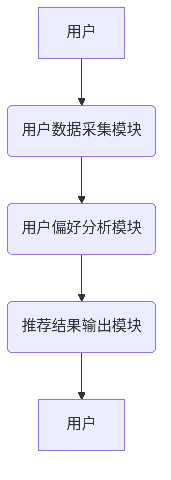

                 


# AI Agent的个性化定制：用户偏好学习与应用

## 关键词：AI Agent、个性化定制、用户偏好、机器学习、深度学习、推荐系统

## 摘要：  
本文深入探讨了AI Agent的个性化定制技术，重点分析了用户偏好学习的核心算法与应用场景。通过结合机器学习和深度学习的方法，详细阐述了如何从数据中提取用户偏好，并将其应用于推荐系统中。文章还介绍了系统的架构设计和项目实现，为读者提供了从理论到实践的全面指导。

---

## 第一部分：AI Agent的个性化定制基础

### 第1章：AI Agent与用户偏好概述

#### 1.1 AI Agent的基本概念
- **1.1.1 AI Agent的定义与分类**  
  AI Agent（智能代理）是指能够感知环境并采取行动以实现目标的智能系统。它可以分为简单反射型、基于模型的反应型、目标驱动型和效用驱动型四种类型。

- **1.1.2 用户偏好在AI Agent中的作用**  
  用户偏好是AI Agent实现个性化服务的核心依据。通过分析用户的偏好，AI Agent能够提供更精准的服务，提升用户体验。

- **1.1.3 个性化定制的必要性**  
  个性化定制能够帮助AI Agent更好地满足用户的特定需求，提高系统的实用性和用户满意度。

#### 1.2 个性化定制的方式
- **1.2.1 基于规则的个性化定制**  
  通过预定义的规则来匹配用户的偏好，适用于场景简单、规则明确的情况。

- **1.2.2 基于机器学习的个性化定制**  
  利用机器学习算法从用户数据中自动学习偏好，适用于复杂场景。

- **1.2.3 基于深度学习的个性化定制**  
  借助深度学习模型（如神经网络）提取高维特征，实现更精准的个性化定制。

#### 1.3 本章小结  
本章介绍了AI Agent的基本概念，分析了用户偏好在个性化定制中的重要性，并总结了三种主要的个性化定制方式。

---

### 第2章：用户偏好学习的核心算法

#### 2.1 协同过滤算法
- **2.1.1 基于用户的协同过滤**  
  基于用户的历史行为（如评分、点击等）相似性，推荐相似用户的偏好内容。

- **2.1.2 基于物品的协同过滤**  
  通过分析物品之间的相似性，向用户推荐与他们已喜欢物品相似的其他物品。

- **2.1.3 混合协同过滤**  
  结合用户和物品的协同过滤方法，利用两者的优势提高推荐准确率。

#### 2.2 基于内容的推荐算法
- **2.2.1 文本挖掘与特征提取**  
  通过文本挖掘技术（如TF-IDF）提取物品内容的关键词特征。

- **2.2.2 基于向量空间模型的推荐**  
  将用户和物品表示为向量空间模型中的点，计算相似度进行推荐。

- **2.2.3 基于深度学习的内容推荐**  
  使用神经网络模型（如Word2Vec）提取更深层次的内容特征。

#### 2.3 深度学习在用户偏好学习中的应用
- **2.3.1 基于神经网络的推荐系统**  
  利用神经网络模型捕捉用户和物品的隐含特征。

- **2.3.2 基于注意力机制的推荐模型**  
  通过注意力机制聚焦用户行为中重要的部分，提高推荐的精准度。

- **2.3.3 基于生成对抗网络的推荐模型**  
  使用生成对抗网络（GAN）生成多样化的推荐结果。

#### 2.4 本章小结  
本章详细介绍了协同过滤和基于内容的推荐算法，以及深度学习在用户偏好学习中的应用，为后续的系统设计和项目实现奠定了理论基础。

---

## 第二部分：AI Agent的系统架构设计

### 第4章：AI Agent的系统架构设计

#### 4.1 系统功能模块设计
- **4.1.1 用户数据采集模块**  
  通过日志、用户行为数据等采集用户的偏好信息。

- **4.1.2 用户偏好分析模块**  
  利用机器学习算法分析用户偏好，生成推荐列表。

- **4.1.3 推荐结果输出模块**  
  将推荐结果通过用户友好的方式（如界面、邮件）呈现。

#### 4.2 系统架构设计
- **4.2.1 前端与后端交互设计**  
  使用RESTful API进行数据交互。

- **4.2.2 后端系统设计**  
  包括数据存储、模型训练和结果生成三个模块。

#### 4.3 数据流图


#### 4.4 本章小结  
本章设计了一个完整的AI Agent系统架构，详细描述了各个模块的功能和交互流程。

---

## 第三部分：项目实战与高级应用

### 第5章：基于Python的推荐系统实现

#### 5.1 环境安装与数据准备
- 安装必要的库：`numpy`, `pandas`, `scikit-learn`
- 数据集：使用公开的电影评分数据集（MovieLens）

#### 5.2 推荐系统实现
```python
from sklearn.metrics.pairwise import cosine_similarity

# 示例：基于协同过滤的推荐系统
def user_based_recommendation(X, user_id):
    similarities = cosine_similarity(X[user_id, :], X.T)
    top_users = similarities.argsort()[::-1][:5]
    recommended_items = X[:, top_users].mean(axis=1).argsort()[::-1][:5]
    return recommended_items

# 数据矩阵X为用户-物品的评分矩阵
```

#### 5.3 项目实现与分析
- 数据预处理：处理缺失值、标准化。
- 模型训练：使用协同过滤算法训练推荐模型。
- 模型评估：采用准确率、召回率等指标评估推荐效果。

#### 5.4 本章小结  
本章通过Python实现了基于协同过滤的推荐系统，详细介绍了项目的实现过程和注意事项。

### 第6章：高级应用与未来趋势

#### 6.1 高级推荐算法
- 多模态推荐：结合文本、图像等多种数据源进行推荐。
- 动态推荐：根据用户实时行为调整推荐结果。

#### 6.2 个性化定制的未来趋势
- 结合强化学习优化推荐策略。
- 增强学习实现自适应推荐系统。

#### 6.3 小结与注意事项
- 注意用户隐私和数据安全。
- 持续优化推荐算法，提升用户体验。

---

## 结语
AI Agent的个性化定制是一项复杂而有趣的任务，需要结合机器学习、深度学习和系统设计等多方面的知识。通过本文的介绍，读者可以系统地了解用户偏好学习的核心算法和实现方法，为实际应用打下坚实的基础。

---

## 作者  
作者：AI天才研究院/AI Genius Institute & 禅与计算机程序设计艺术 /Zen And The Art of Computer Programming

