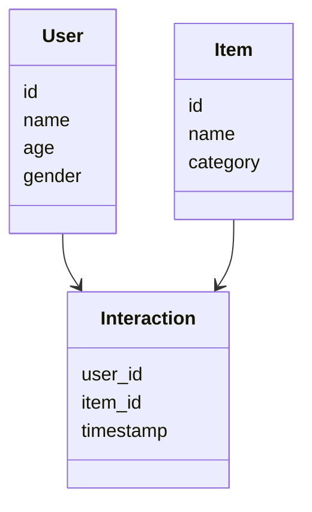
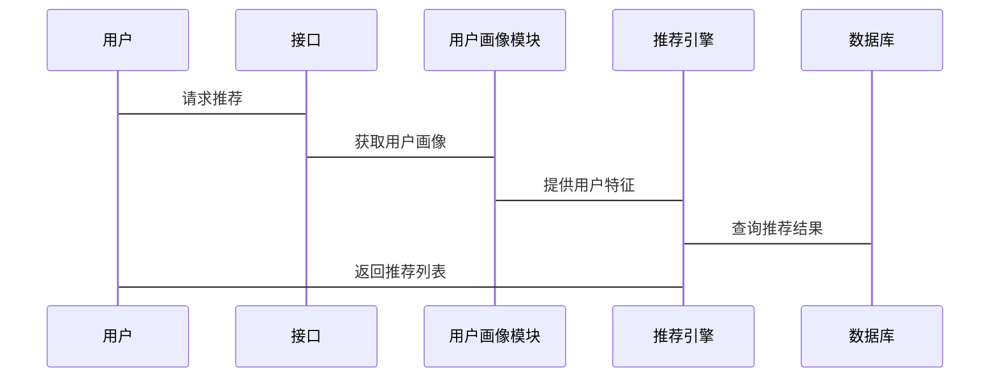

                 


# AI Agent的个性化：用户画像与偏好学习

> 关键词：AI Agent, 用户画像, 偏好学习, 个性化推荐, 机器学习

> 摘要：本文探讨了AI Agent如何通过用户画像和偏好学习实现个性化服务。首先介绍了AI Agent的基本概念和个性化服务的重要性，然后详细讲解了用户画像的构建与分析方法，以及偏好学习的核心原理与技术。接着，从算法原理、系统设计、项目实战等多个角度深入分析了个性化推荐系统，最后总结了当前技术的挑战与未来发展方向。

---

# 第1章: AI Agent与个性化服务概述

## 1.1 AI Agent的基本概念

### 1.1.1 AI Agent的定义
AI Agent（人工智能代理）是指能够感知环境、自主决策并执行任务的智能体。它通过与用户交互或环境数据的分析，提供智能化的服务。AI Agent的核心目标是通过自动化和智能化的方式满足用户需求。

### 1.1.2 AI Agent的核心特征
- **自主性**：能够自主决策和执行任务。
- **反应性**：能够实时感知环境变化并做出响应。
- **学习能力**：通过数据和反馈不断优化自身行为。
- **个性化能力**：能够根据用户需求提供定制化服务。

### 1.1.3 个性化服务的定义与特点
个性化服务是指根据用户的特征、偏好和行为，提供定制化的内容、推荐或体验。其特点包括：
- **针对性**：基于用户需求提供服务。
- **动态性**：根据用户行为变化实时调整。
- **智能化**：利用AI技术实现自动化推荐。

## 1.2 用户画像与偏好学习的背景

### 1.2.1 个性化服务的需求驱动
随着用户需求的多样化，传统通用服务已无法满足用户的个性化需求。个性化服务成为提升用户体验和市场竞争力的关键。

### 1.2.2 用户画像与偏好学习的重要性
用户画像是对用户特征的抽象表示，偏好学习是基于用户行为和数据预测用户偏好的过程。两者结合能够帮助AI Agent更好地理解用户需求，提供更精准的服务。

### 1.2.3 当前技术发展与挑战
- **技术发展**：大数据和机器学习技术为用户画像和偏好学习提供了强大的支持。
- **技术挑战**：数据隐私、实时性要求、模型泛化能力等问题仍需解决。

## 1.3 本书的核心目标与结构

### 1.3.1 本书的研究范围
本书主要研究AI Agent如何通过用户画像和偏好学习实现个性化服务，涵盖从数据采集到模型实现的完整流程。

### 1.3.2 核心问题与解决方案
- **核心问题**：如何构建精准的用户画像，如何学习用户的偏好。
- **解决方案**：通过数据挖掘、机器学习和推荐算法实现个性化服务。

### 1.3.3 目录结构概览
本书将从背景介绍、核心概念、算法原理、系统设计、项目实战等方面展开，帮助读者全面理解AI Agent的个性化实现。

---

# 第2章: 用户画像的构建与分析

## 2.1 用户数据的采集与处理

### 2.1.1 数据来源与分类
用户数据可以来源于以下渠道：
- **用户输入**：如问卷调查、用户反馈。
- **行为数据**：如点击、浏览、购买记录。
- **上下文数据**：如时间、地点、设备信息。

### 2.1.2 数据清洗与预处理
- **数据清洗**：去除重复、错误或缺失的数据。
- **数据标准化**：统一数据格式，如日期、编码。
- **数据去噪**：过滤异常值或噪声数据。

### 2.1.3 数据特征提取
通过特征工程提取关键特征，如用户的基本属性（年龄、性别）、行为特征（点击频率、停留时长）等。

## 2.2 用户画像的构建过程

### 2.2.1 用户画像的定义与维度
用户画像是对用户特征的抽象，通常包括以下维度：
- **基本属性**：年龄、性别、职业。
- **行为特征**：兴趣、偏好、使用习惯。
- **场景特征**：时间、地点、设备。

### 2.2.2 用户画像的构建步骤
1. **数据采集**：收集用户相关数据。
2. **特征提取**：从数据中提取关键特征。
3. **特征分析**：通过数据分析挖掘用户特征。
4. **画像生成**：将特征组合成用户画像。

### 2.2.3 用户画像的可视化与分析
使用图表和可视化工具（如Tableau）展示用户画像，帮助更好地理解用户特征。

## 2.3 用户画像的评估与优化

### 2.3.1 画像准确性的评估指标
- **准确率**：画像与实际用户的匹配程度。
- **覆盖率**：画像覆盖用户群体的范围。
- **区分度**：画像区分不同用户的能力。

### 2.3.2 画像的动态更新机制
- **实时更新**：根据最新数据实时更新画像。
- **周期性更新**：定期批量更新画像。

### 2.3.3 画像的隐私保护问题
- **数据匿名化**：避免泄露用户隐私。
- **数据加密**：保护用户数据安全。

---

# 第3章: 偏好学习的原理与方法

## 3.1 偏好学习的基本概念

### 3.1.1 偏好学习的定义
偏好学习是指基于用户行为数据，学习用户的偏好和偏好的变化规律。

### 3.1.2 偏好学习的核心原理
通过分析用户的历史行为数据，预测用户的偏好，从而实现个性化推荐。

### 3.1.3 偏好学习的应用场景
- **推荐系统**：如电商推荐、视频推荐。
- **个性化搜索**：根据用户的偏好优化搜索结果。
- **智能助手**：如智能音箱、智能客服。

## 3.2 偏好学习的关键技术

### 3.2.1 基于协同过滤的偏好学习
协同过滤是基于用户行为相似性推荐内容。具体步骤如下：

1. **用户相似度计算**：通过余弦相似度或Jaccard系数计算用户相似度。
2. **推荐生成**：基于相似用户的偏好推荐内容。

**数学公式：**
$$ \text{相似度} = \frac{\sum_{i=1}^{n} u_i v_i}{\sqrt{\sum_{i=1}^{n} u_i^2} \cdot \sqrt{\sum_{i=1}^{n} v_i^2}} $$

### 3.2.2 基于内容的偏好学习
内容推荐是基于内容特征相似性推荐内容。具体步骤如下：

1. **内容特征提取**：通过文本挖掘提取内容特征。
2. **内容相似度计算**：基于特征向量计算相似度。

**数学公式：**
$$ \text{相似度} = \frac{\sum_{i=1}^{n} w_i \cdot f_i}{\sum_{i=1}^{n} w_i} $$

### 3.2.3 基于深度学习的偏好预测
深度学习通过神经网络模型学习用户的偏好。具体步骤如下：

1. **数据预处理**：将用户行为数据转化为输入向量。
2. **模型训练**：训练深度学习模型，预测用户的偏好。

**数学公式：**
$$ P(y|x) = \sigma(w x + b) $$

其中，$\sigma$是sigmoid函数，$w$是权重，$x$是输入向量，$b$是偏置。

## 3.3 偏好学习的挑战与解决方案

### 3.3.1 数据稀疏性问题
- **解决方案**：引入正则化方法或使用混合推荐策略。

### 3.3.2 偏好变化的动态性
- **解决方案**：采用实时更新机制或增量学习方法。

### 3.3.3 偏好学习的隐私问题
- **解决方案**：通过差分隐私或联邦学习保护用户数据。

---

# 第4章: 个性化推荐系统的算法原理

## 4.1 推荐算法的分类

### 4.1.1 协同过滤推荐
协同过滤推荐基于用户相似性或物品相似性推荐内容。

### 4.1.2 基于内容的推荐
基于内容特征相似性推荐内容。

### 4.1.3 基于深度学习的推荐
通过神经网络模型学习用户的偏好。

## 4.2 协同过滤算法实现

### 4.2.1 基于用户的协同过滤
**代码示例：**

```python
def user_based_collaborative_filtering(ratings, user_id, n=5):
    # 计算用户相似度
    user_similarity = {}
    for u in ratings:
        if u != user_id:
            similarity = cosine_similarity(ratings[user_id], ratings[u])
            user_similarity[u] = similarity
    # 推荐结果
    recommended_items = []
    for u in sorted(user_similarity, key=lambda x: -user_similarity[x]):
        recommended_items.extend(ratings[u].keys())
    return recommended_items[:n]
```

### 4.2.2 基于物品的协同过滤
**代码示例：**

```python
def item_based_collaborative_filtering(ratings, item_id, n=5):
    # 计算物品相似度
    item_similarity = {}
    for i in ratings[user_id]:
        if i != item_id:
            similarity = cosine_similarity(ratings[i], ratings[item_id])
            item_similarity[i] = similarity
    # 推荐结果
    recommended_users = []
    for i in sorted(item_similarity, key=lambda x: -item_similarity[x]):
        recommended_users.extend(ratings[i].keys())
    return recommended_users[:n]
```

## 4.3 基于深度学习的推荐实现

### 4.3.1 基于神经网络的推荐模型
- **模型结构**：输入层、嵌入层、全连接层、输出层。
- **损失函数**：交叉熵损失函数。
- **优化算法**：Adam优化器。

**数学公式：**
$$ L = -\sum_{i=1}^{n} y_i \log(p_i) + (1 - y_i) \log(1 - p_i) $$

其中，$L$是损失函数，$y_i$是真实标签，$p_i$是预测概率。

### 4.3.2 深度学习推荐的优势
- **非线性特征表达**：能够捕捉复杂的用户偏好。
- **实时性**：支持实时推荐。

---

# 第5章: 系统分析与架构设计

## 5.1 个性化推荐系统的设计思路

### 5.1.1 问题场景介绍
以电商推荐系统为例，分析如何通过用户画像和偏好学习实现个性化推荐。

### 5.1.2 系统功能设计
- **用户画像模块**：构建用户画像。
- **偏好学习模块**：学习用户的偏好。
- **推荐引擎模块**：生成个性化推荐。

### 5.1.3 系统架构设计
- **前端层**：用户交互界面。
- **应用层**：业务逻辑处理。
- **数据层**：存储用户数据和推荐结果。

## 5.2 系统架构的实现细节

### 5.2.1 领域模型设计
使用Mermaid类图展示领域模型：



### 5.2.2 系统架构图
使用Mermaid架构图展示系统架构：


### 5.2.3 接口设计
- **用户画像接口**：提供用户画像查询和更新。
- **推荐接口**：提供基于用户的个性化推荐。

## 5.3 系统交互流程

### 5.3.1 交互流程设计
使用Mermaid序列图展示系统交互流程：



---

# 第6章: 项目实战——个性化推荐系统实现

## 6.1 环境安装与配置

### 6.1.1 安装Python环境
- 使用Anaconda安装Python 3.8及以上版本。

### 6.1.2 安装依赖库
- `pip install numpy pandas scikit-learn`

## 6.2 系统核心实现

### 6.2.1 用户画像构建

```python
import pandas as pd
from sklearn.preprocessing import StandardScaler

# 数据预处理
data = pd.read_csv('user_data.csv')
scaled_data = StandardScaler().fit_transform(data)

# 特征提取
features = ['age', 'gender', 'interest']
```

### 6.2.2 偏好学习实现

```python
from sklearn.linear_model import LogisticRegression

# 训练模型
model = LogisticRegression()
model.fit(scaled_data, target)

# 预测偏好
predicted_preference = model.predict(new_user_data)
```

### 6.2.3 推荐引擎实现

```python
def generate_recommendations(user_id, model):
    user_profile = get_user_profile(user_id)
    recommendations = model.predict(user_profile)
    return recommendations
```

## 6.3 项目总结与经验分享

### 6.3.1 项目成果
成功实现了一个基于用户画像和偏好学习的个性化推荐系统。

### 6.3.2 经验总结
- 数据质量是关键，需要进行充分的数据清洗和特征工程。
- 模型选择需要根据实际场景进行调整和优化。

---

# 第7章: 总结与展望

## 7.1 本书内容回顾
通过用户画像和偏好学习，AI Agent能够实现个性化的服务。

## 7.2 未来研究方向
- 更加精准的用户画像构建方法。
- 更高效的偏好学习算法。
- 更智能的推荐系统设计。

## 7.3 最佳实践 Tips
- 数据隐私保护是重中之重。
- 持续优化模型，提升推荐效果。

---

# 作者：AI天才研究院 & 禅与计算机程序设计艺术

