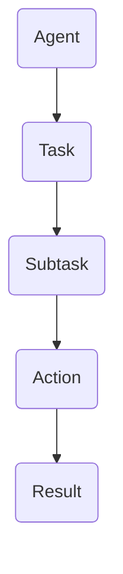
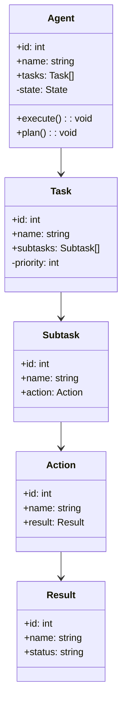
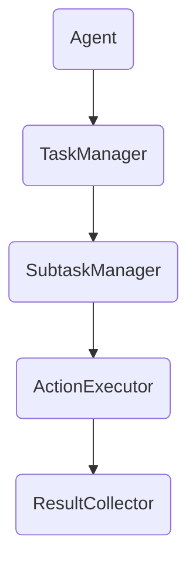
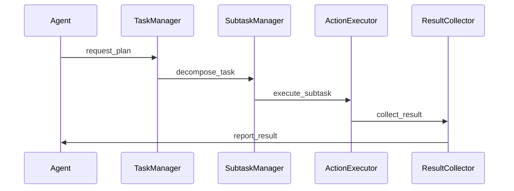

                 


# AI Agent的任务规划与执行框架

> 关键词：AI Agent, 任务规划, 执行框架, 强化学习, 系统架构, 项目实战

> 摘要：本文系统地介绍AI Agent的任务规划与执行框架，涵盖从基础概念到高级算法，再到实际项目的实现与应用。通过详细的理论分析、算法推导、系统设计和项目实战，帮助读者全面掌握AI Agent的任务规划与执行框架的核心原理与实际应用。

---

# 第一部分: AI Agent的任务规划与执行框架概述

---

## 第1章: AI Agent的基本概念与任务规划的定义

### 1.1 AI Agent的定义与特点

#### 1.1.1 AI Agent的定义
AI Agent（智能代理）是指能够感知环境、自主决策并执行任务的智能实体。AI Agent的核心目标是通过感知和行动与环境交互，以实现特定的目标或解决问题。

#### 1.1.2 AI Agent的核心特点
- **自主性**：AI Agent能够自主决策，无需外部干预。
- **反应性**：能够实时感知环境并做出反应。
- **目标导向性**：基于目标进行规划和执行。
- **学习能力**：通过经验改进性能。

#### 1.1.3 AI Agent与传统程序的区别
- **自主性**：传统程序依赖于外部输入，而AI Agent能够自主决策。
- **环境交互**：传统程序不与环境交互，而AI Agent能够感知和行动。
- **学习能力**：传统程序无法改进，而AI Agent可以通过学习优化性能。

### 1.2 任务规划的定义与分类

#### 1.2.1 任务规划的定义
任务规划是指通过分解任务、制定执行计划并优化资源分配，以实现目标的过程。

#### 1.2.2 任务规划的分类
- **静态任务规划**：任务环境固定，规划一次性完成。
- **动态任务规划**：任务环境动态变化，需要实时调整规划。
- **协作任务规划**：多个AI Agent协作完成任务。

#### 1.2.3 任务规划与执行的关系
任务规划是执行的前提，执行是规划的实现。规划与执行是动态交互的过程，执行的结果会影响规划的调整。

### 1.3 AI Agent任务规划的背景与意义

#### 1.3.1 问题背景
在复杂环境中，AI Agent需要高效地规划和执行任务，以应对不确定性。

#### 1.3.2 问题描述
AI Agent需要在动态环境中，通过感知和决策，制定最优的执行计划。

#### 1.3.3 问题解决的思路
- **感知环境**：通过传感器或数据源获取环境信息。
- **任务分解**：将复杂任务分解为子任务。
- **制定计划**：基于任务分解制定执行计划。
- **动态调整**：根据执行反馈实时调整计划。

#### 1.3.4 问题的边界与外延
- **边界**：任务规划的范围和限制条件。
- **外延**：任务规划与其他技术（如机器学习、强化学习）的结合。

#### 1.3.5 核心概念结构与组成要素
- **任务目标**：AI Agent需要完成的目标。
- **任务分解**：将任务分解为子任务。
- **任务约束**：任务执行的限制条件。
- **任务优先级**：子任务的执行顺序。

### 1.4 本章小结
本章介绍了AI Agent的基本概念、任务规划的定义与分类，以及任务规划的背景与意义。接下来将深入探讨任务规划的核心原理与算法。

---

## 第2章: 任务规划的核心原理与算法

### 2.1 任务规划的原理

#### 2.1.1 任务分解的基本原理
任务分解是将复杂任务拆解为多个子任务，以降低问题的复杂性。

#### 2.1.2 任务优先级排序的原理
任务优先级排序是根据任务的重要性和紧急性确定执行顺序。

#### 2.1.3 任务依赖关系的处理
任务依赖关系是指某些任务必须在其他任务完成后才能执行。

### 2.2 任务规划算法的分类与对比

#### 2.2.1 基于规则的规划算法
基于规则的规划算法通过预定义的规则进行任务分解和优先级排序。

#### 2.2.2 基于搜索的规划算法
基于搜索的规划算法通过搜索算法（如A*、Dijkstra）寻找最优路径。

#### 2.2.3 基于强化学习的规划算法
基于强化学习的规划算法通过强化学习模型（如DQN）进行任务规划。

### 2.3 任务规划与执行的协同机制

#### 2.3.1 规划与执行的协同关系
任务规划与执行是动态交互的过程，执行结果会影响规划的调整。

#### 2.3.2 任务执行中的反馈机制
通过执行反馈实时调整任务规划，以应对环境变化。

#### 2.3.3 动态任务调整的实现
根据执行反馈动态调整任务优先级和执行顺序。

### 2.4 核心概念对比表
表2-1: 任务规划算法的分类与对比

| 算法类型       | 描述                           | 优点                   | 缺点                   |
|----------------|--------------------------------|------------------------|------------------------|
| 基于规则的     | 通过预定义规则进行规划         | 实现简单               | 依赖规则设计           |
| 基于搜索的     | 通过搜索算法寻找最优路径       | 可以找到全局最优解     | 计算复杂度高           |
| 基于强化学习的  | 通过强化学习模型进行规划       | 能够适应动态环境       | 需要大量训练数据       |

### 2.5 ER实体关系图


### 2.6 本章小结
本章详细介绍了任务规划的核心原理与算法，包括任务分解、优先级排序、任务依赖关系处理，以及不同任务规划算法的分类与对比。接下来将深入探讨任务规划与执行的协同机制。

---

## 第3章: 系统分析与架构设计

### 3.1 问题场景介绍

#### 3.1.1 问题背景
在动态环境中，AI Agent需要高效地规划和执行任务。

#### 3.1.2 问题描述
AI Agent需要在动态环境中实时感知和调整任务执行计划。

### 3.2 系统功能设计

#### 3.2.1 领域模型类图


#### 3.2.2 系统架构设计


### 3.3 系统接口设计

#### 3.3.1 接口描述
- `Agent.execute()`：执行任务。
- `TaskManager.plan()`：制定任务计划。
- `SubtaskManager.decompose()`：分解子任务。
- `ActionExecutor.execute_action()`：执行动作。
- `ResultCollector.report()`：报告结果。

### 3.4 系统交互序列图


### 3.5 本章小结
本章通过系统分析与架构设计，详细描述了AI Agent任务规划与执行框架的系统结构与交互流程。接下来将通过项目实战进一步验证和优化系统设计。

---

## 第4章: 项目实战

### 4.1 环境安装与配置

#### 4.1.1 环境要求
- Python 3.8+
- 安装依赖：`pip install numpy matplotlib`

### 4.2 核心代码实现

#### 4.2.1 Agent类实现
```python
class Agent:
    def __init__(self, id, name):
        self.id = id
        self.name = name
        self.tasks = []
        self.state = 'idle'

    def execute(self):
        pass

    def plan(self):
        pass
```

#### 4.2.2 Task类实现
```python
class Task:
    def __init__(self, id, name):
        self.id = id
        self.name = name
        self.subtasks = []
        self.priority = 0
```

#### 4.2.3 Subtask类实现
```python
class Subtask:
    def __init__(self, id, name):
        self.id = id
        self.name = name
        self.action = None
```

#### 4.2.4 Action类实现
```python
class Action:
    def __init__(self, id, name):
        self.id = id
        self.name = name
        self.result = None
```

#### 4.2.5 Result类实现
```python
class Result:
    def __init__(self, id, name, status):
        self.id = id
        self.name = name
        self.status = status
```

### 4.3 代码应用解读与分析

#### 4.3.1 Agent的执行流程
1. `Agent.plan()`：根据任务目标制定执行计划。
2. `SubtaskManager.decompose()`：将任务分解为子任务。
3. `ActionExecutor.execute_action()`：执行子任务。
4. `ResultCollector.report()`：报告执行结果。

### 4.4 实际案例分析与详细讲解
假设一个AI Agent需要完成“智能客服”的任务，具体流程如下：

1. **任务分解**：将“智能客服”任务分解为“客户咨询”、“订单处理”等子任务。
2. **优先级排序**：根据紧急程度确定子任务的执行顺序。
3. **任务执行**：根据优先级依次执行子任务。
4. **反馈调整**：根据执行结果动态调整任务计划。

### 4.5 项目小结
本章通过项目实战，详细展示了AI Agent任务规划与执行框架的实现过程，包括环境配置、代码实现和案例分析。

---

## 第5章: 最佳实践与小结

### 5.1 最佳实践
- **任务分解**：合理分解任务，避免过于复杂的子任务。
- **优先级排序**：根据任务的重要性和紧急性确定优先级。
- **动态调整**：根据执行反馈实时调整任务计划。

### 5.2 注意事项
- **任务约束**：充分考虑任务的约束条件。
- **算法选择**：根据具体场景选择合适的任务规划算法。
- **系统架构**：确保系统架构的可扩展性和可维护性。

### 5.3 未来拓展
- **强化学习**：进一步研究强化学习在任务规划中的应用。
- **多 Agent 协作**：研究多 Agent 协作的任务规划与执行。

### 5.4 本章小结
本文系统地介绍了AI Agent的任务规划与执行框架，从基础概念到高级算法，再到实际项目的实现与应用，帮助读者全面掌握AI Agent的任务规划与执行框架的核心原理与实际应用。

---

# 作者：AI天才研究院/AI Genius Institute & 禅与计算机程序设计艺术 /Zen And The Art of Computer Programming

