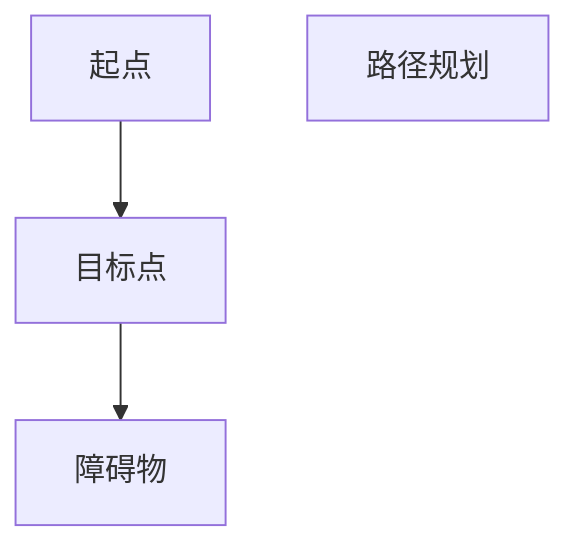
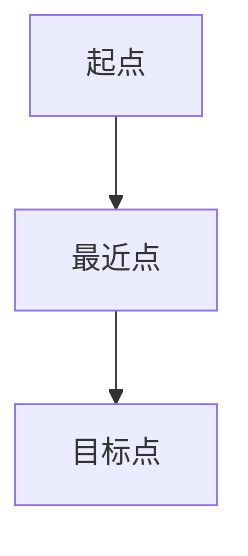
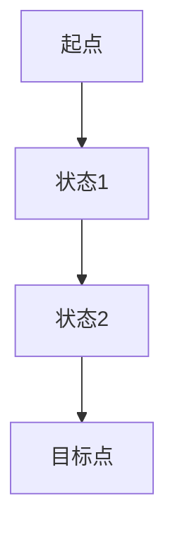
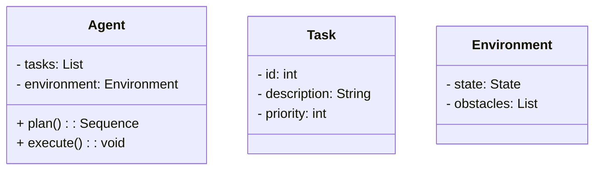
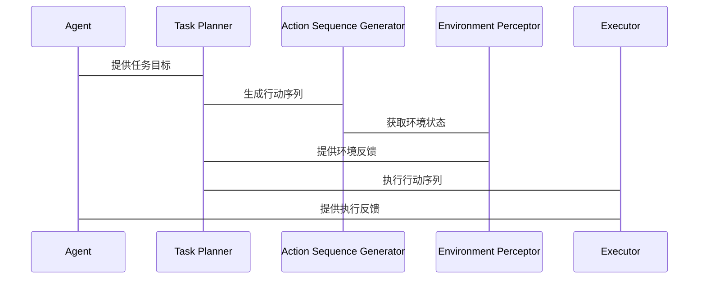

                 


# AI Agent的任务规划与执行模块设计

## 关键词：AI Agent，任务规划，执行模块，算法原理，系统设计，项目实战

## 摘要：  
本文系统地探讨了AI Agent任务规划与执行模块的设计与实现。从基础概念到算法原理，再到系统设计和项目实战，全面分析了任务规划与执行模块的核心要素和实现方法。通过详细的理论分析和实际案例，本文为读者提供了从理论到实践的完整指南。

---

# 第1章: AI Agent任务规划与执行模块概述

## 1.1 问题背景与问题描述
### 1.1.1 AI Agent的基本概念
AI Agent（智能体）是指能够感知环境、自主决策并执行任务的智能实体。任务规划与执行模块是AI Agent的核心组成部分，负责将任务目标转化为具体的行动序列，并在动态环境中动态调整执行策略。

### 1.1.2 任务规划与执行模块的核心问题
任务规划与执行模块需要解决以下核心问题：
- 任务目标的分解与优先级排序。
- 行动序列的生成与优化。
- 动态环境中的实时调整与反馈。

### 1.1.3 任务规划与执行模块的边界与外延
任务规划与执行模块的边界包括：
- 输入：任务目标、环境状态、可用资源。
- 输出：行动序列、执行反馈。
- 外延：与其他模块（如感知模块、决策模块）的交互。

## 1.2 任务规划与执行模块的核心要素
### 1.2.1 任务目标的定义与分解
任务目标需要明确、具体，并能够分解为子任务。例如，将“完成文件分类”分解为“文件识别”和“文件归档”两个子任务。

### 1.2.2 行动序列的生成与优化
行动序列需要满足以下要求：
- 可行性：行动序列必须在环境中可行。
- 优化性：行动序列需要在时间、资源等约束下最优。

### 1.2.3 环境感知与动态调整
环境感知是任务规划与执行模块的关键能力，需要能够实时感知环境变化，并动态调整执行策略。

## 1.3 任务规划与执行模块的结构与功能
### 1.3.1 模块的功能划分
- 任务目标解析模块。
- 行动序列生成模块。
- 环境感知与反馈模块。

### 1.3.2 模块的输入输出关系
- 输入：任务目标、环境状态。
- 输出：行动序列、执行反馈。

### 1.3.3 模块的核心算法与技术
- 任务分解算法。
- 行动序列生成算法。
- 环境感知算法。

## 1.4 本章小结
本章从AI Agent的基本概念出发，详细阐述了任务规划与执行模块的核心问题、核心要素和结构功能，为后续章节的深入分析奠定了基础。

---

# 第2章: 任务规划与执行模块的核心概念与联系

## 2.1 核心概念原理
### 2.1.1 任务目标的表示与建模
任务目标可以通过多种方式表示，例如：
- **向量表示**：将任务目标表示为一个多维向量。
- **图表示**：将任务目标表示为图中的节点。
- **树表示**：将任务目标表示为树结构中的节点。

### 2.1.2 行动序列的生成机制
行动序列的生成机制包括：
- **基于规则的生成**：根据预定义的规则生成行动序列。
- **基于搜索的生成**：通过搜索算法生成最优行动序列。
- **基于强化学习的生成**：通过强化学习算法生成最优行动序列。

### 2.1.3 环境感知与反馈机制
环境感知与反馈机制包括：
- **基于传感器的感知**：通过传感器获取环境信息。
- **基于模型的感知**：通过预定义的模型预测环境状态。
- **基于强化学习的反馈**：通过强化学习算法动态调整执行策略。

## 2.2 核心概念属性对比
| 核心概念 | 属性特征 |
|----------|----------|
| 任务目标 | 明确性、可分解性、可量化性 |
| 行动序列 | 可行性、优化性、可调整性 |
| 环境感知 | 实时性、动态性、不确定性 |

## 2.3 ER实体关系图
```mermaid
er
actor(Agent, action, environment)
```

## 2.4 本章小结
本章通过核心概念的对比和ER实体关系图，深入分析了任务规划与执行模块的内在联系，为后续的算法设计提供了理论基础。

---

# 第3章: 任务规划与执行模块的算法原理

## 3.1 算法原理概述
### 3.1.1 任务规划算法的分类
任务规划算法主要分为以下几类：
- **基于搜索的算法**：如A*、BFS、DFS。
- **基于规则的算法**：如专家系统。
- **基于强化学习的算法**：如Q-learning、Deep Q-Network。

### 3.1.2 行动序列生成算法的分类
行动序列生成算法主要分为以下几类：
- **基于动态规划的算法**：如Dijkstra、Bellman-Ford。
- **基于启发式搜索的算法**：如A*、贪心算法。
- **基于强化学习的算法**：如策略梯度、Actor-Critic。

### 3.1.3 环境感知与反馈算法的分类
环境感知与反馈算法主要分为以下几类：
- **基于监督学习的算法**：如线性回归、SVM。
- **基于无监督学习的算法**：如聚类、降维。
- **基于强化学习的算法**：如Q-learning、Deep Q-Network。

## 3.2 常见任务规划算法
### 3.2.1 A*算法
A*算法是一种常用的路径规划算法，其流程如下：


### 3.2.2 贪心算法
贪心算法是一种简单的路径规划算法，其流程如下：


### 3.2.3 动态规划算法
动态规划算法是一种常用的行动序列生成算法，其流程如下：


## 3.3 行动序列生成算法
### 3.3.1 BFS算法
BFS算法是一种常用的搜索算法，其代码示例如下：
```python
def bfs(start, goal):
    queue = deque([start])
    visited = {start}
    while queue:
        node = queue.popleft()
        if node == goal:
            return True
        for neighbor in neighbors(node):
            if neighbor not in visited:
                visited.add(neighbor)
                queue.append(neighbor)
    return False
```

### 3.3.2 DFS算法
DFS算法是一种常用的搜索算法，其代码示例如下：
```python
def dfs(start, goal):
    stack = [start]
    visited = {start}
    while stack:
        node = stack.pop()
        if node == goal:
            return True
        for neighbor in neighbors(node):
            if neighbor not in visited:
                visited.add(neighbor)
                stack.append(neighbor)
    return False
```

### 3.3.3 动态规划算法
动态规划算法是一种常用的行动序列生成算法，其数学模型如下：
$$
f(n) = \min_{m} (f(m) + cost(m, n))
$$

## 3.4 环境感知与反馈算法
### 3.4.1 基于强化学习的反馈机制
基于强化学习的反馈机制是一种常用的环境感知算法，其数学模型如下：
$$
Q(s, a) = Q(s, a) + \alpha (r + \gamma \max Q(s', a') - Q(s, a))
$$

### 3.4.2 基于监督学习的反馈机制
基于监督学习的反馈机制是一种常用的环境感知算法，其数学模型如下：
$$
y = w \cdot x + b
$$

### 3.4.3 基于混合学习的反馈机制
基于混合学习的反馈机制是一种常用的环境感知算法，其数学模型如下：
$$
Q(s, a) = (1-\alpha)Q(s, a) + \alpha r
$$

## 3.5 本章小结
本章详细介绍了任务规划与执行模块的核心算法，包括任务规划算法、行动序列生成算法和环境感知与反馈算法，并通过代码和数学公式进行了详细讲解。

---

# 第4章: 任务规划与执行模块的数学模型与公式

## 4.1 任务目标的数学表示
### 4.1.1 任务目标的向量表示
任务目标的向量表示可以表示为：
$$
v = [v_1, v_2, ..., v_n]
$$

### 4.1.2 任务目标的图表示
任务目标的图表示可以表示为：
$$
G = (V, E)
$$

### 4.1.3 任务目标的树表示
任务目标的树表示可以表示为：
$$
T = (R, C)
$$

## 4.2 行动序列的数学模型
### 4.2.1 基于概率论的行动序列模型
基于概率论的行动序列模型可以表示为：
$$
P(a|s) = \frac{P(s|a)P(a)}{P(s)}
$$

### 4.2.2 基于图论的行动序列模型
基于图论的行动序列模型可以表示为：
$$
f(n) = \min_{m} (f(m) + cost(m, n))
$$

### 4.2.3 基于强化学习的行动序列模型
基于强化学习的行动序列模型可以表示为：
$$
Q(s, a) = r + \gamma \max Q(s', a')
$$

## 4.3 环境感知与反馈的数学模型
### 4.3.1 基于强化学习的环境感知模型
基于强化学习的环境感知模型可以表示为：
$$
Q(s, a) = Q(s, a) + \alpha (r + \gamma \max Q(s', a') - Q(s, a))
$$

### 4.3.2 基于监督学习的环境感知模型
基于监督学习的环境感知模型可以表示为：
$$
y = w \cdot x + b
$$

### 4.3.3 基于混合学习的环境感知模型
基于混合学习的环境感知模型可以表示为：
$$
Q(s, a) = (1-\alpha)Q(s, a) + \alpha r
$$

## 4.4 本章小结
本章通过数学公式详细分析了任务目标、行动序列和环境感知的核心模型，为后续的系统设计和项目实战奠定了数学基础。

---

# 第5章: 系统分析与架构设计

## 5.1 问题场景介绍
### 5.1.1 项目背景
本项目旨在设计一个AI Agent的任务规划与执行模块，用于实现自主任务规划与执行。

### 5.1.2 项目目标
项目目标包括：
- 实现任务目标的分解与优先级排序。
- 生成可行的行动序列。
- 实现环境感知与动态调整。

## 5.2 系统功能设计
### 5.2.1 领域模型


### 5.2.2 功能模块
- 任务目标解析模块。
- 行动序列生成模块。
- 环境感知与反馈模块。

## 5.3 系统架构设计
### 5.3.1 系统架构


### 5.3.2 接口设计
- 输入接口：任务目标、环境状态。
- 输出接口：行动序列、执行反馈。

## 5.4 系统交互流程
### 5.4.1 交互流程


## 5.5 本章小结
本章通过系统分析与架构设计，明确了任务规划与执行模块的系统结构和交互流程，为后续的项目实战奠定了基础。

---

# 第6章: 项目实战

## 6.1 环境搭建与开发工具安装
### 6.1.1 开发环境
- 操作系统：Linux/Windows/MacOS
- 开发工具：Python/PyCharm
- 依赖库：numpy、pandas、scipy

## 6.2 系统核心实现
### 6.2.1 任务目标解析模块
```python
class TaskPlanner:
    def __init__(self):
        self.tasks = []
    
    def add_task(self, task):
        self.tasks.append(task)
    
    def remove_task(self, task_id):
        for task in self.tasks:
            if task.id == task_id:
                self.tasks.remove(task)
                break
```

### 6.2.2 行动序列生成模块
```python
class ActionGenerator:
    def __init__(self):
        self.actions = []
    
    def generate_actions(self, task):
        for action in task.actions:
            self.actions.append(action)
```

### 6.2.3 环境感知与反馈模块
```python
class EnvironmentPerceptor:
    def __init__(self):
        self.environment = Environment()
    
    def perceive(self):
        return self.environment.state
```

## 6.3 代码应用解读与分析
### 6.3.1 代码功能解读
- 任务目标解析模块负责任务目标的分解与优先级排序。
- 行动序列生成模块负责生成可行的行动序列。
- 环境感知与反馈模块负责实时感知环境状态并提供反馈。

### 6.3.2 代码实现细节
- 任务目标解析模块实现了任务的添加与删除功能。
- 行动序列生成模块实现了基于任务目标的行动序列生成。
- 环境感知与反馈模块实现了环境状态的实时感知与反馈。

## 6.4 实际案例分析
### 6.4.1 案例背景
假设任务目标是“完成文件分类”，需要将文件分为“文档”、“图片”、“视频”三类。

### 6.4.2 案例实现
```python
task = Task(description="完成文件分类", priority=1)
action_sequence = action_generator.generate_actions(task)
```

## 6.5 项目小结
本章通过项目实战，详细讲解了任务规划与执行模块的实现过程，包括环境搭建、代码实现和案例分析。

---

# 作者：AI天才研究院/AI Genius Institute & 禅与计算机程序设计艺术 /Zen And The Art of Computer Programming

---

以上是《AI Agent的任务规划与执行模块设计》的完整目录大纲，涵盖了从基础概念到算法原理，再到系统设计和项目实战的各个方面。

