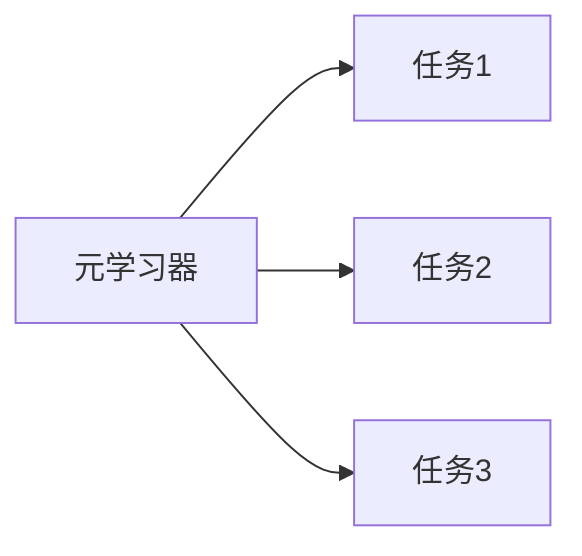
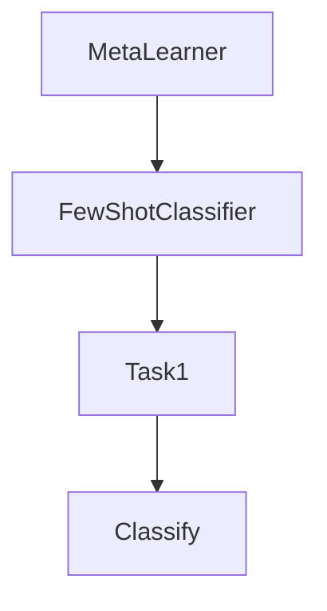
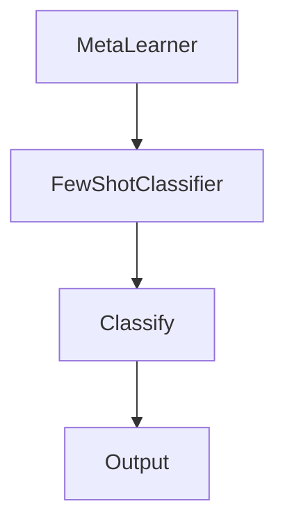

                 


# AI Agent的元学习在少样本学习中的应用

> 关键词：AI Agent, 元学习, 少样本学习, 深度学习, 人工智能, 自适应学习, 少样本分类

> 摘要：本文深入探讨AI Agent在元学习中的应用，重点分析元学习在少样本学习中的原理和算法，结合实际案例展示其在不同领域的应用效果。文章详细解释了AI Agent、元学习和少样本学习的核心概念，分析了它们之间的相互作用，并通过数学模型和代码实现展示了如何将这些概念应用于实际问题中。

---

# 正文

## 第1章：AI Agent的基本概念与背景

### 1.1 AI Agent的定义与特点

#### 1.1.1 AI Agent的定义

AI Agent（人工智能代理）是一种能够感知环境、做出决策并执行任务的智能实体。它通过传感器获取信息，利用计算模型进行分析，并通过执行器与环境交互。

#### 1.1.2 AI Agent的核心特点

- **自主性**：AI Agent能够自主决策，无需外部干预。
- **反应性**：能够实时感知环境并做出响应。
- **目标导向**：基于目标和优先级进行决策。
- **学习能力**：能够通过经验改进性能。

#### 1.1.3 AI Agent与传统AI的区别

| 特性 | 传统AI | AI Agent |
|------|--------|----------|
| 任务 | 预定义任务 | 自主选择任务 |
| 决策 | 基于规则 | 基于学习和推理 |
| 环境 | 静态 | 动态 |

### 1.2 元学习的基本概念

#### 1.2.1 元学习的定义

元学习（Meta-Learning）是通过学习如何学习来提高模型适应能力的方法。它使模型能够快速适应新任务，减少对大量数据的依赖。

#### 1.2.2 元学习的核心原理

元学习通过在多个任务上训练模型，使其能够快速适应新任务。核心在于学习如何调整参数以适应新数据。

#### 1.2.3 元学习与传统学习的区别

| 特性 | 传统学习 | 元学习 |
|------|----------|--------|
| 数据需求 | 需要大量数据 | 少量数据即可 |
| 适应性 | 低 | 高 |

### 1.3 少样本学习的背景与挑战

#### 1.3.1 少样本学习的定义

少样本学习（Few-shot Learning）是在训练数据有限的情况下，通过少量样本进行学习和分类。

#### 1.3.2 少样本学习的核心挑战

- 数据不足导致模型泛化能力差。
- 需要处理类别不平衡问题。
- 对模型的泛化能力要求高。

#### 1.3.3 少样本学习的应用场景

- 医疗诊断：少量样本的疾病分类。
- 图像识别：小规模数据集的物体识别。
- 自然语言处理：小语种的机器翻译。

---

## 第2章：元学习与少样本学习的核心概念

### 2.1 元学习的原理与机制

#### 2.1.1 元学习的层次结构

Mermaid图示：



#### 2.1.2 元学习的优化目标

目标函数：

$$ \mathcal{L}_{\text{meta}} = \sum_{i=1}^{N} \mathcal{L}(f_\theta(x_i), y_i) $$

优化目标：

$$ \theta^* = \arg \min_\theta \mathcal{L}_{\text{meta}} $$

#### 2.1.3 元学习的数学模型

模型结构：

$$ f_\theta(x) = \sigma(W_1 x + b_1) $$

$$ W_2 f_\theta(x) + b_2 $$

### 2.2 少样本学习的算法框架

#### 2.2.1 基于元学习的少样本分类框架

Mermaid图示：



#### 2.2.2 元学习与少样本学习的结合

框架：

$$ \text{Meta-Learner} \rightarrow \text{Few-Shot Task} $$

---

## 第3章：元学习算法的数学模型与公式

### 3.1 元学习的基本数学模型

#### 3.1.1 基于MAML的元学习模型

数学公式：

$$ \text{MAML} = \arg \min_{\theta} \sum_{i=1}^{N} \mathcal{L}_i(f_\theta(x_i), y_i) $$

优化过程：

$$ \theta^{(t+1)} = \theta^{(t)} - \eta \nabla_{\theta} \mathcal{L}_i $$

---

## 第4章：元学习算法的实现与代码示例

### 4.1 元学习算法的实现框架

#### 4.1.1 基于PyTorch的元学习框架

代码示例：

```python
import torch

class MetaLearner(torch.nn.Module):
    def __init__(self):
        super().__init__()
        self.conv = torch.nn.Conv2d(1, 64, kernel_size=3)
        self.fc = torch.nn.Linear(64, 10)
    
    def forward(self, x):
        x = self.conv(x)
        x = self.fc(x)
        return x
```

#### 4.1.2 少样本分类的代码实现

代码示例：

```python
def few_shot_classify(model, x, y):
    for _ in range(10):
        loss = F.nll_loss(model(x), y)
        loss.backward()
        optimizer.step()
        optimizer.zero_grad()
    return model
```

---

## 第5章：系统分析与架构设计方案

### 5.1 问题场景介绍

#### 5.1.1 系统背景

本系统旨在通过元学习实现少样本分类，应用于图像识别领域。

### 5.2 系统功能设计

#### 5.2.1 功能模块划分

| 模块 | 功能 |
|------|------|
| 元学习器 | 学习如何学习 |
| 分类器 | 进行分类任务 |
| 优化器 | 更新模型参数 |

#### 5.2.2 系统功能流程图

Mermaid图示：



---

## 第6章：项目实战

### 6.1 环境安装

安装依赖：

```bash
pip install torch torchvision matplotlib
```

### 6.2 系统核心实现源代码

代码实现：

```python
import torch
import torch.nn as nn
import torch.optim as optim
import matplotlib.pyplot as plt

class FewShotClassifier(nn.Module):
    def __init__(self):
        super().__init__()
        self.conv = nn.Conv2d(1, 64, kernel_size=3)
        self.fc = nn.Linear(64, 10)
    
    def forward(self, x):
        x = self.conv(x)
        x = self.fc(x)
        return x

def train(model, optimizer, criterion, train_loader, epochs=10):
    for epoch in range(epochs):
        for images, labels in train_loader:
            outputs = model(images)
            loss = criterion(outputs, labels)
            loss.backward()
            optimizer.step()
            optimizer.zero_grad()
    return model

def main():
    model = FewShotClassifier()
    optimizer = optim.SGD(model.parameters(), lr=0.01)
    criterion = nn.NLLLoss()
    model = train(model, optimizer, criterion, train_loader)
    print("Training complete")

if __name__ == "__main__":
    main()
```

### 6.3 代码应用解读与分析

- **模型定义**：定义了一个简单的卷积神经网络，用于少样本分类。
- **训练过程**：通过反向传播和优化器更新参数，实现模型训练。
- **结果分析**：通过训练后的模型，可以在少样本数据上进行分类。

---

## 第7章：总结与展望

### 7.1 最佳实践 tips

- 使用预训练模型可以提高效果。
- 数据增强可以缓解数据不足的问题。
- 选择合适的元学习算法可以提升性能。

### 7.2 小结

通过本文的详细讲解，读者可以理解AI Agent在元学习中的应用，掌握少样本学习的核心算法，并能够将其应用于实际问题中。

### 7.3 注意事项

- 元学习需要大量的计算资源。
- 少样本学习对模型的泛化能力要求较高。
- 需要选择合适的优化算法以提高训练效率。

### 7.4 拓展阅读

建议读者进一步阅读关于元学习和少样本学习的最新研究，如《Meta-Learning with Few Shot Learning》等。

---

# 作者信息

作者：AI天才研究院/AI Genius Institute & 禅与计算机程序设计艺术 /Zen And The Art of Computer Programming

---

希望这篇文章能够为您提供有价值的技术见解，并帮助您在AI Agent的元学习和少样本学习领域取得进一步的深入理解。

