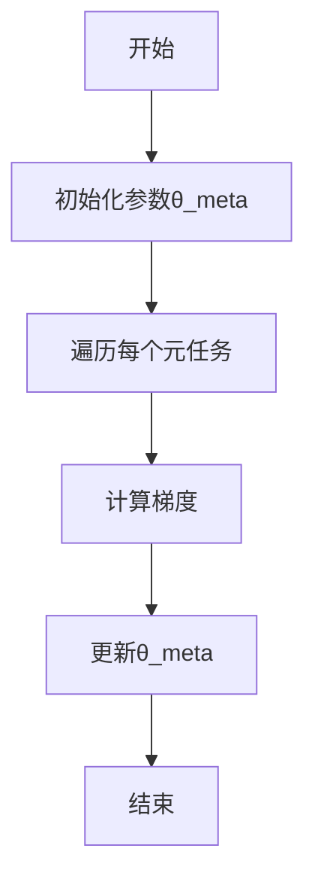
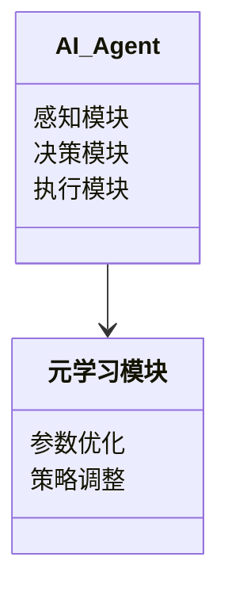
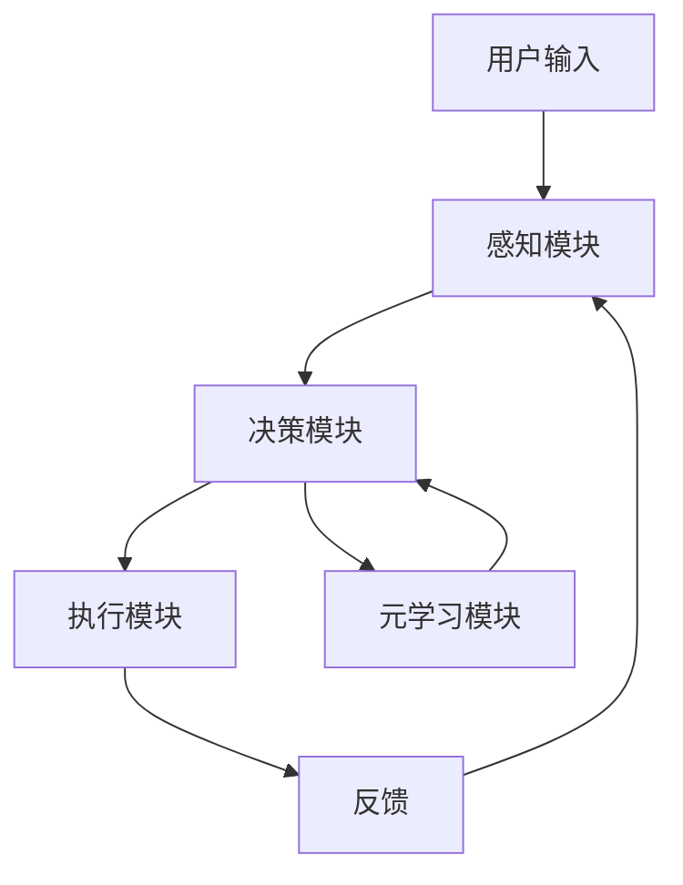
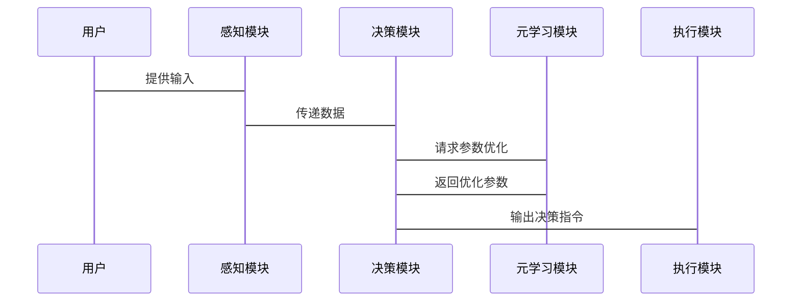

                 


# AI Agent的元学习能力开发实践

## 关键词：
AI Agent, 元学习, MAML, ReMAML, 系统架构, 项目实战

## 摘要：
本文系统地探讨了AI Agent的元学习能力开发实践，从基础概念到算法实现，再到系统架构和项目实战，全面解析了元学习在AI Agent中的应用。通过详细讲解MAML和ReMAML算法，结合数学模型和代码示例，帮助读者深入理解元学习的核心原理。同时，本文还提供了实际项目开发的实战经验，帮助开发者更好地将元学习能力应用于实际场景。

---

## 第一部分: AI Agent与元学习能力开发基础

### 第1章: AI Agent与元学习能力概述

#### 1.1 AI Agent的基本概念

##### 1.1.1 AI Agent的定义
AI Agent（人工智能代理）是指能够感知环境、自主决策并执行任务的智能体。它具备学习、推理和自适应能力，能够在动态环境中完成复杂任务。

##### 1.1.2 AI Agent的核心特点
- **自主性**：能够独立决策和行动。
- **反应性**：能够实时感知环境并做出反应。
- **学习能力**：能够通过经验改进性能。
- **社交能力**：能够与其他Agent或人类进行交互。

##### 1.1.3 元学习能力的定义与特点
元学习（Meta-Learning）是指通过学习如何学习的能力，使AI Agent能够在较少数据或经验的情况下快速适应新任务。

#### 1.2 元学习的背景与意义

##### 1.2.1 元学习的背景
传统机器学习算法在处理新任务时需要大量数据和训练时间，而元学习通过在任务间共享知识，显著提高了学习效率。

##### 1.2.2 元学习的意义
- **提高泛化能力**：能够在新任务中快速适应。
- **减少数据依赖**：降低对大量数据的需求。
- **提升效率**：减少训练时间和资源消耗。

#### 1.3 AI Agent的元学习能力

##### 1.3.1 元学习在AI Agent中的作用
元学习使AI Agent能够快速调整策略，适应动态变化的环境。

##### 1.3.2 元学习能力的核心要素
- **元学习算法**：如MAML、ReMAML等。
- **元知识表示**：如何表示跨任务的知识。
- **自适应机制**：动态调整模型参数。

#### 1.4 本章小结
本章介绍了AI Agent的基本概念和元学习的背景、意义，重点阐述了元学习在AI Agent中的作用和核心要素。

---

### 第2章: 元学习的基本原理与算法

#### 2.1 元学习的基本原理

##### 2.1.1 元学习的原理概述
元学习通过在多个任务间共享参数，优化参数以快速适应新任务。

##### 2.1.2 元学习的核心思想
元学习器在训练过程中学习如何调整模型参数，使其在新任务上快速收敛。

##### 2.1.3 元学习的数学模型
元学习的目标函数通常包括元任务损失和任务损失，具体如下：

$$ \mathcal{L}_{meta} = \sum_{i=1}^{N} \mathcal{L}_{task_i}(θ_{meta}) $$

其中，$θ_{meta}$ 是元学习器的参数。

#### 2.2 元学习算法的分类

##### 2.2.1 基于模型的元学习算法
基于模型的算法通过构建元学习模型来优化参数，如MAML。

##### 2.2.2 基于梯度的元学习算法
基于梯度的算法通过梯度下降优化元学习参数，如ReMAML。

##### 2.2.3 其他元学习算法
包括基于强化学习的元学习算法，如Meta-Q。

#### 2.3 常见元学习算法详解

##### 2.3.1 MAML算法
MAML通过在多个任务上进行两次梯度下降，优化元学习参数。

**MAML算法步骤**：
1. 在每个元任务上进行一次梯度下降，得到快适应步。
2. 在元训练集上进行一次梯度下降，更新元学习参数。

**MAML流程图**：


##### 2.3.2 ReMAML算法
ReMAML通过重新参数化技术优化元学习参数，减少计算复杂度。

**ReMAML流程图**：


##### 2.3.3 其他元学习算法
简要介绍其他算法，如Meta-SGD。

#### 2.4 元学习算法的优缺点分析

##### 2.4.1 元学习算法的优点
- **快速适应新任务**：减少数据需求。
- **提高泛化能力**：在不同任务间共享知识。

##### 2.4.2 元学习算法的缺点
- **计算复杂度高**：需要多次梯度计算。
- **模型收敛问题**：部分算法收敛性较差。

##### 2.4.3 元学习算法的适用场景
适用于数据稀少、任务多样化的场景。

#### 2.5 本章小结
本章详细讲解了元学习的基本原理和常见算法，分析了它们的优缺点及适用场景。

---

### 第3章: AI Agent的系统架构与设计

#### 3.1 AI Agent的系统架构

##### 3.1.1 AI Agent的组成结构
AI Agent通常由感知模块、决策模块和执行模块组成。

##### 3.1.2 元学习模块的设计
元学习模块负责参数优化和策略调整。

##### 3.1.3 系统架构的优缺点
采用模块化设计，提高系统灵活性和可扩展性。

#### 3.2 问题场景介绍

##### 3.2.1 问题背景
动态环境中的任务切换问题。

##### 3.2.2 问题描述
AI Agent需要快速适应新任务。

##### 3.2.3 问题解决
通过元学习优化参数。

#### 3.3 系统功能设计

##### 3.3.1 领域模型设计
使用Mermaid类图展示各模块关系。



##### 3.3.2 系统架构设计
使用Mermaid架构图展示系统整体架构。



#### 3.4 系统接口设计

##### 3.4.1 接口定义
- 感知模块接口：接收输入数据。
- 决策模块接口：输出决策指令。
- 元学习模块接口：优化参数。

##### 3.4.2 交互序列图
展示模块间的交互流程。



#### 3.5 本章小结
本章详细介绍了AI Agent的系统架构设计，包括模块组成、接口设计和系统架构图。

---

### 第4章: 元学习算法实现

#### 4.1 环境安装与配置

##### 4.1.1 安装Python
安装Python 3.x及以上版本。

##### 4.1.2 安装依赖库
安装TensorFlow、Keras、PyTorch等深度学习库。

#### 4.2 核心算法实现

##### 4.2.1 MAML算法实现
实现MAML算法的Python代码如下：

```python
import tensorflow as tf

def meta_learning_loss(theta_meta, gradients):
    # 计算元任务损失
    meta_loss = tf.reduce_mean([tf.norm(g) for g in gradients])
    return meta_loss

# 初始化元学习参数
theta_meta = tf.Variable(tf.random_normal(shape=[num_params]))

# 计算梯度
gradients = [tf.gradients(loss_task_i, theta_meta) for i in range(num_tasks)]
# 更新元学习参数
optimizer = tf.train.AdamOptimizer(learning_rate=0.001)
update_op = optimizer.minimize(meta_learning_loss(theta_meta, gradients))
```

##### 4.2.2 ReMAML算法实现
实现ReMAML算法的Python代码如下：

```python
import torch

def remaml_loss(theta_meta, gradients):
    # 计算元任务损失
    meta_loss = torch.mean(torch.norm(g) for g in gradients)
    return meta_loss

# 初始化元学习参数
theta_meta = torch.randn(num_params)

# 计算梯度
gradients = [torch.autograd.grad(loss_task_i, theta_meta, retain_graph=True) for i in range(num_tasks)]
# 更新元学习参数
optimizer = torch.optim.Adam([theta_meta], lr=0.001)
optimizer.zero_grad()
remaml_loss(theta_meta, gradients).backward()
optimizer.step()
```

#### 4.3 算法实现细节

##### 4.3.1 MAML与ReMAML对比
通过表格对比两者的优缺点。

| 对比维度 | MAML | ReMAML |
|----------|------|--------|
| 计算复杂度 | 高 | 低 |
| 收敛速度 | 较慢 | 较快 |
| 适用场景 | 数据充足 | 数据稀少 |

##### 4.3.2 算法的数学模型
MAML的数学模型如下：

$$ \theta_{meta} = \theta_{meta} - \eta \nabla_{\theta_{meta}} \mathcal{L}_{meta} $$

其中，$\eta$ 是学习率，$\nabla_{\theta_{meta}} \mathcal{L}_{meta}$ 是元任务损失的梯度。

##### 4.3.3 代码实现解读
详细解读上述代码，说明每一步的作用。

#### 4.4 本章小结
本章通过代码实现和对比分析，详细讲解了MAML和ReMAML算法的实现细节。

---

### 第5章: 项目实战

#### 5.1 项目介绍

##### 5.1.1 项目背景
一个基于元学习的多任务分类问题。

##### 5.1.2 项目目标
通过元学习优化分类模型。

#### 5.2 环境安装与配置

##### 5.2.1 安装依赖
安装必要的库，如TensorFlow、Keras等。

##### 5.2.2 数据准备
准备多任务数据集，如MNIST的子任务。

#### 5.3 核心代码实现

##### 5.3.1 MAML实现
实现MAML算法的完整代码。

```python
import tensorflow as tf

def meta_learning_loss(theta_meta, gradients):
    meta_loss = tf.reduce_mean([tf.norm(g) for g in gradients])
    return meta_loss

theta_meta = tf.Variable(tf.random_normal(shape=[num_params]))

gradients = [tf.gradients(loss_task_i, theta_meta) for i in range(num_tasks)]
optimizer = tf.train.AdamOptimizer(learning_rate=0.001)
update_op = optimizer.minimize(meta_learning_loss(theta_meta, gradients))
```

##### 5.3.2 ReMAML实现
实现ReMAML算法的完整代码。

```python
import torch

def remaml_loss(theta_meta, gradients):
    meta_loss = torch.mean(torch.norm(g) for g in gradients)
    return meta_loss

theta_meta = torch.randn(num_params)

gradients = [torch.autograd.grad(loss_task_i, theta_meta, retain_graph=True) for i in range(num_tasks)]
optimizer = torch.optim.Adam([theta_meta], lr=0.001)
optimizer.zero_grad()
remaml_loss(theta_meta, gradients).backward()
optimizer.step()
```

#### 5.4 案例分析与结果解读

##### 5.4.1 实验结果
展示实验结果，如准确率对比图。

##### 5.4.2 结果分析
分析不同算法在不同任务上的表现。

#### 5.5 项目小结
总结项目实现的关键点和经验教训。

---

### 第6章: 系统优化与扩展

#### 6.1 系统优化策略

##### 6.1.1 参数优化
调整学习率、批量大小等超参数。

##### 6.1.2 模型优化
使用更深的网络结构或更高效的算法。

#### 6.2 系统扩展方案

##### 6.2.1 多任务学习
扩展到更多任务。

##### 6.2.2 连续任务学习
支持连续任务流。

#### 6.3 系统性能评估

##### 6.3.1 性能指标
准确率、训练时间、资源消耗。

##### 6.3.2 指标对比
对比优化前后的性能提升。

#### 6.4 本章小结
本章探讨了系统的优化策略和扩展方案，为实际应用提供了参考。

---

### 第7章: 未来趋势与挑战

#### 7.1 未来发展趋势

##### 7.1.1 算法创新
开发更高效的元学习算法。

##### 7.1.2 应用场景扩展
探索更多领域的应用，如自动驾驶、医疗诊断。

#### 7.2 当前挑战

##### 7.2.1 算法局限性
部分算法在实际应用中表现不佳。

##### 7.2.2 数据依赖性
如何在数据稀少的情况下有效学习。

#### 7.3 应对策略

##### 7.3.1 提升算法 robustness
增强算法的鲁棒性。

##### 7.3.2 创新数据收集
探索更高效的数据收集方法。

#### 7.4 本章小结
本章展望了AI Agent元学习能力的未来发展方向，分析了当前面临的挑战及应对策略。

---

## 结语
AI Agent的元学习能力开发是一项复杂但极具潜力的领域。通过深入理解元学习的原理和算法，结合实际项目开发经验，我们可以更好地推动这一领域的发展。

---

## 作者
作者：AI天才研究院/AI Genius Institute  
作者：禅与计算机程序设计艺术/Zen And The Art of Computer Programming

