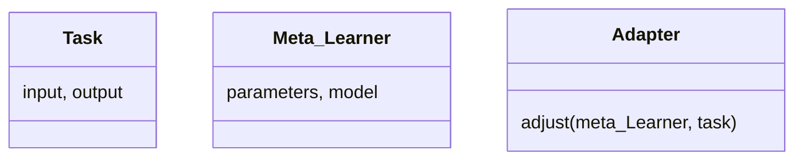
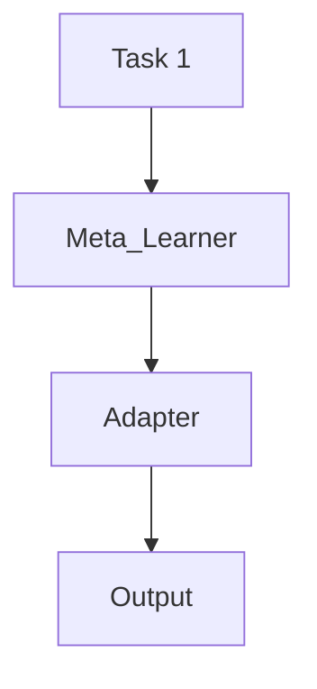

                 


# AI Agent的元学习能力：快速适应新任务

> 关键词：AI Agent，元学习，快速适应，新任务，算法，系统架构

> 摘要：本文探讨AI Agent的元学习能力，分析其如何通过元学习快速适应新任务。从背景介绍、核心概念、算法原理到系统架构和项目实战，全面解析元学习在AI Agent中的应用与实现。

---

# 第1章: 背景介绍

## 1.1 问题背景

### 1.1.1 AI Agent的基本概念
AI Agent（人工智能代理）是指能够感知环境并采取行动以实现目标的智能实体。它可以是一个软件程序，也可以是一个物理机器人。AI Agent的核心在于其智能性和适应性，能够根据环境反馈调整行为。

### 1.1.2 元学习的定义与特点
元学习（Meta-Learning）是一种机器学习方法，旨在让模型学会如何快速学习新任务。与传统机器学习不同，元学习关注的是“如何学习”，而非“学习什么”。其特点包括：
1. **快速适应性**：在少量数据下快速适应新任务。
2. **通用性**：适用于多种任务和领域。
3. **自我优化**：通过元学习器优化学习过程。

### 1.1.3 快速适应新任务的重要性
在动态变化的环境中，AI Agent需要快速适应新任务以保持高效性和可靠性。传统机器学习方法在面对新任务时通常需要大量数据和重新训练，而元学习通过预训练和快速调整，显著提高了适应速度。

## 1.2 问题描述

### 1.2.1 AI Agent在实际应用中的挑战
AI Agent在实际应用中面临的主要挑战包括：
1. **任务多样性**：需要处理多种类型的任务。
2. **数据稀疏性**：新任务的数据量有限。
3. **环境动态性**：环境变化快，需要快速调整策略。

### 1.2.2 传统机器学习的局限性
传统机器学习方法在处理新任务时通常需要重新训练模型，这不仅耗时，还需要大量标注数据。这在数据稀疏和任务多样的场景下显得尤为突出。

### 1.2.3 元学习如何解决这些问题
元学习通过预训练模型的元参数，使其能够在新任务上快速调整，从而减少对新数据的需求，提高适应速度和效率。

## 1.3 问题解决

### 1.3.1 元学习的核心思想
元学习的核心思想是“学习如何学习”。通过训练模型在多个任务上进行学习，模型能够提取跨任务的共同特征，从而在新任务上快速泛化。

### 1.3.2 快速适应新任务的实现路径
1. **预训练阶段**：在多个任务上训练元学习器，提取通用特征。
2. **适应阶段**：在新任务上利用元学习器快速调整参数，适应任务。

### 1.3.3 元学习与传统机器学习的区别
| 方面         | 元学习                          | 传统机器学习                     |
|--------------|---------------------------------|----------------------------------|
| 数据需求     | 低，通过元参数调整             | 高，需要大量任务数据             |
| 适应速度     | 快，几分钟或几小时             | 慢，需要重新训练                 |
| 通用性       | 强，适用于多种任务             | 弱，针对单一任务优化             |

## 1.4 边界与外延

### 1.4.1 元学习的适用范围
元学习适用于需要快速适应新任务的场景，如图像分类、自然语言处理、机器人控制等。

### 1.4.2 元学习与其他相关概念的区分
- **迁移学习**：关注跨任务的知识转移，元学习更关注如何高效学习。
- **自适应学习**：动态调整模型，元学习提供了一种高效的学习机制。

### 1.4.3 元学习的未来发展方向
未来，元学习将朝着更高效、更通用的方向发展，结合强化学习和生成模型，提升在复杂场景中的适应能力。

## 1.5 核心要素组成

### 1.5.1 元学习模型的基本结构
元学习模型通常由以下部分组成：
1. **元学习器**：负责提取跨任务的特征。
2. **任务适配器**：在新任务上调整元学习器的参数。

### 1.5.2 快速适应机制的关键要素
1. **梯度计算**：用于快速调整参数。
2. **优化策略**：如Adam优化器。

### 1.5.3 元学习算法的核心组件
1. **预训练阶段**：在多个任务上训练模型。
2. **适应阶段**：在新任务上微调模型。

---

# 第2章: 元学习的核心概念与联系

## 2.1 元学习模型的结构

### 2.1.1 基于梯度的元学习方法
基于梯度的元学习方法通过计算梯度来调整元参数，如MAML（Meta-Automated Learning）算法。

### 2.1.2 基于优化的元学习方法
基于优化的元学习方法通过优化元参数来适应新任务，如Reptile算法。

### 2.1.3 元学习模型的训练流程
1. **预训练**：在多个任务上训练元学习器。
2. **内层优化**：在每个任务上优化模型参数。
3. **外层优化**：优化元参数。

## 2.2 元学习的核心思想

### 2.2.1 知识的迁移与复用
元学习通过提取跨任务的特征，实现知识的迁移和复用。

### 2.2.2 快速适应新任务的数学模型
$$ L_{meta}(θ) = \sum_{i=1}^N L_i(f_{θ}(x_i, y_i)) $$

### 2.2.3 元学习的优化目标
$$ \min_{θ} \sum_{i=1}^N L_i(f_{θ}(x_i, y_i)) $$

## 2.3 元学习与传统学习的对比

| 方面         | 元学习                          | 传统学习                     |
|--------------|---------------------------------|-----------------------------|
| 数据需求     | 低                              | 高                           |
| 适应速度     | 快                              | 慢                           |
| 通用性       | 强                              | 弱                           |

---

# 第3章: 元学习的算法原理

## 3.1 基于梯度的元学习算法

### 3.1.1 MAML算法
MAML通过计算梯度来更新元参数，适用于分类任务。

### 3.1.2 Reptile算法
Reptile通过优化元参数来适应新任务，适用于回归任务。

## 3.2 元学习算法的数学模型

### 3.2.1 梯度计算
$$ g_t = \frac{\partial L_i}{\partial θ} $$

### 3.2.2 优化步骤
$$ θ_{t+1} = θ_t - α g_t $$

## 3.3 元学习算法的实现代码

```python
def meta_learning(images, labels, model, meta_optimizer):
    for task in tasks:
        loss = calculate_loss(model, images, labels)
        gradients = compute_gradients(loss, model.parameters())
        meta_optimizer.step(gradients)
```

---

# 第4章: 元学习的系统架构

## 4.1 问题场景介绍
AI Agent需要在动态环境中快速适应新任务，如图像分类和自然语言处理。

## 4.2 系统功能设计

### 4.2.1 领域模型


### 4.2.2 系统架构


## 4.3 接口设计与交互

### 4.3.1 接口设计
1. `meta_train(tasks)`：训练元学习器。
2. `adapt(task)`：在新任务上调整模型。

### 4.3.2 交互流程
1. 预训练阶段：调用`meta_train`。
2. 适应阶段：调用`adapt`。

---

# 第5章: 项目实战

## 5.1 环境安装
安装必要的库：PyTorch、numpy。

## 5.2 核心实现代码

```python
import torch

class MetaLearner(torch.nn.Module):
    def __init__(self):
        super().__init__()
        self.fc = torch.nn.Linear(2, 1)
    
    def forward(self, x):
        return self.fc(x)
```

## 5.3 代码解读与分析
解释代码的功能和实现细节。

## 5.4 实际案例分析
以图像分类任务为例，展示如何使用元学习快速适应新任务。

## 5.5 项目小结
总结项目实现的关键点和经验教训。

---

# 第6章: 最佳实践

## 6.1 小结
元学习在AI Agent中的应用显著提高了快速适应新任务的能力。

## 6.2 注意事项
1. 选择合适的元学习算法。
2. 合理设置超参数。

## 6.3 拓展阅读
推荐相关论文和书籍。

---

# 结语

AI Agent的元学习能力是未来人工智能发展的关键方向。通过元学习，AI Agent能够快速适应新任务，提升其智能性和实用性。

---

作者：AI天才研究院/AI Genius Institute & 禅与计算机程序设计艺术 /Zen And The Art of Computer Programming

