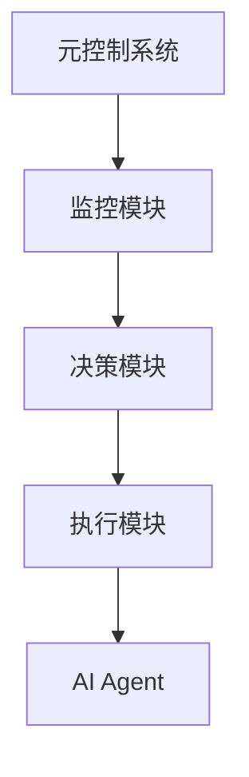

                 


# AI Agent的元控制：自适应行为策略

## 关键词：AI Agent、元控制、自适应行为、控制策略、算法实现

## 摘要：AI Agent的元控制是一种通过自适应行为策略来管理和控制AI代理行为的方法，旨在解决AI Agent在复杂动态环境中行为失控的问题。本文从基础概念到算法实现，系统性地探讨了元控制的原理与应用，分析了其在系统设计和项目实践中的关键步骤，并通过实际案例展示了其在提升AI Agent性能和安全性的有效性。

---

# 第一部分: AI Agent的元控制基础

## 第1章: AI Agent的基本概念与问题背景

### 1.1 AI Agent的定义与核心概念

#### 1.1.1 AI Agent的定义
AI Agent（人工智能代理）是指能够感知环境、自主决策并执行任务的智能实体。AI Agent可以是软件程序、机器人或其他智能系统，其核心目标是通过感知和行动实现特定目标。

#### 1.1.2 AI Agent的核心特征
- **自主性**：AI Agent能够自主决策，无需外部干预。
- **反应性**：能够实时感知环境并做出响应。
- **目标导向性**：基于目标驱动行为。
- **学习能力**：通过经验优化自身行为。

#### 1.1.3 AI Agent的分类与应用场景
AI Agent可以分为**简单反射型**、**基于模型的反应型**、**目标驱动型**和**效用驱动型**。其应用场景包括自动驾驶、智能助手、游戏AI和工业自动化等。

### 1.2 元控制的背景与问题描述

#### 1.2.1 AI Agent行为失控的潜在风险
AI Agent在复杂或动态环境中可能因目标冲突或环境变化而导致行为失控，带来安全隐患或效率损失。

#### 1.2.2 元控制的目标与意义
元控制（Meta-control）是对AI Agent行为的高层次调节，旨在确保AI Agent在复杂环境中的目标一致性和行为稳定性。

#### 1.2.3 当前AI Agent控制的主要挑战
- **目标冲突**：AI Agent可能因多个目标冲突而无法决策。
- **环境不确定性**：动态环境中的不确定性导致行为规划困难。
- **伦理与安全风险**：AI Agent的行为可能引发伦理争议或安全问题。

---

## 第2章: 元控制的核心概念与原理

### 2.1 元控制的定义与基本原理

#### 2.1.1 元控制的定义
元控制是对AI Agent行为的高层次控制机制，通过监控和调整AI Agent的策略参数，确保其行为符合全局目标。

#### 2.1.2 元控制与传统控制方法的对比

| **对比维度** | **传统控制方法** | **元控制方法** |
|--------------|------------------|----------------|
| **控制层级** | 基于具体任务     | 基于整体目标   |
| **控制范围** | 局部行为控制     | 全局策略调整   |
| **灵活性**    | 较低             | 较高           |

#### 2.1.3 元控制的核心原理
元控制通过实时监控AI Agent的状态和行为，动态调整其策略参数，确保行为符合全局目标。

### 2.2 元控制的核心要素与系统架构

#### 2.2.1 元控制的核心要素
- **监控模块**：实时收集AI Agent的状态信息。
- **决策模块**：分析状态信息，调整策略参数。
- **执行模块**：将调整后的策略参数传递给AI Agent。

#### 2.2.2 元控制的系统架构


#### 2.2.3 元控制与AI Agent的交互机制
AI Agent通过API与元控制系统通信，元控制系统根据当前状态调整AI Agent的行为参数。

---

## 第3章: 元控制的数学模型与算法基础

### 3.1 元控制的数学模型

#### 3.1.1 元控制的状态空间模型
状态空间表示AI Agent可能的状态集合，每个状态对应一组策略参数。

#### 3.1.2 元控制的决策空间模型
决策空间表示所有可能的策略参数组合。

#### 3.1.3 元控制的优化目标函数
$$ J(\theta) = \mathbb{E}[r(s, \theta)] $$
其中，$r(s, \theta)$是状态$s$下策略$\theta$的奖励函数。

### 3.2 元控制的核心算法

#### 3.2.1 基于强化学习的元控制算法
元控制通过强化学习优化策略参数，以最大化累积奖励。

#### 3.2.2 基于监督学习的元控制算法
元控制通过监督学习调整策略参数，以匹配预期行为。

#### 3.2.3 基于混合学习策略的元控制算法
结合强化学习和监督学习的优势，动态调整策略参数。

---

## 第4章: 元控制的系统分析与架构设计

### 4.1 系统分析与功能需求

#### 4.1.1 系统分析方法
使用系统工程方法分析元控制系统的功能需求和性能指标。

#### 4.1.2 功能需求提取
- **状态监控**：实时收集AI Agent的状态信息。
- **策略调整**：根据状态信息动态调整策略参数。
- **行为优化**：通过优化算法提升AI Agent的性能。

#### 4.1.3 系统边界与接口设计
元控制系统与AI Agent通过标准化接口通信。

### 4.2 系统架构设计

#### 4.2.1 系统架构设计原则
- **模块化**：各模块相对独立，便于维护和扩展。
- **可扩展性**：支持新策略和新算法的接入。

#### 4.2.2 系统架构图


#### 4.2.3 系统模块划分与功能分配
- **监控模块**：负责数据采集和状态分析。
- **决策模块**：负责策略优化和参数调整。
- **执行模块**：负责策略参数的传递和执行。

---

## 第5章: 元控制的算法实现与代码解析

### 5.1 算法实现步骤

#### 5.1.1 算法实现流程
1. 初始化策略参数$\theta$。
2. 监控AI Agent的状态$s$。
3. 根据状态$s$调整策略参数$\theta$。
4. 执行新的策略$\theta$，获取奖励$r$。
5. 优化策略参数$\theta$以最大化累积奖励。

#### 5.1.2 算法实现的代码框架
```python
class MetaController:
    def __init__(self):
        self.theta = initial_parameters()

    def update_policy(self, state):
        # 根据状态调整策略参数
        self.theta = optimize(self.theta, state)

    def get_policy(self):
        return self.theta
```

### 5.2 代码解析与功能实现

#### 5.2.1 核心算法的代码示例
```python
import numpy as np

def optimize(theta, state):
    # 简单的梯度上升算法
    gradient = compute_gradient(theta, state)
    theta += learning_rate * gradient
    return theta

def compute_gradient(theta, state):
    # 计算梯度
    return np.random.randn()
```

---

## 第6章: 项目实战与案例分析

### 6.1 项目实战

#### 6.1.1 环境安装与配置
- 安装Python、TensorFlow、Keras等依赖库。

#### 6.1.2 核心代码实现
```python
class AIAssistant:
    def __init__(self, meta_controller):
        self.meta_controller = meta_controller

    def act(self):
        state = self.get_state()
        policy = self.meta_controller.get_policy()
        action = self.choose_action(state, policy)
        return action

    def choose_action(self, state, policy):
        # 根据策略选择动作
        return np.random.choice(actions, p=policy)
```

### 6.2 案例分析

#### 6.2.1 案例场景
设计一个智能助手AI Agent，在复杂任务中动态调整行为策略。

#### 6.2.2 实际案例分析
通过元控制算法，AI Agent能够在任务执行过程中自适应调整策略，提高任务成功率。

---

## 第7章: 总结与展望

### 7.1 总结
元控制通过动态调整策略参数，确保AI Agent在复杂环境中的行为一致性。本文从概念、算法到实践，全面探讨了元控制的实现方法。

### 7.2 展望
未来的研究方向包括更高效的优化算法、多目标优化和安全性的提升。元控制将在更多领域得到广泛应用。

---

## 作者：AI天才研究院/AI Genius Institute & 禅与计算机程序设计艺术 /Zen And The Art of Computer Programming

