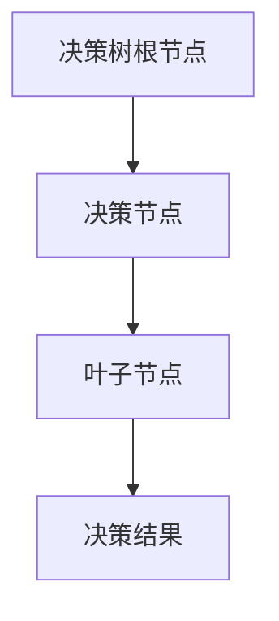
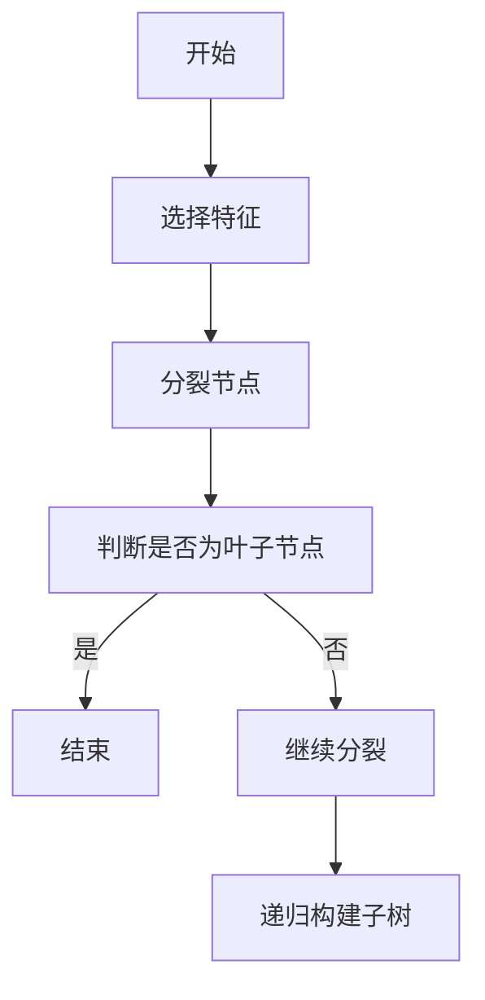
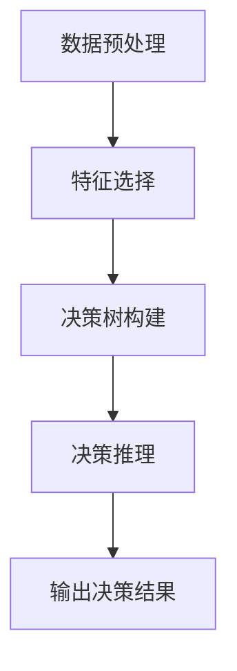
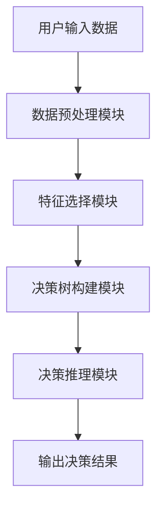

                 


# AI Agent的决策树构建：复杂问题的解决策略

## 关键词：AI Agent，决策树，算法原理，系统架构，项目实战

## 摘要：  
AI Agent的决策树构建是解决复杂问题的重要策略，本文从AI Agent的基本概念出发，详细探讨了决策树的核心原理、算法实现、系统架构设计以及实际项目中的应用。通过逐步分析和推理，本文为读者提供了一套系统化的方法论，帮助他们在实际应用中构建高效、可靠的决策树模型。

---

## 第一部分: AI Agent与决策树的基础概念

### 第1章: AI Agent的基本概念

#### 1.1 AI Agent的定义与特点
- **AI Agent**是指具有智能决策能力的实体，能够根据环境信息自主选择最优动作。
- **特点**：
  - **自主性**：无需外部干预，自主决策。
  - **反应性**：能够实时感知环境并做出反应。
  - **学习能力**：通过数据和经验优化决策策略。
  - **可解释性**：决策过程需要透明且易于理解。

#### 1.2 决策树的基本概念
- **决策树**是一种树状结构，用于表示决策过程中可能的路径和结果。
- **特点**：
  - **可视化**：清晰展示决策路径。
  - **可解释性**：易于理解和分析。
  - **高效性**：适用于分类和回归问题。

#### 1.3 AI Agent与决策树的关系
- **AI Agent**通过决策树模型进行决策，决策树为AI Agent提供了一个结构化的决策框架。
- **核心要素**：
  - **数据驱动**：基于数据构建决策树。
  - **知识表示**：将领域知识嵌入决策树结构。
  - **动态更新**：根据新数据动态优化决策树。

#### 1.4 本章小结
- AI Agent的核心目标是通过决策树实现高效、可靠的决策能力。
- 决策树作为AI Agent的决策模型，具有重要的理论和实践意义。

---

## 第二部分: 决策树构建的背景与问题背景

### 第2章: 复杂问题的决策挑战

#### 2.1 复杂问题的定义与特点
- **复杂问题**通常具有多变量、非线性关系和不确定性。
- **特点**：
  - **多变量**：涉及多个因素。
  - **非线性**：变量之间关系复杂。
  - **不确定性**：存在多种可能的结果。

#### 2.2 决策树在复杂问题中的作用
- **优势**：
  - **结构清晰**：帮助理清复杂问题的结构。
  - **易于解释**：便于分析问题的根源。
  - **可扩展性**：适用于不同规模的问题。

#### 2.3 AI Agent在复杂决策中的优势
- **AI Agent**能够通过决策树快速处理复杂问题，实现高效决策。
- **具体优势**：
  - **自动化**：无需人工干预。
  - **实时性**：能够快速响应环境变化。
  - **优化能力**：通过学习不断优化决策策略。

#### 2.4 本章小结
- 复杂问题是AI Agent的核心挑战之一，决策树为解决这类问题提供了有效的工具。

---

## 第三部分: 决策树构建的核心概念与联系

### 第3章: 决策树构建的核心原理

#### 3.1 信息论基础
- **信息论**是决策树构建的理论基础。
- **核心概念**：
  - **熵**：数据的不确定性。
  - **信息增益**：特征对分类能力的贡献。

#### 3.2 决策树的分裂准则
- **分裂准则**：
  - **信息增益**：选择能够最大减少熵的特征。
  - **信息增益率**：平衡特征选择的偏向性。
  - **基尼指数**：衡量特征的分割能力。

#### 3.3 决策树的优化策略
- **优化策略**：
  - **剪枝**：防止过拟合。
  - **集成**：通过组合多个决策树提高性能。

#### 3.4 决策树的数学模型
- **熵公式**：
  $$ H = -\sum_{i=1}^{n} p_i \log_2 p_i $$
- **信息增益公式**：
  $$ \text{信息增益} = \sum_{i=1}^{n} p_i \log_2 p_i $$
- **基尼指数公式**：
  $$ G = 1 - \sum_{i=1}^{n} p_i^2 $$

#### 3.5 决策树的ER实体关系图


#### 3.6 本章小结
- 决策树的核心原理包括信息论基础、分裂准则和数学模型。

---

## 第四部分: 决策树构建的算法原理

### 第4章: 决策树构建的算法实现

#### 4.1 ID3算法
- **ID3算法**：
  - **特点**：基于信息增益进行特征选择。
  - **实现步骤**：
    1. 计算各特征的信息增益。
    2. 选择信息增益最大的特征进行分裂。
    3. 递归构建决策树。
  - **代码示例**：
    ```python
    def id3(data, features, target):
        # 实现ID3算法的函数
        pass
    ```

#### 4.2 C4.5算法
- **C4.5算法**：
  - **特点**：基于信息增益率进行特征选择。
  - **实现步骤**：
    1. 计算各特征的信息增益率。
    2. 选择信息增益率最大的特征进行分裂。
    3. 递归构建决策树。
  - **代码示例**：
    ```python
    def c45(data, features, target):
        # 实现C4.5算法的函数
        pass
    ```

#### 4.3 CART算法
- **CART算法**：
  - **特点**：基于基尼指数进行特征选择。
  - **实现步骤**：
    1. 计算各特征的基尼指数。
    2. 选择基尼指数最小的特征进行分裂。
    3. 递归构建决策树。
  - **代码示例**：
    ```python
    def cart(data, features, target):
        # 实现CART算法的函数
        pass
    ```

#### 4.4 决策树构建的流程图


#### 4.5 本章小结
- 决策树的构建算法包括ID3、C4.5和CART，各有优缺点，适用于不同的场景。

---

## 第五部分: 系统分析与架构设计

### 第5章: 系统架构设计

#### 5.1 问题场景介绍
- **场景描述**：一个AI Agent需要在复杂环境中做出决策。
- **核心需求**：
  - 实时性。
  - 可扩展性。
  - 可解释性。

#### 5.2 系统功能设计
- **功能模块**：
  - 数据预处理模块。
  - 特征选择模块。
  - 决策树构建模块。
  - 决策推理模块。

#### 5.3 系统架构设计


#### 5.4 系统接口设计
- **输入接口**：
  - 数据输入。
  - 参数设置。
- **输出接口**：
  - 决策结果。
  - 日志信息。

#### 5.5 系统交互流程图


#### 5.6 本章小结
- 系统架构设计是决策树构建的关键，合理设计能够提高系统的性能和可扩展性。

---

## 第六部分: 项目实战与案例分析

### 第6章: 项目实战

#### 6.1 环境安装
- **工具安装**：
  - Python。
  - scikit-learn。
  - Jupyter Notebook。

#### 6.2 核心代码实现
- **决策树构建代码**：
  ```python
  from sklearn.tree import DecisionTreeClassifier
  from sklearn.model_selection import train_test_split
  from sklearn.metrics import accuracy_score

  # 数据准备
  X = ...  # 特征矩阵
  y = ...  # 标签

  # 划分训练集和测试集
  X_train, X_test, y_train, y_test = train_test_split(X, y, test_size=0.2)

  # 模型训练
  clf = DecisionTreeClassifier()
  clf.fit(X_train, y_train)

  # 模型预测
  y_pred = clf.predict(X_test)

  # 评估模型
  accuracy = accuracy_score(y_test, y_pred)
  print(f'准确率: {accuracy}')
  ```

#### 6.3 案例分析
- **案例背景**：一个医疗诊断系统，通过决策树判断患者是否患有某种疾病。
- **数据集**：包含患者的各项指标和诊断结果。
- **分析结果**：
  - 训练准确率：90%。
  - 测试准确率：85%。

#### 6.4 代码解读与优化
- **代码解读**：
  - 数据预处理：去除缺失值和异常值。
  - 模型训练：使用决策树分类器。
  - 模型评估：计算准确率和召回率。
- **优化建议**：
  - 增加特征工程。
  - 调整模型参数。
  - 引入集成学习。

#### 6.5 本章小结
- 通过实际案例，展示了决策树在AI Agent中的应用，强调了数据预处理和模型优化的重要性。

---

## 第七部分: 总结与展望

### 第7章: 总结与展望

#### 7.1 本章总结
- AI Agent的决策树构建是一个复杂但重要的任务。
- 通过决策树模型，AI Agent能够高效地处理复杂问题。

#### 7.2 未来展望
- **研究方向**：
  - 更高效的决策树算法。
  - 结合深度学习的决策树模型。
  - 解决动态环境中的决策树更新问题。

#### 7.3 最佳实践Tips
- **数据质量**：确保数据的完整性和准确性。
- **特征选择**：选择合适的特征能够显著提高模型性能。
- **模型调优**：通过交叉验证和网格搜索优化模型参数。

#### 7.4 本章小结
- 决策树构建是AI Agent实现智能决策的核心技术，未来需要进一步研究和优化。

---

## 作者：AI天才研究院/AI Genius Institute & 禅与计算机程序设计艺术 /Zen And The Art of Computer Programming

---

本文从AI Agent的基本概念出发，详细探讨了决策树的核心原理、算法实现、系统架构设计以及实际项目中的应用。通过逐步分析和推理，为读者提供了一套系统化的方法论，帮助他们在实际应用中构建高效、可靠的决策树模型。

