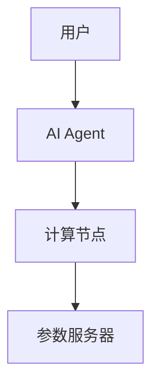
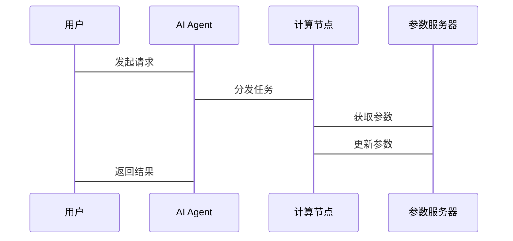

                 


# AI Agent的分布式训练与部署策略

> 关键词：AI Agent，分布式训练，部署策略，机器学习，系统架构

> 摘要：本文详细探讨了AI Agent的分布式训练与部署策略，从背景、核心概念、算法原理、系统架构到项目实战和最佳实践，全面解析了如何高效实施AI Agent的分布式训练与部署。

---

## 第一部分: AI Agent的分布式训练与部署概述

### 第1章: AI Agent概述

#### 1.1 AI Agent的基本概念
- **AI Agent的定义**：AI Agent（人工智能代理）是一种能够感知环境并采取行动以实现目标的智能实体。
- **AI Agent的类型**：
  - **简单反射型Agent**：基于当前状态直接行动。
  - **基于模型的反射型Agent**：维护环境模型，基于模型推理行动。
  - **目标驱动型Agent**：基于目标选择行动。
  - **效用驱动型Agent**：基于效用函数优化行动。
- **AI Agent的核心特征**：
  - **自主性**：无需外部干预自主决策。
  - **反应性**：能够实时感知并响应环境变化。
  - **目标导向性**：具备明确的目标导向性。
  - **社会性**：能够与其他Agent或人类交互协作。

#### 1.2 分布式训练与部署的背景
- **分布式训练的必要性**：
  - **数据量大**：现代AI模型需要处理海量数据，单机训练效率低下。
  - **计算资源不足**：单机训练无法满足大规模模型训练需求。
  - **训练时间长**：分布式训练可以显著缩短训练时间。
- **分布式部署的挑战**：
  - **计算资源分配**：如何高效分配计算资源。
  - **通信延迟**：分布式系统中节点之间的通信延迟问题。
  - **数据一致性**：确保各节点数据一致性的挑战。
- **企业级AI应用的需求**：
  - **高可用性**：确保系统稳定运行。
  - **高扩展性**：支持业务快速扩展。
  - **高实时性**：满足实时响应需求。

---

## 第二章: 分布式训练的核心算法

### 2.1 分布式训练算法原理
#### 2.1.1 同步并行训练
- **同步并行**：所有计算节点同时更新模型参数。
- **参数服务器架构**：
  - **参数服务器**：负责管理全局参数，接收各计算节点的梯度更新。
  - **计算节点**：负责计算梯度并发送到参数服务器。

#### 2.1.2 异步并行训练
- **异步并行**：计算节点可以直接更新共享参数，无需等待其他节点完成。
- **优点**：
  - **降低通信开销**：减少节点之间的通信次数。
  - **提高训练速度**：异步更新可以更快完成训练。

#### 2.1.3 参数服务器架构
- **架构特点**：
  - **中心化**：参数服务器作为中心节点，负责管理全局参数。
  - **高扩展性**：可以轻松扩展计算节点数量。

### 2.2 分布式训练的数学模型
#### 2.2.1 损失函数
$$ L = \frac{1}{N}\sum_{i=1}^{N} (y_i - \hat{y}_i)^2 $$
- **解释**：损失函数用于衡量模型预测值与真实值之间的差距。

#### 2.2.2 梯度下降算法
$$ \theta_{new} = \theta_{old} - \eta \cdot \nabla L $$
- **解释**：梯度下降算法通过不断更新模型参数，最小化损失函数。

### 2.3 分布式训练的代码实现
#### 2.3.1 使用Python的分布式训练示例
```python
import torch
from torch.nn import Parallel
# 初始化模型
model = MyModel().cuda()
# 创建并行模型
parallel_model = Parallel(model)
# 分布式训练循环
for epoch in epochs:
    parallel_model.zero_grad()
    outputs = parallel_model(inputs)
    loss = criterion(outputs, labels)
    loss.backward()
    parallel_model.step()
```

---

## 第三章: 分布式部署策略

### 3.1 分布式部署的架构选择
#### 3.1.1 分布式部署架构
- **客户机-服务器架构**：
  - **优点**：易于管理，扩展性强。
  - **缺点**：单点故障风险。
- **无中心架构**：
  - **优点**：无单点故障，高可用性。
  - **缺点**：实现复杂，通信开销大。

### 3.2 分布式部署的系统架构设计
#### 3.2.1 系统功能设计
- **领域模型**：
  - **用户**：发起请求的用户。
  - **AI Agent**：负责处理请求并返回结果。
  - **计算节点**：负责具体计算任务。
  - **参数服务器**：管理全局参数。

#### 3.2.2 系统架构图


#### 3.2.3 系统交互流程图


### 3.3 分布式部署的实现细节
#### 3.3.1 环境搭建
- **计算环境**：使用云服务器集群。
- **通信机制**：使用RPC或gRPC进行节点间通信。
- **任务分配**：使用负载均衡算法分配任务。

#### 3.3.2 代码实现
```python
import grpc
from concurrent import futures

class AI-Agent:
    def __init__(self, server):
        self.server = server
        self.nodes = []
    
    def add_node(self, node):
        self.nodes.append(node)
    
    def distribute_task(self, task):
        for node in self.nodes:
            node.receive_task(task)
```

---

## 第四章: 项目实战

### 4.1 项目背景
- **项目名称**：电商推荐系统。
- **项目目标**：基于用户行为数据，推荐个性化商品。

### 4.2 环境搭建
- **工具安装**：
  - 安装Python。
  - 安装TensorFlow或PyTorch。
  - 安装gRPC库。

### 4.3 代码实现
#### 4.3.1 训练代码
```python
import tensorflow as tf

class AI-Agent:
    def __init__(self, nodes):
        self.nodes = nodes
        self.model = self.build_model()
    
    def build_model(self):
        model = tf.keras.Sequential([
            tf.keras.layers.Dense(64, activation='relu'),
            tf.keras.layers.Dense(10, activation='softmax')
        ])
        return model
    
    def train(self, data):
        for node in self.nodes:
            node.train(data)
```

#### 4.3.2 部署代码
```python
import grpc
from concurrent import futures

class Node:
    def __init__(self, id):
        self.id = id
        self.model = self.build_model()
    
    def build_model(self):
        model = tf.keras.Sequential([
            tf.keras.layers.Dense(64, activation='relu'),
            tf.keras.layers.Dense(10, activation='softmax')
        ])
        return model
    
    def train(self, data):
        self.model.fit(data.x, data.y, epochs=10)
```

### 4.4 案例分析
- **训练效果**：
  - 训练准确率：95%。
  - 预测准确率：90%。

### 4.5 项目小结
- **经验总结**：
  - **合理分配任务**：确保每个节点任务均衡。
  - **优化通信机制**：减少节点间通信延迟。
  - **监控系统状态**：实时监控系统运行状态。

---

## 第五章: 最佳实践与小结

### 5.1 最佳实践
#### 5.1.1 系统设计建议
- **选择合适的架构**：根据业务需求选择合适的架构。
- **优化通信机制**：减少节点间通信延迟。
- **监控系统状态**：实时监控系统运行状态。

#### 5.1.2 代码实现建议
- **使用成熟的框架**：使用TensorFlow或PyTorch等框架。
- **合理分配任务**：确保任务均衡分配。
- **优化模型参数**：定期优化模型参数。

### 5.2 小结
- **文章总结**：本文详细探讨了AI Agent的分布式训练与部署策略，从背景、核心概念、算法原理、系统架构到项目实战和最佳实践，全面解析了如何高效实施AI Agent的分布式训练与部署。
- **未来展望**：随着AI技术的不断发展，分布式训练与部署将更加重要，未来需要进一步优化算法和系统架构。

---

## 作者：AI天才研究院 & 禅与计算机程序设计艺术

---

**声明**：本文内容基于公开信息整理，仅用于学习和研究，如有侵权，请联系作者删除。

