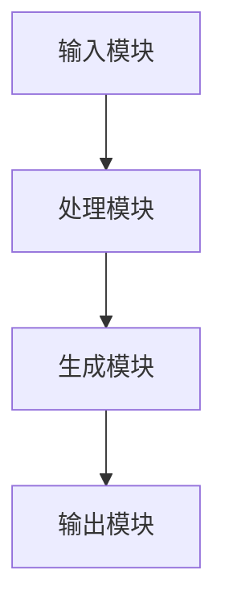

                 


# AI Agent的创造力：激发LLM的创新能力

> 关键词：AI Agent，LLM，创造力，生成式AI，大语言模型，创新算法

> 摘要：本文探讨AI Agent如何利用大语言模型（LLM）激发创造力，详细介绍AI Agent与LLM的基本概念、创造力模型、算法原理、系统架构、项目实战和最佳实践，结合实际案例分析，为读者提供全面的技术指导。

---

## 第一部分: AI Agent与LLM的背景介绍

### 第1章: AI Agent的基本概念

#### 1.1 AI Agent的定义与特点
AI Agent（人工智能代理）是指在计算机系统中代表用户或其他实体执行任务的智能实体。AI Agent具有以下特点：
- **自主性**：能够在没有外部干预的情况下自主决策。
- **反应性**：能够感知环境并实时响应。
- **目标导向**：根据设定的目标执行任务。
- **学习能力**：能够通过经验改进性能。

#### 1.2 AI Agent的分类与应用场景
AI Agent可以分为以下几类：
- **简单反射型**：基于规则进行反应，适用于简单任务。
- **基于模型的反射型**：使用内部模型进行决策，适用于复杂任务。
- **目标驱动型**：根据目标选择最优行动。
- **实用驱动型**：通过效用函数优化决策。

#### 1.3 AI Agent与传统AI的区别
AI Agent与传统AI的主要区别在于：
- **自主性**：AI Agent具备自主决策能力，而传统AI通常需要明确的指令。
- **适应性**：AI Agent能够适应动态环境，而传统AI在固定环境下表现更佳。
- **目标导向**：AI Agent以目标为导向，传统AI可能只是完成特定任务。

### 第2章: LLM的基本概念

#### 2.1 LLM的定义与特点
LLM（大语言模型）是一种基于深度学习的自然语言处理模型，具有以下特点：
- **大规模训练数据**：通常使用海量数据进行训练。
- **生成能力**：能够生成自然语言文本。
- **上下文理解**：能够理解上下文并进行推理。

#### 2.2 LLM的核心技术与实现原理
LLM的核心技术包括：
- **神经网络结构**：通常使用Transformer架构。
- **注意力机制**：通过注意力机制捕捉输入中的重要信息。
- **生成模型**：如GPT系列，基于概率模型生成文本。

#### 2.3 LLM与AI Agent的结合
将LLM集成到AI Agent中，可以增强其自然语言处理能力，使其能够更好地理解和生成文本，从而提升创造力。

---

## 第二部分: 创造力的定义与评估

### 第3章: 创造力的定义与评估

#### 3.1 创造力的定义与特征
创造力是指生成新颖且有价值的想法或解决方案的能力。其特征包括：
- **新颖性**：结果具有独特性。
- **实用性**：结果能够解决问题。
- **适应性**：能够适应不同的场景。

#### 3.2 创造力的评估指标与方法
创造力的评估指标包括：
- **多样性**：生成结果的多样性。
- **相关性**：结果与任务的相关性。
- **质量**：结果的创新性和实用性。

#### 3.3 创造力与AI Agent的关系
AI Agent可以通过LLM等技术来增强其创造力，使其能够生成更多样化和创新性的解决方案。

---

## 第三部分: AI Agent创造力的核心概念与联系

### 第4章: 创造力的数学模型

#### 4.1 创造力的数学表达式
创造力可以通过以下公式进行量化：
$$ Creativity = f(多样性, 相关性, 质量) $$
其中，$f$ 是一个综合函数，具体取决于应用场景。

#### 4.2 创造力模型的属性特征对比表
| 属性 | 创造性 | 新颖性 | 实用性 |
|------|--------|--------|--------|
| 描述 | 结果的独特性 | 结果的创新性 | 结果的实用性 |

#### 4.3 创造力模型的ER实体关系图
```mermaid
er
actor(Agent)
role(Agent通过LLM进行创作)
```

### 第5章: LLM的创造力机制

#### 5.1 LLM的生成原理
LLM通过概率模型生成文本，其生成过程包括：
1. 输入处理：将输入文本转换为模型可处理的形式。
2. 解码：模型根据上下文生成下一个词的概率分布。
3. 采样：根据概率分布选择生成的词。

#### 5.2 LLM的创造力来源
LLM的创造力来源于：
- **大规模数据**：模型通过大量数据学习语言模式。
- **生成能力**：模型能够生成多样化和创新性的文本。
- **上下文理解**：模型能够理解并利用上下文信息。

#### 5.3 LLM创造力的优化方法
优化LLM的创造力可以通过以下方法：
- **微调**：对模型进行针对性训练。
- **调整参数**：如温度和采样策略。
- **结合外部知识**：引入外部知识库增强生成能力。

---

## 第四部分: 算法原理与系统架构

### 第6章: 算法原理

#### 6.1 Transformer模型的结构
Transformer模型由编码器和解码器组成，编码器负责处理输入，解码器负责生成输出。

#### 6.2 注意力机制
注意力机制通过计算输入中每个词的重要性来决定生成词的概率。

#### 6.3 生成过程中的采样方法
常用的采样方法包括贪心采样和随机采样。

### 第7章: 系统架构

#### 7.1 系统功能模块
- **输入模块**：接收输入文本。
- **处理模块**：对输入进行预处理。
- **生成模块**：使用LLM生成输出。
- **输出模块**：将生成结果输出。

#### 7.2 系统架构设计


#### 7.3 系统接口设计
- **输入接口**：接收用户输入。
- **输出接口**：返回生成结果。

---

## 第五部分: 项目实战

### 第8章: 环境安装与核心实现

#### 8.1 环境安装
需要安装以下库：
- Python
- TensorFlow或PyTorch
- transformers库

#### 8.2 核心实现
代码示例：
```python
from transformers import GPT2LMHeadModel, GPT2Tokenizer

model_name = 'gpt2'
tokenizer = GPT2Tokenizer.from_pretrained(model_name)
model = GPT2LMHeadModel.from_pretrained(model_name)

input_text = "创新的思维方式"
inputs = tokenizer.encode(input_text, return_tensors='np')
outputs = model.generate(inputs, max_length=50)
print(tokenizer.decode(outputs[0], skip_special_tokens=True))
```

### 第9章: 案例分析与优化

#### 9.1 案例分析
以智能写作助手为例，展示LLM如何辅助写作。

#### 9.2 系统实现
详细描述系统的实现过程，包括需求分析、功能设计和代码实现。

#### 9.3 测试与优化
对生成结果进行测试，并根据测试结果进行优化。

---

## 第六部分: 最佳实践与未来展望

### 第10章: 最佳实践

#### 10.1 总结
总结AI Agent与LLM结合的关键点。

#### 10.2 小结
提醒读者注意的问题。

#### 10.3 注意事项
避免过度依赖生成模型，注意生成内容的准确性和相关性。

#### 10.4 拓展阅读
推荐相关书籍和论文。

### 第11章: 未来展望

#### 11.1 创新趋势
预测未来创造力相关的创新趋势。

#### 11.2 技术挑战
讨论当前技术面临的挑战。

---

## 作者

作者：AI天才研究院 & 禅与计算机程序设计艺术

