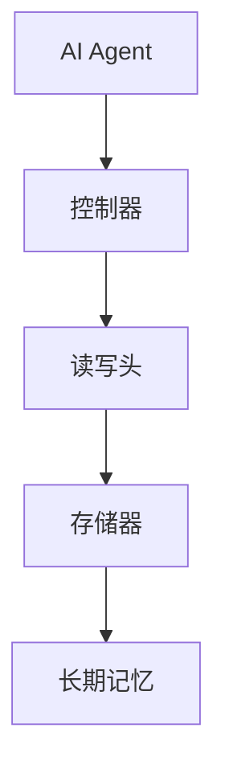
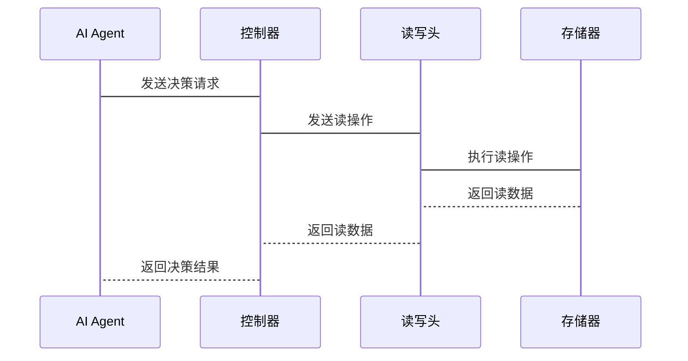

                 


```markdown
# AI Agent的可微分神经计算机：增强记忆能力

> 关键词：AI Agent，可微分神经计算机，记忆增强，神经网络，增强学习

> 摘要：本文深入探讨了AI Agent与可微分神经计算机的结合，重点分析了如何通过增强记忆能力来提升AI Agent的智能水平。文章从基本概念出发，逐步讲解了可微分神经计算机的原理及其在记忆增强中的应用，结合数学模型和实际案例，详细阐述了算法实现和系统设计，最后总结了最佳实践和未来发展方向。

---

## 第一部分: AI Agent与可微分神经计算机的背景与概述

### 第1章: AI Agent与可微分神经计算机概述

#### 1.1 AI Agent的基本概念
##### 1.1.1 什么是AI Agent
AI Agent（人工智能代理）是指能够感知环境、自主决策并采取行动以实现特定目标的智能实体。AI Agent可以是软件程序、机器人或其他智能系统，其核心在于具备自主性和智能性。

##### 1.1.2 AI Agent的类型与特点
AI Agent可以分为多种类型，包括基于规则的Agent、基于模型的Agent、基于Q-learning的Agent等。不同类型Agent的特点如下：

- **基于规则的Agent**：依赖预定义的规则进行决策，简单但缺乏灵活性。
- **基于模型的Agent**：通过构建环境模型进行决策，适合复杂环境。
- **基于Q-learning的Agent**：通过强化学习优化决策策略，具有自适应性。

##### 1.1.3 AI Agent的应用场景
AI Agent广泛应用于自动驾驶、智能助手、机器人控制、游戏AI等领域。例如，自动驾驶汽车通过AI Agent感知环境并做出驾驶决策。

#### 1.2 可微分神经计算机的原理
##### 1.2.1 神经计算机的基本概念
可微分神经计算机（Differentiable Neural Computer，DNC）是一种结合了神经网络和外部存储的计算模型。DNC的核心在于其可微分的存储访问机制，允许通过反向传播算法优化存储操作。

##### 1.2.2 可微分神经网络的定义
可微分神经网络是一种特殊的神经网络架构，其存储操作是可微的，这意味着存储操作可以通过梯度下降等优化算法进行优化。

##### 1.2.3 可微分神经计算机的优势
可微分神经计算机的优势在于其强大的记忆能力和可训练性。通过结合神经网络和外部存储，DNC可以在处理复杂任务时保持长期记忆。

#### 1.3 AI Agent与可微分神经计算机的结合
##### 1.3.1 结合的背景与意义
AI Agent需要处理复杂环境中的任务，而传统的神经网络在处理长期记忆任务时表现不佳。通过结合AI Agent与可微分神经计算机，可以显著提升AI Agent的记忆能力。

##### 1.3.2 结合的核心思想
通过将AI Agent的决策机制与可微分神经计算机的存储机制相结合，使得AI Agent能够更有效地利用长期记忆来优化决策。

##### 1.3.3 结合的技术路线
技术路线包括：设计AI Agent与DNC的接口、实现存储操作的可微分性、优化DNC的训练算法。

#### 1.4 本章小结
本章介绍了AI Agent和可微分神经计算机的基本概念及其结合的意义，为后续章节奠定了基础。

---

## 第二部分: AI Agent的增强记忆能力

### 第2章: 记忆机制与增强学习

#### 2.1 记忆机制的基本原理
##### 2.1.1 短时记忆与长时记忆的区分
短时记忆用于处理当前任务，长时记忆用于存储长期信息。AI Agent需要通过记忆机制将短期记忆与长期记忆有机结合。

##### 2.1.2 增强记忆的核心技术
增强记忆的核心技术包括记忆存储、记忆检索和记忆更新。这些技术需要通过算法实现。

##### 2.1.3 增强记忆的实现方法
通过神经网络和外部存储的结合，实现记忆的存储与检索。例如，DNC通过神经网络控制器与存储器交互，实现记忆的读写操作。

#### 2.2 增强学习在记忆中的应用
##### 2.2.1 增强学习的基本概念
增强学习是一种通过奖励机制优化决策策略的机器学习方法。在AI Agent中，增强学习用于优化记忆操作。

##### 2.2.2 增强学习在记忆中的作用
增强学习通过奖励机制优化记忆操作，例如优化存储位置的选择或记忆检索的策略。

##### 2.2.3 增强学习的算法实现
使用Q-learning算法优化记忆操作，通过状态、动作和奖励的循环更新记忆策略。

#### 2.3 增强记忆的实际案例分析
##### 2.3.1 案例一：文本生成中的记忆增强
在文本生成任务中，AI Agent通过增强记忆机制可以生成连贯的上下文内容。

##### 2.3.2 案例二：图像识别中的记忆增强
通过增强记忆，AI Agent可以在图像识别任务中更好地处理复杂场景。

##### 2.3.3 案例三：语音识别中的记忆增强
增强记忆可以提高语音识别的准确性和连续性。

#### 2.4 本章小结
本章详细探讨了记忆机制与增强学习的结合，通过实际案例展示了增强记忆在AI Agent中的应用。

---

## 第三部分: 可微分神经计算机的数学模型与算法

### 第3章: 可微分神经计算机的数学模型

#### 3.1 神经网络的基本数学模型
##### 3.1.1 神经网络的结构与功能
神经网络由输入层、隐藏层和输出层组成，通过权重和激活函数实现信息处理。

##### 3.1.2 神经网络的数学表达
神经网络的输出可以通过矩阵乘法和激活函数的组合得到：

$$ y = \sigma(Wx + b) $$

其中，$W$ 是权重矩阵，$x$ 是输入向量，$b$ 是偏置向量，$\sigma$ 是激活函数。

##### 3.1.3 神经网络的训练方法
神经网络通过反向传播算法和梯度下降优化训练。损失函数表示为：

$$ L = \frac{1}{n}\sum_{i=1}^{n}(y_i - \hat{y}_i)^2 $$

其中，$y_i$ 是预测值，$\hat{y}_i$ 是真实值，$n$ 是样本数。

#### 3.2 可微分神经计算机的数学模型
##### 3.2.1 可微分神经计算机的结构
DNC由神经网络控制器和外部存储器组成。控制器通过读写头与存储器交互。

##### 3.2.2 可微分神经计算机的数学表达
读写头的读操作表示为：

$$ r_t = \sum_{i=1}^{N} w_i s_i $$

写操作表示为：

$$ w_t = \sum_{i=1}^{N} w_i m_i $$

其中，$r_t$ 是读出向量，$w_i$ 是权重，$s_i$ 是存储向量，$m_i$ 是写入向量。

##### 3.2.3 可微分神经计算机的训练方法
通过反向传播算法优化DNC的参数，包括控制器的权重和存储器的权重。

#### 3.3 增强记忆的数学模型
##### 3.3.1 增强记忆的数学表达
记忆检索可以通过注意力机制实现：

$$ \alpha_i = \frac{\exp(\mathbf{q}^T \mathbf{m}_i)}{\sum_{j=1}^{N}\exp(\mathbf{q}^T \mathbf{m}_j)} $$

其中，$\alpha_i$ 是注意力权重，$\mathbf{q}$ 是查询向量，$\mathbf{m}_i$ 是存储向量。

##### 3.3.2 增强记忆的算法实现
通过强化学习优化记忆操作的权重，例如使用Q-learning算法。

---

## 第四部分: 系统分析与架构设计

### 第4章: 系统架构设计

#### 4.1 项目背景介绍
本项目旨在通过结合AI Agent与可微分神经计算机，提升AI Agent的记忆能力。

#### 4.2 系统功能设计
系统功能包括记忆存储、记忆检索、记忆更新和决策优化。

#### 4.3 系统架构图
使用Mermaid绘制系统架构图：



#### 4.4 系统接口设计
系统接口包括控制器接口、存储器接口和决策优化接口。

#### 4.5 系统交互序列图
使用Mermaid绘制交互序列图：



---

## 第五部分: 项目实战

### 第5章: 项目实战

#### 5.1 环境安装
安装必要的库和工具，例如TensorFlow、Keras、Python等。

#### 5.2 核心代码实现
实现AI Agent与DNC的接口，例如：

```python
class Agent:
    def __init__(self, controller, memory):
        self.controller = controller
        self.memory = memory

    def decide(self, state):
        action = self.controller.compute_action(state)
        return action
```

#### 5.3 案例分析
分析一个具体案例，例如文本生成任务，展示如何通过增强记忆提升生成效果。

#### 5.4 项目小结
总结项目实现的关键点和经验教训。

---

## 第六部分: 最佳实践与总结

### 第6章: 最佳实践与总结

#### 6.1 最佳实践
- 定期优化记忆策略
- 使用高效的存储结构
- 通过强化学习优化决策

#### 6.2 小结
通过结合AI Agent与可微分神经计算机，可以显著提升AI Agent的记忆能力，从而增强其智能水平。

#### 6.3 注意事项
- 确保系统的可扩展性
- 定期维护和更新系统
- 注意数据隐私和安全

#### 6.4 拓展阅读
推荐阅读相关领域的最新论文和书籍，例如《Deep Learning》。

---

## 作者

作者：AI天才研究院/AI Genius Institute & 禅与计算机程序设计艺术 /Zen And The Art of Computer Programming
```

